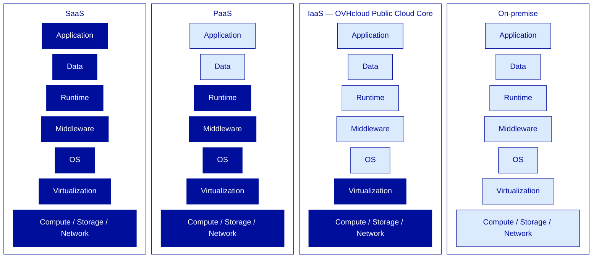
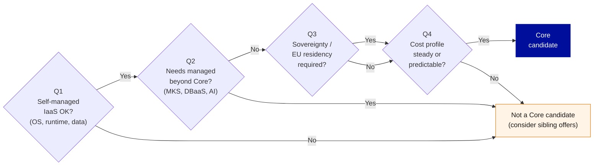

---
# ============================================================
# Module 1.1 — Cloud Foundations & OVHcloud Positioning
# Slidev source file
# ============================================================
theme: ../../theme-ovhcloud
title: Cloud Foundations & OVHcloud Positioning
info: |
  ## OVHcloud — Public Cloud — Core Associate
  Module 1.1 — Cloud Foundations & OVHcloud Positioning.
  Duration: 1h30.
class: text-left
highlighter: shiki
lineNumbers: false
drawings:
  persist: false
transition: slide-left
mdc: true
exportFilename: 'modules/module-1-1-cloud-foundations/student_export'

# Hide the floating navbar / controls overlay in dev mode
controls: false
download: false
selectable: true

# Module-level metadata (consumed by trainer-notes export and CI)
moduleId: "1.1"
moduleTitle: "Cloud Foundations & OVHcloud Positioning"
duration: "1h30"
program: "OVHcloud — Public Cloud — Core Associate"
los:
  - LO-FND-K01
  - LO-FND-K02
  - LO-FND-K03
  - LO-FND-K04
  - LO-FND-K05
  - LO-FND-K06
  - LO-FND-K07
  - LO-FND-A01
  - LO-FND-A02
---

---
# COVER SLIDE
layout: cover
moduleId: "1.1"
duration: "1h30"
---

# Cloud Foundations
## & OVHcloud Positioning

<!--
Trainer notes — Cover slide:
- Welcome learners, do a quick round of intros (name, role, prior cloud experience).
- Calibrate the room: who has used OVHcloud Manager this week? Who is ex-AWS?
- Announce: at the end of this 1h30, you will be able to defend OVHcloud's value to a stakeholder and qualify a workload as Core-eligible.
- This is the entry module of the certification — set the tone: rigorous, honest, no religious debates.
-->

---
layout: default
moduleId: "1.1"
slideId: "Agenda"
---

# Agenda

**Block 1 — Sentier battu** · 5 min
*Prerequisites & remediation pointers*

**Block 2 — Theory** · 30 min
*Cloud properly defined, OVHcloud positioning, Core scope*

**Block 3 — Demo** · 15 min
*Walk-through of the OVHcloud Manager UI*

**Block 4 — Lab** · 30 min
*Positioning Drill (pairs)*

**Block 5 — Micro-check** · 5 min
*Formative QCM, 6 questions*

**Block 6 — Wrap-up** · 5 min
*Recap & transition to Module 1.2*

<!--
Trainer notes — Agenda:
- Frame the journey: theory first, then they SEE it (demo), then they DO it (lab), then they CHECK (micro-check).
- Announce the lab is a Positioning Drill, not a hands-on technical lab — IAM/Compute haven't been covered yet.
- Set expectations on timing — strict 90 min, including transitions.
-->

---
# BLOCK 1 — SENTIER BATTU
layout: section
block: "Block 1"
duration: "5 min"
---

# Before we start
### Prerequisites & remediation

---
layout: two-cols
moduleId: "1.1"
slideId: "S00 — Before we start"
---

# Before we start

::left::

## You are ready if...

**Tools**
- Active OVHcloud account with Manager access
- Modern browser, outbound Internet to `*.ovh.com` and `*.ovh.net`

**Knowledge**
- General IT vocabulary (server, VM, IP, DNS, hypervisor)
- General-public notion of "cloud" (AWS / Azure / GCP)
- Basic CAPEX vs OPEX intuition

::right::

## If not, here's where to look

- **No Manager experience?**
  *Getting started with the OVHcloud Manager* on `docs.ovhcloud.com`.

- **IaaS / PaaS / SaaS unclear?**
  Covered in this module's Theory block — pay extra attention to slide S03.

- **No virtualization background?**
  Watch *VMware 101* (internal portal) or any public KVM/VMware intro.

<!--
Trainer notes — S00 Before we start:
- Show of hands: "Who has opened the OVHcloud Manager this week?" → calibrates the audience early.
- Anticipate 1-2 Corporate learners have never touched the Manager → reassure: the end-of-module demo covers exactly that.
- If someone has no active account → note the name, get it activated during the break, do not block the module.
- Do NOT switch to a live Manager demo here — Block 3 does that one hour later.
- Remind: this *sentier battu* applies to all 3 days, not just this module.
-->

---
# BLOCK 2 — THEORY & CONCEPTS
layout: section
block: "Block 2"
duration: "30 min"
---

# Theory & Concepts
### Cloud defined · Service models · OVHcloud positioning

---
layout: default
moduleId: "1.1"
slideId: "S01 — Northwind Analytics"
---

# Northwind Analytics, in 2 minutes

<strong>Business</strong> 
European B2B SaaS scale-up 
Logistics vertical

<strong>Size</strong> 
~80 employees 
3× growth in 18 months

<strong>Current stack</strong> 
Self-managed PostgreSQL 
Hardened bare-metal

<strong>Current pressure</strong> 
Infrastructure under strain 
Leadership wants cloud

  <strong>2019</strong> founded &nbsp;→&nbsp; <strong>2024</strong> 3× growth &nbsp;→&nbsp; <strong>today</strong> cloud decision

  Our role for the next 3 days: guide them onto OVHcloud.

<!--
Trainer notes — S01 Northwind:
- Souligner que Northwind sera notre cas concret pendant les 3 jours — chaque module ajoute une brique à leur infra.
- Anticiper "is this a real company?" → no, pedagogical scenario, but every technical choice is realistic.
- Demander si quelqu'un dans la salle a un profil client similaire — capter les analogies pour les réutiliser plus tard.
- Rappeler que Northwind est ex-baremetal, pas ex-AWS — détail de ton important pour le module.
- Éviter de plonger dans les détails techniques de leur stack — on les déroule au fil des modules.
-->

---
layout: default
moduleId: "1.1"
slideId: "S02 — Cloud properly defined"
---

# Cloud, properly defined

  
🛎️

  
On-demand self-service

  
Provision without human intervention

  
🌐

  
Broad network access

  
Reachable via standard protocols

  
🧊

  
Resource pooling

  
Shared, dynamically allocated

  
⚡

  
Rapid elasticity

  
Scale up/down fast, often automated

  
📊

  
Measured service

  
Usage metered, billed by consumption

  <strong>Reality filter:</strong> if any one of these five is missing, it's not cloud — it's hosting.

  Source: NIST SP 800-145 (2011)

<!--
Trainer notes — S02 NIST:
- Souligner que ces 5 critères sont le filtre de réalité : si l'un manque, ce n'est pas du cloud, c'est de l'hébergement.
- Anticiper "and serverless?" → all 5 criteria still hold, it's just a higher abstraction level.
- Mini-sondage : "votre infra actuelle coche combien de ces cases ?" — calibre la maturité de la salle.
- Rappeler que la définition NIST date de 2011 et n'a pas bougé — c'est stable, on peut s'y adosser.
- Si quelqu'un cite la définition "marketing" du cloud → recadrer poliment vers le NIST.
-->

---
layout: default
moduleId: "1.1"
slideId: "S03 — IaaS / PaaS / SaaS"
---

# IaaS / PaaS / SaaS — who owns what

  <strong>OVHcloud Public Cloud Core = IaaS.</strong> Adjacent managed services (MKS, DBaaS) sit higher in the stack and are out of scope for this certification.

<!--
Trainer notes — S03 IaaS/PaaS/SaaS:
- Souligner que la frontière IaaS/PaaS n'est plus binaire — managed Kubernetes, par exemple, est entre les deux.
- Anticiper "Object Storage est-il IaaS ou PaaS ?" → conventionnellement IaaS dans la matrice OVHcloud, même si techniquement c'est managé.
- Si quelqu'un demande "et le baremetal cloud d'OVHcloud ?" → c'est IaaS aussi, juste sans virtualisation — détail vu en module 1.3.
- Rappeler que sur cette certif on reste en IaaS — les services managés "au-dessus" sont d'autres certifs (MKS, DBaaS).
- Éviter de digresser sur le serverless — pas dans le scope Core Associate.
-->

---
layout: default
moduleId: "1.1"
slideId: "S04 — Shared responsibility"
---

# Shared responsibility, applied to IaaS

### Customer responsibility
*(above the hypervisor line)*

- Application
- Data & data classification
- Identity & access management *at instance level*
- OS patching & hardening
- Backups *(unless explicit backup service)*
- Network ACLs at OS / app level

### Provider responsibility
*(below the hypervisor line)*

- Hypervisor patching
- Physical compute, storage, network
- Datacenter physical security
- Power, cooling, fire suppression
- Network backbone redundancy
- Underlying storage redundancy

  <strong>"Shared" ≠ "split 50/50".</strong> The line sits between the hypervisor and the guest OS.

<!--
Trainer notes — S04 Shared responsibility:
- Souligner que ce modèle est universel IaaS — AWS, Azure, OVHcloud, le même contrat de base s'applique.
- Anticiper "et les backups, c'est qui ?" → en IaaS, c'est toi sauf si tu souscris un service de backup explicite (vu en module 2.2).
- Rappeler à l'audience ex-AWS que ce modèle leur est familier — pas de surprise ici, juste un transfert de contexte.
- Si quelqu'un demande où se situent les services managés OVHcloud (MKS, DBaaS) → la ligne remonte, le provider prend en charge plus — mais on sort du Core Associate.
- Mini-cas : "vous oubliez de patcher l'OS d'une VM, qui est responsable de l'incident ?" — réponse attendue : le client.
-->

---
layout: default
moduleId: "1.1"
slideId: "S05 — Public / Private / Hybrid / Multi-cloud"
los: ["LO-FND-K04"]
---

# Public, Private, Hybrid, Multi-cloud

<strong>Public cloud</strong> 
Shared infrastructure operated by a third-party provider.

<strong>Private cloud</strong> 
Dedicated, single-tenant infrastructure — on-prem or hosted.

<strong>Hybrid</strong> 
Deliberate combination of public + private/on-prem, with bridges between them.

<strong>Multi-cloud</strong> 
Workloads spread across multiple cloud providers — by design or by drift.

  Northwind's likely positioning: <strong>Public Cloud</strong> + <strong>Hybrid</strong> bridge to residual bare-metal.

  These four terms are often confused in conversation. Clarify the vocabulary <em>before</em> debating the architecture.

<!--
Trainer notes — S05 Public/Private/Hybrid/Multi:
- Souligner que "multi-cloud" est souvent subi (rachats, shadow IT) plus que choisi — distinguer stratégie et réalité.
- Anticiper "Hosted Private Cloud OVHcloud, c'est quoi alors ?" → private cloud hébergé chez OVHcloud (VMware), hors scope Public Cloud Core.
- Rappeler que le baremetal OVHcloud peut faire pont vers le Public Cloud via vRack — on en reparle en module 2.4.
- Si quelqu'un demande "et le souverain ?" → c'est une propriété du cloud (public ou privé), pas un type — on creuse en S09.
- Éviter les architectures distribuées globales — pas pour aujourd'hui.
-->

---
layout: default
moduleId: "1.1"
slideId: "S06 — Cloud provider landscape"
los: ["LO-FND-K06"]
---

# The cloud provider landscape

<strong>Hyperscalers</strong> — global reach, vast catalog, dominant market share, US/CN jurisdictions

AWS · Microsoft Azure · Google Cloud

<strong>European challengers</strong> — EU jurisdiction, sovereignty by design, narrower catalog

<strong style="color: var(--ovh-masterbrand-blue);">OVHcloud</strong> · Scaleway · T-Systems (Open Telekom Cloud) · IONOS

<strong>Vertical & specialized</strong> — niche regulatory or sector fit (defense, health, sovereign)

Outscale · NumSpot · sector-specific players

  Not a ranking. A landscape of <em>value profiles</em>.

<!--
Trainer notes S06 Landscape:
- Souligner que le marche n'est pas un classement lineaire, c'est un paysage de profils de valeur.
- Anticiper "AWS a X pourcent de part de marche, pourquoi pas eux ?" : la part de marche n'est pas le seul critere, certains workloads ont besoin de criteres que les hyperscalers ne couvrent pas par construction.
- Rappeler la posture du programme : on reconcilie avec OVHcloud, on ne denigre pas la concurrence, la credibilite du trainer en depend.
- Si Gartner/Forrester sont cites : ces analyses existent, mais mesurent souvent la couverture catalogue, pas l'adequation a un workload.
- Eviter toute affirmation "OVHcloud meilleur que AWS", faux en absolu, casse la credibilite.
-->

---
layout: default
moduleId: "1.1"
slideId: "S07 — Native OpenStack conviction"
los: ["LO-FND-K06", "LO-FND-K07"]
---

# OVHcloud Public Cloud: native OpenStack

OPENSTACK LAYER (standard APIs)

<strong>Nova</strong> compute · <strong>Neutron</strong> network · <strong>Cinder</strong> block · <strong>Swift</strong> object · <strong>Glance</strong> images · <strong>Keystone</strong> identity · <strong>Octavia</strong> load balancing

OVHCLOUD FOUNDATION

Owned datacenters · Owned backbone · In-house hardware design & assembly · EU operations

<strong>AWS / Azure</strong> 
Proprietary APIs. Leaving = rewriting integrations, Terraform, automation.

<strong>OVHcloud</strong> 
Standard OpenStack APIs. Tooling portable across compatible providers.

Trade-off accepted: a narrower catalog than hyperscalers, by design.

<!--
Trainer notes S07 OpenStack:
- Souligner que "natif OpenStack" est une conviction technologique d'OVHcloud, pas un detail d'implementation.
- Anticiper "OpenStack n'est-il pas en perte de vitesse ?" : la couverture media a baisse, l'adoption en production reste forte (CERN, Workday, operateurs telco).
- Rappeler aux ex-AWS : leur Terraform AWS ne marchera pas ici, mais leur Terraform peut viser OpenStack avec un provider standard, on le verra en module 3.1.
- Si X demande "vous suivez OpenStack upstream ?" : oui, OVHcloud contribue upstream et suit les releases, pas un fork divergent.
- Eviter de denigrer les API proprietaires : c'est un choix legitime, juste different.
-->

---
layout: default
moduleId: "1.1"
slideId: "S08 — Core scope"
los: ["LO-FND-K05"]
---

# What we call "Core" in this training

CORE — this certification

<strong>Compute</strong> — Instances, flavors, images

<strong>Storage</strong> — Block, Object (S3-compatible), File

<strong>Network</strong> — Public, Private, vRack, Load Balancer (Octavia)

<strong>Identity & access</strong> — basic IAM

<strong>Operating tools</strong> — Manager, OpenStack CLI, Terraform

BUILT ON CORE — not Core (sibling certifications)

Managed Kubernetes Service (MKS) · Managed Databases · AI Endpoints · Data Analytics · Data Platform

For 3 days we stay strictly in the <strong>inner</strong> layer. The outer layer is not "less than" — it's the subject of other certifications.

<!--
Trainer notes S08 Core scope:
- Souligner que le perimetre Core est un choix pedagogique, pas une hierarchie de valeur : MKS et DBaaS sont essentiels en production, juste pas ici.
- Anticiper "alors comment Northwind hebergera son PostgreSQL ?" : en self-managed sur des instances Core, hardened, c'est exactement ce qu'on construit ensemble.
- Rappeler que les certifs soeurs (MKS Associate, DBaaS Associate) viendront couvrir l'anneau exterieur, pas ce programme.
- Si quelqu'un demande pourquoi pas tout couvrir : profondeur vs largeur, on a choisi la profondeur sur le Core.
- Verifier la comprehension : "je veux deployer Postgres manage, je suis dans le scope ?" : reponse attendue, non.
-->

---
layout: default
moduleId: "1.1"
slideId: "S09 — Differentiators"
los: ["LO-FND-K06", "LO-FND-A01"]
---

# OVHcloud differentiators, seen from the buyer

<strong style="color: var(--ovh-masterbrand-blue);">Sovereignty</strong>

· European jurisdiction, GDPR-native 
· No US-law extraterritorial exposure 
· SecNumCloud-qualified offers available

<strong style="color: var(--ovh-masterbrand-blue);">Predictability</strong>

· Flat published pricing 
· No egress fees on Public Cloud bandwidth 
· Transparent quotas

<strong style="color: var(--ovh-masterbrand-blue);">Openness</strong>

· Native OpenStack APIs 
· S3-compatible Object Storage 
· No API lock-in

<strong style="color: var(--ovh-masterbrand-blue);">Integration</strong>

· vRack bridge: Public Cloud ↔ Bare Metal ↔ Hosted Private Cloud 
· One Manager across the OVHcloud universe 
· One billing entity per project

A value profile, not a claim of superiority.

<!--
Trainer notes S09 Differentiators:
- Souligner que ces 4 axes sont l'argumentaire a mobiliser dans le Positioning Drill du lab : c'est la slide la plus operationnelle du module.
- Anticiper "et la performance brute ?" : competitive, mais pas un differenciateur, les hyperscalers font bien aussi. Le differentiel est sur les 4 axes ci-dessus.
- Rappeler que "pas d'egress fees sur Public Cloud" est un argument economique majeur : Northwind serait penalisee chez un hyperscaler si elle exporte ses analytics.
- Si X demande "SecNumCloud, c'est quoi ?" : qualification ANSSI niveau le plus exigeant pour cloud, on en reparle en module 2.5.
- Eviter de transformer la slide en pitch commercial : rester factuel, l'audience est technique.
-->

---
layout: default
moduleId: "1.1"
slideId: "S10 — Core qualification grid"
los: ["LO-FND-K05", "LO-FND-A02"]
---

# Qualifying a workload for the Core

A conversation tool, not a commercial gate. Used as framing for the <strong>Positioning Drill</strong> that follows.

<!--
Trainer notes S10 Qualification grid:
- Souligner que la grille est un outil de conversation, pas un referentiel commercial : elle sert a structurer la pensee.
- Anticiper "et si je reponds oui a Q2 ?" : il existe sans doute une offre soeur (MKS, DBaaS), pas un echec, juste un autre perimetre.
- Rappeler que cette grille sera mobilisee dans le Positioning Drill juste apres : les apprenants doivent la garder en tete.
- Si quelqu'un veut une grille plus exhaustive : il en existe en interne (Solution Architect), mais pour Associate cette grille a 4 axes suffit.
- Demander avant de basculer en demo : "un workload de votre boite qui passerait cette grille ?" : capter 1-2 exemples concrets pour le Positioning Drill.
-->

---
layout: default
moduleId: "1.1"
slideId: "S23 — Hyperscaler cross-reference"
---

# OVHcloud ↔ AWS ↔ Azure — Core scope

| Category | OVHcloud | AWS | Azure |
|---|---|---|---|
| **Compute (VM)** | Public Cloud Instance | EC2 | Virtual Machine |
| **Block storage** | Block Storage (Cinder) | EBS | Managed Disk |
| **Object storage** | Object Storage (S3-compatible) | S3 | Blob Storage |
| **Cold storage** | Cold Archive | S3 Glacier | Archive Storage |
| **Private network** | vRack + Private Network | VPC | VNet |
| **Load balancer** | Load Balancer (Octavia) | ELB / ALB / NLB | Load Balancer |
| **Public IP** | Floating IP | Elastic IP | Public IP |
| **DNS** | DNS Zone | Route 53 | Azure DNS |
| **Identity / RBAC** | IAM (Policy + Role) | IAM | Entra ID + RBAC |
| **Infra as Code** | Terraform / OpenStack CLI | CloudFormation / Terraform | ARM / Bicep / Terraform |

  <strong>Reading guide:</strong> rows are <em>functionally equivalent</em>, not feature-identical. Use this table to bridge mental models, not to compare SLAs or feature parity.

<!--
Trainer notes — S23 Hyperscaler cross-reference:
- Souligner que la table couvre uniquement le scope Core Associate — les services managés (MKS, DBaaS, AI) sont hors-périmètre et apparaîtront dans les certifs sœurs.
- Anticiper "et le serverless ?" → pas de Lambda équivalent natif dans le Core OVHcloud, c'est une différence structurelle assumée (voir Q1 du FAQ trainer).
- Anticiper "vRack et VPC c'est pareil ?" → non, modèles différents (L2 chez OVHcloud, L3 chez AWS), à clarifier en Module 2.4 Network.
- Cette table est le "north star" cross-référence du programme — chaque module qui introduit un nouveau service vient compléter une ligne ici.
- Distribuer en handout à la fin du module — les apprenants ex-AWS y reviennent constamment.
-->

---
# BLOCK 3 — TRAINER DEMONSTRATION 
layout: section
block: "Block 3"
duration: "15 min"
---

# Manager UI walk-through
### See where you'll operate for the next 3 days

---
layout: default
moduleId: "1.1"
slideId: "Demo — Manager UI walkthrough"
los: ["LO-FND-K05", "LO-FND-K07"]
---

# Demo — OVHcloud Manager walkthrough

<strong style="color: var(--ovh-masterbrand-blue);">What you'll see</strong>

· The Manager landing & universe selector 
· The Public Cloud universe 
· A Public Cloud project & its dashboard 
· Region selector & service navigation 
· Quotas, documentation, support entry points

<strong style="color: var(--ovh-masterbrand-blue);">What we won't do (yet)</strong>

· No deployment — IAM & Compute come later 
· No CLI, no Terraform — that's Module 3.1 
· No project creation — that's Module 1.2

Goal: visually recognize the environment. Not to operate it yet.

10 min walk-through · 5 min Q&A

<!--
Trainer notes — Demo Manager UI walkthrough:

PRE-FLIGHT (do BEFORE the block):
- Pre-warm the SSO session 5 min before, Manager logged in, demo project open
- Have a backup demo project ready (in case the primary one is quota-frozen)
- Browser at 125% zoom, distracting tabs closed

DEMO SCRIPT (10 steps, ~10 min):
1. www.ovh.com/manager : "Voila la porte d'entree unique pour tous les produits OVHcloud."
2. Universe selector, point to Public Cloud : "Chaque univers a son propre Manager."
3. Enter Public Cloud universe : "L'unite de facturation et d'isolation logique, c'est le projet Public Cloud, equivalent d'un compte AWS ou d'une subscription Azure."
4. Project selector, show the demo project : "Northwind aura le sien, on le creera ensemble en 1.2."
5. Click into the project, land on the dashboard : "Le menu de gauche est votre carte des 3 jours."
6. Open Instances (empty or with demo VMs) : "Ici on deploiera nos VMs, on y revient en 1.3."
7. Open Regions : "Chaque ressource vit dans une region. Souverainete = vous choisissez. On creuse en 1.2."
8. Tour Object Storage / Block Storage / Network briefly : "Chaque section sera son propre module. Aujourd'hui, reconnaitre les noms."
9. Open Quotas & Limits : "Garde-fou natif, on y revient en Operations (3.2)."
10. Back to dashboard, point to Documentation & Support shortcuts : "Deux reflexes : doc sur docs.ovhcloud.com, support depuis le Manager."

FAILURE MODES:
- Session expired : re-authenticate via SSO popup (pre-warmed should prevent this)
- Demo project quota at 0 or frozen : switch to backup project, mention quota-zero is by design (cost protection, covered in Module 3.2)
- UI version differs from learner's : "the Manager evolves continuously, your view may differ slightly" — focus on concepts not pixel parity

Q&A (5 min) : park technical questions on instances/IAM/regions for the relevant later modules, do not answer here.
-->

---
# BLOCK 4 — LEARNER LAB 
layout: section
block: "Block 4"
duration: "30 min"
---

# Positioning Drill
### Defend the choice. In pairs.

---
layout: default
moduleId: "1.1"
slideId: "Lab — Positioning Drill brief"
los: ["LO-FND-A01", "LO-FND-A02"]
---

# Lab — Positioning Drill

In pairs, you draw one <strong>stakeholder objection card</strong>. Prepare a structured 3-point rebuttal grounded in this module's content. Then defend it against another pair playing the stakeholder.

<strong style="color: var(--ovh-masterbrand-blue);">Preparation — 20 min</strong>

Each of your 3 points must: 
· Reference a concrete OVHcloud differentiator 
&nbsp;&nbsp;(Sovereignty · Predictability · Openness · Integration) 
· Cite a Northwind element <em>or</em> the Core qualification grid (S10) 
· Anticipate one counter-objection and address it

<strong style="color: var(--ovh-masterbrand-blue);">Cross-restitution — 10 min</strong>

· Pair up with another pair 
· 5 min : you defend, they push back 
· 5 min : swap roles, second card 
· No plenary debrief — the exchange <em>is</em> the debrief

Success = you can defend the choice without reading your notes.

<!--
Trainer notes — Lab brief:
- Souligner que ce lab n'est pas technique, c'est l'activation de LO-FND-A01 (defend) et LO-FND-A02 (qualify).
- Annoncer la mecanique avant de distribuer les cartes : pairs, prep 20, restitution 10, pas de plenary.
- Rappeler que la grille S10 et les 4 differentiateurs S09 sont les deux outils a mobiliser.
- Si quelqu'un trouve sa carte trop facile ou trop dure : non, on garde, c'est la contrainte. Un seul swap autorise en cas de mismatch extreme.
- Pendant la prep : circuler discretement, ecouter, ne pas intervenir sauf blocage. Noter les patterns recurrents (bons et faibles) pour le wrap-up.
- Lab artifact : la pair garde sa feuille de 3 points (asset perso pour leurs futures conversations commerciales), pas de collecte.

VALIDATION CRITERIA (trainer's silent check during restitution):
- La pair articule ses 3 points sans lire ses notes
- Chaque point reference un differentiateur concret + un element S08-S10
- La pair encaisse au moins une contre-objection sans s'effondrer
- Au moins une mention de la grille de qualification S10 au cours de la defense

SUPPORT FAQ (anticipated learner questions):
- "Ma carte est trop facile/dure ?" : non, c'est la contrainte. Un swap max si mismatch extreme.
- "On peut utiliser des elements hors module ?" : oui, mais chaque point doit s'ancrer sur quelque chose du module.
- "Et si l'objection est en fait valide ?" : reconnaitre le trade-off est une defense honnete. La grille S10 accepte "not a Core fit" comme issue legitime.
- "On est en desaccord dans la pair ?" : bien. Resolvez-le avant de defendre.
- "On aura les bonnes reponses a la fin ?" : non, ce n'est pas un quiz. Le wrap-up signale les patterns observes, pas une reponse canonique.
-->

---
layout: default
moduleId: "1.1"
slideId: "Lab — Objection cards"
los: ["LO-FND-A01", "LO-FND-A02"]
---

# Objection cards

<strong>#1</strong> — "Why not AWS, the market leader?" 
CIO, ex-hyperscaler

<strong>#2</strong> — "Compliance requires EU data residency end-to-end." 
DPO

<strong>#3</strong> — "We need predictable monthly costs, no surprise egress." 
CFO

<strong>#4</strong> — "Our DevOps standardized on Terraform — will it work?" 
Lead Engineer

<strong>#5</strong> — "We keep our bare-metal — can we bridge?" 
Infra Manager

<strong>#6</strong> — "OpenStack feels outdated — dying horse?" 
Architect

<strong>#7</strong> — "We need managed Postgres — does OVHcloud have it?" 
Application Owner

<strong>#8</strong> — "Multi-cloud is mandatory in our group policy." 
Group CTO

One card per pair, drawn at random. Trainer keeps 2 spares.

<!--
Trainer notes — Objection cards:
- Cette slide n'est affichee qu'au moment du tirage : les apprenants voient le pool, pas leur carte specifique.
- Carte #7 est la TRAP CARD : la bonne reponse est "oui mais DBaaS hors Core Associate, Northwind self-manage sur Core". A reserver a la pair la plus solide.
- Imprimer les cartes en format physique (recto verso si possible) : effet pedagogique du tirage > affichage ecran.
- Distribution suggeree : tirage aleatoire, sauf carte #7 reservee pour pair forte identifiee pendant la theorie.
- Si moins de 8 pairs : retirer en priorite les cartes #2, #5, #8 (les plus proches d'autres cartes). Si plus de 8 pairs : doublons autorises, restitution croisee force des angles differents.
-->

---
# BLOCK 5 — MICRO-CHECK QCM
layout: section
block: "Block 5"
duration: "5 min"
---

# Micro-check
### 6 questions · formative, not certifying

---
layout: default
moduleId: "1.1"
slideId: "MC — Q1 NIST characteristics"
los: ["LO-FND-K01"]
---

# Q1 — NIST essential characteristics

Among the following, which is **NOT** one of the five essential characteristics of cloud computing as defined by NIST?

<strong>A.</strong> On-demand self-service

<strong>B.</strong> Rapid elasticity

<strong>C.</strong> Guaranteed uptime SLA

<strong>D.</strong> Measured service

<!--
Trainer notes — Q1:
- Correct answer: C. Guaranteed uptime SLA (SLA is a contractual commitment, not a cloud characteristic).
- A, B, D are 3 of the 5 NIST characteristics; missing from the list: broad network access, resource pooling.
- LO: LO-FND-K01 — Bloom: Remember.
- Common mistake: confusing SLA with cloud-native traits. Recadrer: NIST decrit ce qui rend un service "cloud", pas ce qui le rend "fiable".
-->

---
layout: default
moduleId: "1.1"
slideId: "MC — Q2 Service model"
los: ["LO-FND-K02"]
---

# Q2 — Service model

A customer deploys a virtual machine on OVHcloud Public Cloud, installs their own OS image, and runs their own application on it. 
Which service model best describes what they are consuming?

<strong>A.</strong> PaaS

<strong>B.</strong> IaaS

<strong>C.</strong> SaaS

<strong>D.</strong> On-premise

<!--
Trainer notes — Q2:
- Correct answer: B. IaaS — provider operates infra, customer manages OS upward.
- A wrong: PaaS = provider also manages OS/runtime; here customer manages OS.
- C wrong: SaaS = turnkey app, not a VM.
- D wrong: infra operated by OVHcloud, not by customer.
- LO: LO-FND-K02 — Bloom: Understand.
-->

---
layout: default
moduleId: "1.1"
slideId: "MC — Q3 Shared responsibility"
los: ["LO-FND-K03"]
---

# Q3 — Shared responsibility

In the IaaS shared responsibility model, which of the following is the **customer's** responsibility?

<strong>A.</strong> Patching the guest operating system on a Public Cloud instance

<strong>B.</strong> Patching the hypervisor

<strong>C.</strong> Physical security of the datacenter

<strong>D.</strong> Redundancy of the storage backend

<!--
Trainer notes — Q3:
- Correct answer: A. Guest OS patching is above the hypervisor line = customer.
- B wrong: hypervisor patching = provider side.
- C wrong: physical security = always provider.
- D wrong: IaaS storage backend redundancy = provider.
- LO: LO-FND-K03 — Bloom: Understand.
- Si confusion sur D : la redondance APPLICATIVE des donnees reste cote client (backups), mais la redondance HARDWARE du stockage IaaS est cote provider.
-->

---
layout: default
moduleId: "1.1"
slideId: "MC — Q4 Deployment model"
los: ["LO-FND-K04"]
---

# Q4 — Deployment model

Northwind Analytics keeps part of its workload on bare-metal and plans to deploy new workloads on OVHcloud Public Cloud, with network connectivity between the two. 
Which cloud deployment model best describes the target architecture?

<strong>A.</strong> Public cloud only

<strong>B.</strong> Private cloud

<strong>C.</strong> Hybrid cloud

<strong>D.</strong> Multi-cloud

<!--
Trainer notes — Q4:
- Correct answer: C. Hybrid = deliberate combination of public + dedicated/on-prem with bridges.
- A wrong: bare-metal is not part of shared public cloud.
- B wrong: private = single-tenant dedicated; new workloads here are on shared Public Cloud.
- D wrong: multi-cloud = multiple PUBLIC providers; here a single provider.
- LO: LO-FND-K04 — Bloom: Understand.
- Piege classique entre C et D : insister sur "multiple PROVIDERS" pour D vs "public + private chez un MEME provider" pour C.
-->

---
layout: default
moduleId: "1.1"
slideId: "MC — Q5 Differentiator"
los: ["LO-FND-K06"]
---

# Q5 — Structural differentiator

Which of the following is a **structural differentiator** of OVHcloud Public Cloud compared to the major hyperscalers?

<strong>A.</strong> Largest service catalog on the market

<strong>B.</strong> Proprietary IaaS APIs

<strong>C.</strong> US-based jurisdiction

<strong>D.</strong> No egress fees on Public Cloud bandwidth

<!--
Trainer notes — Q5:
- Correct answer: D. No egress fees = the single biggest structural cost differentiator.
- A wrong: OVHcloud catalog is narrower by design.
- B wrong: native OpenStack APIs, exact opposite of proprietary.
- C wrong: French company, EU jurisdiction — sovereignty point.
- LO: LO-FND-K06 — Bloom: Understand.
- Si quelqu'un coche A en pensant "differenciateur" = "avantage" : recadrer, un differenciateur structurel peut etre une difference qui n'est pas un "plus", mais ici c'est bien un avantage cout.
-->

---
layout: default
moduleId: "1.1"
slideId: "MC — Q6 Core qualification"
los: ["LO-FND-A02"]
---

# Q6 — Core qualification

Northwind wants to migrate a workload requiring a **managed PostgreSQL service with automatic failover and managed backups**. Using the Core qualification grid, what is the right conclusion?

<strong>A.</strong> Core candidate — deploy PostgreSQL on a Public Cloud instance

<strong>B.</strong> Core candidate — use Object Storage to back up the database

<strong>C.</strong> Not a Core candidate — managed PostgreSQL points to DBaaS, outside Core Associate scope

<strong>D.</strong> Not a Core candidate — OVHcloud has no PostgreSQL offering

<!--
Trainer notes — Q6:
- Correct answer: C. Managed DB with failover = DBaaS, sibling offer outside Core Associate.
- A wrong: self-managed Postgres on instances IS Core, but the requirement asks explicitly for a MANAGED service with failover.
- B wrong: backup target is a detail; the disqualifying element is "managed DB with failover".
- D wrong: OVHcloud Managed Databases exists, just outside Core.
- LO: LO-FND-A02 — Bloom: Apply.
- C'est la question Apply du QCM : trace directement au lab Positioning Drill, carte #7.
-->

---
# BLOCK 6 — WRAP-UP & TRANSITION 
layout: section
block: "Block 6"
duration: "5 min"
---

# Wrap-up
### Recap & transition to Module 1.2

---
layout: two-cols
moduleId: "1.1"
slideId: "Wrap-up — Recap & next stop"
los: ["LO-FND-K01", "LO-FND-K02", "LO-FND-K03", "LO-FND-K04", "LO-FND-K05", "LO-FND-K06", "LO-FND-K07", "LO-FND-A01", "LO-FND-A02"]
---

# Wrap-up

::left::

## You can now...

· <strong style="color: var(--ovh-masterbrand-blue);">Define</strong> cloud computing rigorously (NIST 5 characteristics) 
· <strong style="color: var(--ovh-masterbrand-blue);">Place</strong> OVHcloud Public Cloud on the IaaS / PaaS / SaaS map 
· <strong style="color: var(--ovh-masterbrand-blue);">Articulate</strong> OVHcloud's value across Sovereignty · Predictability · Openness · Integration 
· <strong style="color: var(--ovh-masterbrand-blue);">Apply</strong> the 4-question grid to qualify a workload as Core 
· <strong style="color: var(--ovh-masterbrand-blue);">Defend</strong> the OVHcloud choice against a stakeholder objection

::right::

## Next stop — Module 1.2

<strong style="color: var(--ovh-masterbrand-blue);">Public Cloud Project, Regions & Basic IAM</strong>

Decision made. Now the operational questions: 
· <strong>Where?</strong> — region selection 
· <strong>How?</strong> — project structure 
· <strong>Who?</strong> — IAM foundations

Module 1 / 11 — you're at the start of the journey

<!--
Trainer notes Wrap-up:
- Rappeler que le Positioning Drill leur a donne un outil utilisable des demain en clientele, pas juste un exercice scolaire.
- Souligner qu'on quitte la conviction (pourquoi OVHcloud ?) pour entrer dans l'operation (comment on commence ?).
- Anticiper la fatigue cognitive du premier module : annoncer la pause et le timing precis du retour.
- Si question parking du Positioning Drill non resolue : noter sur flipchart "parking", reprendre au wrap-up de fin de jour.
- Eviter de debuter Module 1.2 pendant les 5 dernieres minutes : laisser respirer.
- Transition narrative : "Northwind a tranche, OVHcloud c'est le bon profil. Reste a savoir ou ouvrir le compte, comment structurer les projets, et qui obtient quoi. C'est exactement Module 1.2, juste apres la pause."
-->