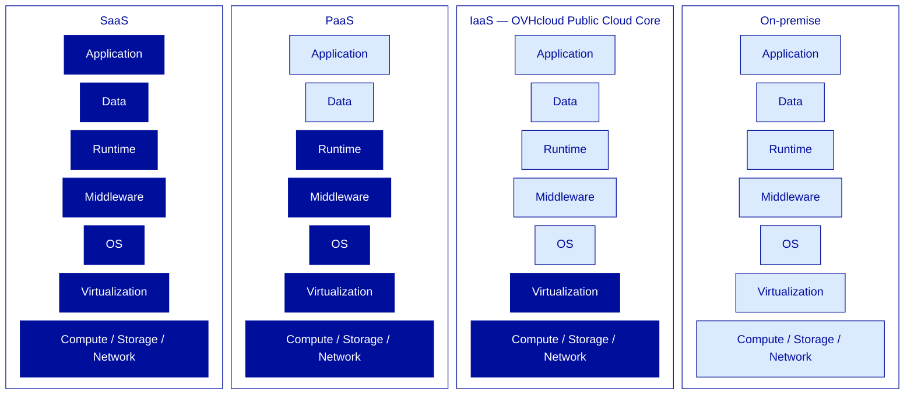

---
# ============================================================
# Module 1.1 — Cloud Foundations & OVHcloud Positioning
# Slidev source file
# ============================================================
theme: ../../theme-ovhcloud
title: Cloud Foundations & OVHcloud Positioning
info: |
  ## OVHcloud — Public Cloud — Core Associate
  Module 1.1 — Cloud Foundations & OVHcloud Positioning.
  Duration: 1h30.
class: text-center
highlighter: shiki
lineNumbers: false
drawings:
  persist: false
transition: slide-left
mdc: true

# Hide the floating navbar / controls overlay in dev mode
controls: false
download: false
selectable: true

# Module-level metadata (consumed by trainer-notes export and CI)
moduleId: "1.1"
moduleTitle: "Cloud Foundations & OVHcloud Positioning"
duration: "1h30"
program: "OVHcloud — Public Cloud — Core Associate"
los:
  - LO-FND-K01
  - LO-FND-K02
  - LO-FND-K03
  - LO-FND-K04
  - LO-FND-K05
  - LO-FND-K06
  - LO-FND-K07
  - LO-FND-A01
  - LO-FND-A02
---

<!-- ====================================================== -->
<!-- COVER SLIDE                                            -->
<!-- ====================================================== -->

---
layout: cover
moduleId: "1.1"
duration: "1h30"
---

# Cloud Foundations
## & OVHcloud Positioning

<!--
Trainer notes — Cover slide:
- Welcome learners, do a quick round of intros (name, role, prior cloud experience).
- Calibrate the room: who has used OVHcloud Manager this week? Who is ex-AWS?
- Announce: at the end of this 1h30, you will be able to defend OVHcloud's value to a stakeholder and qualify a workload as Core-eligible.
- This is the entry module of the certification — set the tone: rigorous, honest, no religious debates.
-->

---
layout: default
moduleId: "1.1"
slideId: "Agenda"
---

# Agenda

**Block 1 — Sentier battu** · 5 min
*Prerequisites & remediation pointers*

**Block 2 — Theory** · 30 min
*Cloud properly defined, OVHcloud positioning, Core scope*

**Block 3 — Demo** · 15 min
*Walk-through of the OVHcloud Manager UI*

**Block 4 — Lab** · 30 min
*Positioning Drill (pairs)*

**Block 5 — Micro-check** · 5 min
*Formative QCM, 6 questions*

**Block 6 — Wrap-up** · 5 min
*Recap & transition to Module 1.2*

<!--
Trainer notes — Agenda:
- Frame the journey: theory first, then they SEE it (demo), then they DO it (lab), then they CHECK (micro-check).
- Announce the lab is a Positioning Drill, not a hands-on technical lab — IAM/Compute haven't been covered yet.
- Set expectations on timing — strict 90 min, including transitions.
-->

<!-- ====================================================== -->
<!-- BLOCK 1 — SENTIER BATTU                                -->
<!-- ====================================================== -->

---
layout: section
block: "Block 1"
duration: "5 min"
---

# Before we start
### Prerequisites & remediation

---
layout: two-cols
moduleId: "1.1"
slideId: "S00 — Before we start"
---

# Before we start

::left::

## You are ready if...

**Tools**
- Active OVHcloud account with Manager access
- Modern browser, outbound Internet to `*.ovh.com` and `*.ovh.net`

**Knowledge**
- General IT vocabulary (server, VM, IP, DNS, hypervisor)
- General-public notion of "cloud" (AWS / Azure / GCP)
- Basic CAPEX vs OPEX intuition

::right::

## If not, here's where to look

- **No Manager experience?**
  *Getting started with the OVHcloud Manager* on `docs.ovhcloud.com`.

- **IaaS / PaaS / SaaS unclear?**
  Covered in this module's Theory block — pay extra attention to slide S03.

- **No virtualization background?**
  Watch *VMware 101* (internal portal) or any public KVM/VMware intro.

<!--
Trainer notes — S00 Before we start:
- Show of hands: "Who has opened the OVHcloud Manager this week?" → calibrates the audience early.
- Anticipate 1-2 Corporate learners have never touched the Manager → reassure: the end-of-module demo covers exactly that.
- If someone has no active account → note the name, get it activated during the break, do not block the module.
- Do NOT switch to a live Manager demo here — Block 3 does that one hour later.
- Remind: this *sentier battu* applies to all 3 days, not just this module.
-->

<!-- ====================================================== -->
<!-- BLOCK 2 — THEORY & CONCEPTS                            -->
<!-- ====================================================== -->

---
layout: section
block: "Block 2"
duration: "30 min"
---

# Theory & Concepts
### Cloud defined · Service models · OVHcloud positioning

---
layout: default
moduleId: "1.1"
slideId: "S01 — Northwind Analytics"
---

# Northwind Analytics, in 2 minutes

<strong>Business</strong> 
European B2B SaaS scale-up 
Logistics vertical

<strong>Size</strong> 
~80 employees 
3× growth in 18 months

<strong>Current stack</strong> 
Self-managed PostgreSQL 
Hardened bare-metal

<strong>Current pressure</strong> 
Infrastructure under strain 
Leadership wants cloud

  <strong>2019</strong> founded &nbsp;→&nbsp; <strong>2024</strong> 3× growth &nbsp;→&nbsp; <strong>today</strong> cloud decision

  Our role for the next 3 days: guide them onto OVHcloud.

<!--
Trainer notes — S01 Northwind:
- Souligner que Northwind sera notre cas concret pendant les 3 jours — chaque module ajoute une brique à leur infra.
- Anticiper "is this a real company?" → no, pedagogical scenario, but every technical choice is realistic.
- Demander si quelqu'un dans la salle a un profil client similaire — capter les analogies pour les réutiliser plus tard.
- Rappeler que Northwind est ex-baremetal, pas ex-AWS — détail de ton important pour le module.
- Éviter de plonger dans les détails techniques de leur stack — on les déroule au fil des modules.
-->

---
layout: default
moduleId: "1.1"
slideId: "S02 — Cloud properly defined"
---

# Cloud, properly defined

  
🛎️

  
On-demand self-service

  
Provision without human intervention

  
🌐

  
Broad network access

  
Reachable via standard protocols

  
🧊

  
Resource pooling

  
Shared, dynamically allocated

  
⚡

  
Rapid elasticity

  
Scale up/down fast, often automated

  
📊

  
Measured service

  
Usage metered, billed by consumption

  <strong>Reality filter:</strong> if any one of these five is missing, it's not cloud — it's hosting.

  Source: NIST SP 800-145 (2011)

<!--
Trainer notes — S02 NIST:
- Souligner que ces 5 critères sont le filtre de réalité : si l'un manque, ce n'est pas du cloud, c'est de l'hébergement.
- Anticiper "and serverless?" → all 5 criteria still hold, it's just a higher abstraction level.
- Mini-sondage : "votre infra actuelle coche combien de ces cases ?" — calibre la maturité de la salle.
- Rappeler que la définition NIST date de 2011 et n'a pas bougé — c'est stable, on peut s'y adosser.
- Si quelqu'un cite la définition "marketing" du cloud → recadrer poliment vers le NIST.
-->

---
layout: default
moduleId: "1.1"
slideId: "S03 — IaaS / PaaS / SaaS"
---

# IaaS / PaaS / SaaS — who owns what

  <strong>OVHcloud Public Cloud Core = IaaS.</strong> Adjacent managed services (MKS, DBaaS) sit higher in the stack and are out of scope for this certification.

<!--
Trainer notes — S03 IaaS/PaaS/SaaS:
- Souligner que la frontière IaaS/PaaS n'est plus binaire — managed Kubernetes, par exemple, est entre les deux.
- Anticiper "Object Storage est-il IaaS ou PaaS ?" → conventionnellement IaaS dans la matrice OVHcloud, même si techniquement c'est managé.
- Si quelqu'un demande "et le baremetal cloud d'OVHcloud ?" → c'est IaaS aussi, juste sans virtualisation — détail vu en module 1.3.
- Rappeler que sur cette certif on reste en IaaS — les services managés "au-dessus" sont d'autres certifs (MKS, DBaaS).
- Éviter de digresser sur le serverless — pas dans le scope Core Associate.
-->

---
layout: default
moduleId: "1.1"
slideId: "S04 — Shared responsibility"
---

# Shared responsibility, applied to IaaS

### Customer responsibility
*(above the hypervisor line)*

- Application
- Data & data classification
- Identity & access management *at instance level*
- OS patching & hardening
- Backups *(unless explicit backup service)*
- Network ACLs at OS / app level

### Provider responsibility
*(below the hypervisor line)*

- Hypervisor patching
- Physical compute, storage, network
- Datacenter physical security
- Power, cooling, fire suppression
- Network backbone redundancy
- Underlying storage redundancy

  <strong>"Shared" ≠ "split 50/50".</strong> The line sits between the hypervisor and the guest OS.

<!--
Trainer notes — S04 Shared responsibility:
- Souligner que ce modèle est universel IaaS — AWS, Azure, OVHcloud, le même contrat de base s'applique.
- Anticiper "et les backups, c'est qui ?" → en IaaS, c'est toi sauf si tu souscris un service de backup explicite (vu en module 2.2).
- Rappeler à l'audience ex-AWS que ce modèle leur est familier — pas de surprise ici, juste un transfert de contexte.
- Si quelqu'un demande où se situent les services managés OVHcloud (MKS, DBaaS) → la ligne remonte, le provider prend en charge plus — mais on sort du Core Associate.
- Mini-cas : "vous oubliez de patcher l'OS d'une VM, qui est responsable de l'incident ?" — réponse attendue : le client.
-->

---
layout: default
moduleId: "1.1"
slideId: "S23 — Hyperscaler cross-reference"
---

# OVHcloud ↔ AWS ↔ Azure — Core scope

| Category | OVHcloud | AWS | Azure |
|---|---|---|---|
| **Compute (VM)** | Public Cloud Instance | EC2 | Virtual Machine |
| **Block storage** | Block Storage (Cinder) | EBS | Managed Disk |
| **Object storage** | Object Storage (S3-compatible) | S3 | Blob Storage |
| **Cold storage** | Cold Archive | S3 Glacier | Archive Storage |
| **Private network** | vRack + Private Network | VPC | VNet |
| **Load balancer** | Load Balancer (Octavia) | ELB / ALB / NLB | Load Balancer |
| **Public IP** | Floating IP / Failover IP | Elastic IP | Public IP |
| **DNS** | DNS Zone | Route 53 | Azure DNS |
| **Identity / RBAC** | IAM (Policy + Role) | IAM | Entra ID + RBAC |
| **Infra as Code** | Terraform / OpenStack CLI | CloudFormation / Terraform | ARM / Bicep / Terraform |
| **Object lifecycle** | S3 Lifecycle Rules | S3 Lifecycle | Blob Lifecycle Mgmt |

  <strong>Reading guide:</strong> rows are <em>functionally equivalent</em>, not feature-identical. Use this table to bridge mental models, not to compare SLAs or feature parity.

<!--
Trainer notes — S23 Hyperscaler cross-reference:
- Souligner que la table couvre uniquement le scope Core Associate — les services managés (MKS, DBaaS, AI) sont hors-périmètre et apparaîtront dans les certifs sœurs.
- Anticiper "et le serverless ?" → pas de Lambda équivalent natif dans le Core OVHcloud, c'est une différence structurelle assumée (voir Q1 du FAQ trainer).
- Anticiper "vRack et VPC c'est pareil ?" → non, modèles différents (L2 chez OVHcloud, L3 chez AWS), à clarifier en Module 2.4 Network.
- Cette table est le "north star" cross-référence du programme — chaque module qui introduit un nouveau service vient compléter une ligne ici.
- Distribuer en handout à la fin du module — les apprenants ex-AWS y reviennent constamment.
-->

---
layout: default

# POC stops here

  Slides S05 → S25, Demo, Lab, Micro-check and Wrap-up 
  will follow the same authoring pattern.

  This deck demonstrates the <strong>docs-as-code workflow</strong>, the <strong>OVHcloud theme</strong>, the <strong>Mermaid integration</strong>, and the <strong>frontmatter convention</strong> for trainer notes and metadata.

<!--
Trainer notes — POC marker:
- This slide is not part of the production deliverable.
- It marks the end of the POC scope: the first 4 content slides (S01-S04) plus structural slides (cover, agenda, block separators, sentier battu).
- Once the POC stack is validated, production resumes on S05 and continues through S25 + demo + lab + micro-check + wrap-up.
-->
