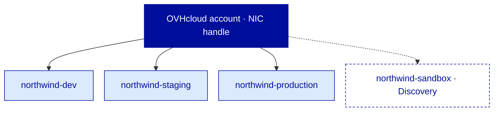
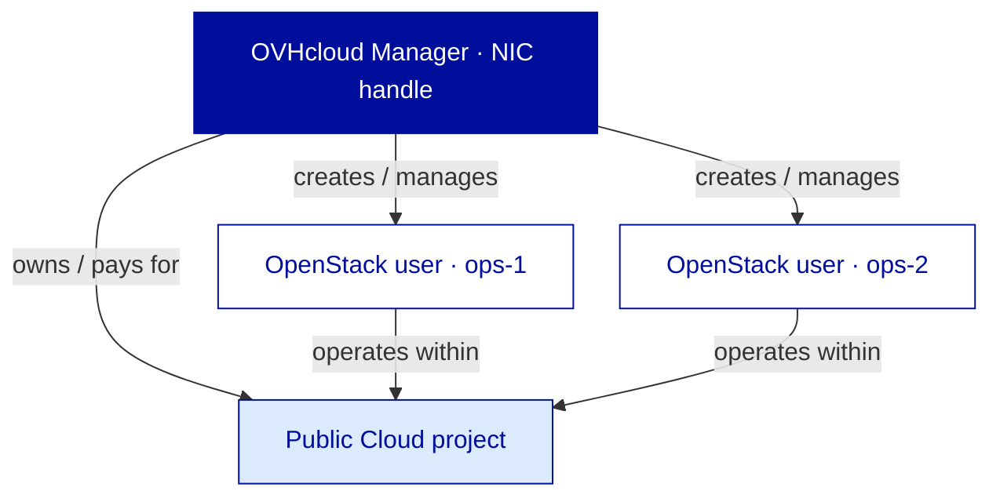
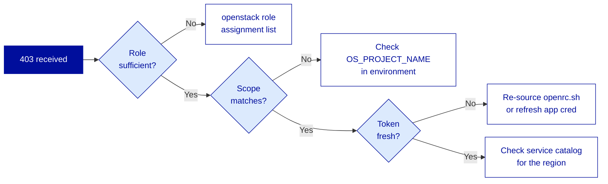

---
# ============================================================
# Module 1.2 — Public Cloud Project, Regions & Basic IAM
# Slidev source file
# ============================================================
theme: ../../theme-ovhcloud
title: Public Cloud Project, Regions & Basic IAM
info: |
  ## OVHcloud — Public Cloud — Core Associate
  Module 1.2 — Public Cloud Project, Regions & Basic IAM.
  Duration: 1h30.
class: text-center
highlighter: shiki
lineNumbers: false
drawings:
  persist: false
transition: slide-left
mdc: true
exportFilename: 'modules/module-1-2-pci-foundation-iam/student_export'

# Hide the floating navbar / controls overlay in dev mode
controls: false
download: false
selectable: true

# Module-level metadata (consumed by trainer-notes export and CI)
moduleId: "1.2"
moduleTitle: "Public Cloud Project, Regions & Basic IAM"
duration: "1h30"
program: "OVHcloud — Public Cloud — Core Associate"
los:
  - LO-PCI-K01
  - LO-PCI-K02
  - LO-PCI-K03
  - LO-PCI-K04
  - LO-PCI-K05
  - LO-PCI-S01
  - LO-PCI-S02
  - LO-PCI-S03
  - LO-PCI-S04
  - LO-PCI-S05
  - LO-PCI-S06
  - LO-PCI-A01
  - LO-PCI-A02
---

<!-- ====================================================== -->
<!-- COVER SLIDE                                            -->
<!-- ====================================================== -->

---
layout: cover
moduleId: "1.2"
duration: "1h30"
---

# Public Cloud Project
## Regions & Basic IAM

<!--
Trainer notes Cover slide:
- Welcome learners back. Quick energy check after Module 1.1.
- Frame the shift: we leave conviction (why OVHcloud) and enter operation (where, how, who).
- Announce: at the end of this 1h30, every learner has a working environment ready for Module 1.3.
- Set expectations: today we touch the Manager, the CLI, and we authenticate for real.
-->

---
layout: default
moduleId: "1.2"
slideId: "Agenda"
---

# Agenda

**Block 1 — Sentier battu** · 5 min
*Prerequisites & remediation pointers*

**Block 2 — Theory** · 30 min
*Project, regions, billing, OpenStack identity*

**Block 3 — Demo** · 15 min
*End-to-end bootstrap : Manager + CLI*

**Block 4 — Lab** · 30 min
*Bootstrap Northwind's working environment*

**Block 5 — Micro-check** · 5 min
*Formative QCM, 7 questions*

**Block 6 — Wrap-up** · 5 min
*Recap & transition to Module 1.3*

<!--
Trainer notes Agenda:
- First operational module of the program : frame it as such, energy shifts here.
- Annonce que le lab produit un livrable concret : un openrc.sh fonctionnel reutilisable des Module 1.3.
- Strict timing 90 min, pause prevue apres ce module.
-->

<!-- ====================================================== -->
<!-- BLOCK 1 — SENTIER BATTU                                -->
<!-- ====================================================== -->

---
layout: section
block: "Block 1"
duration: "5 min"
---

# Before we start
### Prerequisites & remediation

---
layout: two-cols
moduleId: "1.2"
slideId: "S00 — Before we start"
---

# Before we start

::left::

## You are ready if...

**Tools**
- Active OVHcloud account with Manager access, valid payment method or voucher available
- Modern browser, outbound to `*.ovh.com`, `*.ovh.net`, `auth.cloud.ovh.net`
- Terminal with Python 3.8+

**Knowledge**
- Module 1.1 covered : OVHcloud Public Cloud positioning, Core scope
- General IAM vocabulary (user, role, credential, token)
- CLI basics : source a script, set env vars, read JSON

::right::

## If not, here's where to look

- **No OVHcloud account?**
  Self-service signup at `ovhcloud.com/en/auth/signup/`. Sponsor should pre-create accounts for in-person sessions.

- **No OpenStack CLI?**
  `pip install python-openstackclient`. Fallback container image provided in the lab folder.

- **Module 1.1 skipped?**
  Read the 5-page "Why OVHcloud" brief in the standalone delivery kit before the session.

- **No CLI background?**
  Lab provides every command verbatim. You only need to read output, not write commands.

<!--
Trainer notes S00 Before we start:
- Demander : "Qui a installe le CLI OpenStack ?" Si moins de la moitie, signaler la fallback container au moment du lab.
- Anticiper le learner Digital Starter sans payment method : voucher distribue en debut de session, pas a la derniere minute.
- Si quelqu'un n'a pas suivi 1.1 : ne pas rejouer, pointer le brief 5 pages et avancer.
- Rappeler : ce sentier battu s'applique a tous les modules suivants, le CLI est une constante.
-->

<!-- ====================================================== -->
<!-- BLOCK 2 — THEORY & CONCEPTS                            -->
<!-- ====================================================== -->

---
layout: section
block: "Block 2"
duration: "30 min"
---

# Theory & Concepts
### Project · Regions · Billing · OpenStack identity

---
layout: default
moduleId: "1.2"
slideId: "S01 — The Public Cloud Project"
los: ["LO-PCI-K01"]
---

# The Public Cloud Project

  
💰

  
Billing boundary

  
All resources inside are billed under one project line

  
🔐

  
Access boundary

  
OpenStack users are scoped to one project

  
🧱

  
Isolation boundary

  
No data, no network, no IAM crosses the line

  <strong>The project is the fundamental unit of OVHcloud Public Cloud.</strong> Everything you deploy lives inside one.

  Legacy analogy : a vCenter datacenter folder with its own permissions and chargeback. 
  Hyperscaler cross-reference : equivalent to an AWS account or an Azure subscription, not to a VPC.

<!--
Trainer notes S01 The Public Cloud Project:
- Souligner que c'est LE concept a integrer aujourd'hui, tout le reste de la formation s'appuie dessus.
- Anticiper "c'est comme un VPC AWS ?" : non, le projet est plus large, c'est l'equivalent du compte AWS lui-meme.
- Rappeler que Northwind va creer son premier projet dans le lab : northwind-staging.
- Si quelqu'un demande combien de projets max : quota souple, plusieurs dizaines sans souci, voir avec l'AM au-dela.
-->

---
layout: default
moduleId: "1.2"
slideId: "S02 — One account, many projects"
los: ["LO-PCI-K01", "LO-PCI-A01"]
---

# One account, many projects

<strong>One account</strong> = the billing entity, the contract. 
<strong>One project</strong> = an operational silo inside it.

Projects are <strong>airtight by design</strong> : no peering, no shared IAM, no shared data. 
All projects appear on the <strong>same invoice</strong>.

  Segmentation does not fragment billing. It segments operations.

<!--
Trainer notes S02 One account many projects:
- Souligner "airtight" : pas de peering inter-projet en Core, c'est volontaire.
- Anticiper "comment on partage des ressources entre projets ?" : on ne partage pas, on duplique via IaC (Module 3.1).
- Si quelqu'un evoque AWS Organizations : c'est analogue mais OVHcloud reste plus simple, pas de hierarchie d'OU.
- Rappeler le persona Corporate : la separation Dev/Staging/Prod est un attendu non negociable, pas une option.
-->

---
layout: default
moduleId: "1.2"
slideId: "S03 — Discovery mode"
los: ["LO-PCI-K04"]
---

# Discovery mode — free entry, capped ceiling

<strong style="color: var(--ovh-masterbrand-blue);">Discovery project</strong>

✓ Free, no payment method required 
✓ Instant creation, instant access 
✓ Designed for learning &amp; evaluation

Capped on : instance count, flavor sizes, regions, no IP failover, time-limited

<strong style="color: var(--ovh-masterbrand-blue);">Standard project</strong>

→ Payment method validated 
→ Full Core catalog &amp; all regions 
→ Production-ready

Same project ID after upgrade : Discovery → Standard is in-place

<strong>Trap :</strong> never plan a real workload on a Discovery project. Quota caps will hit you mid-deployment.

<!--
Trainer notes S03 Discovery mode:
- Souligner "upgrade in place" : pas besoin de recreer, c'est une bascule.
- Anticiper "et si je depasse les quotas Discovery ?" : blocage net, message explicite, lien d'upgrade dans le Manager.
- Si un learner Digital Starter pose la question cout : Discovery + bons d'essai = ticket d'entree a 0 euro, c'est le parcours self-service typique.
- Eviter de detailler chaque limite Discovery (chiffres bougent), pointer la doc officielle.
-->

---
layout: default
moduleId: "1.2"
slideId: "S04 — Regions"
los: ["LO-PCI-K02"]
---

# Regions — geography meets service catalog

<strong style="color: var(--ovh-masterbrand-blue);">Europe</strong>

GRA · SBG · DE · UK · WAW 
EU jurisdiction · sovereignty

<strong>North America</strong>

BHS · US-EAST-VA · US-WEST-OR 
CA / US jurisdictions

<strong>Asia-Pacific</strong>

SGP · SYD 
Regional reach

A region drives <strong>3 decisions</strong> : latency to your users · regulatory residency · which services are available

Service availability is <strong>not uniform</strong> across regions. Core services exist almost everywhere, some adjacent services are region-restricted. Verify in the Manager at deployment time.

  Northwind's choice : GRA — EU residency, full Core catalog, low latency to French customers.

<!--
Trainer notes S04 Regions:
- Souligner que le service catalog par region se verifie dans le Manager au moment du choix.
- Anticiper "AZ disponibles ?" : 3-AZ regions existent (notamment certaines regions EU), a verifier au cas par cas dans la doc.
- Si quelqu'un compare avec AWS regions/AZ : modele proche mais pas identique, AZ pas generalisees chez OVHcloud.
- Rappeler la souverainete : regions EU = donnees sous droit europeen, argument majeur pour le persona Corporate.
-->

---
layout: default
moduleId: "1.2"
slideId: "S05 — Billing model"
los: ["LO-PCI-K03"]
---

# Billing model — granular, predictable

| | OVHcloud Public Cloud | AWS | Azure |
|---|---|---|---|
| Pricing granularity | **Hourly or monthly per resource** | Hourly / reservations | Hourly / reservations |
| Egress traffic | **Included within committed bandwidth** | Billed per GB | Billed per GB |
| Invoice frequency | Monthly, consolidated all projects | Monthly per account | Monthly per subscription |
| Reservation discount | Monthly commit, simple | RI / Savings Plans families | Reserved instances |
| Currency display | Account's billing currency | USD-anchored | USD-anchored |

<strong style="color: var(--ovh-masterbrand-blue);">Resource-based</strong> : each instance, volume, IP, snapshot is billed individually. Two modes per resource : hourly (pay-as-you-go) or monthly (commit, lower unit price).

<strong style="color: var(--ovh-masterbrand-blue);">No surprise overage</strong> : pricing is published, no proprietary commitment family to learn. Egress included is the structural cost differentiator.

  "Egress included" = within the publicly committed bandwidth. Sustained abuse triggers a Fair Use conversation, not a silent bill spike.

<!--
Trainer notes S05 Billing model:
- Souligner "egress included" : argument financier numero un face a AWS, a ne pas survendre mais a mentionner clairement.
- Anticiper "c'est vraiment illimite ?" : non, traffic bandwidth is what's committed, sustained abuse triggers a conversation, voir la doc Fair Use.
- Si quelqu'un demande pour des reservations longues durees : modele mensuel et engagement annuel possible, voir avec l'AM pour Corporate.
- Rappeler que le persona Digital Starter peut predire son budget au centime pres : argument self-service decisif.
-->

---
layout: default
moduleId: "1.2"
slideId: "S06 — Two identities one project"
los: ["LO-PCI-K05"]
---

# Two identities, one project

<strong>Manager identity (NIC handle)</strong> 
The OVHcloud account itself. Owns the contract, pays the bill, creates projects, full administrative scope.

<strong>OpenStack identity (Keystone user)</strong> 
Scoped inside a specific project. Deploys and operates resources via API / CLI. No billing visibility.

  <strong>Deliberate split.</strong> You can delegate full operational power to engineers without exposing the billing-owning account.

<!--
Trainer notes S06 Two identities:
- Souligner que c'est la confusion numero un pour les ex-AWS : chez AWS, IAM est unifie, ici non.
- Anticiper "et la SSO entre les deux ?" : pas de federation native Manager-OpenStack en Core Associate, sujet Module 2.5 et tier Professional.
- Si quelqu'un demande pourquoi cette separation : heritage OpenStack + isolation forte entre billing et runtime, c'est un choix architectural.
- Verifier la comprehension par une question : "qui cree l'utilisateur OpenStack ?" reponse : un Manager user, depuis le Manager.
-->

---
layout: default
moduleId: "1.2"
slideId: "S07 — OpenStack identity"
los: ["LO-PCI-K05"]
---

# OpenStack identity — the five concepts

  
🗝️

  
Keystone

  
The OpenStack identity service. Every API call hits it first.

  
👤

  
User

  
Actor (human or service) authenticated with credentials

  
📦

  
Project

  
The scope the user operates within

  
🎫

  
Role

  
What the user can do : member, admin, read-only variants

  
⏱️

  
Token

  
Short-lived credential issued at login, attached to every call

  <strong>Service catalog :</strong> the list of endpoints the user can reach once authenticated. Different per region.

  Analogy : User = employee · Project = office · Role = access badge · Token = day pass.

<!--
Trainer notes S07 OpenStack identity:
- Souligner que le token est ephemere (typiquement quelques heures) : c'est ce qui expire et declenche les 403.
- Anticiper "ou je vois la liste des roles ?" : openstack role list, on le verra en demo.
- Si quelqu'un confond user et project : utiliser l'analogie employe / bureau / badge.
- Eviter d'entrer dans les details de Keystone v3 (domains, federation), hors scope Associate.
-->

---
layout: default
moduleId: "1.2"
slideId: "S08 — Three ways to authenticate"
los: ["LO-PCI-S03", "LO-PCI-S05"]
---

# Three ways to authenticate

<strong>Manager login</strong>

👤 Human in a browser 
🔐 Password + 2FA 
🌐 Full account control

Never share. Never script.

<strong>OpenStack RC + password</strong>

🧑‍💻 Human at a terminal 
📄 <code>openrc.sh</code> file sourced 
🎯 Scoped OpenStack user

Fine for interactive use. Awkward for automation.

<strong style="color: var(--ovh-masterbrand-blue);">Application Credentials</strong>

🤖 Scripts &amp; CI pipelines 
🔑 ID + secret, revocable 
♻️ Rotatable, expirable

Recommended for any non-interactive workflow.

  <strong>Rule of thumb :</strong> a human uses a password, a script uses an application credential.

  All three authenticate against Keystone in the end. Only the credential type differs.

<!--
Trainer notes S08 Three ways to authenticate:
- Souligner que les Application Credentials sont la bonne pratique 2026, a privilegier des qu'on quitte le terminal d'un humain.
- Anticiper "et la rotation ?" : app creds peuvent etre creees avec une date d'expiration, a scripter dans la CI.
- Si quelqu'un demande "et les access keys S3 ?" : existent pour Object Storage S3-compatible, on en parlera Module 2.1.
- Rappeler le persona Digital Starter : pour un freelance qui automatise, app credential des le premier script Terraform.
-->

---
layout: default
moduleId: "1.2"
slideId: "S09 — Project segmentation"
los: ["LO-PCI-A01"]
---

# Project segmentation — the corporate playbook

<strong>❌ Anti-pattern</strong>

One giant project 
Dev + Staging + Prod mingled 
One role set for everyone

A misclick on Dev can touch Prod.

<strong style="color: var(--ovh-masterbrand-blue);">✓ Recommended</strong>

<code>acme-dev</code> &nbsp;·&nbsp; dev-team: member &nbsp;+&nbsp; ops: admin 
<code>acme-staging</code> &nbsp;·&nbsp; dev-team: read &nbsp;+&nbsp; ops: admin 
<code>acme-prod</code> &nbsp;·&nbsp; ops: admin only

Blast radius contained. Per-env cost visibility.

<strong>Benefit 1</strong> 
Blast radius contained per environment

<strong>Benefit 2</strong> 
Per-env cost visibility on the same invoice

<strong>Benefit 3</strong> 
Per-env access policies, no role gymnastics

  Counter-pattern : don't mirror your org chart into projects mechanically. Keep the model legible.

<!--
Trainer notes S09 Project segmentation:
- Souligner que la decision est faite tot et coute cher a defaire : d'ou l'A-level LO.
- Anticiper "et si on veut partager une base de donnees entre Dev et Staging ?" : on ne fait pas, on duplique, c'est le principe.
- Si quelqu'un demande "et le cout additionnel ?" : zero, les projets vides ne coutent rien.
- Rappeler que c'est l'attendu N+1 pour le persona Corporate : pas de raccourci sur ce point.
-->

---
layout: default
moduleId: "1.2"
slideId: "S10 — 403 Keystone error"
los: ["LO-PCI-A02"]
---

# The 403 Keystone error — diagnostic flow

<strong>401 vs 403</strong> 
<strong>401</strong> = "I don't know who you are" (bad credentials) 
<strong>403</strong> = "I know who you are, you can't do that"

<strong style="color: var(--ovh-masterbrand-blue);">Mechanical flow</strong> 
Three dominant root causes, checked in order. Removes 80% of "ticket support" reflexes.

<!--
Trainer notes S10 403 Keystone error:
- Souligner le 401/403 split : c'est la premiere discrimination a faire dans tout diagnostic.
- Anticiper "et le token, comment je vois qu'il a expire ?" : en CLI le message d'erreur est explicite, sinon openstack token issue pour en generer un frais.
- Si quelqu'un demande "et les logs Keystone cote serveur ?" : pas accessibles en Core, on diagnostique cote client, c'est la philosophie SaaS-cloud.
- Verifier en posant : "tu recois un 403, premier reflexe ?" reponse attendue : openstack role assignment list.
-->

<!-- ====================================================== -->
<!-- BLOCK 3 — TRAINER DEMONSTRATION                        -->
<!-- ====================================================== -->

---
layout: section
block: "Block 3"
duration: "15 min"
---

# End-to-end bootstrap
### Manager + CLI, same project, two views

---
layout: default
moduleId: "1.2"
slideId: "Demo — Bootstrap end-to-end"
los: ["LO-PCI-S01", "LO-PCI-S02", "LO-PCI-S03", "LO-PCI-S04", "LO-PCI-S05"]
---

# Demo — Bootstrap a Public Cloud environment

<strong style="color: var(--ovh-masterbrand-blue);">What you'll see</strong>

· Create a Public Cloud project from the Manager 
· Configure billing &amp; pick a region 
· Create an OpenStack user with the <code>member</code> role 
· Download and source <code>openrc.sh</code> 
· Verify via <code>openstack catalog list</code> and <code>quota show</code> 
· Create an Application Credential

<strong style="color: var(--ovh-masterbrand-blue);">Why this matters</strong>

Two channels, same project. The Manager and the CLI show the same object from two angles. By the end, you have a working environment ready for any later module.

  Project name for the demo : <code>demo-bootstrap</code> · Region : GRA11

  12 steps · ~12 min walkthrough · 3 min Q&amp;A

<!--
Trainer notes Demo Bootstrap end-to-end:

PRE-FLIGHT (do BEFORE the block):
- Pre-warm the Manager session 5 min before. Logged in, Public Cloud universe open.
- Ensure the OpenStack CLI is installed on the demo terminal. Test 'openstack' returns help.
- Have a backup voucher code ready in case the primary one is rejected.
- Terminal at 16pt+, dark background, distracting tabs closed.
- IMPORTANT : create demo project under a throwaway sub-account if possible, NOT your production training account, since the project will linger.

DEMO SCRIPT (12 steps, ~12 min):
1. Manager > Public Cloud > Create a new project : name 'demo-bootstrap'.
   "Voila l'entree. Si vous voyez ca, vous etes au bon endroit."
2. Attach payment method OR apply voucher : "Discovery toggle visible. Today : standard."
3. Confirm > wait 30 sec : "Notez l'ID UUID, c'est lui dans toutes les commandes CLI."
4. Project Management > Users & Roles > Add user : "Pas un user Manager. Un user OpenStack local."
5. Name 'ops-demo', role 'member' : "Mot de passe affiche UNE FOIS. Copiez-le maintenant."
6. Click user > Download OpenStack RC : pick region GRA.
   "Un RC = une region. Multi-region = plusieurs fichiers."
7. Terminal : 'source openrc.sh', paste password : "Aucune sortie = succes."
8. 'openstack token issue' : "Token avec date d'expiration. C'est ca qui expire et cause les 403."
9. 'openstack catalog list' : "Tout ce que ce user peut atteindre dans GRA."
10. 'openstack quota show --compute' : "Quotas par projet et par region, pas globaux."
11. Manager > API & Credentials > Create Application Credential 'demo-app-cred' :
    "JSON avec id + secret, affiche UNE fois. Pour la CI = secret de pipeline."
12. Highlight Revoke button : "C'est ce qui distingue app cred d'un mot de passe : rotation et revocation natives."

FAILURE MODES:
- 'openstack: command not found' : pip install python-openstackclient or switch to prepared container.
- Authentication failed after source : password copied with trailing space. Paste in scratch buffer first.
- 'openstack catalog list' empty : RC downloaded for wrong region. Re-download for GRA, re-source.

Q&A (3 min) : focus on identity model and bootstrap flow. Park IaC questions for Module 3.1.
-->

<!-- ====================================================== -->
<!-- BLOCK 4 — LEARNER LAB                                  -->
<!-- ====================================================== -->

---
layout: section
block: "Block 4"
duration: "30 min"
---

# Bootstrap Northwind
### Your turn. Solo. 30 minutes.

---
layout: default
moduleId: "1.2"
slideId: "Lab — Bootstrap Northwind brief"
los: ["LO-PCI-S01", "LO-PCI-S02", "LO-PCI-S03", "LO-PCI-S04", "LO-PCI-S05"]
---

# Lab — Bootstrap Northwind's working environment

You are Northwind's new Cloud Ops engineer. The CTO has handed you the OVHcloud credentials and a voucher. Your mission : bootstrap a fully working Public Cloud environment named <code>&lt;your-initials&gt;-northwind-staging</code>, create one OpenStack user, set up local CLI access, and prove the environment is operational.

<strong style="color: var(--ovh-masterbrand-blue);">Channels</strong>

· OVHcloud Manager (web UI) for project &amp; user creation 
· OpenStack CLI (terminal) for verification

<strong style="color: var(--ovh-masterbrand-blue);">Success criteria</strong>

A working <code>openrc.sh</code> and an application credential, both reusable in Modules 1.3+

  Naming : <code>&lt;your-initials&gt;-northwind-staging</code> &nbsp;·&nbsp; Region : GRA &nbsp;·&nbsp; Time : 30 min

<!--
Trainer notes Lab brief:
- Souligner que ce lab produit un artefact concret reutilise des Module 1.3 : ce n'est pas un exercice scolaire.
- Annoncer les criteres de succes en debut de lab : ils sont auto-verifiables via CLI output.
- Circuler discretement, ne pas intervenir sauf blocage. Reperer 2-3 learners en avance pour les rendre support-pair.
- Garder un voucher de secours, certains codes sont parfois rejetes.
- Si quelqu'un fait planter son projet : pas grave, on en recree un avec un autre prefixe.

VALIDATION CRITERIA (silent check by trainer):
- Project visible in dashboard with UUID
- 'openstack token issue' returns future expiration
- 'openstack catalog list' shows at least compute, network, volume, image, identity
- App credential visible in Manager
-->

---
layout: default
moduleId: "1.2"
slideId: "Lab — Steps"
---

# Lab — Step-by-step

**Manager side (UI)**

1. Log in : `ovh.com/manager/`
2. Public Cloud > Create new project
   Name : `<initials>-northwind-staging`
   Mode : **standard** (not Discovery)
3. Apply voucher code (provided by trainer)
4. Project Management > Users &amp; Roles
   Add user `<initials>-ops`, role `member`
   **Save password — shown once**
5. Click user > Download OpenStack RC
   Region : **GRA**
6. API &amp; Credentials > Create App Credential
   Name : `<initials>-northwind-tf`

**CLI side (terminal)**

7. `cd` to the download folder
8. `source openrc.sh`, paste password
9. Run the three verification commands :
   - `openstack token issue`
   - `openstack catalog list`
   - `openstack quota show --compute`
10. Final check : `openstack user list`
    Your `<initials>-ops` user must appear

<strong>Artifacts to keep locally</strong> (do NOT commit to git) : 
<code>openrc.sh</code> · <code>app-cred.json</code> · <code>verification.txt</code> (captured CLI output)

  Stuck? Raise your hand or ping the trainer. Common issues : voucher, CLI install, password typo on source.

<!--
Trainer notes Lab Steps:
- Slide de reference pendant le lab : laisser projete tout le long, learners s'y referent.
- Insister oralement : "le mot de passe est affiche UNE fois, copiez-le tout de suite."
- Si un learner copie le password avec un espace en trop : symptome = source semble OK, premiere commande retourne 401. Pas 403.
- Si plusieurs learners bloquent sur l'installation CLI : basculer en masse vers le container image preparee.
- Eviter d'aider trop tot : laisser le learner lire le message d'erreur, 70% du temps il se debloque seul.

SUPPORT FAQ (anticipated learner questions):
- "Mon password de l'etape 4 ne marche plus" : password affiche une fois, regenerer depuis la fiche user.
- "openstack: command not found" : pip install python-openstackclient ou utiliser le container.
- "Voucher dit invalid" : verifier qu'il n'a pas deja ete utilise sur un autre compte, voucher de secours dispo.
- "openstack catalog list ne renvoie rien" : RC telecharge pour mauvaise region ou password mistype. Re-download pour GRA, re-source.
- "Je peux nommer mon projet differemment ?" : garder le suffixe '-northwind-staging', le prefixe peut varier.
-->

<!-- ====================================================== -->
<!-- BLOCK 5 — MICRO-CHECK QCM                              -->
<!-- ====================================================== -->

---
layout: section
block: "Block 5"
duration: "5 min"
---

# Micro-check
### 7 questions · formative, not certifying

---
layout: default
moduleId: "1.2"
slideId: "MC — Q1 Project role"
los: ["LO-PCI-K01"]
---

# Q1 — The role of a Public Cloud project

In OVHcloud Public Cloud, what is the primary role of a Public Cloud project?

<strong>A.</strong> The fundamental unit of resource isolation, billing scope, and access control

<strong>B.</strong> A network boundary equivalent to an AWS VPC

<strong>C.</strong> A regional construct — one project exists per region

<strong>D.</strong> A billing aggregator that holds no resources directly

<!--
Trainer notes Q1:
- Correct answer: A. Three roles in one boundary : isolation, billing, access.
- B wrong : a project contains networks but is broader than a single network.
- C wrong : one project spans regions, resources within it are region-scoped.
- D wrong : projects do hold resources, billing is one role among three.
- LO: LO-PCI-K01 — Bloom: Remember.
-->

---
layout: default
moduleId: "1.2"
slideId: "MC — Q2 Discovery"
los: ["LO-PCI-K04"]
---

# Q2 — Discovery mode

A learner creates a Discovery project to try OVHcloud Public Cloud. Which statement is correct?

<strong>A.</strong> A Discovery project is free forever and can host production workloads at small scale

<strong>B.</strong> A Discovery project has capped quotas; it can be upgraded to a standard project in place, keeping the same project ID

<strong>C.</strong> A Discovery project must be deleted and recreated as a standard project to remove the limits

<strong>D.</strong> A Discovery project is available only in the GRA region

<!--
Trainer notes Q2:
- Correct answer: B. Upgrade is in-place, project ID unchanged.
- A wrong : Discovery is not production-ready, quota caps and time limits will block.
- C wrong : recreation is unnecessary, the upgrade is in-place.
- D wrong : Discovery is available across standard Public Cloud regions, not GRA-exclusive.
- LO: LO-PCI-K04 — Bloom: Understand.
-->

---
layout: default
moduleId: "1.2"
slideId: "MC — Q3 OpenStack identity"
los: ["LO-PCI-K05"]
---

# Q3 — OpenStack identity concept

Which OpenStack identity concept matches : "a time-bounded credential issued by Keystone after a successful authentication, attached to every subsequent API call"?

<strong>A.</strong> Role

<strong>B.</strong> Service catalog

<strong>C.</strong> Token

<strong>D.</strong> Project

<!--
Trainer notes Q3:
- Correct answer: C. Token = short-lived credential attached to every call.
- A wrong : role = permission level, not a credential.
- B wrong : service catalog lists reachable endpoints, not a credential.
- D wrong : project = scope, not a credential.
- LO: LO-PCI-K05 — Bloom: Remember.
-->

---
layout: default
moduleId: "1.2"
slideId: "MC — Q4 Region choice"
los: ["LO-PCI-K02"]
---

# Q4 — Region choice

Northwind operates in Europe and must keep customer data under EU jurisdiction while minimizing latency to French users. Which region is the most appropriate first choice for `northwind-staging`?

<strong>A.</strong> GRA (Gravelines, France)

<strong>B.</strong> BHS (Beauharnois, Canada)

<strong>C.</strong> SGP (Singapore)

<strong>D.</strong> US-EAST-VA

<!--
Trainer notes Q4:
- Correct answer: A. GRA = EU jurisdiction, full Core catalog, low latency to French customers.
- B wrong : outside EU jurisdiction, latency penalty.
- C wrong : outside EU, high latency.
- D wrong : outside EU, breaks the residency requirement.
- LO: LO-PCI-K02 — Bloom: Understand.
-->

---
layout: default
moduleId: "1.2"
slideId: "MC — Q5 Two identities"
los: ["LO-PCI-K05"]
---

# Q5 — Manager identity vs OpenStack identity

Which statement correctly describes the relationship between the Manager identity (NIC handle) and an OpenStack identity (Keystone user)?

<strong>A.</strong> They are the same identity — the NIC handle is automatically the OpenStack admin

<strong>B.</strong> The OpenStack user inherits the Manager user's billing privileges

<strong>C.</strong> SSO is enabled by default between Manager and OpenStack

<strong>D.</strong> Two separate identity systems; a Manager user creates and manages OpenStack users, but credentials and scopes are distinct

<!--
Trainer notes Q5:
- Correct answer: D. Deliberate separation, two identity systems coexisting.
- A wrong : the two are deliberately separated.
- B wrong : OpenStack users have no billing visibility.
- C wrong : no native federation in Core Associate scope, sujet Module 2.5.
- LO: LO-PCI-K05 — Bloom: Understand.
- Piege classique : un ex-AWS coche A par reflexe IAM unifie. Recadrer poliment.
-->

---
layout: default
moduleId: "1.2"
slideId: "MC — Q6 Segmentation strategy"
los: ["LO-PCI-A01"]
---

# Q6 — Project segmentation strategy

A corporate customer plans to migrate to OVHcloud Public Cloud with separate Dev / Staging / Production environments, operated by different teams. Which recommendation aligns with the OVHcloud segmentation pattern?

<strong>A.</strong> One project containing all environments, separated by OpenStack roles

<strong>B.</strong> One Public Cloud project per environment, per-project roles, consolidated invoice

<strong>C.</strong> One project per team regardless of environment

<strong>D.</strong> One OVHcloud account per environment

<!--
Trainer notes Q6:
- Correct answer: B. One project per environment is the default pattern.
- A wrong : single project cannot fully isolate blast radius and lifecycle across environments.
- C wrong : misses the environment isolation that matters most.
- D wrong : fragments billing unnecessarily, segmentation belongs at project level not account.
- LO: LO-PCI-A01 — Bloom: Apply.
-->

---
layout: default
moduleId: "1.2"
slideId: "MC — Q7 403 root cause"
los: ["LO-PCI-A02"]
---

# Q7 — 403 Keystone root cause

A learner runs `openstack server list` and receives an HTTP 403 error. Credentials in `openrc.sh` were working ten minutes ago. Most likely root cause and first diagnostic step?

<strong>A.</strong> The Keystone token has expired; re-source the <code>openrc.sh</code> to obtain a fresh token, then retry

<strong>B.</strong> The user's password has been reset; reset it again in the Manager

<strong>C.</strong> The region is down; check the OVHcloud status page

<strong>D.</strong> The project has been deleted; re-create it

<!--
Trainer notes Q7:
- Correct answer: A. Tokens are short-lived, 403 with previously working creds = expired token.
- B wrong : a password reset would surface as 401 (authentication failure), not 403.
- C wrong : regional outage = connection errors or 5xx, not 403.
- D wrong : deleted project would prevent auth entirely with different error patterns.
- LO: LO-PCI-A02 — Bloom: Apply.
- Insister sur le 401/403 split a chaque fois que la question est traitee.
-->

<!-- ====================================================== -->
<!-- BLOCK 6 — WRAP-UP & TRANSITION                         -->
<!-- ====================================================== -->

---
layout: section
block: "Block 6"
duration: "5 min"
---

# Wrap-up
### Recap & transition to Module 1.3

---
layout: two-cols
moduleId: "1.2"
slideId: "Wrap-up — Recap & next stop"
los: ["LO-PCI-K01", "LO-PCI-K02", "LO-PCI-K03", "LO-PCI-K04", "LO-PCI-K05", "LO-PCI-S01", "LO-PCI-S02", "LO-PCI-S03", "LO-PCI-S04", "LO-PCI-S05", "LO-PCI-S06", "LO-PCI-A01", "LO-PCI-A02"]
---

# Wrap-up

::left::

## You can now...

· <strong style="color: var(--ovh-masterbrand-blue);">Define</strong> a Public Cloud project as the isolation / billing / access boundary 
· <strong style="color: var(--ovh-masterbrand-blue);">Identify</strong> OVHcloud regions and the Discovery / standard distinction 
· <strong style="color: var(--ovh-masterbrand-blue);">Distinguish</strong> the Manager identity from the OpenStack Keystone identity 
· <strong style="color: var(--ovh-masterbrand-blue);">Operate</strong> a project end-to-end : create, configure, authenticate, verify 
· <strong style="color: var(--ovh-masterbrand-blue);">Defend</strong> a Dev / Staging / Prod segmentation strategy 
· <strong style="color: var(--ovh-masterbrand-blue);">Diagnose</strong> the three dominant causes of a 403 Keystone error

::right::

## Next stop — Module 1.3

<strong style="color: var(--ovh-masterbrand-blue);">Compute (Part 1) — Instances, Flavors &amp; Deployment</strong>

The lights are on. Time to spin up the first 3 instances of Northwind's stack : 
· <code>nwa-web-staging-01</code> &nbsp;·&nbsp; web frontend 
· <code>nwa-api-staging-01</code> &nbsp;·&nbsp; API backend 
· <code>nwa-pgsql-staging-01</code> &nbsp;·&nbsp; self-managed PostgreSQL

Module 2 / 11 — environment ready, deployment begins

<!--
Trainer notes Wrap-up:
- Rappeler que chaque learner repart avec un openrc.sh fonctionnel : asset reutilise des Module 1.3.
- Souligner qu'on a quitte la theorie pour entrer dans l'execution, le rythme change a partir de maintenant.
- Anticiper la fatigue cognitive : annoncer la pause, timing precis du retour.
- Si question parking non resolue (notamment sur la federation Manager/OpenStack) : noter "parking", reprendre en Module 2.5.
- Transition narrative : "L'environnement Northwind est pret. Le CTO debarque : 'Allume-moi les 3 premieres instances, je veux voir ca tourner.' C'est exactement Module 1.3."
- Eviter de demarrer 1.3 maintenant : laisser respirer.
-->
