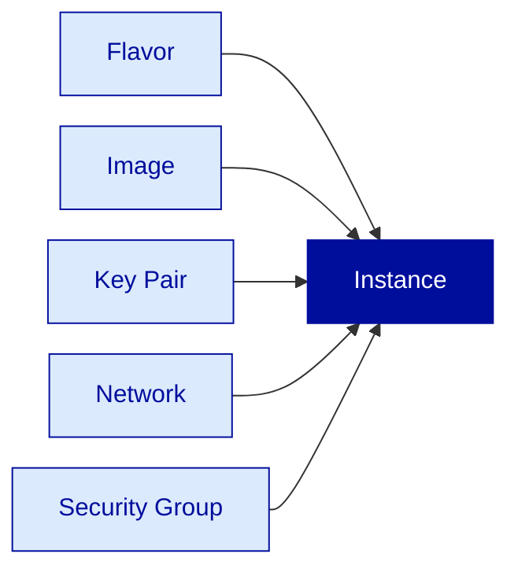
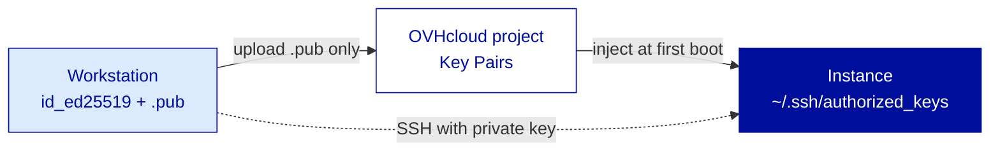
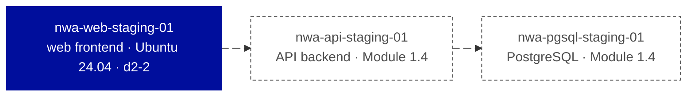

---
# ============================================================
# Module 1.3 — Compute (Part 1) — Instances, Flavors & Deployment
# Slidev source file
# ============================================================
theme: ../../theme-ovhcloud
title: Compute (Part 1) — Instances, Flavors & Deployment
info: |
  ## OVHcloud — Public Cloud — Core Associate
  Module 1.3 — Compute (Part 1) — Instances, Flavors & Deployment.
  Duration: 1h30.
class: text-left
highlighter: shiki
lineNumbers: false
drawings:
  persist: false
transition: slide-left
mdc: true
exportFilename: 'modules/module-1-3/student_export'

# Hide the floating navbar / controls overlay in dev mode
controls: false
download: false
selectable: true

# Module-level metadata (consumed by trainer-notes export and CI)
moduleId: "1.3"
moduleTitle: "Compute (Part 1) — Instances, Flavors & Deployment"
duration: "1h30"
program: "OVHcloud — Public Cloud — Core Associate"
los:
  - LO-CMP-K01
  - LO-CMP-K02
  - LO-CMP-K03
  - LO-CMP-K04
  - LO-CMP-K05
  - LO-CMP-K06
  - LO-CMP-S01
  - LO-CMP-S02
  - LO-CMP-S03
  - LO-CMP-S04
# COVER SLIDE
layout: cover
---

# Compute (Part 1)
## Instances, Flavors & Deployment

<!--
Trainer notes Cover slide:
- Welcome learners back. Energy check after Module 1.2.
- Frame the shift : we leave bootstrap (where do we work) and enter execution (what do we deploy).
- Announce : at the end of this 1h30, Northwind's first staging host is up and reachable.
- Set expectations : today we touch the Manager and the CLI, three channels are seen, one is executed.
-->

---
layout: default
moduleId: "1.3"
slideId: "Agenda"
---

# Agenda

<strong style="color: var(--ods-color-primary-700)">Block 1 — 5 min</strong> 
Sentier battu / Hors piste

<strong style="color: var(--ods-color-primary-700)">Block 2 — 30 min</strong> 
Theory &amp; Concepts 
Instances · flavors · images · SSH · channels

<strong style="color: var(--ods-color-primary-700)">Block 3 — 15 min</strong> 
Trainer Demonstration 
End-to-end deploy via OpenStack CLI

<strong style="color: var(--ods-color-primary-700)">Block 4 — 30 min</strong> 
Learner Lab 
Deploy Northwind's web frontend via the Manager

<strong style="color: var(--ods-color-primary-700)">Block 5 — 5 min</strong> 
Micro-check QCM 
7 questions

<strong style="color: var(--ods-color-primary-700)">Block 6 — 5 min</strong> 
Wrap-up &amp; Transition 
Recap · transition to Module 1.4

<!--
Trainer notes Agenda:
- First "something runs" module of the program : frame it as the moment Northwind goes from authenticated to operational.
- Annoncer le perimetre strict : aujourd'hui = deploiement et connexion SSH. Hardening, cloud-init, snapshots = Module 1.4.
- Trois canaux sont vus (Manager / CLI / Terraform), un seul est execute par le learner (Manager) : economie cognitive deliberee.
- Strict timing 90 min, pause prevue apres ce module.
-->

---
# BLOCK 1 — SENTIER BATTU
layout: section
block: "Block 1"
duration: "5 min"
---

# Before we start
### Prerequisites & remediation

---
layout: two-cols
moduleId: "1.3"
slideId: "S00 — Before we start"
---

# Before we start

::left::

## You are ready if...

**Tools**
- `<initials>-northwind-staging` project in GRA (Mod 1.2)
- `openrc.sh` sourced, `openstack token issue` works
- SSH key pair on workstation (`id_ed25519` + `.pub`)
- An SSH client (OpenSSH or Git Bash)

**Knowledge**
- The project as unit of isolation (Mod 1.2)
- Manager vs OpenStack identity (Mod 1.2)
- VM vocabulary : vCPU, RAM, disk, NIC, image
- SSH : public on server, private on workstation

::right::

## If not, here's where to look

- **No SSH key pair?** → `ssh-keygen -t ed25519`, accept defaults
- **Module 1.2 skipped?** → trainer pre-creates project + RC, sentier battu becomes 10 min
- **No prior SSH experience?** → lab gives every command verbatim
- **PuTTY user?** → convert key via PuTTYgen (*Load* → *Save private key*)

<!--
Trainer notes S00 Before we start:
- Demander : "Qui a un keypair SSH fonctionnel ?" Si moins de la moitie, faire le ssh-keygen ensemble en 2 min.
- Anticiper le learner sans Module 1.2 : sortir le RC file pre-genere de la pochette session, ne pas refaire 1.2.
- Si plusieurs PuTTY users dans la salle : grouper le PuTTYgen conversion en parallele du lab.
- Rappeler : le sentier battu s'applique aussi a Module 1.4, le keypair est une constante.
-->

---
# BLOCK 2 — THEORY & CONCEPTS       
layout: section
block: "Block 2"
duration: "30 min"
---

# Theory & Concepts
### Instances · Flavors · Images · SSH · Channels

---
layout: default
moduleId: "1.3"
slideId: "S01 — From a VM you built to a VM you ordered"
los: ["LO-CMP-K01"]
---

# From a VM you built to a VM you ordered

<strong>Legacy / VMware</strong>

You <strong>built</strong> a VM : 
· custom vCPU / RAM 
· custom disk size 
· manual OS install from ISO 
· tuned NIC, drivers, hypervisor settings

15+ knobs. Hours of provisioning.

<strong style="color: var(--ovh-masterbrand-blue);">OVHcloud Public Cloud Instance</strong>

You <strong>order</strong> a VM : 
· one flavor from the catalog 
· one image from the catalog 
· one SSH key from the project 
· one network, one security group

5 picks. Seconds of provisioning.

<OvhWarning title="Cultural shift" class="mt-6">In public IaaS, custom per-instance sizing does not exist. You pick from a catalog.</OvhWarning>

  Hyperscaler cross-reference : AWS calls this an <em>instance type</em>, Azure calls it a <em>VM size</em>, OVHcloud calls it a <em>flavor</em>.

<!--
Trainer notes S01 From built to ordered:
- Souligner que c'est le premier vrai changement de mental model du module : catalog-based provisioning.
- Anticiper "et si j'ai besoin d'une taille intermediaire ?" : on prend le palier au-dessus, le delta de cout est negligeable face au cout d'ingenierie d'une exception.
- Si quelqu'un evoque AWS EC2 : memes principes, le vocabulaire change, la mecanique est identique.
- Rappeler le persona Corporate ex-VMware : la friction du "pas de custom sizing" est reelle, a expliciter calmement, pas a minimiser.
-->

---
layout: default
moduleId: "1.3"
slideId: "S02 — Anatomy of an instance"
los: ["LO-CMP-K05"]
---

# Anatomy of an instance — five things you choose

<strong>Deploying = composing</strong> 
The five objects already exist in the project. You reference them, you don't create them at instance time.

<strong>OpenStack Nova names</strong> 
Flavor · Image (Glance) · Keypair · Network (Neutron) · Security Group (Neutron).

<!--
Trainer notes S02 Anatomy:
- Souligner que ces cinq objets pre-existent dans le projet : deployer = composer, pas creer.
- Anticiper "et l'IP, on la choisit ?" : non, elle est attribuee automatiquement, on en parlera Module 2.3.
- Si quelqu'un demande la liste exhaustive des objets Nova : instance, image, flavor, keypair, security group, plus le port et le volume qu'on verra Module 1.4 et 2.1.
- Verifier la comprehension : "le SSH key pair, il vit ou ?" reponse : dans le projet, pas sur l'instance.
-->

---
layout: default
moduleId: "1.3"
slideId: "S03 — Flavor families"
los: ["LO-CMP-K02"]
---

# Flavor families — what you pick depends on what you run

<strong style="color: var(--ovh-masterbrand-blue);">📚 d2 — Discovery</strong>

Lab, dev, training. Smallest, cheapest, capped.

<strong style="color: var(--ovh-masterbrand-blue);">⚖️ b3 — General Purpose</strong>

Balanced vCPU/RAM. Web frontends, app servers.

<strong style="color: var(--ovh-masterbrand-blue);">🏃 c3 — CPU Optimized</strong>

Compute-bound. Encoding, build agents, CPU-bound APIs.

<strong style="color: var(--ovh-masterbrand-blue);">🧠 r3 — RAM Optimized</strong>

In-memory caches (Redis, Memcached), hot analytics.

<strong style="color: var(--ovh-masterbrand-blue);">⚡ i1 — IOPS</strong>

Local NVMe. Low-latency databases, brokers, log ingestion.

<strong style="color: var(--ovh-masterbrand-blue);">🤖 t1 / t2 — GPU</strong>

AI/ML training, 3D rendering, inference. Premium pricing.

<OvhNotice title="Selection rule" class="mt-4">Pick by I/O profile and CPU/RAM ratio, not by price.</OvhNotice>

<!--
Trainer notes S03 Flavor families:
- Souligner que la famille se choisit d'apres le profil I/O et CPU/RAM, pas d'apres le prix.
- Anticiper "et le GPU, c'est dans le scope Associate ?" : on le mentionne pour la culture, le deploiement GPU serieux est sujet tier superieur ou certif AI.
- Si quelqu'un demande pour Northwind PostgreSQL : reponse mecanique : b3 ou r3 selon la pression memoire, on tranchera Module 1.4.
- Rappeler le persona Digital Starter : d2 ou b3 couvrent 95% de leurs besoins, inutile de surcomplexifier.
-->

---
layout: default
moduleId: "1.3"
slideId: "S04 — Flavor naming"
los: ["LO-CMP-K03"]
---

# Decoding a flavor name — `family-generation-size`

  

    b3-8
  

  

    <code>b3</code> = family + generation (Balanced, gen 3) · <code>-</code> = separator · <code>8</code> = size (≈ vCPU count)
  

<strong>Examples</strong> 
<code>d2-2</code> · Discovery gen 2, size 2 
<code>b3-8</code> · General gen 3, size 8 
<code>r3-32</code> · RAM gen 3, size 32 
<code>i1-15</code> · IOPS gen 1, size 15

<strong>Reflex</strong> 
Prefer the latest generation (highest digit). Older generations are phased out. The catalog tells you what's current.

<!--
Trainer notes S04 Flavor naming:
- Souligner que c'est une convention publique, pas un secret OVHcloud : n'importe qui peut decoder.
- Anticiper "et le RAM, ca suit quelle regle ?" : ratio standard par famille, a verifier dans la doc au moment du choix, ne pas memoriser les chiffres.
- Si quelqu'un demande la doc officielle : docs.ovhcloud.com > Public Cloud > Compute > Instances, fiche par famille.
- Eviter de reciter tous les ratios RAM/vCPU : la doc est l'autorite, le but est de savoir LIRE le nom, pas de le memoriser.
-->

---
layout: default
moduleId: "1.3"
slideId: "S05 — Ephemeral vs persistent"
los: ["LO-CMP-K04"]
---

# Ephemeral local disk — the cloud-native gotcha

<strong>⏱️ Local disk (ephemeral)</strong>

· Lives with the instance 
· Dies with the instance 
· Size fixed by the flavor 
· No recovery, no undo

Use for : OS, swap, cache, scratch.

<strong style="color: var(--ovh-masterbrand-blue);">⚓ Block Storage volume (persistent)</strong>

· Independent lifecycle 
· Portable between instances 
· Resizable (up only) 
· Billed per GB / month

Use for : databases, app data, user uploads.

<OvhWarning title="Reflex to install" class="mt-4">OS on local · application data on a Block Storage volume. <em>Always.</em></OvhWarning>

  Legacy analogy : local disk = scratch SSD soldered to the motherboard · volume = SAN LUN that survives the server.

<!--
Trainer notes S05 Ephemeral vs persistent:
- Souligner que c'est LE point ou les ex-VMware se font pieger : un disque de VM survit chez VMware, ici non.
- Anticiper "et si je stoppe l'instance (sans la supprimer) ?" : le local disk survit a un stop, il ne meurt qu'a la suppression de l'instance.
- Si quelqu'un demande la taille du local disk par flavor : c'est dans la doc, varie par famille, a verifier au moment du choix.
- Rappeler que c'est l'attitude A03 du referentiel : anticiper la perte de donnees liee a l'ephemere est un reflexe Associate.
-->

---
layout: default
moduleId: "1.3"
slideId: "S06 — Image catalog"
los: ["LO-CMP-K05"]
---

# The OVHcloud image catalog — what you can boot

<strong style="color: var(--ovh-masterbrand-blue);">Public images</strong>

Maintained by OVHcloud 
Patched, ready to boot

Ubuntu 22.04 / 24.04 LTS 
Debian 12 · Rocky 9 · Alma 9 
Windows Server 2022

<strong>Marketplace images</strong>

Apps layered on public images 
One-click start

Docker · Plesk · LAMP 
Nextcloud · cPanel...

<strong>Private images</strong>

Snapshots of your own instances 
Your golden images

Covered in Module 1.4

<strong>Lab today</strong> 
Ubuntu 24.04 LTS — most current LTS, broad familiarity, reference OS for the rest of the program.

<strong>Windows Server surcharge</strong> 
Windows images carry a Microsoft licensing surcharge on top of the instance price. Factor into Corporate sizing.

<!--
Trainer notes S06 Image catalog:
- Souligner qu'on n'installe jamais un OS manuellement en IaaS : on boote sur une image.
- Anticiper "et BYOL Windows ?" : existe pour les Corporate sous SPLA, a voir avec l'AM, hors scope Associate.
- Si quelqu'un demande comment trouver l'UUID d'une image en CLI : openstack image list --public | grep -i "ubuntu 24", on le fera en demo.
- Eviter d'entrer dans la strategie golden image privee : c'est le sujet snapshots du Module 1.4.
-->

---
layout: default
moduleId: "1.3"
slideId: "S07 — SSH key authentication"
los: ["LO-CMP-S04"]
---

# SSH key authentication — no root password by default

<strong>No root password, no brute-force</strong> 
OVHcloud Linux instances have no root password by default. There is nothing to guess.

<strong style="color: var(--ovh-masterbrand-blue);">Default user per image</strong> 
<code>ubuntu</code> · <code>debian</code> · <code>rocky</code> · <code>almalinux</code> 
<strong>Never</strong> <code>root</code>. Elevate via <code>sudo</code>.

<OvhWarning title="Private key = secret" class="mt-4">Never commits to Git, never uploaded to a shared drive, never copied between teams. Each engineer has their own pair.</OvhWarning>

<!--
Trainer notes S07 SSH key authentication:
- Souligner que c'est l'attitude A02 du referentiel (securite) : no root SSH, key-only. Non negociable.
- Anticiper "et si je perds ma cle privee ?" : l'instance devient inaccessible par SSH, recovery via Rescue mode (Module 1.4) ou via redeploiement.
- Si quelqu'un demande "et le user root, on en fait quoi ?" : on l'eleve via sudo depuis le user par defaut, jamais d'acces direct.
- Verifier la comprehension : "qui voit la cle privee ?" reponse : personne d'autre que la workstation qui l'a generee.
-->

---
layout: default
moduleId: "1.3"
slideId: "S08 — Three deployment channels"
los: ["LO-CMP-S01", "LO-CMP-S02", "LO-CMP-S03"]
---

# Three deployment channels — same API behind

<strong>🖥️ Manager (UI)</strong>

👤 Interactive, visual 
🚀 Zero install 
🎯 First instance, one-shot ops

Today's lab channel.

<strong>⌨️ OpenStack CLI</strong>

🧑‍💻 Operator's daily tool 
📜 Scriptable, repeatable 
🎯 Manual ops at speed

Today's demo channel.

<strong style="color: var(--ovh-masterbrand-blue);">📐 Terraform</strong>

🤖 Declarative, version-controlled 
👥 Team-shared, reproducible 
🎯 Production-grade IaC

Full module dedicated : 3.1.

<OvhNotice title="Manager = CLI = Terraform = API" class="mt-6">All three channels call the same OpenStack Nova API. A resource created in one appears identically in all the others.</OvhNotice>

  Rule of thumb : one-shot → Manager · scripted ops → CLI · reproducible / team → Terraform

<!--
Trainer notes S08 Three deployment channels:
- Souligner "Manager = CLI = API" : c'est le moment "aha" du module, a verbaliser explicitement.
- Anticiper "et lequel est le plus rapide ?" : CLI pour un humain seul, Terraform pour reproduire, Manager pour decouvrir.
- Si quelqu'un demande pourquoi on garde le Manager : entry point, debug visuel, operations one-shot, lecture rapide d'etat.
- Rappeler le lien avec Module 3.1 : Terraform sera vu la-bas pour de vrai, aujourd'hui c'est un teaser conceptuel.
-->

---
layout: default
moduleId: "1.3"
slideId: "S09 — Standard vs Flex"
los: ["LO-CMP-K06"]
---

# Standard vs Flex — resize constraints

| | Standard instance | Flex instance |
|---|---|---|
| Local disk | **Fixed by flavor** | **Decoupled, choose at deploy** |
| Resize-up local disk | Change the flavor (reboot) | Grow the disk in place |
| Resize-down local disk | **Not supported** | **Not supported** |
| vCPU / RAM resize-up | Change the flavor | Change the flavor |
| Best for | Most workloads, default reflex | Stable compute, growing storage footprint |

<strong>Resize direction</strong> 
Up : supported on both, often with a short reboot. <strong>Down : never.</strong> Plan upward.

<strong>Choice is permanent</strong> 
Standard vs Flex is decided at deployment. You don't migrate Standard → Flex. Pick consciously.

<!--
Trainer notes S09 Standard vs Flex:
- Souligner que le choix Standard vs Flex se fait au deploiement et est fige apres : on ne migre pas Standard vers Flex.
- Anticiper "et pour resize-up sur Standard ?" : on change la flavor (resize de l'instance), procedure standard avec un court downtime.
- Si quelqu'un demande "et si je veux shrink ?" : non, on deploie une nouvelle instance plus petite et on migre la donnee.
- Eviter de promettre des resize sans downtime : il y a un reboot dans la majorite des cas, a verifier dans la doc.
-->

---
layout: default
moduleId: "1.3"
slideId: "S10 — Northwind staging stack"
los: ["LO-CMP-S01"]
---

# The Northwind staging stack — today's first host

<strong style="color: var(--ovh-masterbrand-blue);">Today's deliverable</strong> 
One instance up and reachable. The Core Associate "Hello World" : 
<code>ssh ubuntu@&lt;public-ip&gt;</code> → prompt.

<strong>Specs</strong> 
Region GRA · Image Ubuntu 24.04 LTS · Flavor <code>d2-2</code> · Default Security Group · Public IP · Learner's SSH key

<OvhWarning title="Deliberately minimal" class="mt-2">No cloud-init, no SG hardening, no snapshot. All of that is Module 1.4. Today we prove we know how to deploy and connect.</OvhWarning>

<!--
Trainer notes S10 Northwind staging stack:
- Souligner que c'est volontairement minimal : on valide le reflexe de deploiement et la connexion SSH, pas le hardening.
- Anticiper "et le hardening alors ?" : demain (Module 1.4), aujourd'hui on prouve qu'on sait deployer et joindre.
- Rappeler que Northwind est notre fil rouge : chaque module fait progresser cette stack, pas un autre exemple a chaque fois.
- Verifier que tous ont l'openrc.sh du Module 1.2 fonctionnel : sinon, retour rapide sur la Hors piste avant de lancer le lab.
-->

---
# BLOCK 3 — TRAINER DEMONSTRATION  
layout: section
block: "Block 3"
duration: "15 min"
---

# End-to-end deployment
### One instance, via the OpenStack CLI

---
layout: default
moduleId: "1.3"
slideId: "Demo — End-to-end deployment"
los: ["LO-CMP-S02", "LO-CMP-S04"]
---

# Demo — Deploy an instance via the CLI

<strong style="color: var(--ovh-masterbrand-blue);">What you'll see</strong>

· Upload an SSH public key to the project 
· Find image and network UUIDs 
· <code>openstack server create</code> → one instance 
· Poll status until <code>ACTIVE</code> 
· SSH in as <code>ubuntu</code> 
· Show the same instance live in the Manager

<strong style="color: var(--ovh-masterbrand-blue);">Why this matters</strong>

The CLI is the operator's daily tool. By the end of the demo, you've seen the entire deployment lifecycle in a single channel — and you've seen the Manager confirm it.

  Instance : <code>demo-web-01</code> · Image : Ubuntu 24.04 LTS · Flavor : <code>d2-2</code> · Region : GRA

  14 steps · ~11 min walkthrough · 4 min Q&amp;A · Terraform shown read-only at the end

<!--
Trainer notes Demo End-to-end:

PRE-FLIGHT (do BEFORE the block):
- Pre-source openrc.sh in the demo terminal. 'openstack token issue' must succeed.
- Generate a dedicated demo SSH keypair : ~/.ssh/demo_ed25519 + .pub. Don't reuse a personal key on screen.
- Have the Manager open in a SECOND browser tab, signed in, on the demo project.
- Terminal at 16pt+, dark background, only one tab.
- Pre-write the Terraform read-only snippet in a text editor, ready to alt-tab to.

DEMO SCRIPT (14 steps, ~11 min):
1. 'openstack token issue' : confirm Module 1.2 environment still valid.
2. 'openstack keypair create --public-key ~/.ssh/demo_ed25519.pub demo-key'.
   "La cle publique vit dans le projet, pas dans l'instance."
3. 'openstack keypair list' : show fingerprint. Alt-tab to Manager > SSH Keys, same entry visible.
4. 'openstack image list --public | grep -i "ubuntu 24"' : multiple matches, pick the right one.
5. Capture image UUID : 'IMG=$(openstack image list --public -f value -c ID -c Name | grep "Ubuntu 24.04" | head -1 | awk "{print \$1}")'. "Style operateur : on capture, on ne re-tape pas."
6. 'openstack network list' : show Ext-Net.
7. Capture Ext-Net UUID into NET variable.
8. 'openstack server create --image $IMG --flavor d2-2 --key-name demo-key --network $NET demo-web-01' : status BUILD.
9. 'openstack server show demo-web-01 -c status -c addresses' twice : BUILD then ACTIVE with IP.
10. Refresh Manager tab : instance appears with same IP. "Manager = CLI. Un seul objet, deux angles."
11. 'IP=$(openstack server show demo-web-01 -f value -c addresses | sed "s/.*=//" | awk "{print \$1}") && echo $IP'.
12. 'ssh -i ~/.ssh/demo_ed25519 ubuntu@$IP' : accept host key, prompt visible.
    "User = ubuntu, jamais root."
13. Inside : 'uname -a && cat /etc/os-release | head -3 && df -h /'.
    Souligner df -h / : "Ce disque meurt avec l'instance."
14. 'exit'. Alt-tab to Terraform snippet, show 10 lines of HCL. "Voila ce que Terraform ecrirait. Hands-on Module 3.1."

FAILURE MODES:
- 'keypair create' : Public key file not found = wrong path. ls ~/.ssh/.
- BUILD > 2 min : quota or image not in region. openstack server show -c fault.
- SSH timeout 90s+ post-ACTIVE : workstation outbound blocked OR default SG altered. openstack security group rule list default.
- 'flavor not allowed' : project still in Discovery. Switch to d2-2 (allowed) or upgrade project.

Q&A (4 min) : focus on the API-behind-everything realization. Park cloud-init / SG hardening for Module 1.4.
-->

---
# BLOCK 4 — LEARNER LAB
layout: section
block: "Block 4"
duration: "30 min"
---

# Deploy Northwind's web frontend
### Your turn. Solo. 30 minutes. Manager UI.

---
layout: default
moduleId: "1.3"
slideId: "Lab — Web frontend brief"
los: ["LO-CMP-S01", "LO-CMP-S04"]
---

# Lab — Deploy the Northwind web frontend

<OvhNotice title="Mission" class="mt-4">You are Northwind's Cloud Ops engineer. The CTO has asked the staging stack to come up. Today you deliver the <strong>web frontend host</strong>: one Ubuntu 24.04 LTS instance in your <code>&lt;initials&gt;-northwind-staging</code> project, region GRA, flavor <code>d2-2</code>, with your SSH key. Prove it is reachable by SSHing in and running three sanity commands.</OvhNotice>

<strong style="color: var(--ovh-masterbrand-blue);">Channels</strong>

· OVHcloud Manager (web UI) for the deployment 
· OpenStack CLI <em>or</em> system <code>ssh</code> client for verification

<strong style="color: var(--ovh-masterbrand-blue);">Success criteria</strong>

<code>ssh ubuntu@&lt;public-ip&gt;</code> succeeds with key auth · 3 sanity commands return expected output

  Instance name : <code>&lt;initials&gt;-nw-web-01</code> &nbsp;·&nbsp; Region : GRA &nbsp;·&nbsp; Time : 30 min

<!--
Trainer notes Lab brief:
- Souligner que l'instance reste UP a la fin du lab : elle sera reutilisee en Module 1.4 pour le hardening et les snapshots.
- Annoncer les criteres de succes en debut de lab : auto-verifiables via la sortie SSH.
- Circuler discretement, ne pas intervenir sauf blocage. Reperer 2-3 learners en avance pour les rendre support-pair.
- Si quelqu'un casse son projet : pas grave, redeployer dans le meme projet, le nom de l'instance suffit a discriminer.

VALIDATION CRITERIA (silent check by trainer):
- Instance ACTIVE in Manager with public IP
- Image = Ubuntu 24.04 LTS, Flavor = d2-2, Region = GRA
- SSH connection succeeds with key (no password)
- /etc/os-release confirms Ubuntu 24.04
-->

---
layout: default
moduleId: "1.3"
slideId: "Lab — Steps"
---

# Lab — Step-by-step

**Manager side (UI)**

1. `cat ~/.ssh/id_ed25519.pub` → copy
2. Manager > Public Cloud > your project
3. Compute > SSH Keys > **Add an SSH key**
   Name `<initials>-key`, paste public key
4. Compute > Instances > **Create an instance**
   - Region : **GRA**
   - Image : **Ubuntu 24.04 LTS**
   - Flavor : **`d2-2`**
   - Network : `Ext-Net` · SG : `default`
   - SSH key : `<initials>-key`
   - Name : `<initials>-nw-web-01`
5. Validate → wait for **ACTIVE** · note public IP

**CLI / SSH side (terminal)**

6. Wait 30 s after `ACTIVE` for cloud-init
7. `ssh -i ~/.ssh/id_ed25519 ubuntu@<public-ip>`
   Accept host key on first connection
8. Inside the instance, run :
   - `uname -a`
   - `cat /etc/os-release | head -3`
   - `df -h /`
9. `exit` → verify instance still **ACTIVE**

**Artifact** (do NOT commit)
`<initials>-northwind-staging/instance-web-01.txt`
3 SSH outputs + public IP + instance UUID

<!--
Trainer notes Lab Steps:
- Slide de reference pendant le lab : laisser projete tout le long, learners s'y referent.
- Insister oralement : "le user SSH est ubuntu, JAMAIS root. Si vous tapez root@..., ca echoue."
- Si plusieurs learners bloquent sur SSH : 90% du temps c'est cloud-init pas fini, attendre 30 s de plus.
- Si l'instance reste BUILD > 2 min : verifier que le projet n'est pas en Discovery avec flavor bloque.
- Eviter d'aider trop tot : laisser le learner lire le message d'erreur, 70% du temps il se debloque seul.

SUPPORT FAQ (anticipated learner questions):
- "Permission denied (publickey)" : verifier le user (ubuntu pas root) et le -i sur la bonne cle privee.
- "Connection timed out" : cloud-init pas fini (attendre) OU reseau workstation bloque port 22 sortant (tester en hotspot).
- "Ma flavor d2-2 n'apparait pas" : projet encore en Discovery ou region mal selectionnee. Verifier dans le Manager.
- "Le Manager ne montre pas d'IP" : refresh, sinon le reseau Ext-Net n'a pas ete coche, redeployer.
- "Je peux SSH en root ?" : non. Toujours user par defaut, puis sudo si besoin d'elevation.
-->

---
# BLOCK 5 — MICRO-CHECK QCM   
layout: section
block: "Block 5"
duration: "5 min"
---

# Micro-check
### Seven formative questions

---
layout: default
moduleId: "1.3"
slideId: "MC — Q1 IaaS vs legacy sizing"
los: ["LO-CMP-K01"]
---

# Q1 — IaaS compute vs legacy VM sizing

A learner from a VMware background asks why they cannot configure a Public Cloud instance with exactly 3 vCPUs and 5 GB of RAM. What is the correct explanation?

<strong>A.</strong> The OpenStack Nova engine does not support odd-numbered vCPU counts

<strong>B.</strong> The customer can request custom sizing via an OVHcloud support ticket

<strong>C.</strong> OVHcloud Public Cloud instances use pre-defined resource templates called flavors; the operator picks the closest from the catalog

<strong>D.</strong> Custom sizing requires upgrading to a Professional-tier subscription

<!--
Trainer notes Q1:
- Correct answer: C. Catalog-based provisioning is the IaaS model.
- A wrong : vCPU parity is not a constraint, the catalog itself is the constraint.
- B wrong : custom sizing is not a support option in the IaaS catalog model.
- D wrong : flavors are the standard provisioning unit at all tiers.
- LO: LO-CMP-K01 — Bloom: Understand.
- Piege classique : un ex-VMware coche B par reflexe support. Recadrer poliment.
-->

---
layout: default
moduleId: "1.3"
slideId: "MC — Q2 Flavor family"
los: ["LO-CMP-K02"]
---

# Q2 — Flavor family for an in-memory cache

A team is sizing an instance for an in-memory Redis cache with 60 GB of working set. Which OVHcloud flavor family is the correct first candidate?

<strong>A.</strong> <code>d2</code> — Discovery

<strong>B.</strong> <code>r3</code> — RAM Optimized

<strong>C.</strong> <code>c3</code> — CPU Optimized

<strong>D.</strong> <code>i1</code> — IOPS Optimized

<!--
Trainer notes Q2:
- Correct answer: B. RAM-bound workload, r3 family is the first reflex.
- A wrong : Discovery is the lab/dev family with capped capacity, inadapted to 60 GB workload.
- C wrong : CPU-Optimized has higher vCPU/RAM ratio, opposite of the need.
- D wrong : IOPS targets disk latency, not memory.
- LO: LO-CMP-K02 — Bloom: Apply.
-->

---
layout: default
moduleId: "1.3"
slideId: "MC — Q3 Flavor naming"
los: ["LO-CMP-K03"]
---

# Q3 — Decoding the flavor name `b3-16`

An OVHcloud flavor is named `b3-16`. What does each part of the name represent?

<strong>A.</strong> <code>b3</code> = family (General Purpose, generation 3); <code>16</code> = size, roughly correlated to vCPU count

<strong>B.</strong> <code>b3</code> = region code; <code>16</code> = RAM in GB

<strong>C.</strong> <code>b3</code> = OS image; <code>16</code> = disk size in GB

<strong>D.</strong> <code>b3</code> = price tier; <code>16</code> = maximum number of instances allowed

<!--
Trainer notes Q3:
- Correct answer: A. family-generation-size convention.
- B wrong : regions have own codes (GRA, SBG…), not encoded in flavor name.
- C wrong : image and disk size are separate objects.
- D wrong : flavor name encodes hardware shape, not pricing or quota.
- LO: LO-CMP-K03 — Bloom: Remember.
-->

---
layout: default
moduleId: "1.3"
slideId: "MC — Q4 Ephemeral disk"
los: ["LO-CMP-K04"]
---

# Q4 — Recovering data from a deleted instance

A junior engineer deletes a Public Cloud instance to "clean up resources" and later asks how to recover the data that was on the instance's local disk. What is the correct answer?

<strong>A.</strong> The data is preserved for 30 days in a recycle bin, accessible via the Manager

<strong>B.</strong> The data is automatically backed up to Object Storage by OVHcloud

<strong>C.</strong> The data can be restored by re-creating the instance with the same name

<strong>D.</strong> The local disk is ephemeral; deletion is irreversible. For persistence, a Block Storage volume should have been attached and used

<!--
Trainer notes Q4:
- Correct answer: D. Ephemeral disk + responsibility for persistence rests on the operator.
- A wrong : no recycle bin exists for ephemeral local disks.
- B wrong : backups are not enabled by default, customer's responsibility.
- C wrong : instance names are not tied to disk content, a new instance is a blank slate.
- LO: LO-CMP-K04 — Bloom: Understand.
- C'est le moment cle pour reverbaliser l'attitude A03 : "anticiper la perte de donnees liee a l'ephemere".
-->

---
layout: default
moduleId: "1.3"
slideId: "MC — Q5 Key pair object"
los: ["LO-CMP-K05"]
---

# Q5 — Which Nova object holds the SSH public key?

When deploying an instance in OVHcloud Public Cloud, which OpenStack Nova object holds the SSH **public** key that will be injected into the instance at first boot?

<strong>A.</strong> Image

<strong>B.</strong> Key pair

<strong>C.</strong> Security Group

<strong>D.</strong> Flavor

<!--
Trainer notes Q5:
- Correct answer: B. Key pair = object holding the SSH public key in the project.
- A wrong : image is the OS template, no user-specific credentials.
- C wrong : security group is a firewall ruleset, no credentials.
- D wrong : flavor is a hardware template, no credentials.
- LO: LO-CMP-K05 — Bloom: Remember.
-->

---
layout: default
moduleId: "1.3"
slideId: "MC — Q6 Standard vs Flex"
los: ["LO-CMP-K06"]
---

# Q6 — Standard vs Flex for a growing local footprint

A Cloud Ops engineer expects an existing workload's local disk to outgrow its current size in three months and wants to grow it later without rebuilding the instance. Which variant should they deploy?

<strong>A.</strong> A Flex instance — decouples the local disk size from the flavor, allows in-place disk growth

<strong>B.</strong> A Standard instance — fixed disk by flavor, growth needs a flavor change

<strong>C.</strong> A Discovery (<code>d2</code>) instance

<strong>D.</strong> An IOPS (<code>i1</code>) instance

<!--
Trainer notes Q6:
- Correct answer: A. Flex = decoupled local disk, resize-up supported.
- B wrong : Standard's disk is fixed by flavor; growing it requires changing flavor.
- C wrong : Discovery is a family, not a resize policy.
- D wrong : i1 targets disk performance, not size flexibility.
- LO: LO-CMP-K06 — Bloom: Understand.
-->

---
layout: default
moduleId: "1.3"
slideId: "MC — Q7 Root SSH"
los: ["LO-CMP-S04"]
---

# Q7 — SSHing as root on a new Linux instance

A learner deploys a Public Cloud instance and asks how to log in as `root` via SSH using the password they "saw flashing on the screen" during creation. What is the correct guidance?

<strong>A.</strong> The root password is sent by email after deployment; check the spam folder

<strong>B.</strong> Set a root password from the Manager under "Instance > Reset Password"

<strong>C.</strong> OVHcloud Linux instances have no root password and disable root SSH by default. SSH as the image's default user (e.g., <code>ubuntu</code>), elevate via <code>sudo</code>

<strong>D.</strong> SSH as <code>root</code> with the SSH key — root login is enabled by default

<!--
Trainer notes Q7:
- Correct answer: C. No root password, no root SSH, default user + sudo.
- A wrong : no password is generated or emailed, access is key-based.
- B wrong : option does not exist for Linux instances in Core scope.
- D wrong : default is to disable root SSH; access via default user.
- LO: LO-CMP-S04 — Bloom: Understand.
- Reverbaliser A02 : "no root SSH, key-only" est un reflexe Associate, non negociable.
-->

---
# BLOCK 6 — WRAP-UP & TRANSITION 
layout: section
block: "Block 6"
duration: "5 min"
---

# Wrap-up
### Recap & transition to Module 1.4

---
layout: two-cols
moduleId: "1.3"
slideId: "Wrap-up — Recap & next stop"
los: ["LO-CMP-K01", "LO-CMP-K02", "LO-CMP-K03", "LO-CMP-K04", "LO-CMP-K05", "LO-CMP-K06", "LO-CMP-S01", "LO-CMP-S02", "LO-CMP-S03", "LO-CMP-S04"]
---

# Wrap-up

::left::

## You can now...

· <strong style="color: var(--ovh-masterbrand-blue);">Define</strong> a Public Cloud instance and the IaaS catalog model 
· <strong style="color: var(--ovh-masterbrand-blue);">Identify</strong> the six flavor families and their target workloads 
· <strong style="color: var(--ovh-masterbrand-blue);">Decode</strong> any flavor name on sight (<code>family-generation-size</code>) 
· <strong style="color: var(--ovh-masterbrand-blue);">Distinguish</strong> ephemeral local disk from persistent Block Storage 
· <strong style="color: var(--ovh-masterbrand-blue);">Explain</strong> the Standard vs Flex resize constraints 
· <strong style="color: var(--ovh-masterbrand-blue);">Deploy</strong> an instance via the Manager and via the OpenStack CLI 
· <strong style="color: var(--ovh-masterbrand-blue);">Connect</strong> via SSH with key-based authentication

::right::

## Next stop — Module 1.4

<strong style="color: var(--ovh-masterbrand-blue);">Compute (Part 2) — Lifecycle, Security &amp; Diagnostics</strong>

The web frontend is up but exposed. Time to make it production-grade : 
· Restrict SSH via a custom Security Group 
· Inject hardening config at first boot (cloud-init) 
· Snapshot before anyone touches it 
· Read the console when things go wrong 
· Bring up the API + PostgreSQL hosts properly

Module 3 / 11 — first host running, hardening begins

<!--
Trainer notes Wrap-up:
- Rappeler que l'instance reste UP : chacun repart avec un asset reutilise des Module 1.4 (hardening, snapshot, rescue).
- Souligner la realisation "Manager = CLI = API" : c'etait le moment cle du module, a verbaliser une derniere fois.
- Anticiper la fatigue cognitive : annoncer la pause, timing precis du retour.
- Si question parking non resolue (notamment cloud-init, snapshots, Security Group hardening) : noter "parking", reprendre en Module 1.4 immediatement apres la pause.
- Transition narrative : "Northwind a un host en ligne. Le CTO revient : 'Bien, maintenant rends-le production-grade et monte les deux autres proprement.' C'est exactement Module 1.4."
- Eviter de demarrer 1.4 maintenant : laisser respirer.
-->
