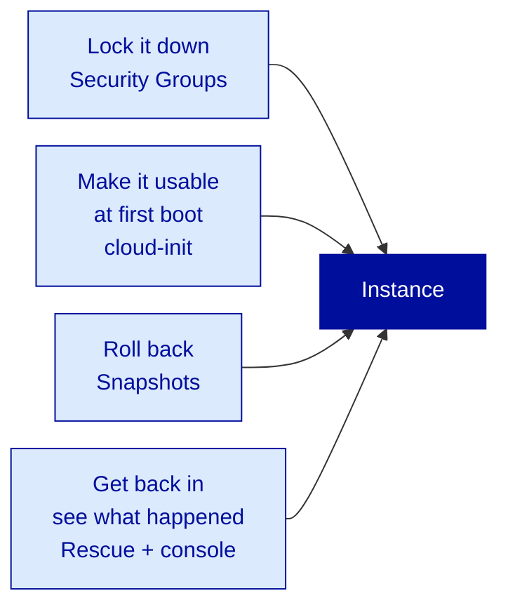
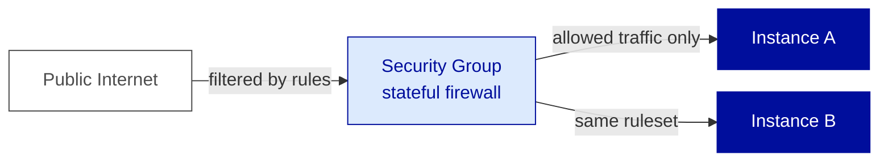
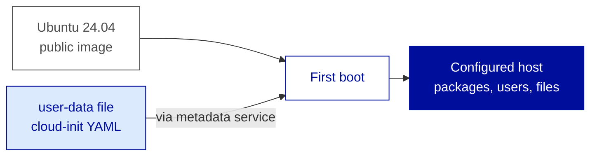
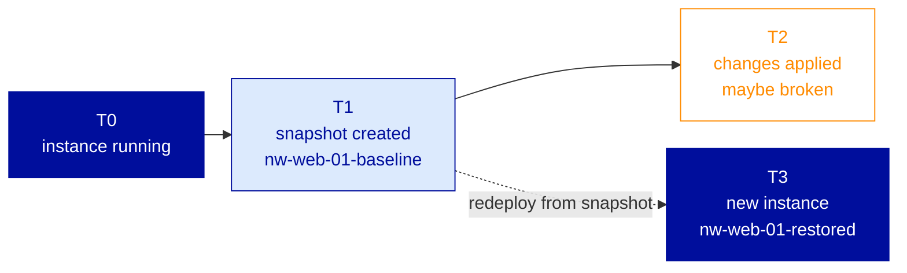
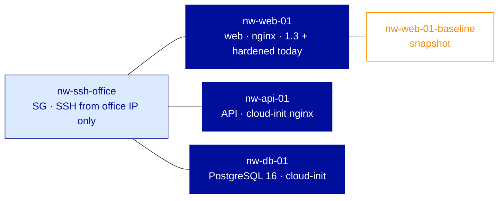

---
# ============================================================
# Module 1.4 — Compute (Part 2) — Lifecycle, Security & Diagnostics
# Slidev source file
# ============================================================
theme: ../../theme-ovhcloud
title: Compute (Part 2) — Lifecycle, Security & Diagnostics
info: |
  ## OVHcloud — Public Cloud — Core Associate
  Module 1.4 — Compute (Part 2) — Lifecycle, Security & Diagnostics.
  Duration: 1h30.
class: text-left
highlighter: shiki
lineNumbers: false
drawings:
  persist: false
transition: slide-left
mdc: true
exportFilename: 'modules/module-1-4/student_export'

# Hide the floating navbar / controls overlay in dev mode
controls: false
download: false
selectable: true

# Module-level metadata (consumed by trainer-notes export and CI)
moduleId: "1.4"
moduleTitle: "Compute (Part 2) — Lifecycle, Security & Diagnostics"
duration: "1h30"
program: "OVHcloud — Public Cloud — Core Associate"
los:
  - LO-CMP-S05
  - LO-CMP-S06
  - LO-CMP-S07
  - LO-CMP-S08
  - LO-CMP-S09
  - LO-CMP-A02
  - LO-CMP-A03
# COVER SLIDE
layout: cover
---

# Compute (Part 2)
## Lifecycle, Security & Diagnostics

<!--
Trainer notes Cover slide:
- Welcome back. After 1.3, every learner has one instance up. Energy check.
- Frame the shift : we leave deployment (does it run) and enter operation (does it survive).
- Announce : at the end of 1h30, Northwind's three tiers are up, hardened, cloud-init bootstrapped, with a baseline snapshot.
- Set expectations : more Demo and Lab time than 1.3 because every concept has an immediate operational counterpart.
-->

---
layout: default
moduleId: "1.4"
slideId: "Agenda"
---

# Agenda

<div class="grid grid-cols-2 gap-8 mt-8">

<div>

**Block 1 — Sentier battu** · 5 min
*Prerequisites & remediation pointers*

**Block 2 — Theory** · 30 min
*Security Groups · cloud-init · snapshots · Rescue · console*

**Block 3 — Demo** · 15 min
*SG tightening + snapshot + Rescue + console read*

</div>

<div>

**Block 4 — Lab** · 30 min
*Bring Northwind staging to production-grade, three tiers*

**Block 5 — Micro-check** · 5 min
*Formative QCM, 7 questions*

**Block 6 — Wrap-up** · 5 min
*Recap & transition to Module 2.1*

</div>

</div>

<!--
Trainer notes Agenda:
- Module operationnel : annoncer que Theory est court (30 min) et que Demo + Lab couvrent 45 min.
- Insister : on construit sur l'instance de 1.3, elle doit etre encore UP. Rapide sondage main levee.
- Annoncer les 5 reflexes infra-layer qu'on va installer aujourd'hui : SG restrictive, cloud-init, snapshot, Rescue, console.
- Strict timing 90 min, pause prevue apres ce module.
-->

---
# BLOCK 1 — SENTIER BATTU
layout: section
block: "Block 1"
duration: "5 min"
---

# Before we start
### Prerequisites & remediation

---
layout: two-cols
moduleId: "1.4"
slideId: "S00 — Before we start"
---

# Before we start

::left::

<div class="text-sm">

<strong style="color: var(--ovh-masterbrand-blue); font-size: 1.1rem;">You are ready if...</strong>

<div class="mt-3">
<strong>Tools</strong><br/>
· <code>&lt;initials&gt;-nw-web-01</code> from Module 1.3 still UP and SSH-reachable<br/>
· <code>openrc.sh</code> from Module 1.2 still sourced<br/>
· Your workstation's public IP at hand : <code>curl -s ifconfig.me</code><br/>
· A text editor that saves Unix line endings (LF), not CRLF
</div>

<div class="mt-3">
<strong>Knowledge</strong><br/>
· The five-object instance composition (Mod 1.3)<br/>
· Basic firewall vocabulary : source, port, ingress, egress<br/>
· YAML basics : spaces for indentation, never tabs<br/>
· Reading a Linux boot log in a terminal
</div>

</div>

::right::

<div class="text-sm">

<strong style="color: var(--ovh-masterbrand-blue); font-size: 1.1rem;">If not, here's where to look</strong>

<div class="mt-3">
· <strong>No <code>nw-web-01</code> running?</strong> → quick redeploy via CLI in 2 min, or pair with a neighbor for SG and snapshot exercises<br/>
· <strong>Public IP detection blocked?</strong> → <code>dig +short myip.opendns.com @resolver1.opendns.com</code><br/>
· <strong>No YAML familiarity?</strong> → cloud-init files are provided verbatim, only the package list is edited<br/>
· <strong>On Windows, files end up CRLF?</strong> → in VSCode, click <code>CRLF</code> in the status bar to switch to <code>LF</code>
</div>

</div>

<!--
Trainer notes S00 Before we start:
- Demander : "Qui a encore son nw-web-01 de 1.3 joignable en SSH ?" Si moins de la moitie, faire le redeploiement minimal en 2 min avant de demarrer le bloc Theory.
- Anticiper la NAT pool rotation : un learner peut avoir une IP publique differente d'hier, c'est normal, on en parlera au moment de la regle SG.
- Si plusieurs Windows / VSCode users : demontrer une fois la conversion CRLF en LF, ca desamorce 80% des bugs cloud-init du lab.
- Rappeler que le sentier battu s'applique aussi au reste de Day 1 et Day 2 : le keypair, l'openrc.sh, le projet, ce sont des constantes.
-->

---
# BLOCK 2 — THEORY & CONCEPTS
layout: section
block: "Block 2"
duration: "30 min"
---

# Theory & Concepts
### SG · cloud-init · snapshots · Rescue · console

---
layout: default
moduleId: "1.4"
slideId: "S01 — The four operational questions"
los: ["LO-CMP-A02", "LO-CMP-A03"]
---

# Why this module? — four operational questions

<div class="flex justify-center mt-2">



</div>

<div class="grid grid-cols-2 gap-4 mt-4 text-sm">

<div class="ovh-callout">
<strong>1.3 answered : how do I deploy</strong><br/>
1.4 answers what comes next in every real ops conversation.
</div>

<div class="ovh-callout" style="border-left-color: var(--ovh-masterbrand-blue); border-left-width: 4px;">
<strong style="color: var(--ovh-masterbrand-blue);">Universal cloud questions</strong><br/>
An AWS or Azure operator asks them in exactly the same order.
</div>

</div>

<div class="mt-4 text-center text-sm" style="color: var(--ovh-gray-700);">
  Hyperscaler cross-reference : AWS SG · Azure NSG · AWS user-data · EBS snapshot · EC2 Rescue · console output.
</div>

<!--
Trainer notes S01 Four operational questions:
- Souligner que ces quatre questions sont universelles cloud, pas specifiques OVHcloud.
- Anticiper "et le hardening OS ?" : on parle infra layer aujourd'hui, le hardening OS (CIS, ANSSI) est sujet du programme Pro.
- Rappeler que le module est volontairement plus operationnel que theorique : Theory 30 min, Demo + Lab 45 min.
- Verbaliser le mapping AWS pour les ex-AWS : un par un, ca rassure le persona Corporate ex-hyperscaler.
-->

---
layout: default
moduleId: "1.4"
slideId: "S02 — Security Groups overview"
los: ["LO-CMP-S05", "LO-CMP-A02"]
---

# Security Groups — the stateful firewall in front of every instance

<div class="flex justify-center mt-2">



</div>

<div class="grid grid-cols-2 gap-4 mt-4 text-sm">

<div class="ovh-callout">
<strong>Stateful · default-deny ingress</strong><br/>
Nothing reaches the instance unless explicitly allowed. Egress is allow-all by default; return traffic auto-allowed.
</div>

<div class="ovh-callout" style="border-left-color: var(--ovh-masterbrand-blue); border-left-width: 4px;">
<strong style="color: var(--ovh-masterbrand-blue);">One SG, many instances</strong><br/>
Attach the same SG to N instances : change the rule once, N hosts inherit. Instances can carry several SGs (rules are additive).
</div>

</div>

<div class="mt-4 text-center text-sm" style="color: var(--ovh-gray-700);">
  Legacy analogy : the per-VM iptables ruleset, but API-driven, centrally managed, and surviving reboots.
</div>

<!--
Trainer notes S02 Security Groups:
- Souligner que c'est stateful : on autorise l'ingress, le retour egress correspondant passe sans regle explicite.
- Anticiper "et les ACL reseau ?" : pas dans le scope Core OVHcloud, defense in-depth via SG + IAM + private network (Module 2.3).
- Si quelqu'un evoque AWS NACL : la fonction NACL (stateless, subnet-level) n'a pas d'equivalent direct dans le Core OVHcloud, c'est une absence a connaitre.
- Rappeler l'attitude A02 : sur une instance publique, ouvrir le moins possible, jamais SSH sur 0.0.0.0/0 en production.
-->

---
layout: default
moduleId: "1.4"
slideId: "S03 — SG rule anatomy"
los: ["LO-CMP-S05"]
---

# Security Group rule — anatomy of one rule

<div class="mt-4 text-center">
  <div style="font-size: 1.6rem; font-weight: 700; font-family: monospace; color: var(--ovh-masterbrand-blue); letter-spacing: 0.05em;">
    ingress &nbsp;·&nbsp; tcp &nbsp;·&nbsp; 22 &nbsp;·&nbsp; 203.0.113.42/32
  </div>
  <div class="mt-1 text-sm" style="color: var(--ovh-gray-700);">
    direction · protocol · port range · source (CIDR or SG ID)
  </div>
</div>

<div class="grid grid-cols-2 gap-4 mt-6 text-sm">

<div class="ovh-callout">
<strong>Four required fields</strong><br/>
· direction : ingress / egress<br/>
· protocol : tcp / udp / icmp<br/>
· port range : <code>22</code> or <code>30000-32767</code><br/>
· source (ingress) or destination (egress)
</div>

<div class="ovh-callout">
<strong>Source flexibility</strong><br/>
· CIDR : <code>/32</code> single IP · <code>/24</code> 256 IPs · <code>0.0.0.0/0</code> the public Internet<br/>
· Another SG ID : tiered architectures without hardcoded CIDRs
</div>

</div>

<div class="ovh-callout ovh-callout-warn mt-4">
  <strong>ALLOW-only model :</strong> there are no DENY rules. The default is deny; rules express exceptions. The engine evaluates the union of allows; order does not matter.
</div>

<!--
Trainer notes S03 SG rule anatomy:
- Souligner qu'on ne raisonne qu'en ALLOW : pas de DENY explicite, simplifie enormement le mental model.
- Anticiper "et la priorite entre regles ?" : pas de priorite, c'est l'union des allows, simple a raisonner.
- Si quelqu'un demande SG referenceant SG : exemple concret, un SG web-tier autorise tcp/8080 depuis le SG frontend-tier, c'est ainsi qu'on chaine web vers app vers db sans CIDR codee en dur.
- Verifier la comprehension : "qu'est-ce qui passe par defaut en ingress ?" reponse : rien, default-deny.
-->

---
layout: default
moduleId: "1.4"
slideId: "S04 — Cloud-init overview"
los: ["LO-CMP-S06"]
---

# Cloud-init — turning a generic image into a configured host

<div class="flex justify-center mt-2">



</div>

<div class="grid grid-cols-2 gap-4 mt-4 text-sm">

<div class="ovh-callout">
<strong>Baked into every public Linux image</strong><br/>
Open-source agent. Reads the user-data passed at instance creation, applies it before SSH is ready.
</div>

<div class="ovh-callout" style="border-left-color: var(--ovh-masterbrand-blue); border-left-width: 4px;">
<strong style="color: var(--ovh-masterbrand-blue);">Runs once · idempotent</strong><br/>
First boot only. Reboots are a no-op by default. The difference between artisanal and operational.
</div>

</div>

<div class="mt-4 text-center text-sm" style="color: var(--ovh-gray-700);">
  Cross-cloud standard : same agent on AWS, Azure, GCP, Scaleway. Same syntax, same stages.
</div>

<!--
Trainer notes S04 Cloud-init overview:
- Souligner que cloud-init est un standard cross-cloud : ce qu'on apprend ici fonctionne identiquement sur AWS, Azure, GCP.
- Anticiper "et Windows ?" : cloudbase-init est l'equivalent pour Windows, meme principe, fichier user-data different, hors scope Associate.
- Si quelqu'un demande "et Ansible alors ?" : cloud-init pour le bootstrap (blanc vers minimal viable), Ansible pour le configuration management ongoing, les deux coexistent.
- Rappeler que c'est ce qui rend l'IaC reelle : sans cloud-init, le terraform apply produit une VM nue, inutilisable sans intervention manuelle.
-->

---
layout: default
moduleId: "1.4"
slideId: "S05 — Cloud-init in practice"
los: ["LO-CMP-S06"]
---

# Cloud-init in practice — a minimal user-data file

<div class="grid grid-cols-2 gap-4 mt-4">

<div>

```yaml
#cloud-config
package_update: true
packages:
  - nginx
write_files:
  - path: /etc/motd
    content: |
      Welcome to Northwind API host.
      Managed by Public Cloud Core team.
runcmd:
  - systemctl enable --now nginx
```

</div>

<div class="text-sm">

<div class="ovh-callout">
<strong><code>#cloud-config</code></strong><br/>
Mandatory first line. Without it the agent treats the file as a plain shell script.
</div>

<div class="ovh-callout mt-3">
<strong><code>packages:</code></strong><br/>
Uses the distro's package manager : APT on Ubuntu/Debian, DNF on Rocky/Alma.
</div>

<div class="ovh-callout mt-3">
<strong><code>write_files:</code> · <code>runcmd:</code></strong><br/>
Drop static files cleanly · escape hatch for arbitrary shell, used sparingly.
</div>

</div>

</div>

<div class="ovh-callout ovh-callout-warn mt-4">
  <strong>YAML traps :</strong> indentation is <em>spaces</em> (two per level), never tabs. CRLF line endings on Windows silently break the parser. Logs after first boot : <code>/var/log/cloud-init-output.log</code>.
</div>

<!--
Trainer notes S05 Cloud-init in practice:
- Souligner que le premier #cloud-config n'est PAS un commentaire, c'est un marqueur de format : sans lui, le fichier n'est pas reconnu.
- Anticiper "et si l'install echoue ?" : l'instance boot quand meme, cloud-init log dans /var/log/cloud-init-output.log, on le verra sur la slide console log.
- Si quelqu'un demande la liste exhaustive des modules cloud-init : renvoyer a cloudinit.readthedocs.io, ne pas tenter de la reciter.
- Eviter de laisser passer un fichier YAML en CRLF : demontrer une fois la conversion VSCode CRLF vers LF, ca desamorce 80% des bugs du lab.
-->

---
layout: default
moduleId: "1.4"
slideId: "S06 — Snapshots"
los: ["LO-CMP-S07", "LO-CMP-A03"]
---

# Snapshots — your "before I touch it" insurance

<div class="flex justify-center mt-2">



</div>

<div class="grid grid-cols-2 gap-4 mt-4 text-sm">

<div class="ovh-callout">
<strong>What it captures</strong><br/>
Local disk only : OS, packages, files. <strong>Not</strong> the running RAM. <strong>Not</strong> attached Block Storage volumes (own snapshot mechanism, Mod 2.1).
</div>

<div class="ovh-callout">
<strong>How restoration works</strong><br/>
Not in-place. You deploy a <strong>new instance</strong> from the snapshot, then cut over (IP, DNS). The original instance is untouched.
</div>

</div>

<div class="ovh-callout ovh-callout-warn mt-4">
  <strong>Billing :</strong> snapshots are stored as private images, billed as Object Storage per GB-month. A few cents per snapshot of a <code>d2-2</code>. <strong>OVHcloud deletes nothing :</strong> retention is your responsibility.
</div>

<!--
Trainer notes S06 Snapshots:
- Souligner que ce n'est pas un rollback in-place : on deploie une nouvelle instance a partir du snapshot, c'est different d'un VMware revert.
- Anticiper "et la coherence base de donnees ?" : snapshot d'une instance avec une DB active = etat non transactionnellement coherent, on traitera la coherence des volumes Module 2.1, en attendant : stopper l'instance avant ou faire un dump applicatif.
- Si quelqu'un demande la politique de retention : c'est manuel, vous gerez vos snapshots, rappeler A03 : conscientiser le cout.
- Rappeler que ca illustre A03 : un snapshot avant d'effacer = filet de securite, ne pas en prendre = accepter la perte.
-->

---
layout: default
moduleId: "1.4"
slideId: "S07 — Rescue mode"
los: ["LO-CMP-S08"]
---

# Rescue mode — getting back into an unreachable instance

```mermaid {scale: 0.55}
%%{init: {'flowchart': {'nodeSpacing': 18, 'rankSpacing': 22}}}%%
flowchart LR
    A[Instance unreachable<br/>SSH fails]:::warn
    A --> B[Trigger Rescue<br/>Manager / CLI]:::act
    B --> C[Boot rescue image<br/>OVHcloud-maintained]:::rescue
    C --> D[SSH with<br/>temp password]:::rescue
    D --> E[Mount original<br/>root as /dev/sdb]:::act
    E --> F[Fix · unmount<br/>exit Rescue]:::act
    F --> G[Reboot to<br/>original OS]:::ok

    classDef warn fill:#FFFFFF,stroke:#FF8B00,color:#FF8B00
    classDef act fill:#DCEAFD,stroke:#000E9C,color:#000E9C
    classDef rescue fill:#FFFFFF,stroke:#000E9C,color:#000E9C
    classDef ok fill:#000E9C,stroke:#000E9C,color:#FFFFFF
```

<div class="flex justify-center mt-2">



</div>

<div class="grid grid-cols-2 gap-4 mt-4 text-sm">

<div class="ovh-callout">
<strong>Common use cases</strong><br/>
Broken <code>sshd_config</code> · expired / lost SSH key · broken <code>/etc/fstab</code> · full root filesystem blocking boot.
</div>

<div class="ovh-callout" style="border-left-color: var(--ovh-masterbrand-blue); border-left-width: 4px;">
<strong style="color: var(--ovh-masterbrand-blue);">Temporary by design</strong><br/>
Rescue password is one-shot, regenerated each time. Your fixes on the original disk persist. Exit Rescue → reboot to your OS.
</div>

</div>

<!--
Trainer notes S07 Rescue mode:
- Souligner que le Rescue mode est OVHcloud-specifique dans son delivrement, mais le principe (reboot sur image alternative) existe partout. AWS equivalent : stop + detach EBS + re-attach a une autre instance.
- Anticiper "et le mot de passe Rescue ?" : affiche a l'activation, temporaire, ne fonctionne que pendant la session, pas une porte derobee permanente.
- Si quelqu'un demande "et si je perds la cle SSH originale ?" : Rescue mode permet de remettre une cle dans le authorized_keys du user par defaut sur le disque monte. C'est le cas d'usage canonique.
- Rappeler que ca illustre la resilience operationnelle : on peut toujours rentrer dans une instance, a condition d'avoir acces au compte qui controle le projet (donc IAM Module 1.2).
-->

---
layout: default
moduleId: "1.4"
slideId: "S08 — Console log"
los: ["LO-CMP-S09"]
---

# Console log — what the instance said while you were not watching

<div class="grid grid-cols-2 gap-6 mt-6">

<div class="ovh-callout ovh-callout-warn">
<strong>SSH</strong>
<div class="mt-2 text-sm">
Needs : network reachability + sshd running + valid key + correct user.<br/>
Fails the moment any of those breaks.
</div>
</div>

<div class="ovh-callout" style="border-left-color: var(--ovh-masterbrand-blue); border-left-width: 4px;">
<strong style="color: var(--ovh-masterbrand-blue);">Console log</strong>
<div class="mt-2 text-sm">
<code>openstack console log show &lt;instance&gt;</code><br/>
Needs : API access only. Reads what the serial console would show on a physical screen.
</div>
</div>

</div>

<div class="grid grid-cols-2 gap-4 mt-4 text-sm">

<div class="ovh-callout">
<strong>Right reflex when...</strong><br/>
Status <code>ACTIVE</code> but SSH refuses · instance never gets a public IP · cloud-init seems not to have run.
</div>

<div class="ovh-callout">
<strong>What you read</strong><br/>
Kernel messages · systemd units · cloud-init output · network bring-up · sshd start. Cloud-init success marker : <code>Cloud-init v. X.Y finished</code>.
</div>

</div>

<div class="ovh-callout ovh-callout-warn mt-4">
  <strong>Limits :</strong> post-boot in-process issues do not appear (app crashed 20 min after boot → that's journalctl, needs SSH). Log is truncated to the last N kilobytes.
</div>

<!--
Trainer notes S08 Console log:
- Souligner que console log + Rescue mode = la paire diagnostique standard. L'un lit, l'autre intervient.
- Anticiper "et si le log est vide ?" : instance n'a pas vraiment boote (probleme hyperviseur cote OVHcloud), c'est un cas pour le ticket support, pas pour l'operateur.
- Si quelqu'un demande "et l'equivalent AWS ?" : aws ec2 get-console-output, exacte meme mecanique.
- Verifier que tout le monde sait lire un boot log Linux : si quelqu'un n'identifie pas une ligne kernel d'un systemd unit, c'est un gap legacy a combler hors session.
-->

---
layout: default
moduleId: "1.4"
slideId: "S09 — Northwind three-tier hardened"
los: ["LO-CMP-S05", "LO-CMP-S06", "LO-CMP-S07"]
---

# The Northwind staging stack — three tiers, hardened

<div class="flex justify-center mt-2">



</div>

<div class="grid grid-cols-2 gap-4 mt-4 text-sm">

<div class="ovh-callout">
<strong>Three instances · one SG</strong><br/>
All on <code>d2-2</code> / Ubuntu 24.04 in GRA. SSH restricted to the learner's office IP. API and DB bootstrapped via cloud-init.
</div>

<div class="ovh-callout" style="border-left-color: var(--ovh-masterbrand-blue); border-left-width: 4px;">
<strong style="color: var(--ovh-masterbrand-blue);">PostgreSQL self-managed</strong><br/>
Core scope : the customer owns the DB lifecycle. <strong>Managed Databases</strong> is the alternative — same engine, different operational contract. Separate DBaaS certification.
</div>

</div>

<!--
Trainer notes S09 Northwind three-tier hardened:
- Souligner que self-managed PostgreSQL sur Core est un choix volontaire pour le programme : c'est ce qui distingue Core (vous operez) de Managed (OVHcloud opere).
- Anticiper "pourquoi ne pas prendre Managed Databases tout de suite ?" : parce que le persona Core Associate doit savoir operer la couche IaaS, MKS/MDB sont au-dessus. Les choix produits viendront en formation Pro.
- Si quelqu'un demande "et la backup PostgreSQL ?" : snapshot d'instance n'est pas une backup applicative coherente, vrai backup = pg_dump ou replication. Module 2.1 traitera Block Storage snapshots, les backups DB sortent du scope Core.
- Rappeler le persona Corporate : 3 tiers, SG restrictive, cloud-init, c'est exactement ce qu'ils retrouvent sur AWS, transposition mentale immediate.
-->

---
layout: default
moduleId: "1.4"
slideId: "S10 — Hardening reflexes"
los: ["LO-CMP-A02"]
---

# Hardening reflexes — what we just put in place

<div class="grid grid-cols-2 gap-6 mt-6">

<div class="ovh-callout" style="border-left-color: var(--ovh-masterbrand-blue); border-left-width: 4px;">
<strong style="color: var(--ovh-masterbrand-blue);">What we did today (infra layer)</strong>
<div class="mt-2 text-sm">
✅ SSH key-only auth · no password<br/>
✅ No root SSH · default user + sudo<br/>
✅ SG restricted to known source IPs<br/>
✅ Snapshot before risky changes<br/>
✅ Cloud-init for repeatable bootstrap
</div>
</div>

<div class="ovh-callout">
<strong>What's still ahead (other layers)</strong>
<div class="mt-2 text-sm" style="color: var(--ovh-gray-700);">
🔒 Private network for inter-tier traffic — Module 2.3<br/>
🔒 Centralized identity & MFA — partly Module 1.2<br/>
🔒 OS-level CIS / ANSSI hardening — Pro tier<br/>
🔒 fail2ban · auditd · SELinux — Pro tier
</div>
</div>

</div>

<div class="ovh-callout ovh-callout-warn mt-4">
  <strong>The Core Associate operator does the infrastructure layer.</strong> The OS hardening is the next layer up : today's setup is the necessary precondition for it.
</div>

<!--
Trainer notes S10 Hardening reflexes:
- Souligner que ces 5 reflexes sont l'attitude A02 reifiee : pas un slogan, des actions concretes.
- Anticiper "et fail2ban ?" : couche OS, hors scope Associate. On installe la couche infra propre, apres quoi fail2ban et CIS deviennent pertinents.
- Si quelqu'un demande "et la rotation des cles SSH ?" : process organisationnel (equipe + outillage IAM/secret store), pas une feature OVHcloud specifique, breve mention de Vault en culture.
- Rappeler le persona Digital Starter : ces 5 reflexes sont aussi pour lui, surtout SG restrictive et snapshot. Un freelance compromis perd souvent une mission entiere.
-->

---
# BLOCK 3 — TRAINER DEMONSTRATION
layout: section
block: "Block 3"
duration: "15 min"
---

# Hardening, snapshot, Rescue, console
### Same instance, four operational gestures

---
layout: default
moduleId: "1.4"
slideId: "Demo — Production-grade operations"
los: ["LO-CMP-S05", "LO-CMP-S07", "LO-CMP-S08", "LO-CMP-S09"]
---

# Demo — Production-grade operations on `demo-web-01`

<div class="grid grid-cols-2 gap-6 mt-6">

<div class="ovh-callout">
<strong style="color: var(--ovh-masterbrand-blue);">What you'll see</strong>
<div class="mt-2 text-sm">
· Create <code>demo-ssh-office</code> SG, allow SSH from demo IP only<br/>
· Attach to <code>demo-web-01</code>, remove <code>default</code><br/>
· Take snapshot <code>demo-web-01-baseline</code><br/>
· Trigger Rescue mode, mount original disk<br/>
· Exit Rescue, instance returns to its OS<br/>
· Read the console log of a broken cloud-init instance
</div>
</div>

<div class="ovh-callout" style="border-left-color: var(--ovh-masterbrand-blue); border-left-width: 4px;">
<strong style="color: var(--ovh-masterbrand-blue);">Why this matters</strong>
<div class="mt-2 text-sm">
By the end of the demo, you've seen the four operational gestures of a production-grade instance. Three are CLI, one is GUI : same primitives, different channels.
</div>
</div>

</div>

<div class="mt-6 text-center" style="color: var(--ovh-masterbrand-blue); font-weight: 600;">
  Instance : <code>demo-web-01</code> &nbsp;·&nbsp; Region : GRA &nbsp;·&nbsp; Channel : OpenStack CLI + Manager UI
</div>

<div class="mt-2 text-center text-sm" style="color: var(--ovh-gray-700);">
  15 steps · ~12 min walkthrough · 3 min Q&amp;A · Terraform snippet shown read-only at the end
</div>

<!--
Trainer notes Demo Production-grade operations:

PRE-FLIGHT (do BEFORE the block):
- Pre-source openrc.sh in the demo terminal, openstack token issue must succeed.
- Have demo-web-01 from Module 1.3 demo still running and SSH-reachable.
- Pre-deploy a second instance demo-broken-cloudinit with a deliberately malformed user-data file (tab indentation), let it boot, keep its name handy for step 14.
- Manager open in a SECOND browser tab, signed in on the demo project.
- Terminal at 16pt+, dark background, one tab.
- Pre-write the Terraform 5-line snippet in a text editor, ready to alt-tab.

DEMO SCRIPT (15 steps, ~12 min):
1. openstack token issue : confirm env. Quick.
2. curl -s ifconfig.me : get demo workstation public IP, say it out loud. "C'est CET IP, pas un range."
3. openstack security group create --description "SSH from demo office" demo-ssh-office.
4. openstack security group rule create --proto tcp --dst-port 22 --remote-ip 203.0.113.42/32 demo-ssh-office. Souligner le /32.
5. openstack server add security group demo-web-01 demo-ssh-office. Alt-tab Manager : SG visible attache.
6. openstack server remove security group demo-web-01 default. "Maintenant SSH ne passe que depuis ici."
7. From workstation : ssh ubuntu@<demo-web-01-public-ip> "uname -a" : succeeds. Verbaliser : "L'IP source matche le /32 autorise."
8. openstack server image create --name demo-web-01-baseline demo-web-01. Souligner : snapshot crash-consistent, instance pas arretee.
9. openstack image list --private | grep baseline : status active. "Image privee dans le catalogue du projet."
10. Switch to Manager, trigger Rescue on demo-web-01 from the UI. Show temp password displayed. "Rescue se declenche aussi de l'API ; ici Manager pour voir ou ca vit."
11. SSH into rescue env with temp password. lsblk : two disks, rescue root + original as /dev/sdb.
12. mount /dev/sdb1 /mnt && ls /mnt/etc/ssh/ : "Acces au disque comme un disque externe. A partir d'ici on corrige sshd_config, fstab, authorized_keys."
13. umount /mnt, exit Rescue from Manager : instance reboot sur OS d'origine.
14. openstack console log show demo-broken-cloudinit | tail -50 : montrer les lignes cloud-init FAIL ou l'absence du marker "Cloud-init v. X.Y finished".
15. Alt-tab to Terraform snippet : 5 lines HCL declaring openstack_compute_secgroup_v2 + openstack_compute_instance_v2 with user_data. "Tout ce qu'on vient de faire en CLI s'ecrit comme ca. Hands-on Module 3.1."

FAILURE MODES:
- Step 6 blocks if new SG not actually attached : openstack server show -c security_groups before removing default. Re-add default if needed.
- Step 7 SSH timeout : workstation public IP changed (corporate NAT pool). Re-curl ifconfig.me, update rule.
- Step 10 Rescue stuck in "transitioning" : wait 2 min, refresh Manager. If still stuck, switch to demo-web-01-backup pre-deployed.
- Step 14 empty console log : have a screenshot of a real broken cloud-init log as fallback.

Q&A (3 min) : focus on the SG ALLOW-only model and on the difference between snapshot and backup. Park retention strategy for Module 2.1.
-->

---
# BLOCK 4 — LEARNER LAB
layout: section
block: "Block 4"
duration: "30 min"
---

# Bring Northwind staging to production-grade
### Your turn. Solo. 30 minutes. Three tiers.

---
layout: default
moduleId: "1.4"
slideId: "Lab — Production-grade brief"
los: ["LO-CMP-S05", "LO-CMP-S06", "LO-CMP-S07", "LO-CMP-S09"]
---

# Lab — Bring Northwind staging to production-grade

<div class="ovh-callout mt-4">
You are Northwind's Cloud Ops engineer. The CTO has asked for the staging stack to be production-grade <em>and</em> for the two missing tiers. Today you : (1) tighten SSH on <code>&lt;initials&gt;-nw-web-01</code> via a new Security Group, (2) snapshot it as your baseline, (3) deploy <code>nw-api-01</code> and <code>nw-db-01</code> with cloud-init, (4) read the console log of one of them to find the cloud-init success marker.
</div>

<div class="grid grid-cols-2 gap-4 mt-6">

<div class="ovh-callout" style="border-left-color: var(--ovh-masterbrand-blue); border-left-width: 4px;">
<strong style="color: var(--ovh-masterbrand-blue);">Channels</strong>
<div class="mt-2 text-sm">
· OVHcloud Manager (web UI) for SG, snapshot, deployments<br/>
· System <code>ssh</code> client for verification
</div>
</div>

<div class="ovh-callout" style="border-left-color: var(--ovh-masterbrand-blue); border-left-width: 4px;">
<strong style="color: var(--ovh-masterbrand-blue);">Success criteria</strong>
<div class="mt-2 text-sm">
3 instances <code>ACTIVE</code> · all SSH-reachable from learner's workstation only · cloud-init footprint on api + db · snapshot active · success marker found
</div>
</div>

</div>

<div class="mt-6 text-center" style="color: var(--ovh-masterbrand-blue); font-weight: 600;">
  SG : <code>&lt;initials&gt;-nw-ssh-office</code> &nbsp;·&nbsp; Snapshot : <code>&lt;initials&gt;-nw-web-01-baseline</code> &nbsp;·&nbsp; Time : 30 min
</div>

<!--
Trainer notes Lab Production-grade brief:
- Souligner que les 3 instances restent UP a la fin du lab : reutilisees Module 2.1 (volumes) et Module 2.3 (private network).
- Annoncer les criteres de succes en debut de lab : auto-verifiables via la sortie SSH et le Manager.
- Lab dense pour 30 min : surveiller le timing, si plus de la moitie de la salle est en retard a 20 min, couper le tier db et le declarer homework.
- Circuler discretement, ne pas intervenir sauf blocage. Reperer 2-3 learners en avance pour qu'ils soutiennent les voisins en difficulte.

VALIDATION CRITERIA (silent check by trainer):
- nw-ssh-office SG visible in Manager, one ingress rule tcp/22 from learner-IP/32
- 3 instances ACTIVE, all attached to nw-ssh-office, none with default SG
- nw-web-01-baseline snapshot status Active
- SSH succeeds from learner workstation, motd present on nw-api-01 + nw-db-01
- nginx active on nw-api-01, northwind DB present on nw-db-01
-->

---
layout: default
moduleId: "1.4"
slideId: "Lab — Steps (1/2) SG + snapshot"
---

# Lab — Step-by-step (1/2)

## SG + snapshot — Manager UI

<div class="text-sm mt-4">

**1.** `curl -s ifconfig.me` → note `<my-ip>`

**2.** Manager > Public Cloud > your project > Network > **Security Groups** > Create<br/>
&nbsp;&nbsp;&nbsp;&nbsp;&nbsp;Name : `<initials>-nw-ssh-office`<br/>
&nbsp;&nbsp;&nbsp;&nbsp;&nbsp;Rule : ingress, TCP, port 22, source `<my-ip>/32`

**3.** Open `<initials>-nw-web-01`, attach `nw-ssh-office`, remove `default`

**4.** Verify : `ssh ubuntu@<web-public-ip>` works

**5.** Instance page > *Actions > Create snapshot*
&nbsp;&nbsp;&nbsp;&nbsp;Name : `<initials>-nw-web-01-baseline`
&nbsp;&nbsp;&nbsp;&nbsp;Wait for **Active** in *Images > Snapshots*

</div>

<!--
Trainer notes Lab Steps 1/2:
- Slide de reference pendant les 10 premieres minutes du lab : laisser projetee.
- Insister oralement en debut de lab : "le SG par defaut doit etre RETIRE de nw-web-01, sinon l'IP source du SG nw-ssh-office ne sert a rien."
- Si quelqu'un a son IP publique qui change entre l'etape 1 et l'etape 4 (NAT pool rotation) : re-curl ifconfig.me et editer la regle SG, c'est une realite production pas un bug.
- Snapshot status "Queued" plus de 60 s : attendre, refresh ; pour d2-2 ca complete sous 90 s. Si ca persiste, delai infra cote OVHcloud.
- Quand 80% de la salle est a l'etape 5 active, passer a la slide 2/2.
-->

---
layout: default
moduleId: "1.4"
slideId: "Lab — Steps (2/2) cloud-init deploy"
---

# Lab — Step-by-step (2/2)

## Deploy api + db with cloud-init

<div class="text-sm mt-4">

**6.** Prepare `nw-api-cloudinit.yaml` (nginx) and `nw-db-cloudinit.yaml` (postgresql-16) — both files provided<br/>
&nbsp;&nbsp;&nbsp;&nbsp;&nbsp;Save as **LF**, UTF-8, no BOM

**7.** Manager > Compute > **Instances** > Create<br/>
&nbsp;&nbsp;&nbsp;&nbsp;&nbsp;Region GRA, Ubuntu 24.04, `d2-2`, your SSH key, SG `nw-ssh-office`<br/>
&nbsp;&nbsp;&nbsp;&nbsp;&nbsp;**Paste cloud-init in User-data field**<br/>
&nbsp;&nbsp;&nbsp;&nbsp;&nbsp;Name : `<initials>-nw-api-01`

**8.** Repeat for `<initials>-nw-db-01` with the db cloud-init

**9.** SSH into each : motd visible, `curl localhost` (api), `sudo -u postgres psql -l` (db)

**10.** Instance page > *Console > View console log* → find `Cloud-init v. X.Y finished`

</div>

<div class="ovh-callout mt-4 text-xs">
<strong>Artifact</strong> (do NOT commit) — <code>&lt;initials&gt;-northwind-staging/hardening-notes.txt</code> · 4 resource names + success marker line
</div>

<!--
Trainer notes Lab Steps 2/2:
- Slide de reference pendant les 20 dernieres minutes du lab : laisser projetee.
- Si plusieurs learners bloquent sur SSH api/db : 90% du temps c'est cloud-init pas fini (attendre 2 min apres ACTIVE) ou indentation YAML (tab au lieu d'espaces).
- "cloud-init semble pas avoir tourne" : SSH in, sudo cat /var/log/cloud-init.log | tail -30. Causes : indentation tab, manque #cloud-config, CRLF si edite sous Windows sans conversion.
- "PostgreSQL n'est pas demarre" : sudo systemctl status postgresql ; si runcmd a echoue parce que l'install a depasse le race, sudo systemctl enable --now postgresql en manuel.
- Eviter d'aider trop tot : laisser le learner lire le message d'erreur, 70% du temps il se debloque seul.
- Validation silencieuse en circulant : 3 instances ACTIVE, toutes sur nw-ssh-office (aucune sur default), snapshot baseline Active, motd visible sur api+db, nginx + postgresql running.
-->

---
# BLOCK 5 — MICRO-CHECK QCM
layout: section
block: "Block 5"
duration: "5 min"
---

# Micro-check
### Seven formative questions

---
layout: default
moduleId: "1.4"
slideId: "MC — Q1 SG default behavior"
los: ["LO-CMP-S05", "LO-CMP-A02"]
---

# Q1 — Default Security Group ingress

A learner has just created a Public Cloud instance with the default Security Group only and has not added any custom rule. What ingress traffic reaches the instance from the public Internet?

<div class="grid grid-cols-1 gap-3 mt-6">

<div class="ovh-callout"><strong>A.</strong> All TCP traffic, because the default group is permissive</div>
<div class="ovh-callout"><strong>B.</strong> Only ICMP (ping), to allow basic reachability checks</div>
<div class="ovh-callout"><strong>C.</strong> None — Security Groups are default-deny on ingress; the default group ships with no allow rules</div>
<div class="ovh-callout"><strong>D.</strong> SSH (TCP/22) only, since cloud providers always allow management access</div>

</div>

<!--
Trainer notes Q1:
- Correct answer: C. Default-deny ingress, no implicit allow.
- A wrong : Security Groups are never default-allow on ingress.
- B wrong : nothing is allowed by default, including ICMP.
- D wrong : no implicit rule for SSH ; the operator must add it.
- LO: LO-CMP-S05, LO-CMP-A02. Bloom: Understand.
- Piege classique : un ex-on-prem peut cocher D par habitude de la console hyperviseur. Recadrer poliment.
-->

---
layout: default
moduleId: "1.4"
slideId: "MC — Q2 Cloud-init source"
los: ["LO-CMP-S06"]
---

# Q2 — Where cloud-init reads the user-data from

When you create an OVHcloud Public Cloud instance with a `user-data` cloud-init file, where does the cloud-init agent **read that file from** at first boot?

<div class="grid grid-cols-1 gap-3 mt-6">

<div class="ovh-callout"><strong>A.</strong> From a file pre-baked into the OS image at OVHcloud's build time</div>
<div class="ovh-callout"><strong>B.</strong> From the cloud's metadata service, exposed at a link-local address inside the instance</div>
<div class="ovh-callout"><strong>C.</strong> From an SSH-mounted directory pushed by the OVHcloud control plane after first boot</div>
<div class="ovh-callout"><strong>D.</strong> From a parameter passed on the kernel command line at first boot</div>

</div>

<!--
Trainer notes Q2:
- Correct answer: B. Metadata service at link-local 169.254.169.254 is the canonical cloud-init source.
- A wrong : user-data is per-instance, provided at creation, not baked in the image.
- C wrong : no SSH push exists, the agent reads metadata, no inbound connection.
- D wrong : kernel cmdline may carry some flags, but not the user-data payload.
- LO: LO-CMP-S06. Bloom: Remember.
- Forward reference Q&A : ca repond aussi a la question "et les secrets dans user-data ?" : un process sur l'instance peut curl le metadata, donc user-data = non-confidentiel.
-->

---
layout: default
moduleId: "1.4"
slideId: "MC — Q3 Snapshot scope"
los: ["LO-CMP-S07", "LO-CMP-A03"]
---

# Q3 — What a snapshot captures

A team takes a snapshot of an instance whose application data sits on an **attached Block Storage volume**. What does that snapshot actually capture?

<div class="grid grid-cols-1 gap-3 mt-6">

<div class="ovh-callout"><strong>A.</strong> Only the instance's local disk (OS, files written there). The Block Storage volume is not included</div>
<div class="ovh-callout"><strong>B.</strong> The local disk and the Block Storage volume, atomically</div>
<div class="ovh-callout"><strong>C.</strong> The instance's running memory (RAM) and process state, in addition to the local disk</div>
<div class="ovh-callout"><strong>D.</strong> Only the user-data cloud-init file and the SSH key — enough to redeploy</div>

</div>

<!--
Trainer notes Q3:
- Correct answer: A. Instance snapshots = local disk only. Volumes have their own snapshot mechanism (Mod 2.1).
- B wrong : snapshot scope is the local disk, not the attached volumes.
- C wrong : disk-level snapshot, RAM not captured (no live state).
- D wrong : a snapshot is a full disk image, not a deployment recipe.
- LO: LO-CMP-S07, LO-CMP-A03. Bloom: Understand.
- C'est le moment cle pour reverbaliser A03 : un snapshot d'instance avec une DB sur volume = donnee applicative NON capturee.
-->

---
layout: default
moduleId: "1.4"
slideId: "MC — Q4 Rescue mode behavior"
los: ["LO-CMP-S08"]
---

# Q4 — What Rescue mode actually does

An operator triggers Rescue mode on a Linux instance that has a broken `sshd_config` blocking SSH. After entering Rescue mode, what is the situation?

<div class="grid grid-cols-1 gap-3 mt-6">

<div class="ovh-callout"><strong>A.</strong> The instance has rebooted into the original OS image with <code>sshd</code> disabled, allowing key-based access via a backdoor</div>
<div class="ovh-callout"><strong>B.</strong> The instance is paused; the operator gets a remote desktop into the running OS</div>
<div class="ovh-callout"><strong>C.</strong> The instance is recreated from the latest snapshot, losing all changes since that snapshot</div>
<div class="ovh-callout"><strong>D.</strong> The instance has rebooted into an OVHcloud-maintained rescue image; the original root disk is attached as a <strong>secondary</strong> disk that the operator can mount and fix</div>

</div>

<!--
Trainer notes Q4:
- Correct answer: D. Rescue reboots into a separate OVHcloud image, original disk attached as secondary.
- A wrong : Rescue does NOT boot the original image, it boots a separate rescue image.
- B wrong : no remote desktop, Rescue is SSH into a separate Linux image.
- C wrong : Rescue does not destroy or recreate, the original disk is preserved.
- LO: LO-CMP-S08. Bloom: Understand.
- Bon distracteur : C est le piege classique pour quelqu'un qui confond Rescue et restore from snapshot.
-->

---
layout: default
moduleId: "1.4"
slideId: "MC — Q5 Console log usage"
los: ["LO-CMP-S09"]
---

# Q5 — First-look diagnostic without SSH

An instance status is `ACTIVE` but SSH connections immediately time out. The operator does not know why. Which command gives them the highest-signal first look, **without needing SSH or any network reachability to the instance**?

<div class="grid grid-cols-1 gap-3 mt-6">

<div class="ovh-callout"><strong>A.</strong> <code>ssh -v ubuntu@&lt;instance-public-ip&gt;</code> with verbose mode</div>
<div class="ovh-callout"><strong>B.</strong> <code>ping &lt;instance-public-ip&gt;</code> to confirm ICMP reachability</div>
<div class="ovh-callout"><strong>C.</strong> <code>openstack console log show &lt;instance-name&gt;</code> — reads the boot console output via the API</div>
<div class="ovh-callout"><strong>D.</strong> <code>openstack server reboot &lt;instance-name&gt;</code> — reboot blindly and hope</div>

</div>

<!--
Trainer notes Q5:
- Correct answer: C. Console log via API, no network reachability needed.
- A wrong : still requires SSH to be reachable, verbose adds no signal.
- B wrong : ICMP usually blocked by SG, and pass/fail tells nothing about the underlying cause.
- D wrong : rebooting blindly is poor practice, read the log first.
- LO: LO-CMP-S09. Bloom: Apply.
- Forward Q&A possible : "et si le log est tronque ?" : ok pour les early-boot issues, post-boot = Rescue + journalctl.
-->

---
layout: default
moduleId: "1.4"
slideId: "MC — Q6 Ephemeral risk anticipation"
los: ["LO-CMP-A03"]
---

# Q6 — Anticipating ephemeral disk loss in design

A developer is designing the deployment of a small log-collection daemon that writes ~1 GB/day to a directory on the instance's local disk. They expect the workload to run for months. What is the right anticipation of the storage choice?

<div class="grid grid-cols-1 gap-3 mt-6">

<div class="ovh-callout"><strong>A.</strong> The local disk is automatically backed up by OVHcloud, so deletion is recoverable</div>
<div class="ovh-callout"><strong>B.</strong> The local disk is ephemeral — if the instance is deleted, the logs are gone. For any data that must survive instance deletion, plan for a Block Storage volume from the start</div>
<div class="ovh-callout"><strong>C.</strong> Once the local disk is more than 80% full, OVHcloud auto-migrates the data to Block Storage</div>
<div class="ovh-callout"><strong>D.</strong> The local disk size grows automatically as data accumulates, up to the flavor's hard limit</div>

</div>

<!--
Trainer notes Q6:
- Correct answer: B. Ephemerality + customer responsibility for persistence.
- A wrong : no automatic backup exists, local disk dies with the instance.
- C wrong : no auto-migration, capacity management is the customer's responsibility.
- D wrong : local disk size is fixed by the flavor.
- LO: LO-CMP-A03. Bloom: Apply.
- Reverbaliser A03 a haute voix : "anticiper la perte de donnees liee a l'ephemere est un reflexe Associate."
-->

---
layout: default
moduleId: "1.4"
slideId: "MC — Q7 Baseline hardening reflexes"
los: ["LO-CMP-A02"]
---

# Q7 — Infra-layer hardening reflexes for a public instance

A learner has deployed a publicly reachable Linux instance for a customer demo. Which set represents the **infrastructure-layer baseline** an operator should apply (regardless of OS-level CIS or ANSSI hardening)?

<div class="grid grid-cols-1 gap-3 mt-6">

<div class="ovh-callout"><strong>A.</strong> SSH key-only auth (no password), no root SSH, Security Group restricted to known source IPs, snapshot before risky changes, cloud-init for repeatable bootstrap</div>
<div class="ovh-callout"><strong>B.</strong> fail2ban installed, auditd running, AppArmor profile loaded, SELinux enforcing, SSH on a non-standard port</div>
<div class="ovh-callout"><strong>C.</strong> Daily public-IP rotation, weekly instance recreation, randomized SSH port, certificate-pinned <code>apt</code></div>
<div class="ovh-callout"><strong>D.</strong> Disable all egress traffic, allow ingress only on TCP/22, run sshd as a non-root user, encrypt the local disk at rest</div>

</div>

<!--
Trainer notes Q7:
- Correct answer: A. The five infra-layer reflexes installed today.
- B wrong : valid OS-layer measures (CIS-like), above the infra layer the Core Associate scope addresses. Relevant Pro tier.
- C wrong : operational anti-patterns at scale, recreate-by-default is wasteful, cert-pinned apt is rare in practice.
- D wrong : blocking egress breaks apt update, sshd cannot run unprivileged, at-rest encryption is not the entry-point concern.
- LO: LO-CMP-A02. Bloom: Apply.
- C'est le moment pour reverbaliser une derniere fois A02 : "5 reflexes infra-layer, l'OS hardening c'est la couche au-dessus."
-->

---
# BLOCK 6 — WRAP-UP & TRANSITION
layout: section
block: "Block 6"
duration: "5 min"
---

# Wrap-up
### Recap & transition to Module 2.1

---
layout: two-cols
moduleId: "1.4"
slideId: "Wrap-up — Recap & next stop"
los: ["LO-CMP-S05", "LO-CMP-S06", "LO-CMP-S07", "LO-CMP-S08", "LO-CMP-S09", "LO-CMP-A02", "LO-CMP-A03"]
---

# Wrap-up

::left::

## You can now...

<div class="ovh-callout mt-4">
<div class="text-sm leading-relaxed">
· <strong style="color: var(--ovh-masterbrand-blue);">Configure</strong> a Security Group restricted to a specific source IP<br/>
· <strong style="color: var(--ovh-masterbrand-blue);">Inject</strong> a cloud-init file to bootstrap an instance at first boot<br/>
· <strong style="color: var(--ovh-masterbrand-blue);">Create</strong>, list, and redeploy from an instance snapshot<br/>
· <strong style="color: var(--ovh-masterbrand-blue);">Enter</strong> Rescue mode to fix an unreachable instance<br/>
· <strong style="color: var(--ovh-masterbrand-blue);">Read</strong> the console log to diagnose a boot or cloud-init failure<br/>
· <strong style="color: var(--ovh-masterbrand-blue);">Identify</strong> baseline hardening reflexes on a public instance<br/>
· <strong style="color: var(--ovh-masterbrand-blue);">Anticipate</strong> the data loss risk of ephemeral storage
</div>
</div>

::right::

## Next stop — Module 2.1

<div class="ovh-callout mt-4" style="border-left-color: var(--ovh-masterbrand-blue); border-left-width: 4px;">
<strong style="color: var(--ovh-masterbrand-blue);">Block Storage — persistent volumes</strong>
<div class="mt-3 text-sm">
Northwind's three tiers are up and hardened, but the database still sits on ephemeral local disk. The CTO walks back in :<br/><br/>
<em>"Tomorrow, I want the database on a real volume — something that survives if I recreate the instance."</em><br/><br/>
That's Module 2.1 : Block Storage volumes, types, attach / detach lifecycle, and the operational reflexes that come with persistent storage.
</div>
</div>

<div class="mt-6 text-center text-sm" style="color: var(--ovh-gray-700);">
Module 4 / 11 — Compute domain complete · Storage domain begins
</div>

<!--
Trainer notes Wrap-up:
- Rappeler que les 3 instances restent UP : chacune est reutilisee Module 2.1 (volume sur nw-db-01) et Module 2.3 (private network pour les 3 tiers).
- Souligner que les 5 reflexes infra-layer sont l'attitude A02 : pas un slogan, des actions concretes faites aujourd'hui.
- Anticiper la fatigue cognitive en fin de Day 1 : annoncer la pause, timing precis du retour.
- Si question parking non resolue (notamment retention snapshot, cloud-init avance, Rescue Windows) : noter "parking", traiter ulterieurement.
- Transition narrative : "Trois tiers UP et hardened. CTO revient : 'Maintenant, met-moi la DB sur un vrai volume.' C'est exactement Module 2.1."
- Eviter de demarrer 2.1 maintenant : laisser respirer.
-->