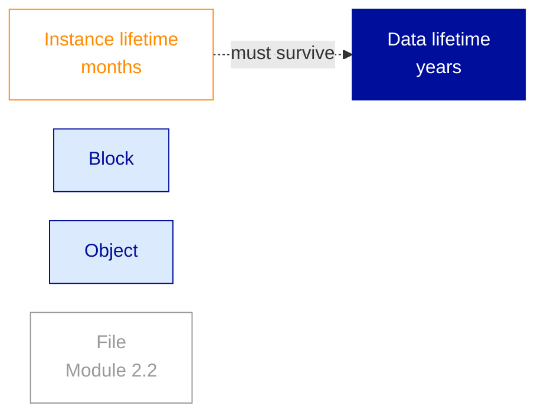
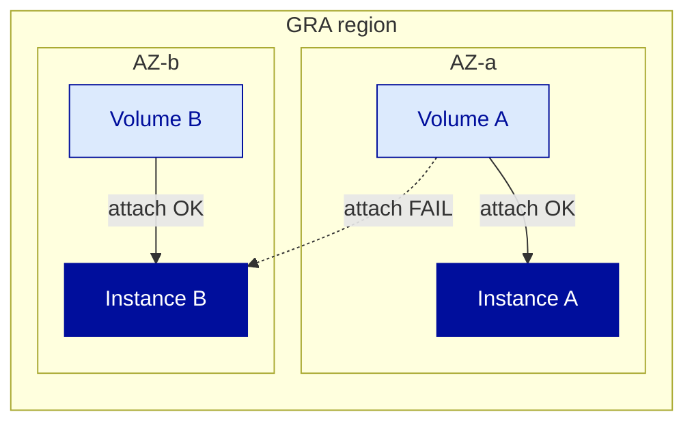
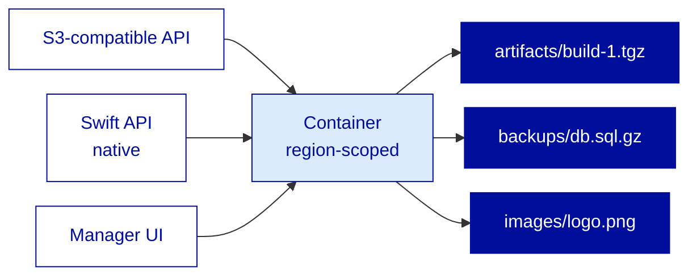
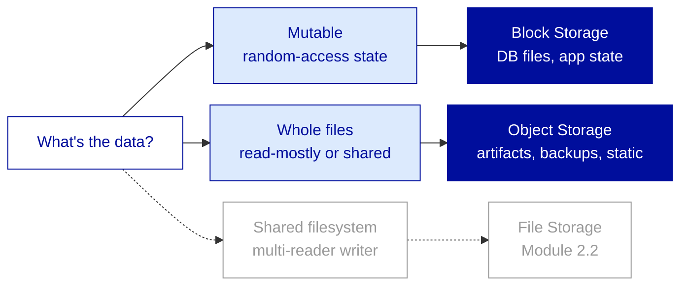
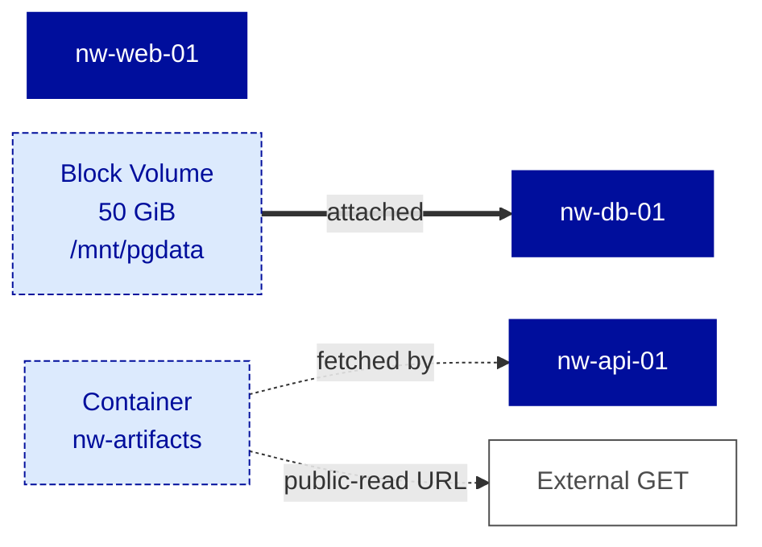

---
# ============================================================
# Module 2.1 — Storage (Part 1) — Block & Object
# Slidev source file
# ============================================================
theme: ../../theme-ovhcloud
title: Storage (Part 1) — Block & Object
info: |
  ## OVHcloud — Public Cloud — Core Associate
  Module 2.1 — Storage (Part 1) — Block & Object.
  Duration: 1h30.
class: text-left
highlighter: shiki
lineNumbers: false
drawings:
  persist: false
transition: slide-left
mdc: true
exportFilename: 'modules/module-2-1/student_export'

# Hide the floating navbar / controls overlay in dev mode
controls: false
download: false
selectable: true

# Module-level metadata (consumed by trainer-notes export and CI)
moduleId: "2.1"
moduleTitle: "Storage (Part 1) — Block & Object"
duration: "1h30"
program: "OVHcloud — Public Cloud — Core Associate"
los:
  - LO-STO-K01
  - LO-STO-K02
  - LO-STO-K03
  - LO-STO-S01
  - LO-STO-S02
  - LO-STO-S03
  - LO-STO-S04
  - LO-STO-S05
# COVER SLIDE
layout: cover
---

# Storage (Part 1)
## Block & Object

<!--
Trainer notes Cover slide:
- Welcome to Day 2. Energy check after Day 1 close.
- Frame the shift : Day 1 was Compute (does the instance run, does it survive). Day 2 starts with Storage : the data must outlive the compute.
- Announce : at the end of 1h30, Northwind has a 50 GiB volume on the DB instance and an Object Storage container holding build artifacts, one public-read.
- Set expectations : Block and Object today, File + Snapshots + Backup tomorrow in 2.2.
-->

---
layout: default
moduleId: "2.1"
slideId: "Agenda"
---

# Agenda

**Block 1 — Sentier battu** · 5 min
*Prerequisites & remediation pointers*

**Block 2 — Theory** · 30 min
*Block · Object · paradigms · OpenStack provenance*

**Block 3 — Demo** · 15 min
*Volume create / attach / mount / detach + S3 round-trip*

**Block 4 — Lab** · 30 min
*Provision Northwind's stateful and shared storage layers*

**Block 5 — Micro-check** · 5 min
*Formative QCM, 7 questions*

**Block 6 — Wrap-up** · 5 min
*Recap & transition to Module 2.2*

<!--
Trainer notes Agenda:
- Module mixte : 30 min Theory pour bien installer le mental model block-vs-object, puis 45 min Demo + Lab pour le manipuler.
- Annoncer les deux outils du module : openstack CLI pour le block, aws-cli pour l'object. Verifier rapide main levee : "qui a deja aws-cli installe ?"
- Rappeler que les 3 instances de fin de Module 1.4 doivent etre UP : si pas le cas, hors piste avant le Theory.
- Strict timing 90 min. Pause prevue apres ce module.
-->

---
# BLOCK 1 — SENTIER BATTU
layout: section
block: "Block 1"
duration: "5 min"
---

# Before we start
### Prerequisites & remediation

---
layout: two-cols
moduleId: "2.1"
slideId: "S00 — Before we start"
---

# Before we start

::left::

<strong style="color: var(--ovh-masterbrand-blue); font-size: 1.1rem;">You are ready if...</strong>

<strong>Tools</strong> 
&middot; <code>&lt;initials&gt;-nw-db-01</code> from Module 1.4 still UP and SSH-reachable 
&middot; <code>openrc.sh</code> from Module 1.2 still sourced (scoped to GRA) 
&middot; <code>aws-cli</code> v2 (or <code>rclone</code>) installed on your workstation 
&middot; Basic Linux command line : <code>lsblk</code>, <code>mount</code>, <code>df -h</code>, <code>blkid</code>, editing <code>/etc/fstab</code>

<strong>Knowledge</strong> 
&middot; The five-object instance composition (Mod 1.3) 
&middot; Difference between a block device, a filesystem, a mount point 
&middot; Vague mental model of "buckets and keys" (S3-like) 
&middot; An HTTPS URL can serve a static file, no app server needed

::right::

<strong style="color: var(--ovh-masterbrand-blue); font-size: 1.1rem;">If not, here's where to look</strong>

&middot; <strong>No <code>nw-db-01</code> running?</strong> &rarr; redeploy a <code>d2-2</code> Ubuntu in 2 min via Mod 1.3 sequence, lab proceeds identically 
&middot; <strong>Never used <code>aws-cli</code>?</strong> &rarr; 60 sec teach : <code>aws configure</code> writes <code>~/.aws/credentials</code>, every command takes <code>--endpoint-url</code> to target non-AWS 
&middot; <strong>Unfamiliar with <code>/etc/fstab</code>?</strong> &rarr; lab handout provides the line, you substitute the UUID from <code>blkid</code> 
&middot; <strong>Corporate proxy intercepts S3 HTTPS?</strong> &rarr; fall back to Manager UI for upload / download, the credential lifecycle still applies

<!--
Trainer notes S00 Before we start:
- Demander : "Qui a encore ses 3 instances de 1.4 jointes en SSH ?" Si moins de la moitie, redeploy minimal du seul nw-db-01 en 2 min avant Theory.
- Anticiper : un learner peut ne pas avoir aws-cli installe, donner 30 sec : pip install awscli ou snap install aws-cli, fallback rclone si Python KO sur le workstation.
- Si plusieurs Windows users : verifier que CRLF n'est pas un sujet ici (pas de YAML edite dans ce module), seulement le aws-cli qui fonctionne identiquement.
- Rappeler que le sentier battu est aussi le rappel : openrc.sh, keypair, projet, ce sont les invariants de Day 2.
-->

---
# BLOCK 2 — THEORY & CONCEPTS
layout: section
block: "Block 2"
duration: "30 min"
---

# Theory & Concepts
### Block paradigm, Object paradigm, choose right

---
layout: default
moduleId: "2.1"
slideId: "S01 — Data outlives compute"
los: ["LO-STO-K01"]
---

# Why this module? &mdash; data outlives compute

<strong>Instance is disposable by design</strong> 
Destroy, redeploy, autoscale, blue-green : every modern operations pattern assumes the compute is replaceable.

<strong style="color: var(--ovh-masterbrand-blue);">Data must outlive any single instance</strong> 
This requires storage decoupled from instance lifecycle. Three paradigms : block, object, file.

  Today : block + object. Module 2.2 : file + snapshots + backup strategy.

<!--
Trainer notes S01 Data outlives compute:
- Souligner le declic culturel : la VM est devenue jetable, c'est la donnee qui devient le seul actif. Le plus difficile pour un ex-VMware.
- Anticiper "et un local disk persistent comme AWS instance store ?" : pareil que Mod 1.4, local disk = ephemere, perit avec l'instance, pas une option pour de la donnee.
- Rappeler le red-thread : le CTO veut PostgreSQL sur un vrai volume et les artefacts dans un bucket, c'est l'agenda de la journee.
- Si quelqu'un demande pourquoi 3 paradigmes : 80% des workloads = block + object, file pour le cas multi-attach partage, on y vient en 2.2.
-->

---
layout: default
moduleId: "2.1"
slideId: "S02 — Two access patterns"
los: ["LO-STO-K01"]
---

# The two access patterns that drive everything

Block &mdash; the disk model

<strong>Random read / write at byte level</strong> 
Read 4 KiB at offset X &middot; write 4 KiB at offset Y &middot; update in place.

Workloads : database files, app working directory, OS filesystem

Object &mdash; the key / value model

<strong>Whole objects addressed by key</strong> 
<code>PUT artifacts/v1.0.tgz</code> &middot; <code>GET backups/2026-06-08.sql.gz</code> &middot; no in-place byte update.

Workloads : build artifacts, backups, static assets, log archives

  <strong>Not interchangeable :</strong> object as a database is painful (no in-place updates). Block to share static assets across N web servers is wasteful (single-attach). Legacy analogy : Block = SAN LUN, Object = CDN origin.

<!--
Trainer notes S02 Two access patterns:
- Souligner que le critere de choix n'est pas "performance" ou "cost", c'est le pattern d'acces, tout le reste decoule.
- Demander : "Vous voulez stocker un PDF de 50 MB que 500 personnes vont telecharger, block ou object ?" Reponse object : partage, immutable, acces HTTP.
- Anticiper "et si je veux les deux ?" : tout a fait normal, une appli typique utilise les deux, block pour la base, object pour les uploads utilisateurs.
- Rappeler le mapping AWS : Block = EBS, Object = S3, 1-to-1 conceptuellement.
-->

---
layout: default
moduleId: "2.1"
slideId: "S03 — Block Storage characteristics"
los: ["LO-STO-K02"]
---

# Block Storage &mdash; characteristics

<strong>AZ-scoped &middot; persistent &middot; single-attach</strong> 
&middot; Lives in one Availability Zone, attaches only to instances in same AZ 
&middot; Lifecycle independent of instance : delete instance, volume survives 
&middot; At any moment, attached to <strong>one</strong> instance only

<strong style="color: var(--ovh-masterbrand-blue);">Performance tier &middot; resizable</strong> 
&middot; <code>classic</code> &middot; <code>high-speed</code> &middot; <code>high-speed-gen2</code> (HDD &middot; SSD &middot; NVMe) 
&middot; Chosen at creation, no in-place tier change 
&middot; Grow online, cannot shrink

OpenStack <strong>Cinder</strong> under the hood &middot; AWS analogy : EBS volume, gp3 / io2 tiers

<!--
Trainer notes S03 Block Storage characteristics:
- Souligner que single-attach est LA contrainte qui differencie block du file storage : pour partager, c'est file storage, pas block.
- Anticiper "et le multi-attach Cinder qui existe sur d'autres clouds OpenStack ?" : pas expose dans le Core OVHcloud, absence a connaitre.
- Si quelqu'un demande "AZ vs region ?" : on creuse slide 5, garder le suspens 30 sec.
- Verifier la comprehension : "si je supprime mon instance, le volume disparait ?" Reponse : non, le volume survit, c'est tout le point.
-->

---
layout: default
moduleId: "2.1"
slideId: "S04 — Block Storage tiers"
los: ["LO-STO-K02"]
---

# Block Storage performance tiers

<strong>classic</strong> &middot; HDD 

~250 IOPS 
Lowest cost / GiB 
<em>Sequential workloads : log archives, batch jobs reading large files</em>

<strong style="color: var(--ovh-masterbrand-blue);">high-speed</strong> &middot; SSD 

~3 000 IOPS 
Mid cost / GiB 
<em>Default reasonable choice : general app data, mid-traffic databases</em>

<strong>high-speed-gen2</strong> &middot; NVMe 

~20 000 IOPS 
Top cost / GiB 
<em>OLTP databases, latency-critical workloads</em>

  <strong>Tier choice is at creation only.</strong> To change tier on an existing volume : create a new volume in the target tier and copy the data over. IOPS numbers indicative &mdash; verify on <code>docs.ovhcloud.com</code>.

For Northwind staging PostgreSQL : <code>high-speed</code> is plenty. Production might warrant <code>high-speed-gen2</code>.

<!--
Trainer notes S04 Block Storage tiers:
- Souligner que le choix se fait a la creation, on ne change pas de tier sur un volume existant : recreer et copier.
- Anticiper "et les IOPS exactes ?" : renvoyer a docs.ovhcloud.com, les chiffres bougent, retenir l'ordre de grandeur HDD / SSD / NVMe.
- Si quelqu'un demande "comment je sais ce qu'il me faut ?" : commencer par high-speed, observer les metriques (IO wait dans top, latence applicative), upgrade vers gen2 si necessaire.
- Eviter le debat FinOps detaille : c'est Pro+, ici on installe le reflexe "choisir en conscience".
-->

---
layout: default
moduleId: "2.1"
slideId: "S05 — AZ scoping"
los: ["LO-STO-K02"]
---

# AZ scoping &mdash; what it means in practice

<strong>The most common attach error</strong> 
Volume and instance in different AZs &rarr; attach fails. Always check : <code>openstack volume show</code> and <code>openstack server show</code> for the AZ field.

<strong style="color: var(--ovh-masterbrand-blue);">Multi-AZ status today</strong> 
Most OVHcloud regions today expose a single AZ. Multi-AZ is an ongoing roll-out &mdash; verify on <code>docs.ovhcloud.com</code> for the session date.

Block does NOT auto-replicate across AZs &mdash; multi-AZ apps replicate at application layer (e.g., PostgreSQL streaming replication).

<!--
Trainer notes S05 AZ scoping:
- Souligner que la majorite des regions OVHcloud aujourd'hui ne sont pas multi-AZ : l'AZ est une contrainte conceptuelle a connaitre, pas une douleur quotidienne.
- Anticiper "et le multi-AZ AWS partout ?" : la maturite multi-AZ varie entre hyperscalers et entre regions OVHcloud, verifier docs avant de promettre un design.
- Si quelqu'un demande la liste a jour des regions multi-AZ : docs.ovhcloud.com section Regions and Availability Zones, source autoritaire qui bouge.
- Verifier : "j'ai un volume en GRA9-a et une instance en GRA9-b, que se passe-t-il ?" Reponse : l'attach echoue, il faut snapshot le volume et recreer dans l'autre AZ.
-->

---
layout: default
moduleId: "2.1"
slideId: "S06 — Object Storage characteristics"
los: ["LO-STO-K03"]
---

# Object Storage &mdash; characteristics

<strong>Region-scoped &middot; two APIs</strong> 
&middot; A container lives in a region, reachable from any AZ in that region 
&middot; <strong>S3-compatible API</strong> (industry standard) and native <strong>Swift API</strong> 
&middot; S3 is a translation layer ON TOP of Swift

<strong style="color: var(--ovh-masterbrand-blue);">Capacity &middot; billing &middot; encryption</strong> 
&middot; No pre-provisioned size : you pay for what you store 
&middot; Pay-per-use : storage GiB-month + egress + requests 
&middot; Encryption at rest by default, platform-managed

OpenStack <strong>Swift</strong> under the hood &middot; AWS analogy : S3 &middot; Azure analogy : Blob Storage

<!--
Trainer notes S06 Object Storage characteristics:
- Souligner explicitement que S3 sur OVHcloud est une API de compatibilite au-dessus de Swift : c'est honnete, ca gere les attentes ex-AWS qui pourraient buter sur un edge case.
- Anticiper "100% S3 compatible ?" : 95%+ pour les operations CRUD courantes, edges sur certaines fonctions avancees (multi-part lifecycle, certains CORS), verifier docs.ovhcloud.com avant de promettre.
- Si quelqu'un demande Swift vs S3 API en pratique : utiliser S3, tout le tooling moderne parle S3, Swift utile pour des outils OpenStack natifs ou cas de niche.
- Verifier : "puis-je modifier l'octet 47 d'un fichier de 100 MiB ?" Reponse : non, on PUT l'objet entier, c'est pas du block.
-->

---
layout: default
moduleId: "2.1"
slideId: "S07 — Containers, keys, permissions"
los: ["LO-STO-S04", "LO-STO-S05"]
---

# Containers, keys, and visibility patterns

<strong>Private</strong> (default) 

Read / write requires valid S3 credentials matched against project IAM.  
<em>For : everything that is not explicitly meant to be public.</em>

<strong style="color: var(--ovh-masterbrand-blue);">Public-read</strong> 

Any HTTPS GET on the object's URL returns it. No credentials.  
<em>For : static assets, public artifacts, logos.</em>

<strong>Presigned URL</strong> 

Time-limited signed URL granting read (or write) for a defined window.  
<em>For : sharing one object without exposing publicly.</em>

  <strong>Anti-pattern :</strong> making an entire container public-read when only a handful of objects need public access. Narrow visibility to the objects that need it. Object-level ACL overrides container-level.

IAM scoping &middot; which user can use which credentials against which container &middot; covered in Module 2.5.

<!--
Trainer notes S07 Containers keys permissions:
- Souligner que public-read sur tout un container est l'erreur classique qui finit en data leak mediatise : on autorise au niveau de l'objet quand c'est legitime.
- Anticiper "et le versioning, lifecycle policies, replication ?" : disponibles selon la maturite du service, verifier docs.ovhcloud.com, on ne couvre pas Associate.
- Si quelqu'un demande "presigned URL pour upload aussi ?" : oui, presigned PUT existe, utile pour laisser un client uploader directement vers Object Storage sans relayer par l'app.
- Rappeler le red-thread : Northwind a besoin du container nw-artifacts aujourd'hui, on l'utilise au lab.
-->

---
layout: default
moduleId: "2.1"
slideId: "S08 — OpenStack provenance"
los: ["LO-STO-K02", "LO-STO-K03"]
---

# OpenStack provenance &mdash; Cinder, Swift, and what it means

<strong style="color: var(--ovh-masterbrand-blue);">Block Storage</strong>

Storage hardware 
&darr; 
OpenStack <strong>Cinder</strong> 
&darr; 
OVHcloud Block Storage 
&darr; 
<code>openstack volume</code> CLI &middot; Manager UI 

<strong style="color: var(--ovh-masterbrand-blue);">Object Storage</strong>

Storage hardware 
&darr; 
OpenStack <strong>Swift</strong> 
&darr; 
OVHcloud Object Storage 
&darr; 
<code>aws s3</code> (S3 API) &middot; <code>openstack object</code> (Swift API) &middot; Manager UI 

Knowing the OpenStack project names is not folklore : it lets you search upstream docs when the OVHcloud doc stops short.

<!--
Trainer notes S08 OpenStack provenance:
- Souligner que connaitre les noms OpenStack n'est pas du folklore : c'est ce qui permet de chercher de la doc upstream quand le besoin sort de la doc OVHcloud.
- Anticiper "alors je peux suivre les tutos OpenStack a la lettre ?" : conceptuellement oui, operationnellement il peut y avoir des specificites OVHcloud (endpoints, auth) qui passent par docs.ovhcloud.com.
- Si quelqu'un demande Manila (file storage OpenStack) : c'est ce qui est derriere File Storage, on le verra en 2.2.
- Rappeler : la connaissance OpenStack est un asset durable, transferable a tout cloud OpenStack-based (sovereign clouds, on-prem privatif).
-->

---
layout: default
moduleId: "2.1"
slideId: "S09 — Block or Object decision"
los: ["LO-STO-K01"]
---

# Block or Object? &mdash; the decision in one diagram

<strong>Common mistakes</strong> 
&middot; User uploads on Block on a single instance &rarr; doesn't survive instance deletion, doesn't scale to N app instances 
&middot; Database on Object &rarr; whole-file read / write per transaction = catastrophic latency

<strong style="color: var(--ovh-masterbrand-blue);">Northwind today</strong> 
&middot; PostgreSQL data &rarr; Block (<code>nw-db-data-01</code>) 
&middot; Build artifacts &rarr; Object (<code>nw-artifacts</code>) 
&middot; Both happen in the lab

<!--
Trainer notes S09 Block or Object decision:
- Souligner que le diagramme est volontairement simple : 80% des decisions de stockage se reglent avec ces deux questions.
- Anticiper "et pour les images Docker ?" : registry container privee Object-backed pour les artefacts, filesystem ephemere du host pour le cache local des layers Docker, cas hybride normal.
- Si quelqu'un demande "les logs vont ou ?" : logs applicatifs temps reel sur filesystem (block), archives long-terme exportees en Object.
- Rappeler que la 3eme option (file storage) existe et qu'on la verra en 2.2 pour le cas filesystem partage multi-reader writer.
- Slide cle du module : prendre 2 min pour le faire vivre, demander a 2 learners de placer un workload dans le diagramme.
-->

---
layout: default
moduleId: "2.1"
slideId: "S10 — Northwind storage architecture"
los: ["LO-STO-S01", "LO-STO-S04"]
---

# Northwind today &mdash; where storage lands

<strong>Two of three CTO demands &mdash; today</strong> 
&middot; Block volume on <code>nw-db-01</code> &rarr; PostgreSQL data dir lands here in Mod 2.2 
&middot; Object container <code>nw-artifacts</code> &rarr; build artifacts + one public-read static

<strong style="color: var(--ovh-masterbrand-blue);">Third demand &mdash; tomorrow</strong> 
Private network between the three tiers : <strong>Module 2.3</strong>. Inter-tier traffic still goes via public IPs today &mdash; costly and exposed.

<!--
Trainer notes S10 Northwind storage architecture:
- Souligner que le module ne fait pas encore tout : la base PostgreSQL n'est pas encore migree, le reseau prive n'est pas encore la, c'est le rythme de la journee.
- Rappeler le red-thread : trois exigences du CTO en fin de 1.4 : "real volume", "private network", "object storage for artifacts". On en regle deux aujourd'hui (volume + object), le reseau prive demain matin (2.3).
- Anticiper "pourquoi on ne migre pas PostgreSQL aujourd'hui ?" : la migration applicative (dump / restore, downtime, validation) est un sujet a part, on prepare le volume aujourd'hui, on charge PostgreSQL dessus en 2.2 ou en post-formation.
- Verifier que tout le monde a nw-db-01 qui tourne, sinon c'est l'heure du hors piste.
-->

---
# BLOCK 3 — TRAINER DEMONSTRATION
layout: section
block: "Block 3"
duration: "15 min"
---

# Volume lifecycle + S3 round-trip
### Two storage primitives, end-to-end

---
layout: default
moduleId: "2.1"
slideId: "Demo — Storage end-to-end"
los: ["LO-STO-S01", "LO-STO-S03", "LO-STO-S04", "LO-STO-S05"]
---

# Demo &mdash; Volume lifecycle + S3 round-trip on `demo-db-01`

<strong style="color: var(--ovh-masterbrand-blue);">What you'll see</strong>

&middot; Create a 20 GiB <code>classic</code> volume, attach, format, mount 
&middot; Write a MARKER file, unmount, detach 
&middot; Re-attach to a second instance, the MARKER is still there 
&middot; Generate S3 credentials in the Manager 
&middot; Create a container, upload, list, download 
&middot; Public-read on one object, verify with <code>curl</code> no auth

<strong style="color: var(--ovh-masterbrand-blue);">Why this matters</strong>

By the end of the demo, you've manipulated both primitives end-to-end. Two channels : <code>openstack</code> for block, <code>aws s3</code> for object. Same project, two storage paradigms.

  Instance : <code>demo-db-01</code> &middot; Region : GRA &middot; Channels : OpenStack CLI + aws-cli + Manager UI

  14 steps &middot; ~12 min walkthrough &middot; 3 min Q&amp;A

<!--
Trainer notes Demo Storage end-to-end:

PRE-FLIGHT (do BEFORE the block):
- openrc.sh pre-sourced, openstack token issue must succeed.
- demo-db-01 from Module 1.4 demo still running and SSH-reachable.
- A second instance demo-web-01 also running, same AZ as demo-db-01.
- aws-cli v2 installed on the demo workstation. Profile ovh-gra pre-configured EXCEPT for the credentials (which we generate live for pedagogy).
- A small test file ready : sample-artifact.tgz (~5 MiB) and a tiny README.txt.
- Manager open in a second browser tab, signed in on the demo project.
- Terminal at 16pt+, dark background.

DEMO SCRIPT (14 steps, ~12 min):
1. openstack volume create --size 20 --type classic demo-db-data-01. Souligner --type classic = tier choice du slide S04.
2. openstack volume list. Status available. "Le volume existe, attache a personne."
3. openstack server add volume demo-db-01 demo-db-data-01. Status in-use. "Maintenant attache. Cote OS, Linux a vu un nouveau block device."
4. SSH demo-db-01, lsblk. Voir sdb (ou vdb) 20G no partition no fs. "Disque vide. Il faut un filesystem avant utilisation."
5. sudo mkfs.ext4 /dev/sdb. Note l'UUID a la fin. "C'est cet UUID qu'on mettra dans fstab pour persistence."
6. sudo mkdir -p /mnt/data && sudo mount /dev/sdb /mnt/data && echo "northwind-demo" | sudo tee /mnt/data/MARKER. "MARKER prouve qu'on a ecrit. On le retrouvera apres detach / reattach."
7. sudo umount /mnt/data, puis openstack server remove volume demo-db-01 demo-db-data-01. Status available. "Toujours umount avant detach. Detacher un fs monte = corruption."
8. openstack server add volume demo-web-01 demo-db-data-01. "Meme volume, autre instance. Single-attach : etait libre, est repris."
9. SSH demo-web-01, sudo mount /dev/sdb /mnt/data && cat /mnt/data/MARKER. Voir northwind-demo. "La donnee a voyage avec le volume, independante des deux instances."
10. Manager > Public Cloud > Project > Users & Roles > Add user S3, copier acces + secret. "Le secret s'affiche une fois. Sauve ou regenere."
11. aws configure --profile ovh-gra : keys + region gra + json. ~/.aws/credentials updated. "L'endpoint URL est ce qui pointe vers OVHcloud au lieu d'AWS. Seule difference."
12. aws s3 mb s3://demo-northwind-artifacts --endpoint-url https://s3.gra.io.cloud.ovh.net --profile ovh-gra. Bucket cree. "mb = make bucket. Dans notre vocabulaire : container cree en region GRA."
13. aws s3 cp sample-artifact.tgz s3://demo-northwind-artifacts/app/build-1.0.tgz, puis aws s3 ls s3://demo-northwind-artifacts/app/. "Le app/ est juste une convention de naming, pas un vrai dossier."
14. aws s3api put-object-acl --bucket demo-northwind-artifacts --key app/build-1.0.tgz --acl public-read, puis curl -sI https://demo-northwind-artifacts.s3.gra.io.cloud.ovh.net/app/build-1.0.tgz. HTTP/2 200. "Public-read sur un objet. Pas besoin de aws-cli pour le recuperer, l'URL HTTPS suffit."

FAILURE MODES:
- Step 4 lsblk ne voit rien : attendre 5-10 sec, le kernel doit enumerer. Si toujours rien, AZ mismatch entre volume et instance. openstack volume show et openstack server show, comparer.
- Step 6 mount fails "wrong fs type" : volume pas formate, refaire mkfs.ext4.
- Step 12 mb returns 403 : credentials pas encore propages (30-60 sec apres generation), ou typo endpoint URL.
- Step 14 curl returns 403 : URL format faux. Le virtual-hosted-style est https://<bucket>.s3.gra.io.cloud.ovh.net/<key>. Path-style aussi fonctionne : https://s3.gra.io.cloud.ovh.net/<bucket>/<key>.

Q&A (3 min) : focus sur le mental model block-vs-object et le AZ scoping. Parking pour 2.2 : snapshots de volumes et coherence applicative.
-->

---
# BLOCK 4 — LEARNER LAB
layout: section
block: "Block 4"
duration: "30 min"
---

# Provision Northwind's storage layers
### Your turn. Solo. 30 minutes. Block + Object.

---
layout: default
moduleId: "2.1"
slideId: "Lab — Brief"
los: ["LO-STO-S01", "LO-STO-S02", "LO-STO-S04", "LO-STO-S05"]
---

# Lab &mdash; Provision Northwind's stateful + shared storage

You are Northwind's Cloud Ops engineer. The CTO wants the database off the ephemeral local disk and the build artifacts in a shared store. Today you : (1) create a 50 GiB Block volume, attach it to <code>&lt;initials&gt;-nw-db-01</code>, format, mount, persist across reboot, (2) generate S3 credentials, create a container <code>&lt;initials&gt;-nw-artifacts</code>, round-trip a file, (3) expose one file as public-read and verify with <code>curl</code>.

<strong style="color: var(--ovh-masterbrand-blue);">Channels</strong>

&middot; <code>openstack</code> CLI for block (volume + attach) 
&middot; <code>aws-cli</code> for object (S3 API) 
&middot; Manager UI for S3 credential generation

<strong style="color: var(--ovh-masterbrand-blue);">Success criteria</strong>

Volume survives reboot, OWNER file intact &middot; round-trip MD5 matches &middot; public-read URL returns the file unauthenticated

  Volume : <code>&lt;initials&gt;-nw-db-data-01</code> &middot; Container : <code>&lt;initials&gt;-nw-artifacts</code> &middot; Time : 30 min

<!--
Trainer notes Lab Brief:
- Souligner que le volume reste attache a la fin du lab : utilise Module 2.2 pour le data directory PostgreSQL et 2.3 pour les flux prives.
- Annoncer les criteres de succes : auto-verifiables, l'apprenant n'a pas besoin du formateur pour savoir.
- Lab dense pour 30 min : surveiller le timing, si plus de la moitie de la salle est en retard a 20 min, couper le public-read et le declarer homework.
- Circuler discretement, ne pas intervenir sauf blocage. Cibler les 2-3 learners en avance pour soutenir les voisins.

VALIDATION CRITERIA (silent check by trainer):
- Volume nw-db-data-01 visible openstack volume list, status in-use, attache a nw-db-01
- Sur l'instance, df -h montre /mnt/pgdata 50G, fichier OWNER present
- Apres reboot, df -h | grep pgdata toujours present (fstab OK)
- Container nw-artifacts visible aws s3 ls, au moins 1 objet uploade
- curl public-read URL retourne 200 et le contenu, depuis un terminal incognito (no profile loaded)
-->

---
layout: default
moduleId: "2.1"
slideId: "Lab — Steps (1/2) Block Storage"
---

# Lab &mdash; Step-by-step (1/2) &middot; Block Storage

<strong style="color: var(--ovh-masterbrand-blue);">Block Storage (openstack CLI)</strong>

<strong>1.</strong> <code>openstack volume create --size 50 --type classic &lt;initials&gt;-nw-db-data-01</code> 
&nbsp;&nbsp;&nbsp;&nbsp;Verify <code>available</code> with <code>openstack volume list</code> 
<strong>2.</strong> <code>openstack server add volume &lt;initials&gt;-nw-db-01 &lt;initials&gt;-nw-db-data-01</code> 
<strong>3.</strong> SSH into nw-db-01, <code>lsblk</code>, note device (typically <code>/dev/sdb</code>) 
<strong>4.</strong> <code>sudo mkfs.ext4 /dev/sdb</code> 
<strong>5.</strong> <code>sudo mkdir -p /mnt/pgdata && sudo mount /dev/sdb /mnt/pgdata</code> 
<strong>6.</strong> <code>echo "&lt;initials&gt; $(date -I)" | sudo tee /mnt/pgdata/OWNER</code> 
<strong>7.</strong> <code>sudo blkid /dev/sdb</code> &rarr; copy UUID 
&nbsp;&nbsp;&nbsp;&nbsp;Append to <code>/etc/fstab</code> : 
&nbsp;&nbsp;&nbsp;&nbsp;<code>UUID=&lt;uuid&gt; /mnt/pgdata ext4 defaults,nofail 0 2</code> 
<strong>8.</strong> <code>sudo umount /mnt/pgdata && sudo mount -a && ls /mnt/pgdata</code> &rarr; OWNER visible 
<strong>9.</strong> <code>sudo reboot</code>, wait, SSH back in, <code>df -h | grep pgdata</code> &rarr; mount persists

<!--
Trainer notes Lab Steps 1/2 Block:
- Slide de reference pour la premiere moitie du lab : laisser projete pendant les steps 1 a 9.
- Insister oralement en debut : "creez le volume dans LA MEME AZ que nw-db-01, sinon l'attach echoue."
- Si plusieurs learners bloquent sur lsblk qui ne voit rien : 90% du temps c'est l'AZ mismatch, le reste c'est attendre 5-10 sec.
- Si fstab fait crasher le reboot : nofail dans les options est ce qui sauve, verifier que c'est bien dans la ligne fstab. Sinon Rescue mode (Mod 1.4) pour reparer fstab.

SUPPORT FAQ (anticipated learner questions):
- "Volume available mais attach refuse not in same AZ" : openstack volume show et server show, comparer la zone. Recreer le volume dans la bonne AZ.
- "lsblk ne voit pas le nouveau device" : attendre 10 sec et retry. Sinon AZ mismatch.
- "mkfs dit que le device est busy" : sudo wipefs -a /dev/sdb pour clear, puis remkfs.
- "Apres reboot le mount est parti" : cat /etc/fstab, verifier que l'UUID matche sudo blkid. Cause classique : guillemets autour de l'UUID ou typo.
-->

---
layout: default
moduleId: "2.1"
slideId: "Lab — Steps (2/2) Object Storage"
---

# Lab &mdash; Step-by-step (2/2) &middot; Object Storage

<strong style="color: var(--ovh-masterbrand-blue);">Object Storage (Manager + aws-cli)</strong>

<strong>10.</strong> Manager &gt; Public Cloud &gt; project &gt; Users & Roles &gt; Add user S3 &rarr; copy access key + secret (shown once) 
<strong>11.</strong> <code>aws configure --profile ovh-gra</code> &rarr; keys + region <code>gra</code> + format <code>json</code> 
&nbsp;&nbsp;&nbsp;&nbsp;Every <code>aws s3</code> command below : add 
&nbsp;&nbsp;&nbsp;&nbsp;<code>--profile ovh-gra --endpoint-url https://s3.gra.io.cloud.ovh.net</code> 
<strong>12.</strong> <code>aws s3 mb s3://&lt;initials&gt;-nw-artifacts</code> 
<strong>13.</strong> <code>aws s3 cp &lt;localfile&gt; s3://&lt;initials&gt;-nw-artifacts/app/sample.tgz</code> 
&nbsp;&nbsp;&nbsp;&nbsp;<code>aws s3 ls s3://&lt;initials&gt;-nw-artifacts/app/</code> 
<strong>14.</strong> <code>aws s3 cp s3://&lt;initials&gt;-nw-artifacts/app/sample.tgz ./downloaded.tgz</code> 
&nbsp;&nbsp;&nbsp;&nbsp;Verify <code>md5sum</code> matches original 
<strong>15.</strong> <code>aws s3 cp README.txt s3://&lt;initials&gt;-nw-artifacts/public/README.txt</code> 
&nbsp;&nbsp;&nbsp;&nbsp;<code>aws s3api put-object-acl --bucket &lt;initials&gt;-nw-artifacts --key public/README.txt --acl public-read</code> 
<strong>16.</strong> Incognito browser or <code>curl</code> : 
&nbsp;&nbsp;&nbsp;&nbsp;<code>https://&lt;initials&gt;-nw-artifacts.s3.gra.io.cloud.ovh.net/public/README.txt</code> &rarr; 200 + content

<strong>Artifact</strong> (do NOT commit) 
<code>&lt;initials&gt;-northwind-staging/storage-notes.txt</code> 
volume UUID + container name + public URL + md5 round-trip

<!--
Trainer notes Lab Steps 2/2 Object:
- Slide de reference pour la seconde moitie du lab : laisser projete pendant les steps 10 a 16.
- Eviter d'aider trop tot sur les erreurs aws-cli : laisser le learner lire le message, 70% se debloque seul.
- Si plusieurs learners n'ont pas aws-cli installe : fallback rclone ou Manager UI pour upload / download (le credential lifecycle reste enseigne).

SUPPORT FAQ (anticipated learner questions):
- "aws s3 mb returns 403" : credentials pas encore actives (30-60 sec apres generation), ou endpoint URL typo.
- "Le bucket name est deja pris" : les noms sont uniques par region dans le namespace S3 OVHcloud, prefixer initiales + date.
- "curl public-read returns 403" : refaire put-object-acl, ou URL format faux. Le virtual-hosted-style est https://<bucket>.s3.gra.io.cloud.ovh.net/<key>.
- "Je peux partager mes credentials S3 avec mon voisin ?" : non, generer les siennes. Partager des credentials obscurcit l'audit trail, Pro tier antipattern.
-->

---
# BLOCK 5 — MICRO-CHECK QCM
layout: section
block: "Block 5"
duration: "5 min"
---

# Micro-check
### Seven formative questions

---
layout: default
moduleId: "2.1"
slideId: "MC — Q1 Block vs Object choice"
los: ["LO-STO-K01"]
---

# Q1 &mdash; Which paradigm for which workload

A learner needs to store a PostgreSQL database's data files for an application running on a single Public Cloud Instance. Which OVHcloud storage paradigm is the correct primary choice?

<strong>A.</strong> Block Storage &mdash; the workload needs random read / write at byte level on mutable state, attached to a single instance

<strong>B.</strong> Object Storage &mdash; PostgreSQL files can be large and Object has practically unlimited capacity

<strong>C.</strong> File Storage &mdash; PostgreSQL is often deployed on NFS in the OVHcloud documentation

<strong>D.</strong> Cold Archive &mdash; the data must be retained long-term

<!--
Trainer notes Q1:
- Correct answer: A. Random read / write at byte level on mutable state = block.
- B wrong : object stores immutable whole objects, updating bytes in place at every transaction is not workable for a database.
- C wrong : NFS for PostgreSQL data files adds latency and locking issues, not recommended.
- D wrong : Cold Archive is for infrequent retrieval, PostgreSQL reads and writes constantly.
- LO: LO-STO-K01. Bloom: Understand.
- Piege : un ex-S3-heavy peut etre tente par B, recadrer sur le pattern d'acces.
-->

---
layout: default
moduleId: "2.1"
slideId: "MC — Q2 AZ scoping"
los: ["LO-STO-K02"]
---

# Q2 &mdash; Attaching a volume across AZs

An operator has a Block Storage volume in `GRA9-a` that they would like to attach to an instance running in `GRA9-b`. What is the correct procedure?

<strong>A.</strong> <code>openstack server add volume --force-cross-az</code> overrides the AZ check

<strong>B.</strong> It is not possible &mdash; AZ scoping is enforced. Create a new volume in <code>GRA9-b</code> and copy the data over (typically via snapshot + restore)

<strong>C.</strong> Create a vRack between the two AZs to bridge the volume attach

<strong>D.</strong> Use <code>openstack volume migrate</code> to relocate the volume's metadata to <code>GRA9-b</code>

<!--
Trainer notes Q2:
- Correct answer: B. AZ scoping is enforced by the storage backend.
- A wrong : pas de --force-cross-az, l'AZ scoping vient du backend, pas du CLI.
- C wrong : vRack est un primitif reseau L2 entre produits OVHcloud, pas un pont Block Storage. AZ scoping est independant du reseau.
- D wrong : pas de live migration cross-AZ expose dans Core Block Storage. Snapshot / restore est le pattern.
- LO: LO-STO-K02. Bloom: Remember.
- Recadrer un ex-AWS sur le fait que c'est exactement le meme comportement qu'EBS : AZ-scoped, pas de cross-AZ attach.
-->

---
layout: default
moduleId: "2.1"
slideId: "MC — Q3 Object Storage facts"
los: ["LO-STO-K03"]
---

# Q3 &mdash; Object Storage on OVHcloud

Which statement about OVHcloud Object Storage is correct?

<strong>A.</strong> Object Storage is AZ-scoped and supports single-instance attach, similar to Block Storage

<strong>B.</strong> Object Storage on OVHcloud exposes only the Swift API; S3 is not supported

<strong>C.</strong> Object Storage is region-scoped, exposes both an S3-compatible API and a native Swift API, and is backed by OpenStack Swift

<strong>D.</strong> Object Storage is built on OpenStack Cinder, the same project that powers Block Storage

<!--
Trainer notes Q3:
- Correct answer: C. Region-scoped, two APIs, Swift backend.
- A wrong : confond Object et Block. Object est region-scoped, accede via HTTP API, pas attache aux instances.
- B wrong : S3-compatible API est la surface primaire pour Object Storage, layered sur Swift.
- D wrong : Cinder = block, Swift = object, projets OpenStack distincts.
- LO: LO-STO-K03. Bloom: Remember.
- Bonne question pour piocher les fondamentaux : 3 faits importants en une.
-->

---
layout: default
moduleId: "2.1"
slideId: "MC — Q4 OpenStack mapping"
los: ["LO-STO-K02", "LO-STO-K03"]
---

# Q4 &mdash; OpenStack project mapping

A learner reads in an OpenStack tutorial that they should use the `openstack volume` and `openstack object` commands. Which underlying OpenStack projects do these two commands correspond to?

<strong>A.</strong> <code>openstack volume</code> &rarr; <strong>Cinder</strong> (block) &middot; <code>openstack object</code> &rarr; <strong>Swift</strong> (object)

<strong>B.</strong> <code>openstack volume</code> &rarr; <strong>Manila</strong> &middot; <code>openstack object</code> &rarr; <strong>Cinder</strong>

<strong>C.</strong> <code>openstack volume</code> &rarr; <strong>Nova</strong> &middot; <code>openstack object</code> &rarr; <strong>Keystone</strong>

<strong>D.</strong> Both commands are part of the <strong>Glance</strong> project (image storage)

<!--
Trainer notes Q4:
- Correct answer: A. Cinder block, Swift object.
- B wrong : Manila est file storage (Mod 2.2), mapping inverse.
- C wrong : Nova compute, Keystone identity, sans rapport avec stockage.
- D wrong : Glance est image storage pour les images Compute, pas block / object products.
- LO: LO-STO-K02, LO-STO-K03. Bloom: Remember.
- C'est aussi le moment de mentionner Manila en preview : on le verra 2.2 pour File Storage.
-->

---
layout: default
moduleId: "2.1"
slideId: "MC — Q5 Volume resize"
los: ["LO-STO-S02"]
---

# Q5 &mdash; Volume resize and filesystem extend

An operator has resized a Block Storage volume from 20 GiB to 50 GiB using `openstack volume set --size 50`. SSH-ing into the instance, `lsblk` shows the device is now 50 GiB but `df -h` still shows the filesystem as 20 GiB. What is the missing step?

<strong>A.</strong> Reboot the instance &mdash; <code>df -h</code> reflects the new size after a fresh boot

<strong>B.</strong> Detach and reattach the volume to force the kernel to re-read the size

<strong>C.</strong> Run <code>openstack volume set --refresh-mount</code> to push the new size to the instance

<strong>D.</strong> Extend the filesystem online : <code>sudo resize2fs /dev/&lt;device&gt;</code> for ext4, <code>sudo xfs_growfs /mnt/&lt;mountpoint&gt;</code> for XFS

<!--
Trainer notes Q5:
- Correct answer: D. Le filesystem doit etre etendu, le device l'a deja ete.
- A wrong : reboot n'etend pas un filesystem, le filesystem ignore que le device a grandi.
- B wrong : le kernel a deja vu la nouvelle taille (confirme par lsblk), c'est le fs au-dessus qui manque.
- C wrong : commande inexistante. L'extension fs est responsabilite operateur.
- LO: LO-STO-S02. Bloom: Apply.
- Forward reference : pareil sur AWS gp3 / io2, le couple block + filesystem est universel.
-->

---
layout: default
moduleId: "2.1"
slideId: "MC — Q6 Volume move"
los: ["LO-STO-S03"]
---

# Q6 &mdash; Moving a volume to another instance

A learner wants to move a Block Storage volume from `nw-db-01` to `nw-web-01` without losing data. Both instances are in the same AZ. What is the correct sequence?

<strong>A.</strong> Detach with <code>--force</code> while the filesystem is mounted &mdash; the cloud handles the unmount for you

<strong>B.</strong> Inside <code>nw-db-01</code>, <code>sudo umount</code>; on cloud side, <code>openstack server remove volume nw-db-01 &lt;vol&gt;</code>; <code>openstack server add volume nw-web-01 &lt;vol&gt;</code>; inside <code>nw-web-01</code>, mount

<strong>C.</strong> Stop both instances, swap the volume attachment, restart both instances

<strong>D.</strong> Take a snapshot, create a new volume from the snapshot in <code>nw-web-01</code>, leave the original attached

<!--
Trainer notes Q6:
- Correct answer: B. Unmount au niveau OS d'abord, puis detach / attach, puis mount.
- A wrong : detacher un fs monte cause corruption fs, l'unmount doit etre cote OS.
- C wrong : pas besoin d'arreter, les operations attach / detach sont online.
- D wrong : ca produit une COPIE, pas un MOVE. La question demandait un move.
- LO: LO-STO-S03. Bloom: Apply.
- Bon distracteur D : un ex-Cinder peut etre tente par le snapshot, recadrer sur la difference move / copy.
-->

---
layout: default
moduleId: "2.1"
slideId: "MC — Q7 Permissions"
los: ["LO-STO-S05"]
---

# Q7 &mdash; Time-limited external sharing

A learner needs to share a 10 MiB PDF with an external customer for a 48-hour review window. The file must not be publicly accessible after that window, and creating an external IAM principal for the customer is not desired. Which Object Storage permission pattern fits?

<strong>A.</strong> Generate a <strong>presigned URL</strong> with a 48-hour validity targeting the specific object

<strong>B.</strong> Set the entire container to public-read for 48 hours, then revert to private

<strong>C.</strong> Email the file directly from the instance &mdash; Object Storage is overkill for one-off sharing

<strong>D.</strong> Create a private container and share your own S3 credentials with the customer for the window

<!--
Trainer notes Q7:
- Correct answer: A. Presigned URL, time-limited, scope a un objet specifique.
- B wrong : expose TOUS les objets du container, et la fenetre temporelle est manuelle, error-prone.
- C wrong : contourne la question et ne teste pas Object Storage, et l'email casse pour les gros fichiers.
- D wrong : partager des credentials = acces a tout ce que ces credentials peuvent atteindre, audit trail casse.
- LO: LO-STO-S05. Bloom: Apply.
- Bon distracteur D : reverbaliser que partager des credentials est l'antipattern classique cloud.
-->

---
# BLOCK 6 — WRAP-UP & TRANSITION
layout: section
block: "Block 6"
duration: "5 min"
---

# Wrap-up
### Recap & transition to Module 2.2

---
layout: two-cols
moduleId: "2.1"
slideId: "Wrap-up — Recap & next stop"
los: ["LO-STO-K01", "LO-STO-K02", "LO-STO-K03", "LO-STO-S01", "LO-STO-S02", "LO-STO-S03", "LO-STO-S04", "LO-STO-S05"]
---

# Wrap-up

::left::

## You can now...

&middot; <strong style="color: var(--ovh-masterbrand-blue);">Distinguish</strong> the three storage paradigms and pick the right one 
&middot; <strong style="color: var(--ovh-masterbrand-blue);">Explain</strong> Block Storage : AZ-scoped, single-attach, persistent, with Cinder behind 
&middot; <strong style="color: var(--ovh-masterbrand-blue);">Explain</strong> Object Storage : region-scoped, S3 + Swift APIs, with Swift behind 
&middot; <strong style="color: var(--ovh-masterbrand-blue);">Create</strong>, attach, format, mount, persist a Block volume across reboot 
&middot; <strong style="color: var(--ovh-masterbrand-blue);">Resize</strong> a volume online and extend the filesystem 
&middot; <strong style="color: var(--ovh-masterbrand-blue);">Detach</strong> cleanly and reattach to another instance in the same AZ 
&middot; <strong style="color: var(--ovh-masterbrand-blue);">Manipulate</strong> Object Storage via the S3 API : create, upload, list, download 
&middot; <strong style="color: var(--ovh-masterbrand-blue);">Set</strong> private / public-read / presigned URL visibility

::right::

## Next stop &mdash; Module 2.2

<strong style="color: var(--ovh-masterbrand-blue);">File Storage, Snapshots & Backup Strategy</strong>

Northwind's CTO walks back in with three follow-ups :  
<em>"What about the four old PDFs the legal team needs to keep for ten years? What about a shared filesystem the API and web instances both need to read configuration from? And what's our backup story if someone runs DELETE FROM on the wrong table at 3am?"</em>  
That's Module 2.2 : File Storage, Snapshots, Instance Backup, Cold Archive, and the design of a real backup strategy.

Module 5 / 11 &middot; Storage domain in progress &middot; Block and Object done, File and backups next

<!--
Trainer notes Wrap-up:
- Rappeler que le volume nw-db-data-01 reste attache et que le container nw-artifacts reste actif : reutilises Module 2.2 (snapshots de volume + backup strategy) et Module 2.3 (private network).
- Souligner que les 2 paradigmes vus aujourd'hui couvrent 80% des workloads : File en 2.2 sert le cas multi-attach partage.
- Anticiper la fatigue : on est au milieu de Day 2, annoncer la pause, timing precis du retour.
- Si question parking non resolue (snapshot de volumes, lifecycle policies, replication cross-region) : noter "parking 2.2".
- Transition narrative : "Block sous PostgreSQL, Object pour les artefacts. CTO revient : 'Et mes vieux PDF legal ? Et le partage entre instances ? Et le backup ?' Module 2.2."
- Eviter de demarrer 2.2 maintenant : laisser respirer.
-->