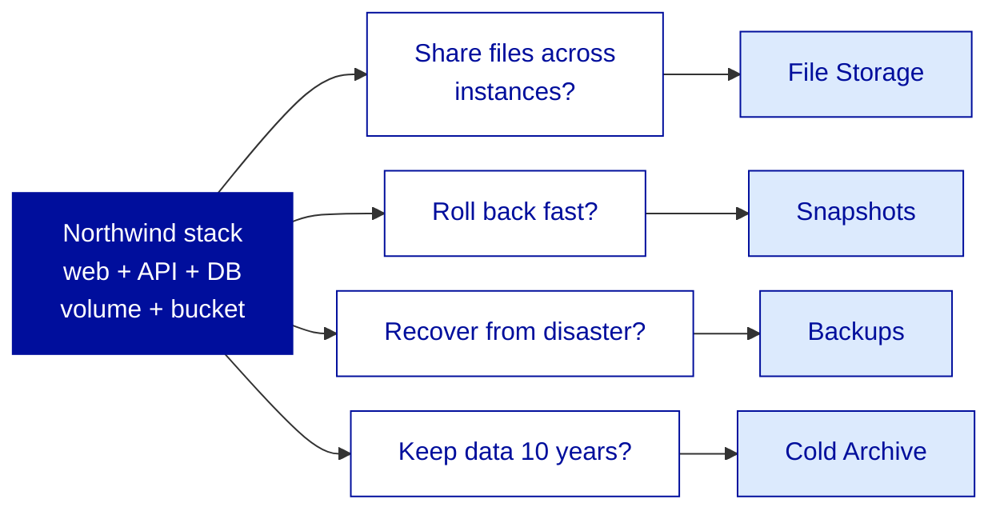
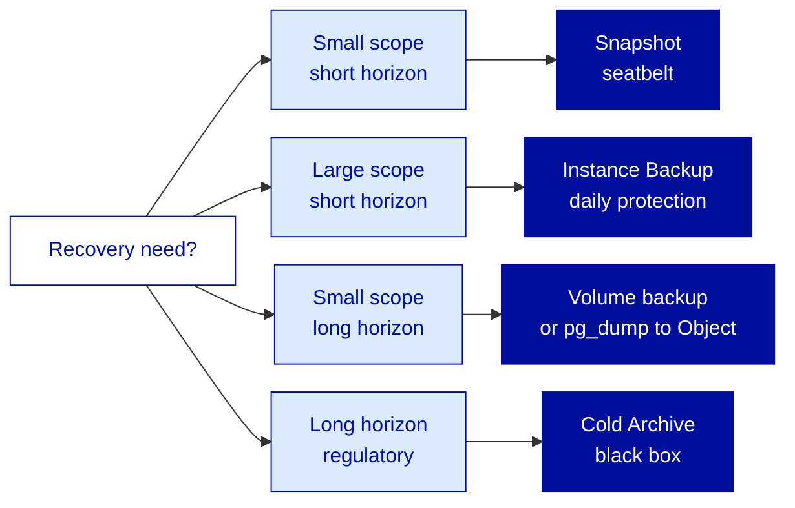
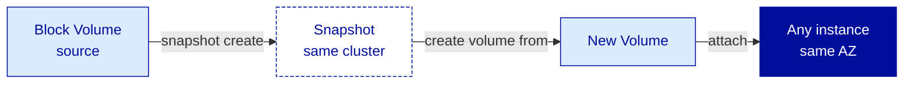

---
# ============================================================
# Module 2.2 — Storage (Part 2) — File, Snapshots & Backup Strategy
# Slidev source file
# ============================================================
theme: ../../theme-ovhcloud
title: Storage (Part 2) — File, Snapshots & Backup Strategy
info: |
  ## OVHcloud — Public Cloud — Core Associate
  Module 2.2 — Storage (Part 2) — File, Snapshots & Backup Strategy.
  Duration: 1h30.
class: text-left
highlighter: shiki
lineNumbers: false
drawings:
  persist: false
transition: slide-left
mdc: true
exportFilename: 'modules/module-2-2/student_export'

# Hide the floating navbar / controls overlay in dev mode
controls: false
download: false
selectable: true

# Module-level metadata (consumed by trainer-notes export and CI)
moduleId: "2.2"
moduleTitle: "Storage (Part 2) — File, Snapshots & Backup Strategy"
duration: "1h30"
program: "OVHcloud — Public Cloud — Core Associate"
los:
  - LO-STO-K04
  - LO-STO-K05
  - LO-STO-K06
  - LO-STO-S06
  - LO-STO-S07
  - LO-STO-S08
  - LO-STO-A01
  - LO-STO-A02
  - LO-STO-A03
# COVER SLIDE
layout: cover
---

# Storage (Part 2)
## File, Snapshots & Backup Strategy

<!--
Trainer notes Cover slide:
- Welcome back from the pause. Energy check after Module 2.1.
- Frame the shift : 2.1 stored data on block and object. 2.2 makes it durable : the third paradigm (File), the snapshot-vs-backup distinction, the real backup strategy.
- Announce : at the end of 1h30, Northwind has a shared upload directory mounted on web + API, snapshots on the DB volume, Instance Backup on the API, and pg_dump to Object Storage with a restore drill.
- Set expectations : slide 4 (snapshot vs backup) is the most important slide of the storage domain. Pre-flag it.
-->

---
layout: default
moduleId: "2.2"
slideId: "Agenda"
---

# Agenda

**Block 1 — Sentier battu** · 5 min
*Prerequisites & remediation pointers*

**Block 2 — Theory** · 30 min
*File Storage · Snapshot vs Backup · Cold Archive*

**Block 3 — Demo** · 15 min
*Share mount · Snapshot restore · Instance Backup · pg_dump round-trip*

**Block 4 — Lab** · 30 min
*Make Northwind's data layer durable*

**Block 5 — Micro-check** · 5 min
*Formative QCM, 7 questions*

**Block 6 — Wrap-up** · 5 min
*Recap & transition to Module 2.3*

<!--
Trainer notes Agenda:
- Module mixte : 30 min Theory pour bien installer File Storage, snapshot-vs-backup et Cold Archive, puis 45 min Demo + Lab pour manipuler les 4 primitives durabilite.
- Annoncer les outils : openstack CLI pour share et snapshot, Manager UI pour Instance Backup, aws s3 pour le pg_dump.
- Verifier que les sorties de 2.1 (volume sur nw-db-01, container nw-artifacts, credentials S3) sont toujours operationnels : si non, hors piste avant Theory.
- Strict timing 90 min. Slide la plus importante du module : slide 4 (snapshot vs backup). Pre-annoncer.
-->

---
layout: section
block: "Block 1"
duration: "5 min"
---

# Before we start
### Prerequisites & remediation

---
layout: two-cols
moduleId: "2.2"
slideId: "S00a — You are ready if..."
---

# Before we start (1/2)

::left::

<strong style="color: var(--ovh-masterbrand-blue); font-size: 1.1rem;">Tools</strong>

&middot; <code>&lt;initials&gt;-nw-web-01</code>, <code>-nw-api-01</code>, <code>-nw-db-01</code> from Module 1.4 UP and SSH-reachable 
&middot; Block volume from Module 2.1 attached on <code>nw-db-01</code> at <code>/mnt/pgdata</code> 
&middot; Object Storage container <code>&lt;initials&gt;-nw-artifacts</code> + S3 credentials from Module 2.1 
&middot; <code>openrc.sh</code> sourced, scoped to GRA 
&middot; <code>aws-cli</code> v2 with the GRA profile

::right::

<strong style="color: var(--ovh-masterbrand-blue); font-size: 1.1rem;">Knowledge</strong>

&middot; The Block vs Object distinction from Module 2.1 (mutable vs immutable, single-attach vs region-scoped) 
&middot; Linux <code>mount</code> basics 
&middot; NFS as a network filesystem protocol (from Mod 1.1 legacy vocabulary) 
&middot; PostgreSQL basics : <code>psql</code>, <code>pg_dump</code>, <code>SELECT</code> / <code>DROP TABLE</code> 
&middot; The ephemeral storage warning from Mod 1.4 : data not on a persistent volume is lost

<!--
Trainer notes S00a You are ready if:
- Demander : "Qui a encore les 3 instances + le volume + le container de fin 2.1 ?" Si moins de la moitie, redeploy minimal du seul nw-db-01 avec un volume vide pour les exercices snapshot.
- Verifier le sourcing openrc.sh + la presence des credentials S3 : ce sont les invariants de Day 2.
- Rappeler : ce module est dense en attitudes (A01, A02, A03). Le mental model snapshot-vs-backup est l'asset cle a sortir d'ici.
- Annoncer : si quelque chose manque dans cette liste, slide suivante = la remediation.
-->

---
layout: two-cols
moduleId: "2.2"
slideId: "S00b — If not, here's where to look"
---

# Before we start (2/2)

::left::

<strong style="color: var(--ovh-masterbrand-blue); font-size: 1.1rem;">Stack or credentials missing</strong>

&middot; <strong>Northwind stack missing?</strong> &rarr; pair with a neighbor for the multi-instance mount step. Snapshot and Instance Backup work on a freshly deployed instance with an attached volume 
&middot; <strong>No S3 credentials at hand?</strong> &rarr; re-issue from Manager (Public Cloud &gt; Users &amp; Roles), reconfigure <code>aws</code> profile. 2 min operation

::right::

<strong style="color: var(--ovh-masterbrand-blue); font-size: 1.1rem;">Tooling or concepts</strong>

&middot; <strong><code>nfs-common</code> missing?</strong> &rarr; <code>sudo apt install -y nfs-common</code>. Default Ubuntu image already ships it 
&middot; <strong>Confusion NAS-HA vs File Storage?</strong> &rarr; preempted here : today we use File Storage (Public Cloud, Manila). NAS-HA exists, it is Hosted Private Cloud, not in our scope. Same NFS protocol, different product line

<!--
Trainer notes S00b If not where to look:
- Anticiper la confusion NAS-HA : preempter ici en 30 sec. Si elle reapparait en Theory, c'est qu'on l'a mal verbalise au Sentier battu.
- Si plusieurs learners ont perdu les credentials S3 : faire la regeneration en parallele pendant que les autres preparent le terminal SSH.
- Si nfs-common manque sur plusieurs postes : faire l'install en batch verbal, 30 sec, eviter les retards individuels au Block 4.
- Cloturer le Sentier battu en confirmant que tout le monde a les invariants. Si plus de 20% de la salle bloque, prolonger de 5 min sur le timing global.
-->

---
layout: section
block: "Block 2"
duration: "30 min"
---

# Theory & Concepts
### File Storage, snapshot vs backup, Cold Archive, strategy

---
layout: default
moduleId: "2.2"
slideId: "S01 — Durability question"
los: ["LO-STO-K04", "LO-STO-K05", "LO-STO-K06"]
---

# Why this module? &mdash; the durability question

<strong>Module 2.1 stored data</strong> 
Block + Object : the two primary paradigms. The data is persistent and lives outside the instance lifecycle.

<strong style="color: var(--ovh-masterbrand-blue);">Module 2.2 keeps it durable</strong> 
Four concepts close the storage domain : File Storage, snapshots, backups, Cold Archive. The single most important slide is slide 4.

<!--
Trainer notes S01 Durability question:
- Annoncer le perimetre : 4 concepts, 4 slides cles. Le slide 4 est le pivot du domaine.
- Souligner que la confusion snapshot/backup est le piege numero 1 du storage cloud, surtout pour ex-AWS.
- Rappeler le persona Corporate : en legacy, le backup est un produit separe (Veeam, NetBackup). Ici c'est integre, mais l'integration ne dispense pas de la strategie.
- Demander : "qui a deja perdu de la donnee parce qu'un snapshot n'etait pas un backup ?" Laisser 5 secondes. Souvent quelqu'un raconte une histoire, capitaliser dessus.
-->

---
layout: default
moduleId: "2.2"
slideId: "S02 — File Storage paradigm"
los: ["LO-STO-K04"]
---

# File Storage &mdash; the third paradigm

<strong>Block</strong> &middot; single-attach 

Random read / write at byte level 
Attached to <strong>one</strong> instance 
OpenStack <strong>Cinder</strong> 
<em>DB files, app working dir</em>

<strong>Object</strong> &middot; HTTP API 

Whole objects via key 
Region-scoped, no attach 
OpenStack <strong>Swift</strong> 
<em>Artifacts, backups, static</em>

<strong style="color: var(--ovh-masterbrand-blue);">File</strong> &middot; multi-attach 

POSIX over NFS v3 
<strong>N</strong> instances mount together 
OpenStack <strong>Manila</strong> 
<em>Shared uploads, shared config</em>

  <strong>Not NAS-HA.</strong> NAS-HA is a Hosted Private Cloud product. In OVHcloud Public Cloud, the shared filesystem service is called <strong>File Storage</strong> (Manila, NFS v3). Same protocol, different product line.

Legacy analogy : block = SAN LUN &middot; object = CDN origin &middot; file = NAS share &middot; AWS analogy : EBS &middot; S3 &middot; EFS

<!--
Trainer notes S02 File Storage paradigm:
- Souligner que c'est la 3e paradigme : cloture la trilogie ouverte en 2.1. La grille des 3 colonnes est la grille de reference du domaine.
- Anticiper la confusion NAS-HA vs File Storage : meme protocole NFS, deux produits OVHcloud distincts (Hosted Private Cloud vs Public Cloud).
- Si quelqu'un demande SMB / CIFS : non, NFS v3 uniquement sur File Storage Public Cloud.
- Rappeler l'analogie legacy : NAS partage, accessible de plusieurs serveurs en meme temps, contrairement au volume SAN mono-attache.
- Pour ex-AWS : EFS est l'equivalent direct. Pour ex-Azure : Azure Files.
-->

---
layout: default
moduleId: "2.2"
slideId: "S03 — File Storage decision"
los: ["LO-STO-K04", "LO-STO-A01"]
---

# File Storage &mdash; when to reach for it (and when not to)

Reach for File Storage when...

&middot; <strong>N instances share the same files</strong> simultaneously 
&middot; A legacy app speaks NFS natively 
&middot; POSIX semantics needed across instances 
&middot; Kubernetes ReadWriteMany volumes (forward ref MKS)

Don't reach for File Storage when...

&middot; A single instance owns the data &rarr; <strong>Block</strong> 
&middot; Large unstructured blobs over HTTP &rarr; <strong>Object</strong> 
&middot; Millisecond IOPS on a database &rarr; <strong>Block high-speed-gen2</strong> 
&middot; 10-year archival rarely accessed &rarr; <strong>Cold Archive</strong>

  <strong>Multi-attach is the killer feature.</strong> If only one instance owns the data, Block Storage is simpler and faster. If the data is accessed via HTTP, Object Storage is the right tool. File Storage is for the multi-reader-writer case.

<!--
Trainer notes S03 File Storage decision:
- Souligner : File Storage = "je dois partager des fichiers entre VM, point". Tout le reste est mal place.
- Anticiper "pourquoi pas File Storage pour la DB PostgreSQL ?" : latence NFS vs local block, IOPS plus faibles, locking issues. Le pattern PostgreSQL sur NFS existe mais c'est un anti-pattern hors cas tres particulier.
- Rappeler LO-STO-A01 : recommander le bon outil. C'est ici que la posture se forme.
- Pour ex-AWS : equivalent EFS, meme grille de decision.
-->

---
layout: default
moduleId: "2.2"
slideId: "S04 — Snapshot vs Backup"
los: ["LO-STO-K05"]
---

# Snapshot vs Backup &mdash; the distinction

<table style="width:100%; border-collapse: collapse;">
<thead>
<tr style="background: var(--ovh-masterbrand-blue); color: white;">
<th style="padding: 6px 8px; text-align: left;">Criterion</th>
<th style="padding: 6px 8px; text-align: left;">Snapshot</th>
<th style="padding: 6px 8px; text-align: left;">Backup</th>
</tr>
</thead>
<tbody>
<tr style="background: #F2F2F2;">
<td style="padding: 6px 8px;"><strong>Scope</strong></td>
<td style="padding: 6px 8px;">Point-in-time copy of one volume</td>
<td style="padding: 6px 8px;">Independent archive of a volume or instance</td>
</tr>
<tr>
<td style="padding: 6px 8px;"><strong>Location</strong></td>
<td style="padding: 6px 8px;">Same storage cluster as the source</td>
<td style="padding: 6px 8px;">Separate storage, often different system or region</td>
</tr>
<tr style="background: #F2F2F2;">
<td style="padding: 6px 8px;"><strong>Retention</strong></td>
<td style="padding: 6px 8px;">Operational rollback (hours to days)</td>
<td style="padding: 6px 8px;">Disaster recovery (weeks to years)</td>
</tr>
<tr>
<td style="padding: 6px 8px;"><strong>Recovery time</strong></td>
<td style="padding: 6px 8px;">Seconds to minutes (clone the snapshot)</td>
<td style="padding: 6px 8px;">Minutes to hours (read from independent storage)</td>
</tr>
<tr style="background: #F2F2F2;">
<td style="padding: 6px 8px;"><strong>Survives source deletion</strong></td>
<td style="padding: 6px 8px;"><strong style="color: #C7253E;">No</strong> &mdash; tied to volume lifecycle</td>
<td style="padding: 6px 8px;"><strong style="color: var(--ovh-masterbrand-blue);">Yes</strong> &mdash; lives on its own</td>
</tr>
</tbody>
</table>

  <strong>A snapshot is NOT a backup.</strong> Snapshots are the seatbelt (fast operational rollback). Backups are the airbag (disaster recovery on independent storage). The 3-2-1 rule applies : 3 copies, 2 media, 1 off-site &mdash; snapshots alone violate it.

<!--
Trainer notes S04 Snapshot vs Backup:
- Slide la plus importante du module. Ralentir, articuler chaque ligne du tableau.
- Souligner : "un snapshot n'est PAS un backup", le repeter, le faire repeter par la salle.
- Anticiper la resistance ex-AWS : "EBS snapshot c'est presque pareil que backup" &rarr; non, un EBS snapshot peut etre copie cross-region pour devenir un backup, mais le snapshot Cinder OVHcloud reste local au cluster.
- Demander : "si je supprime mon volume, mon snapshot survit ?" Reponse : non. Reformuler si la salle hesite.
- Si question sur 3-2-1 : 3 copies de la donnee, 2 supports differents, 1 hors site. La strategie Northwind du slide 9 respecte la regle.
-->

---
layout: default
moduleId: "2.2"
slideId: "S05 — When snapshot, when backup"
los: ["LO-STO-K05", "LO-STO-A02"]
---

# When snapshot, when backup, when archive

<strong>Choose by scope and horizon</strong> 
Scope = what you need to recover (a volume, an instance, a whole tier). Horizon = how far back you need to reach.

<strong style="color: var(--ovh-masterbrand-blue);">They combine</strong> 
A real strategy uses snapshots <em>and</em> backups <em>and</em> Cold Archive. The question is the recipe per tier (slide 9).

<!--
Trainer notes S05 When snapshot when backup:
- Souligner que c'est LO-STO-A02 qui se forme : design d'une strategie de backup.
- Demander : "avant une migration de schema SQL, snapshot ou backup ?" Reponse : snapshot (rollback rapide, meme volume, secondes).
- Demander : "pour respecter une obligation legale de 7 ans, Cold Archive ou backup standard ?" Reponse : Cold Archive.
- Rappeler : les outils ne sont pas exclusifs. Une strategie reelle les combine, c'est le slide 9 qui montre la composition.
- Eviter de rentrer dans le detail des RPO / RTO : c'est Pro+, ici on installe le reflexe "scope + horizon = outil".
-->

---
layout: default
moduleId: "2.2"
slideId: "S06 — Volume Snapshot"
los: ["LO-STO-K05", "LO-STO-S08"]
---

# Volume Snapshot &mdash; how it works

<strong>Cinder operation, region-scoped</strong> 
&middot; Point-in-time copy of one volume 
&middot; Stored alongside the source, same cluster 
&middot; Restore = create a new volume from snapshot, attach where needed 
&middot; Snapshot consumes billed storage

<strong style="color: var(--ovh-masterbrand-blue);">Crash-consistent, not app-consistent</strong> 
&middot; Equivalent of pulling the power on the disk 
&middot; Databases recover via WAL but may lose in-flight transactions 
&middot; For application consistency : <code>pg_dump</code> or freeze the filesystem first 
&middot; Restore is to a <strong>new</strong> volume, never in-place

<!--
Trainer notes S06 Volume Snapshot:
- Souligner la difference crash-consistent vs application-consistent. C'est la clef de la slide.
- Anticiper "donc je peux faire un snapshot d'une DB live ?" : oui, mais sans garantie de coherence applicative. D'ou pg_dump dans le lab.
- Rappeler le cout : un snapshot consomme du stockage facture, ce n'est pas gratuit. Verifier sur docs.ovhcloud.com.
- Si question coherence multi-volumes : un snapshot est par volume, pas un point-in-time global sur plusieurs volumes. Pour ca il faut un mecanisme applicatif.
- Demander : "ou est restauree la donnee, dans le volume original ou ailleurs ?" Reponse : un nouveau volume, jamais in-place.
-->

---
layout: default
moduleId: "2.2"
slideId: "S07 — Instance Backup"
los: ["LO-STO-S07"]
---

# Instance Backup &mdash; the managed backup service

<strong style="color: var(--ovh-masterbrand-blue);">What it captures</strong>

&middot; <code>/dev/sda</code> &mdash; system disk only 
&middot; Stored as a private image in <strong>Glance</strong> 
&middot; Region-scoped 
&middot; Daily / weekly cycle, configurable retention 
&middot; Configured per instance via the <strong>Manager</strong>

<strong style="color: var(--ovh-masterbrand-blue);">What it does NOT capture</strong>

&middot; Attached additional volumes (<code>/dev/sdb</code>, <code>/dev/sdc</code>...) 
&middot; Object Storage data 
&middot; File Storage data 
&middot; Anything outside <code>/dev/sda</code>

  <strong>Instance Backup is system-disk only.</strong> Additional volumes must be backed up independently &mdash; via volume snapshots, application-level dumps to Object Storage, or both. This is THE pitfall of the service.

AWS analogy : AWS Backup (closer match than EBS snapshot) &middot; Azure analogy : Azure Backup

<!--
Trainer notes S07 Instance Backup:
- Souligner le scope : systeme uniquement, pas les volumes additionnels. C'est LE piege du service.
- Anticiper : "ma DB est sur /dev/sdb, Instance Backup me la sauvegarde ?" &rarr; NON. Il faut une strategie separee.
- Rappeler que c'est expose proprement via le Manager. Le CLI peut prendre un image one-shot via openstack server image create, mais ce n'est pas l'equivalent fonctionnel d'un schedule.
- Si question retention : jusqu'a 30 jours au scope Associate, au-dela on copie vers Object Storage manuellement.
- Verifier : "qu'est-ce qui est dans /dev/sda d'une Ubuntu standard ?" Reponse : l'OS, /etc, /var, /home. Pas les volumes additionnels montes ailleurs.
-->

---
layout: default
moduleId: "2.2"
slideId: "S08 — Cold Archive"
los: ["LO-STO-K06"]
---

# Cold Archive &mdash; the long tail

<strong>The cheapest tier</strong> 
&middot; Magnetic tape backend, multi-DC France 
&middot; Same <strong>S3 API</strong> as Object Storage 
&middot; Retrieval : minutes to hours, billed 
&middot; Object Lock + WORM for compliance

<strong style="color: var(--ovh-masterbrand-blue);">When to use it</strong> 
&middot; Regulatory archiving (7-10 years) 
&middot; Accessed 1-2 times/year max 
&middot; The "black box" you put data in and don't touch 
&middot; <strong>Not</strong> for daily backups (retrieval latency)

AWS analogy : S3 Glacier Deep Archive &middot; Azure analogy : Azure Archive Storage

<!--
Trainer notes S08 Cold Archive:
- Souligner que c'est le "black box" : on y depose, on n'y touche pas. Le retrieval coute en temps et en argent.
- Anticiper "et si je dois restaurer en urgence ?" : Cold Archive n'est pas pour ca. C'est de l'archivage froid, par construction.
- Si question souverainete : Cold Archive heberge en France, multi-DC. Bon argument pour les workloads regules.
- Rappeler : Cold Archive est dans le scope Associate au niveau positionnement, pas en manipulation pratique. La demo et le lab ne le couvrent pas.
- Pour ex-AWS : Glacier Deep Archive est l'equivalent le plus proche. Pas d'equivalent direct a Glacier Instant Retrieval cote OVHcloud.
-->

---
layout: default
moduleId: "2.2"
slideId: "S09 — Northwind backup strategy"
los: ["LO-STO-A01", "LO-STO-A02", "LO-STO-A03"]
---

# Northwind backup strategy &mdash; putting it together

<table style="width:100%; border-collapse: collapse;">
<thead>
<tr style="background: var(--ovh-masterbrand-blue); color: white;">
<th style="padding: 6px 8px; text-align: left;">Tier</th>
<th style="padding: 6px 8px; text-align: left;">Snapshot</th>
<th style="padding: 6px 8px; text-align: left;">Backup</th>
<th style="padding: 6px 8px; text-align: left;">Archive</th>
</tr>
</thead>
<tbody>
<tr style="background: #F2F2F2;">
<td style="padding: 6px 8px;"><strong>web</strong> (stateless)</td>
<td style="padding: 6px 8px;">&mdash;</td>
<td style="padding: 6px 8px;">Instance Backup daily, 7 days</td>
<td style="padding: 6px 8px;">&mdash; (static assets already in Object)</td>
</tr>
<tr>
<td style="padding: 6px 8px;"><strong>API</strong> (stateless + shared uploads)</td>
<td style="padding: 6px 8px;">&mdash;</td>
<td style="padding: 6px 8px;">Instance Backup daily, 7 days</td>
<td style="padding: 6px 8px;">&mdash; (uploads on File Storage)</td>
</tr>
<tr style="background: #F2F2F2;">
<td style="padding: 6px 8px;"><strong>DB</strong> (stateful)</td>
<td style="padding: 6px 8px;">Volume snapshot before risky ops</td>
<td style="padding: 6px 8px;"><code>pg_dump</code> to Object Storage nightly, 30-day retention</td>
<td style="padding: 6px 8px;">Monthly copy to Cold Archive</td>
</tr>
</tbody>
</table>

  <strong>Three tiers, three recipes &mdash; same tools.</strong> The DB strategy alone respects 3-2-1 : 3 copies (live volume + S3 dump + Cold Archive), 2 media (block + tape), 1 off-site (Cold Archive in different DCs).

<!--
Trainer notes S09 Northwind backup strategy:
- Souligner que c'est la synthese. C'est le slide qui prepare le lab.
- Rappeler la 3-2-1 : la strategie DB la respecte. Demander a la salle de l'identifier dans le tableau.
- Anticiper : "pourquoi pas un snapshot quotidien de la DB ?" &rarr; coherence crash-consistent uniquement. pg_dump est applicatif, donc coherent. La combinaison snapshot avant ops + dump nightly est la bonne lecture.
- Demander aux apprenants : "dans votre quotidien, vous avez un tier stateless ou stateful ?" Faire le mapping mental.
- Eviter le debat sur RPO / RTO chiffres : c'est Pro+. Ici on installe les categories.
-->

---
layout: default
moduleId: "2.2"
slideId: "S10 — Hyperscaler mapping"
los: ["LO-STO-K04", "LO-STO-K05", "LO-STO-K06"]
---

# Hyperscaler cross-reference

<table style="width:100%; border-collapse: collapse;">
<thead>
<tr style="background: var(--ovh-masterbrand-blue); color: white;">
<th style="padding: 6px 8px; text-align: left;">OVHcloud</th>
<th style="padding: 6px 8px; text-align: left;">AWS</th>
<th style="padding: 6px 8px; text-align: left;">Azure</th>
<th style="padding: 6px 8px; text-align: left;">OpenStack</th>
</tr>
</thead>
<tbody>
<tr style="background: #F2F2F2;">
<td style="padding: 6px 8px;"><strong>File Storage</strong></td>
<td style="padding: 6px 8px;">Amazon EFS</td>
<td style="padding: 6px 8px;">Azure Files</td>
<td style="padding: 6px 8px;">Manila</td>
</tr>
<tr>
<td style="padding: 6px 8px;"><strong>Volume Snapshot</strong></td>
<td style="padding: 6px 8px;">EBS Snapshot</td>
<td style="padding: 6px 8px;">Managed Disk Snapshot</td>
<td style="padding: 6px 8px;">Cinder Snapshot</td>
</tr>
<tr style="background: #F2F2F2;">
<td style="padding: 6px 8px;"><strong>Instance Backup</strong></td>
<td style="padding: 6px 8px;">AWS Backup (partial)</td>
<td style="padding: 6px 8px;">Azure Backup</td>
<td style="padding: 6px 8px;">&mdash;</td>
</tr>
<tr>
<td style="padding: 6px 8px;"><strong>Cold Archive</strong></td>
<td style="padding: 6px 8px;">S3 Glacier Deep Archive</td>
<td style="padding: 6px 8px;">Azure Archive Storage</td>
<td style="padding: 6px 8px;">&mdash;</td>
</tr>
</tbody>
</table>

  <strong>Same primitives, different names.</strong> The snapshot-vs-backup distinction is universal &mdash; and universally misunderstood. AWS Backup is a closer match to Instance Backup than EBS Snapshot, because EBS Snapshot is just the snapshot primitive, not a scheduled service.

<!--
Trainer notes S10 Hyperscaler mapping:
- Souligner que c'est un slide d'ancrage pour les profils ex-AWS / ex-Azure.
- Anticiper "AWS Backup couvre plus que le disque systeme, et OVHcloud Instance Backup non" &rarr; confirmer, c'est une difference de perimetre, pas une promesse comparable.
- Si question sur Glacier Instant Retrieval : pas d'equivalent direct OVHcloud, on reste sur Standard / Infrequent Access / Cold Archive.
- Rappeler : ce n'est pas un classement, c'est une cartographie. Les ex-cloud reconnaissent leurs reperes, c'est tout.
- Connaitre les noms OpenStack (Manila, Cinder) reste utile pour chercher de la doc upstream quand besoin.
-->

---
layout: section
block: "Block 3"
duration: "15 min"
---

# Demo
### File Storage + Snapshot + Instance Backup + pg_dump

---
layout: default
moduleId: "2.2"
slideId: "Demo — Durability primitives"
los: ["LO-STO-S06", "LO-STO-S07", "LO-STO-S08"]
---

# Demo &mdash; the four durability primitives, end-to-end

<strong style="color: var(--ovh-masterbrand-blue);">What you'll see</strong>

&middot; Create a File Storage share, mount on 2 instances 
&middot; Snapshot a volume, corrupt data, restore from snapshot 
&middot; Enable Instance Backup via Manager 
&middot; <code>pg_dump</code> piped directly to Object Storage 
&middot; Restore the dump into a fresh database

<strong style="color: var(--ovh-masterbrand-blue);">Why this matters</strong>

By the end of the demo, you've exercised all four durability primitives end-to-end on a real workload. Channels mixed deliberately : CLI for share + snapshot, Manager for Instance Backup, shell + aws-cli for the dump.

  Instances : <code>demo-api-01</code> + <code>demo-web-01</code> + <code>demo-db-01</code> &middot; Region : GRA &middot; Channels : openstack + Manager + aws-cli

  12 steps &middot; ~12 min walkthrough &middot; 3 min Q&amp;A

<!--
Trainer notes Demo Durability primitives:

PRE-FLIGHT (do BEFORE the block):
- openrc.sh pre-sourced, openstack token issue must succeed.
- demo-api-01, demo-web-01, demo-db-01 still running from Mod 2.1 / 1.4 demos.
- Block volume from 2.1 still attached on demo-db-01 with a PostgreSQL container running (or a tiny postgres binary install).
- aws-cli v2 with the GRA profile pre-configured.
- A small dummy PostgreSQL DB northwind with a customers table populated (~10 rows) on demo-db-01.
- Manager open in a second browser tab, signed in on the demo project.
- Terminal at 16pt+, dark background.

DEMO SCRIPT (12 steps, ~12 min):
1. openstack share create --share-type default nfs 10 --name demo-uploads. Souligner Manila, NFS v3, region-scoped.
2. openstack share access create demo-uploads ip <demo-api-01-IP> then ip <demo-web-01-IP>. "Access control par IP."
3. openstack share show demo-uploads, lire le path field. "C'est le path NFS qu'on va monter."
4. SSH demo-api-01, sudo mount -t nfs <path> /mnt/uploads, sudo touch /mnt/uploads/marker-from-api.txt. "Cree sur le shared filesystem."
5. SSH demo-web-01, sudo mount -t nfs <path> /mnt/uploads, ls /mnt/uploads. Le fichier est la. "Multi-attach in action."
6. openstack volume snapshot create --volume demo-db-data-01 demo-snap-pre-drop. Status available. "Point-in-time copy, meme cluster."
7. SSH demo-db-01, sudo -u postgres psql -d northwind -c "DROP TABLE customers;". "Destruction deliberee. La table n'est plus la."
8. openstack volume create --snapshot demo-snap-pre-drop --size 20 demo-db-data-restored. "Restore = nouveau volume depuis snapshot, jamais in-place."
9. Detach old, attach restored, mount, restart postgres, \dt : customers est revenue. "La donnee est de retour. Snapshot a sauve la mise."
10. Manager > Public Cloud > Instances > demo-api-01 > Backup tab > Enable daily, 7-day retention. "Manager only, c'est le bon canal pour Instance Backup."
11. pg_dump northwind | aws s3 cp - s3://demo-northwind-artifacts/db-$(date +%Y%m%d).sql --endpoint-url https://s3.gra.io.cloud.ovh.net --profile ovh-gra. "Stream direct vers S3, pas de fichier intermediaire."
12. aws s3 ls s3://demo-northwind-artifacts/ --endpoint-url <url> --profile ovh-gra. L'objet apparait. "Backup sur stockage independant : c'est ca, la difference snapshot vs backup."

FAILURE MODES:
- Step 4 mount hangs : access rule pas encore propagee. openstack share access list demo-uploads, attendre que la regle soit active.
- Step 6 snapshot en error : quota epuise ou volume detache. openstack volume show et openstack quota show.
- Step 11 aws s3 cp returns AccessDenied : endpoint URL typo, ou credentials pas charges. Verifier ~/.aws/credentials et l'endpoint matche la region.
- Step 10 Backup tab non visible : instance trop fraiche, refresh le Manager. Fallback CLI : openstack server image create demo-api-01 demo-api-snap, one-shot.

Q&A (3 min) : focus sur le mental model snapshot-vs-backup et le scope Instance Backup. Parking pour 2.3 : reseau prive entre tiers.
-->

---
layout: section
block: "Block 4"
duration: "30 min"
---

# Make Northwind's data layer durable
### Your turn. Solo. 30 minutes.

---
layout: default
moduleId: "2.2"
slideId: "Lab — Brief"
los: ["LO-STO-S06", "LO-STO-S07", "LO-STO-S08", "LO-STO-A02"]
---

# Lab &mdash; Make Northwind's data layer durable

You are Northwind's Cloud Ops engineer. The CTO walks in : <em>"What if someone runs DELETE FROM customers at 3am? What about that shared upload directory the API and web both need?"</em> Today you : (1) provision File Storage and multi-mount on web + API, (2) snapshot the DB volume and prove a rollback works, (3) configure Instance Backup on the API, (4) implement pg_dump &rarr; Object Storage with a restore drill.

<strong style="color: var(--ovh-masterbrand-blue);">Channels</strong>

&middot; <code>openstack</code> CLI for share + snapshot 
&middot; Manager UI for Instance Backup 
&middot; <code>aws-cli</code> + <code>psql</code> for the pg_dump round-trip

<strong style="color: var(--ovh-masterbrand-blue);">Success criteria</strong>

Marker file visible from both instances &middot; customers table restored after DROP &middot; Instance Backup scheduled &middot; dump object listed in container &middot; restored DB queryable

  Share : <code>&lt;initials&gt;-nw-uploads</code> &middot; Snapshot : <code>&lt;initials&gt;-nw-db-data-pre-migration</code> &middot; Time : 30 min

<!--
Trainer notes Lab Brief:
- Souligner que les artefacts du lab restent en place : la base restauree, le snapshot, le schedule Instance Backup. Reutilises Module 2.5 pour le hardening securite (Secret Manager, IAM scoping).
- Annoncer les criteres de succes : auto-verifiables. L'apprenant sait s'il a reussi sans demander.
- Lab dense pour 30 min : surveiller le timing. Si plus de la moitie de la salle est en retard a 20 min, couper le restore drill (etape 8) et le declarer homework.
- Circuler discretement. Cibler les learners en avance pour soutenir leurs voisins.

VALIDATION CRITERIA (silent check by trainer):
- openstack share show <initials>-nw-uploads : active, rules present pour web et api
- ls /srv/uploads sur les deux instances : marker file visible
- psql -d northwind -c "\dt" sur nw-db-01 : table customers presente apres restore
- Manager : Instance Backup actif sur nw-api-01, next run timestamp non vide
- aws s3 ls <bucket>/ : au moins un objet db-*.sql present
- psql -d northwind_restore_test -c "SELECT COUNT(*) FROM customers" : valeur non-zero
-->

---
layout: default
moduleId: "2.2"
slideId: "Lab — Steps 1/2"
---

# Lab &mdash; Step-by-step (1/2)
### File Storage + Snapshot &middot; openstack CLI

<strong>1.</strong> <code>openstack share create --share-type default nfs 10 --name &lt;initials&gt;-nw-uploads</code> 
&nbsp;&nbsp;<code>openstack share access create &lt;share&gt; ip &lt;api-IP&gt;</code> (and again for <code>&lt;web-IP&gt;</code>) 
<strong>2.</strong> <code>openstack share show &lt;share&gt;</code> &rarr; copy the <code>path</code> field 
<strong>3.</strong> SSH <code>nw-api-01</code> : 
&nbsp;&nbsp;<code>sudo apt install -y nfs-common</code> (if missing) 
&nbsp;&nbsp;<code>sudo mkdir -p /srv/uploads && sudo mount -t nfs &lt;path&gt; /srv/uploads</code> 
&nbsp;&nbsp;<code>echo "marker-api" | sudo tee /srv/uploads/marker-api.txt</code> 
<strong>4.</strong> SSH <code>nw-web-01</code>, mount the same share at <code>/srv/uploads</code>, <code>ls</code> &rarr; marker visible 
<strong>5.</strong> Persist in <code>/etc/fstab</code> on both : <code>&lt;path&gt; /srv/uploads nfs defaults,nofail 0 0</code> 
<strong>6.</strong> <code>openstack volume snapshot create --volume &lt;initials&gt;-nw-db-data-01 &lt;initials&gt;-nw-db-data-pre-migration</code> 
<strong>7.</strong> SSH <code>nw-db-01</code> &middot; <code>sudo -u postgres psql -d northwind -c "DROP TABLE customers;"</code> 
<strong>8.</strong> Restore : <code>openstack volume create --snapshot &lt;snap&gt; --size 50 &lt;initials&gt;-nw-db-data-restored</code> 
&nbsp;&nbsp;Stop postgres, detach old vol, attach restored, mount, restart postgres 
&nbsp;&nbsp;<code>psql -d northwind -c "\dt"</code> &rarr; customers is back

<!--
Trainer notes Lab Steps 1/2:
- Slide de reference pendant la premiere moitie du lab : laisser projete jusqu'a l'etape 8.
- Insister oralement en debut : "le snapshot est cree AVANT le DROP, sinon vous n'avez rien a restaurer." Erreur classique.
- Si plusieurs learners bloquent sur le mount NFS : 90% du temps c'est la regle d'access pas active (attendre 30 sec apres openstack share access create), le reste c'est nfs-common manquant.
- Verbalise l'attente "available" sur l'etape 1 plutot que d'occuper de la place sur la slide.
- Passer a la slide 2/2 quand la majorite atteint l'etape 8 ou apres 15 min.
-->

---
layout: default
moduleId: "2.2"
slideId: "Lab — Steps 2/2"
---

# Lab &mdash; Step-by-step (2/2)
### Instance Backup + pg_dump &middot; Manager + aws-cli

<strong>9.</strong> Manager &gt; Public Cloud &gt; Instances &gt; <code>&lt;initials&gt;-nw-api-01</code> &gt; Backup tab &gt; Enable 
&nbsp;&nbsp;Daily frequency, 7-day retention &middot; confirm next-run timestamp is non-empty 
<strong>10.</strong> SSH <code>nw-db-01</code>, pipe <code>pg_dump</code> to Object Storage : 
&nbsp;&nbsp;<code>sudo -u postgres pg_dump northwind | aws s3 cp -</code> 
&nbsp;&nbsp;<code>&nbsp;&nbsp;s3://&lt;initials&gt;-nw-artifacts/db-DATE.sql</code> 
&nbsp;&nbsp;<code>&nbsp;&nbsp;--endpoint-url https://s3.gra.io.cloud.ovh.net --profile ovh-gra</code> 
&nbsp;&nbsp;(replace <code>DATE</code> with <code>$(date +&percnt;Y&percnt;m&percnt;d)</code> at execution) 
<strong>11.</strong> <code>aws s3 ls s3://&lt;initials&gt;-nw-artifacts/ --profile ovh-gra</code> &rarr; dump object appears 
<strong>12.</strong> Restore drill : <code>aws s3 cp s3://&lt;...&gt;/db-&lt;date&gt;.sql ./dump.sql</code> 
&nbsp;&nbsp;<code>sudo -u postgres createdb northwind_restore_test</code> 
&nbsp;&nbsp;<code>sudo -u postgres psql -d northwind_restore_test -f ./dump.sql</code> 
<strong>13.</strong> <code>psql -d northwind_restore_test -c "SELECT COUNT(*) FROM customers;"</code> &rarr; non-zero = restore is real

<strong>Artifact</strong> (do NOT commit secrets) &middot; <code>storage2-notes.txt</code> &middot; share path + snapshot name + dump key + restore COUNT result

<!--
Trainer notes Lab Steps 2/2:
- Slide de reference pendant la seconde moitie du lab.
- Eviter d'aider trop tot sur le pg_dump : laisser le learner lire le message d'erreur S3. 70% se debloque seul.
- L'artifact est en bas pour rappel : verifier en fin de lab que chaque apprenant a son storage2-notes.txt avant le micro-check.

SUPPORT FAQ (anticipated learner questions for steps 9-13):
- "Instance Backup tab not visible" : refresh Manager, ou fallback openstack server image create one-shot.
- "aws s3 cp returns AccessDenied" : endpoint URL typo (region mismatch) ou credentials pas charges. Verifier ~/.aws/credentials et --profile.
- "Le pg_dump est lent" : pour un petit dump c'est la latence first-write sur Object Storage, normal en premier passage.
- "Le restore ecrase la prod ?" : non, on restore dans northwind_restore_test, une DB neuve. La prod n'est pas touchee.
- "Je peux supprimer le snapshot apres le lab ?" : pour ce lab oui, openstack volume snapshot delete. En reel, garder tant que le rollback est plausible.
-->

---
layout: section
block: "Block 5"
duration: "5 min"
---

# Micro-check
### Seven formative questions

---
layout: default
moduleId: "2.2"
slideId: "MC — Q1 File Storage characteristics"
los: ["LO-STO-K04"]
---

# Q1 &mdash; Multi-instance shared filesystem

Which OVHcloud Public Cloud service exposes a shared filesystem accessible from multiple Public Cloud Instances simultaneously?

<strong>A.</strong> NAS-HA &mdash; the OVHcloud product for shared NFS storage

<strong>B.</strong> File Storage &mdash; based on OpenStack Manila, NFS v3, multi-attach

<strong>C.</strong> Block Storage with multi-attach mode enabled

<strong>D.</strong> Object Storage with an <code>s3fs</code> FUSE mount on each instance

<!--
Trainer notes Q1:
- Correct answer: B. File Storage, Manila, NFS v3, multi-attach.
- A wrong : NAS-HA est Hosted Private Cloud, pas Public Cloud. Meme protocole NFS, autre produit.
- C wrong : Block Storage en Public Cloud OVHcloud est single-attach. Multi-attach Cinder existe sur d'autres OpenStack mais pas expose ici.
- D wrong : possible techniquement via s3fs, mais pas un service filesystem Public Cloud, pas POSIX-compliant.
- LO: LO-STO-K04. Bloom: Remember.
- Piege classique : la confusion NAS-HA est l'erreur numero 1, surtout pour ceux qui ont vu NAS-HA dans la doc OVHcloud par ailleurs.
-->

---
layout: default
moduleId: "2.2"
slideId: "MC — Q2 Snapshot lifecycle"
los: ["LO-STO-K05"]
---

# Q2 &mdash; Snapshot survives source deletion?

A volume snapshot is taken on a Block Storage volume. The source volume is then deleted. What happens to the snapshot?

<strong>A.</strong> The snapshot is preserved and can be restored to a new volume at any time

<strong>B.</strong> The snapshot is automatically converted to an Object Storage object

<strong>C.</strong> The snapshot is also deleted &mdash; it is tied to the source volume's lifecycle

<strong>D.</strong> The snapshot can still be restored for 30 days after the source volume deletion (grace period)

<!--
Trainer notes Q2:
- Correct answer: C. Snapshot tied to volume lifecycle.
- A wrong : ce serait un backup, pas un snapshot. Confusion typique snapshot vs backup.
- B wrong : pas de conversion automatique. Si on veut survivre a la suppression, il faut creer un volume depuis le snapshot avant et l'exporter.
- D wrong : pas de grace period dans Cinder. La doc OVHcloud peut evoluer mais la regle est : Manager empeche la suppression d'un volume qui a des snapshots dependants. Il faut supprimer les snapshots d'abord.
- LO: LO-STO-K05. Bloom: Understand.
- C'est LA question pivot du module. Si elle est ratee, retourner sur slide 4 en wrap-up.
-->

---
layout: default
moduleId: "2.2"
slideId: "MC — Q3 Cold Archive positioning"
los: ["LO-STO-K06"]
---

# Q3 &mdash; Cold Archive use case

Cold Archive is the appropriate choice for which of the following workloads?

<strong>A.</strong> Regulatory archiving of historical records, accessed 1-2 times/year, 10-year retention

<strong>B.</strong> Daily backups of a production database with a 24-hour RPO

<strong>C.</strong> Hot static assets served on a public website

<strong>D.</strong> Shared filesystem for a Kubernetes cluster

<!--
Trainer notes Q3:
- Correct answer: A. Long-term, rare access, regulatory.
- B wrong : retrieval latency (minutes a heures) viole le RPO 24h. Standard ou Infrequent Access pour ca.
- C wrong : c'est Standard, acces immediat. Cold Archive serait inutilisable.
- D wrong : c'est File Storage. Cold Archive n'est pas un filesystem.
- LO: LO-STO-K06. Bloom: Remember.
- Bon distracteur B : le piege "backup quotidien" est tentant si on a juste lu le mot backup.
-->

---
layout: default
moduleId: "2.2"
slideId: "MC — Q4 File Storage mount"
los: ["LO-STO-S06"]
---

# Q4 &mdash; Mounting a File Storage share

A learner has just provisioned a File Storage share. Which step is required *before* mounting it from a Public Cloud Instance?

<strong>A.</strong> Format the share with <code>mkfs.ext4</code>

<strong>B.</strong> Create an access rule authorizing the instance's IP on the share

<strong>C.</strong> Generate S3 credentials and configure the AWS CLI

<strong>D.</strong> Attach the share with <code>openstack server add volume</code>

<!--
Trainer notes Q4:
- Correct answer: B. Access rule par IP avant mount, c'est le mecanisme d'autorisation Manila.
- A wrong : File Storage expose un share NFS pre-formate cote serveur. Le client monte, ne formate pas.
- C wrong : c'est Object Storage. Pas applicable a File Storage.
- D wrong : c'est la commande Block Storage. Inadaptee a File Storage qui se monte via NFS, pas via attach.
- LO: LO-STO-S06. Bloom: Apply.
- Piege classique : un ex-Block confond les commandes openstack share et openstack volume.
-->

---
layout: default
moduleId: "2.2"
slideId: "MC — Q5 Instance Backup scope"
los: ["LO-STO-S07"]
---

# Q5 &mdash; Instance Backup coverage

An OVHcloud Public Cloud Instance has Instance Backup enabled. The instance has its root filesystem on `/dev/sda` and an attached Block Volume mounted at `/var/lib/data` on `/dev/sdb`. After a corruption on `/var/lib/data`, which statement is true?

<strong>A.</strong> Instance Backup includes both <code>/dev/sda</code> and <code>/dev/sdb</code> by default

<strong>B.</strong> Instance Backup can be configured to include attached volumes via an option in the Manager

<strong>C.</strong> The attached volume is auto-snapshotted whenever Instance Backup runs

<strong>D.</strong> Instance Backup does not protect <code>/var/lib/data</code> &mdash; the additional volume must be backed up independently

<!--
Trainer notes Q5:
- Correct answer: D. Instance Backup = system disk only.
- A wrong : c'est la confusion classique, Instance Backup ne couvre que /dev/sda.
- B wrong : pas d'option pour inclure les volumes additionnels au scope Associate.
- C wrong : pas d'auto-snapshot des volumes attaches.
- LO: LO-STO-S07. Bloom: Understand.
- Question piege si l'apprenant a survole le slide 7. Si rate, refaire le pointage scope.
-->

---
layout: default
moduleId: "2.2"
slideId: "MC — Q6 Pre-migration protection"
los: ["LO-STO-S08", "LO-STO-A02"]
---

# Q6 &mdash; Protection before a risky migration

Before a risky PostgreSQL schema migration on a Public Cloud Instance with its data on a dedicated Block Volume, which short-term protection is the most appropriate?

<strong>A.</strong> A volume snapshot of the data volume, kept for the duration of the migration window

<strong>B.</strong> A copy of the data folder into <code>/tmp</code> on the same instance

<strong>C.</strong> A Cold Archive copy of the data folder

<strong>D.</strong> An Instance Backup triggered manually before the migration

<!--
Trainer notes Q6:
- Correct answer: A. Snapshot rapide, meme cluster, rollback en secondes.
- B wrong : /tmp vit sur le disque systeme, ephemere, perdu a la terminaison. Antipattern.
- C wrong : Cold Archive a une latence de restauration de minutes a heures, pas adapte au rollback same-day.
- D wrong : Instance Backup = disque systeme uniquement. La donnee sur /dev/sdb n'est PAS capturee.
- LO: LO-STO-S08, LO-STO-A02. Bloom: Apply.
- Distracteur D excellent : il teste la comprehension du scope Instance Backup, lie a Q5.
-->

---
layout: default
moduleId: "2.2"
slideId: "MC — Q7 Storage tool recommendation"
los: ["LO-STO-A01", "LO-STO-A03"]
---

# Q7 &mdash; Storage choice for shared uploads

A web application stores user uploads. The app is deployed across 3 Public Cloud Instances behind a Load Balancer. Which storage service is the right primary choice for the uploaded files?

<strong>A.</strong> A Block Storage volume on instance 1, NFS-exported to instances 2 and 3

<strong>B.</strong> Object Storage with an <code>s3fs</code> FUSE mount on each instance

<strong>C.</strong> File Storage (Manila / NFS), mounted on all three instances

<strong>D.</strong> A separate Block Storage volume per instance, with <code>rsync</code> between them

<!--
Trainer notes Q7:
- Correct answer: C. File Storage est exactement concu pour ca : multi-attach, POSIX, NFS.
- A wrong : marche mais cree un SPOF sur instance 1, et re-implemente File Storage a la main. Antipattern.
- B wrong : possible techniquement mais s3fs n'est pas POSIX-compliant et n'est pas le bon usage d'Object Storage.
- D wrong : reimplemente un filesystem partage au niveau applicatif, fragile, latence rsync.
- LO: LO-STO-A01, LO-STO-A03. Bloom: Apply.
- C'est la question qui forme l'attitude "le bon outil pour le bon job". Reverbaliser explicitement.
-->

---
layout: section
block: "Block 6"
duration: "5 min"
---

# Wrap-up
### Recap & transition to Module 2.3

---
layout: two-cols
moduleId: "2.2"
slideId: "Wrap-up — Recap & next stop"
los: ["LO-STO-K04", "LO-STO-K05", "LO-STO-K06", "LO-STO-S06", "LO-STO-S07", "LO-STO-S08", "LO-STO-A01", "LO-STO-A02", "LO-STO-A03"]
---

# Wrap-up

::left::

## You can now...

&middot; <strong style="color: var(--ovh-masterbrand-blue);">Distinguish</strong> the three storage paradigms and identify when File Storage is the right tool 
&middot; <strong style="color: var(--ovh-masterbrand-blue);">Articulate</strong> the snapshot-vs-backup distinction without confusion 
&middot; <strong style="color: var(--ovh-masterbrand-blue);">Identify</strong> Cold Archive's positioning in a tiered storage strategy 
&middot; <strong style="color: var(--ovh-masterbrand-blue);">Mount</strong> a File Storage share on multiple instances 
&middot; <strong style="color: var(--ovh-masterbrand-blue);">Configure</strong> Instance Backup and know its scope limitations 
&middot; <strong style="color: var(--ovh-masterbrand-blue);">Restore</strong> data from snapshots and backups via a real restore drill 
&middot; <strong style="color: var(--ovh-masterbrand-blue);">Recommend</strong> the right storage tool per workload 
&middot; <strong style="color: var(--ovh-masterbrand-blue);">Design</strong> a basic snapshot + backup + archive strategy 
&middot; <strong style="color: var(--ovh-masterbrand-blue);">Anticipate</strong> cost and performance implications of storage choices

::right::

## Next stop &mdash; Module 2.3

<strong style="color: var(--ovh-masterbrand-blue);">Network (Part 1) &mdash; Public, Private & Security Groups</strong>

Northwind's data layer is durable. But the three tiers still talk over public IPs : the API hits the DB through internet routing, the web hits the API the same way. Costly, exposed, fragile.  
<em>"Can we split this into a public-facing tier and a private tier the DB lives in?"</em>  
Module 2.3 : public vs private IPs, the subnet model, Security Groups beyond the basics, and the first network design choice for Northwind.

Module 6 / 11 &middot; Storage domain CLOSED &middot; Network domain starts now

<!--
Trainer notes Wrap-up:
- Rappeler que la base PostgreSQL est durable : snapshot avant ops risquees, pg_dump nightly sur Object, Instance Backup sur les tiers stateless. Reutilise en Module 2.5 pour le hardening securite (credentials Secret Manager, IAM scoping sur les bucket S3 de backup).
- Souligner que le domaine Storage est CLOTURE : 8 LOs valides sur 8 (K04 K05 K06 S06 S07 S08 A01 A02 A03 + ceux de 2.1).
- Anticiper la fatigue : on est en fin de matinee de Day 2. Annoncer la pause dejeuner si c'est l'heure, timing precis du retour.
- Si question parking non resolue (cross-region replication, lifecycle policies, versioning) : noter "parking Network ou Pro+".
- Transition narrative : "Data durable, mais les tiers parlent en public. CTO veut un reseau prive. Module 2.3."
- Eviter de demarrer 2.3 maintenant : laisser respirer.
-->
