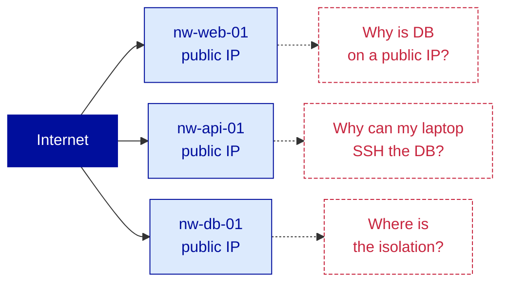
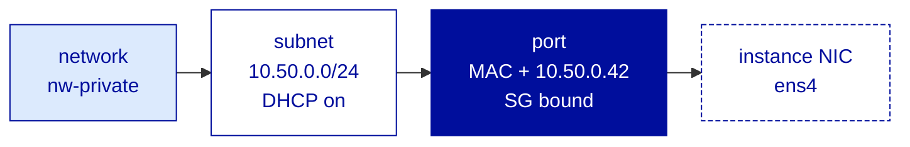
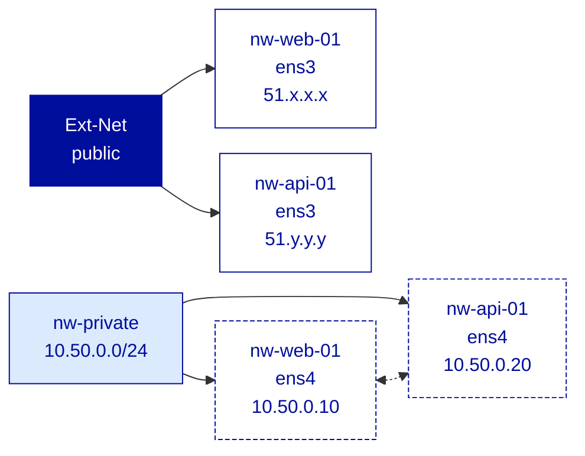
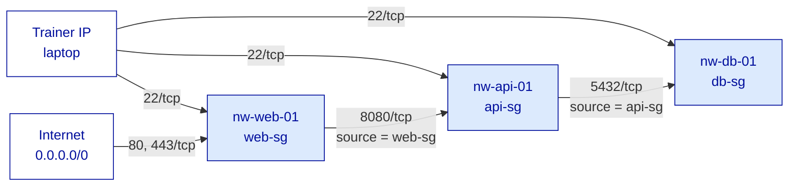
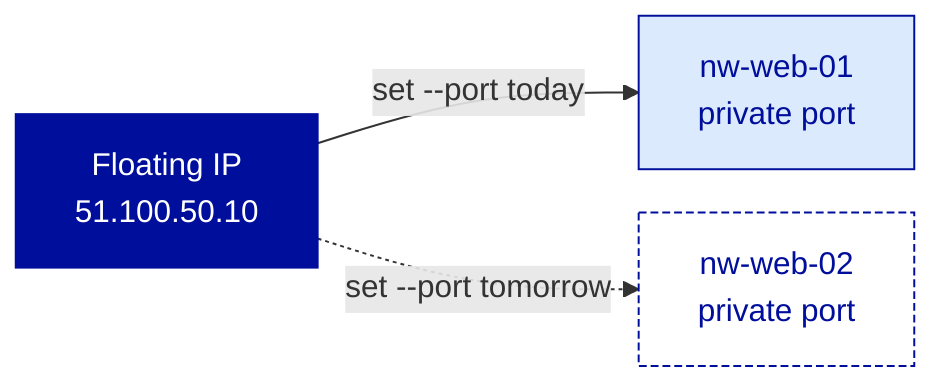

---
# ============================================================
# Module 2.3 -- Network (Part 1) -- Public, Private & Security Groups
# Slidev source file
# ============================================================
theme: ../../theme-ovhcloud
title: Network (Part 1) -- Public, Private & Security Groups
info: |
  ## OVHcloud -- Public Cloud -- Core Associate
  Module 2.3 -- Network (Part 1) -- Public, Private & Security Groups.
  Duration: 1h30.
class: text-left
highlighter: shiki
lineNumbers: false
drawings:
  persist: false
transition: slide-left
mdc: true
exportFilename: 'modules/module-2-3/student_export'

# Hide the floating navbar / controls overlay in dev mode
controls: false
download: false
selectable: true

# Module-level metadata (consumed by trainer-notes export and CI)
moduleId: "2.3"
moduleTitle: "Network (Part 1) -- Public, Private & Security Groups"
duration: "1h30"
program: "OVHcloud -- Public Cloud -- Core Associate"
los:
  - LO-NET-K01
  - LO-NET-K02
  - LO-NET-S01
  - LO-NET-S02
  - LO-NET-S03
  - LO-NET-S04
# COVER SLIDE
layout: cover
---

# Network (Part 1)
## Public, Private & Security Groups

<!--
Trainer notes Cover slide:
- Welcome back. Day 2, afternoon. Storage is closed, the data is durable.
- Frame the shift : the three Northwind tiers are durable but still wide open on the network. Each instance has its own public IP, no isolation, the DB is one credential away from the public Internet.
- Announce : at the end of 1h30, web is in front, API and DB are on a private network, Security Groups enforce least-privilege ingress between tiers, and a Floating IP serves the web frontend.
- Set expectations : slide 7 (Security Group default-deny + stateful) is the pivot of the module. Pre-flag it.
- Anticipate two recurring questions : vRack vs private network (answered tomorrow morning, Module 2.4), and why API + DB still have a public IP at the end (Gateway, also 2.4).
-->

---
layout: default
moduleId: "2.3"
slideId: "Agenda"
---

# Agenda

<div class="grid grid-cols-3 gap-4 mt-4 text-sm">
<div class="border border-gray-200 rounded-lg p-3">
<strong style="color: var(--ods-color-primary-700)">Block 1 — 5 min</strong><br/>
Sentier battu / Hors piste
</div>
<div class="border border-gray-200 rounded-lg p-3">
<strong style="color: var(--ods-color-primary-700)">Block 2 — 30 min</strong><br/>
Theory &amp; Concepts<br/>
<span class="text-xs text-gray-500">Ext-Net vs private · Neutron objects · Security Groups · Floating IP</span>
</div>
<div class="border border-gray-200 rounded-lg p-3">
<strong style="color: var(--ods-color-primary-700)">Block 3 — 15 min</strong><br/>
Trainer Demonstration<br/>
<span class="text-xs text-gray-500">Private network · dual-NIC · SG composition · Floating IP</span>
</div>
<div class="border border-gray-200 rounded-lg p-3">
<strong style="color: var(--ods-color-primary-700)">Block 4 — 30 min</strong><br/>
Learner Lab<br/>
<span class="text-xs text-gray-500">Split Northwind into a public and a private tier</span>
</div>
<div class="border border-gray-200 rounded-lg p-3">
<strong style="color: var(--ods-color-primary-700)">Block 5 — 5 min</strong><br/>
Micro-check QCM<br/>
<span class="text-xs text-gray-500">7 questions</span>
</div>
<div class="border border-gray-200 rounded-lg p-3">
<strong style="color: var(--ods-color-primary-700)">Block 6 — 5 min</strong><br/>
Wrap-up &amp; Transition<br/>
<span class="text-xs text-gray-500">Recap · transition to Module 2.4</span>
</div>
</div>

<!--
Trainer notes Agenda:
- Module dense en CLI : openstack reseau, openstack security group, openstack floating ip. Annoncer que la Manager UI sert peu ici.
- Verifier que les sorties de Module 2.2 (les 3 instances nw-web-01, nw-api-01, nw-db-01) sont up et SSH-reachable. Si non, Sentier battu prolonge.
- Annoncer l'IP source SSH du formateur a noter par toute la salle : elle servira pour les regles 22/tcp tout au long du lab. Calibrer 1 minute pour la diffusion.
- Strict timing 90 min. Slide la plus importante : slide 7 (SG default-deny stateful). Pre-annoncer.
-->

---
layout: section
block: "Block 1"
duration: "5 min"
---

# Before we start
### Prerequisites & remediation

---
layout: two-cols
moduleId: "2.3"
slideId: "S00a -- You are ready if..."
---

# Before we start (1/2)

::left::

<div class="text-sm">

<strong style="color: var(--ovh-masterbrand-blue); font-size: 1.1rem;">Tools</strong>

<div class="mt-3">
&middot; <code>&lt;initials&gt;-nw-web-01</code>, <code>-nw-api-01</code>, <code>-nw-db-01</code> from Modules 1.4 / 2.2 UP and SSH-reachable on their public IPs<br/>
&middot; <code>openrc.sh</code> sourced, scoped to GRA<br/>
&middot; A running <code>nginx</code> on <code>nw-web-01:80</code> (from Module 1.3)<br/>
&middot; A running PostgreSQL on <code>nw-db-01:5432</code> (from Module 2.2)<br/>
&middot; A placeholder API process on <code>nw-api-01:8080</code> (one-liner provided in the lab)<br/>
&middot; Your laptop public IP at hand : <code>curl ifconfig.me</code>
</div>

</div>

::right::

<div class="text-sm">

<strong style="color: var(--ovh-masterbrand-blue); font-size: 1.1rem;">Knowledge</strong>

<div class="mt-3">
&middot; The default network situation of a Public Cloud Instance (Mod 1.3) : one public IP, one Security Group<br/>
&middot; Linux network basics : <code>ip link</code>, <code>ip addr</code>, <code>dhclient</code>, <code>ping</code>, <code>curl</code><br/>
&middot; The notion of a <strong>stateful</strong> firewall : connection tracking, return packets auto-permitted<br/>
&middot; Basic TCP port awareness : 22, 80, 443, 8080, 5432<br/>
&middot; Persona-Corporate analogies from Mod 1.1 : VLAN, DMZ, firewall ruleset, VIP
</div>

</div>

<!--
Trainer notes S00a You are ready if:
- Demander : "Qui a encore les 3 instances + nginx + postgres up de la fin de 2.2 ?" Si moins de la moitie, demander un redeploy minimal du seul nw-web-01 et nw-api-01 (la DB n'est pas indispensable a la connectivite reseau du lab).
- Verifier le sourcing openrc.sh : c'est l'invariant Day 2.
- Diffuser l'IP source SSH du formateur a noter : tous les SG ouvriront 22/tcp depuis cette IP uniquement. Cette IP doit etre routable et stable pendant les 90 min.
- Annoncer le placeholder API : "python3 -m http.server 8080 &" dans un tmux, c'est suffisant pour le lab. Pas besoin de vraie API.
-->

---
layout: two-cols
moduleId: "2.3"
slideId: "S00b -- If not, here's where to look"
---

# Before we start (2/2)

::left::

<div class="text-sm">

<strong style="color: var(--ovh-masterbrand-blue); font-size: 1.1rem;">Stack or services missing</strong>

<div class="mt-3">
&middot; <strong>No public IP visible on an instance?</strong> &rarr; <code>openstack server add network &lt;name&gt; Ext-Net</code>, reboot. Unusual but recoverable<br/>
&middot; <strong>No nginx on the web?</strong> &rarr; <code>sudo apt install -y nginx</code>, default welcome page is enough<br/>
&middot; <strong>No placeholder API on the API?</strong> &rarr; <code>python3 -m http.server 8080 &</code> in a <code>tmux</code> session, valid for the duration of the lab
</div>

</div>

::right::

<div class="text-sm">

<strong style="color: var(--ovh-masterbrand-blue); font-size: 1.1rem;">Concept confusions to preempt</strong>

<div class="mt-3">
&middot; <strong>Stateful vs stateless firewall?</strong> &rarr; preempted here : stateful = write the ingress rule, the return packet is remembered. Security Groups are stateful<br/>
&middot; <strong>vRack vs private network?</strong> &rarr; out of scope today, Module 2.4. We stay in one project, one region, Neutron objects only<br/>
&middot; <strong>Floating IP vs Additional IP?</strong> &rarr; covered slide 9. Today we use Floating IP. Additional IP is a separate OVHcloud product, not Public-Cloud-internal
</div>

</div>

<!--
Trainer notes S00b If not where to look:
- Anticiper la confusion vRack : si elle reapparait pendant la Theory, c'est qu'on n'a pas suffisamment pose le perimetre ici.
- Anticiper la confusion stateful vs stateless : si elle reapparait en slide 7, on aura perdu 5 min sur "ou est la regle pour le retour ?". La preempter ici.
- Si plus de 20% de la salle a besoin du nginx ou du python -m http.server, faire l'install en batch verbal de 30 sec.
- Cloturer en confirmant que toute la salle a : 3 instances up, openrc source, l'IP du formateur notee, services HTTP/API qui ecoutent.
-->

---
layout: section
block: "Block 2"
duration: "30 min"
---

# Theory & Concepts
### Ext-Net, private, Neutron, Security Groups, Floating IP

---
layout: default
moduleId: "2.3"
slideId: "S01 -- Starting point"
los: ["LO-NET-K01"]
---

# Where we left off &mdash; the network is wide open

<div class="flex justify-center mt-2">



</div>

<div class="grid grid-cols-2 gap-4 mt-4 text-sm">

<div class="ovh-callout">
<strong>Today's starting point</strong><br/>
3 instances, 3 public IPs, 0 isolation. The default network configuration of a Public Cloud Instance.
</div>

<div class="ovh-callout" style="border-left-color: var(--ovh-masterbrand-blue); border-left-width: 4px;">
<strong style="color: var(--ovh-masterbrand-blue);">Module 2.3 makes the network sane</strong><br/>
Split tiers, write tiered Security Groups, attach a Floating IP. Loose ends (Gateway, vRack, Load Balancer) close in 2.4.
</div>

</div>

<!--
Trainer notes S01 Starting point:
- Souligner que la situation de depart est volontairement laxiste, c'est le defaut Public Cloud.
- Demander : "qui exposerait sa base PostgreSQL sur une IP publique en prod ?" Laisser le silence. La salle se positionne.
- Rappeler le persona Corporate ex-AWS : "VPC par defaut sur AWS aussi, mais l'inertie pousse a default-VPC partout, donc tout le monde a deja vu cette situation".
- Anticiper la question vRack : "on en parle demain matin, aujourd'hui on reste dans un projet, une region, Neutron". Ne pas se laisser entrainer.
-->

---
layout: default
moduleId: "2.3"
slideId: "S02 -- Ext-Net vs private"
los: ["LO-NET-K01"]
---

# The two network worlds &mdash; Ext-Net vs private

<div class="grid grid-cols-2 gap-6 mt-6 text-sm">

<div class="ovh-callout">
<strong>Ext-Net &middot; public</strong>
<div class="mt-2">
&middot; OpenStack <strong>provider network</strong><br/>
&middot; Shared across all projects in a region<br/>
&middot; Routable <strong>public</strong> IPv4 (one per instance by default)<br/>
&middot; Billed via instance bandwidth<br/>
&middot; <em>Legacy analogy : DMZ uplink</em>
</div>
</div>

<div class="ovh-callout" style="border-left-color: var(--ovh-masterbrand-blue); border-left-width: 4px;">
<strong style="color: var(--ovh-masterbrand-blue);">Private network &middot; tenant</strong>
<div class="mt-2">
&middot; OpenStack <strong>tenant network</strong>, created by you<br/>
&middot; Scoped to <strong>your project</strong>, invisible outside<br/>
&middot; <strong>RFC1918</strong> ranges : 10/8, 172.16/12, 192.168/16<br/>
&middot; No per-IP cost<br/>
&middot; <em>Legacy analogy : internal VLAN</em>
</div>
</div>

</div>

<OvhWarning title="An instance attaches to one, the other, or both" class="mt-4">Today's topology is <strong>dual-NIC</strong>: Ext-Net for ingress + outbound updates, private network for inter-tier traffic. Private-only becomes practical only after Module 2.4 introduces the Gateway.</OvhWarning>

<!--
Trainer notes S02 Ext-Net vs private:
- Souligner : deux objets totalement distincts. Ext-Net est partage entre projets de la region, le private network est prive au projet.
- Anticiper la question AWS : "Ext-Net = default VPC ?" Non, Ext-Net est un provider network partage cote OpenStack, pas un VPC isole.
- Si quelqu'un demande "et un projet = un VPC ?" : oui, c'est l'analogie utile cote isolation logique, mais le mecanisme OpenStack n'est pas un VPC AWS.
- Rappeler que le dual-NIC est la topologie qu'on construit aujourd'hui. C'est l'etape avant la Gateway.
-->

---
layout: default
moduleId: "2.3"
slideId: "S03 -- Neutron"
los: ["LO-NET-K02"]
---

# Neutron &mdash; the OpenStack networking service

<div class="grid grid-cols-3 gap-3 mt-6 text-sm">

<div class="ovh-callout">
<strong>network</strong><br/>
<div class="mt-2">
The L2 segment, an empty bag.<br/>
<code>openstack network</code>
</div>
</div>

<div class="ovh-callout">
<strong>subnet</strong><br/>
<div class="mt-2">
L3 layer : CIDR + DHCP.<br/>
<code>openstack subnet</code>
</div>
</div>

<div class="ovh-callout">
<strong>port</strong><br/>
<div class="mt-2">
Virtual NIC : MAC, IP, SG binding.<br/>
<code>openstack port</code>
</div>
</div>

<div class="ovh-callout">
<strong>router</strong><br/>
<div class="mt-2">
L3 routing (Gateway use case, Mod 2.4).<br/>
<code>openstack router</code>
</div>
</div>

<div class="ovh-callout" style="border-left-color: var(--ovh-masterbrand-blue); border-left-width: 4px;">
<strong style="color: var(--ovh-masterbrand-blue);">security group</strong><br/>
<div class="mt-2">
Stateful firewall ruleset.<br/>
<code>openstack security group</code>
</div>
</div>

<div class="ovh-callout" style="border-left-color: var(--ovh-masterbrand-blue); border-left-width: 4px;">
<strong style="color: var(--ovh-masterbrand-blue);">floating IP</strong><br/>
<div class="mt-2">
NAT object, movable public IPv4.<br/>
<code>openstack floating ip</code>
</div>
</div>

</div>

<div class="mt-3 text-center text-sm" style="color: var(--ovh-gray-700);">
OVHcloud Public Cloud is OpenStack-native &middot; AWS analogies : VPC = network + subnet + router &middot; SG = SG (same semantics) &middot; Elastic IP = Floating IP
</div>

<!--
Trainer notes S03 Neutron:
- Souligner que les 6 objets sont le vocabulaire commun pour les deux modules Network (2.3 et 2.4).
- Demander : "qui a deja touche a Neutron en CLI directement ?" Calibre le niveau d'aisance.
- Anticiper : "et le router, on l'utilise quand ?" Reponse : pour le Gateway en 2.4. Aujourd'hui les routes sortantes des dual-NIC passent par leur NIC publique.
- Si question sur Manila / Cinder : ne pas digresser, rester sur Neutron.
- La Manager UI expose un sous-ensemble curate, le CLI expose tout. C'est pour cela qu'on fait tout en CLI dans ce module.
-->

---
layout: default
moduleId: "2.3"
slideId: "S04 -- Port object"
los: ["LO-NET-K02"]
---

# From network to instance &mdash; the port object

<div class="flex justify-center mt-2">



</div>

<div class="grid grid-cols-2 gap-4 mt-4 text-sm">

<div class="ovh-callout">
<strong>Port = virtual NIC, Neutron-managed</strong><br/>
&middot; Carries the MAC, the IP, the Security Group binding<br/>
&middot; Created when the instance attaches to a network<br/>
&middot; <strong>One NIC = one port = one IP per subnet</strong>
</div>

<div class="ovh-callout" style="border-left-color: var(--ovh-masterbrand-blue); border-left-width: 4px;">
<strong style="color: var(--ovh-masterbrand-blue);">Port outlives the instance state</strong><br/>
&middot; Survives instance stop / start<br/>
&middot; Floating IP attaches to a <strong>port</strong>, not to a NIC<br/>
&middot; The DHCP server is part of the subnet : IP allocated on port creation, communicated at instance boot
</div>

</div>

<!--
Trainer notes S04 Port object:
- Souligner que le port est l'objet qui survit aux redemarrages d'instance. C'est la clef de la portabilite de la Floating IP.
- Anticiper "qui assigne l'IP ?" : le port la recoit de Neutron a sa creation, le DHCP la communique a l'instance au boot.
- Rappeler l'analogie legacy : le port Neutron, c'est l'entree vNIC dans vCenter, attachee a un VLAN, avec une MAC reservee meme quand la VM est eteinte.
- Si question "et si je veux une IP statique cote Linux ?" : possible mais inutile, l'IP est deja fixe cote Neutron via le port. Configurer en static cote Linux peut creer des conflits.
-->

---
layout: default
moduleId: "2.3"
slideId: "S05 -- Create a private network"
los: ["LO-NET-S01"]
---

# Creating a private network &mdash; three commands

<div class="text-sm mt-4">

<strong style="color: var(--ovh-masterbrand-blue);">Step 1</strong> &middot; the L2 segment (empty bag)

```bash
openstack network create nw-private
```

<strong style="color: var(--ovh-masterbrand-blue);">Step 2</strong> &middot; the L3 layer + DHCP server &mdash; <strong>enable DHCP at creation</strong>

```bash
openstack subnet create --network nw-private \
  --subnet-range 10.50.0.0/24 --dhcp nw-subnet
```

<strong style="color: var(--ovh-masterbrand-blue);">Step 3</strong> &middot; attach an instance (Neutron creates the port automatically)

```bash
openstack server add network <instance> nw-private
```

</div>

<OvhWarning title="DHCP must be enabled at subnet creation" class="mt-4">Adding it later is not a clean operation: the supported path is to delete and recreate the subnet, which requires detaching every instance first. Get it right at creation.</OvhWarning>

<!--
Trainer notes S05 Create a private network:
- Souligner que --dhcp est facile a oublier et difficile a corriger apres coup.
- Anticiper "et si j'oublie le DHCP ?" : il faut supprimer et recreer le subnet. openstack subnet set --dhcp existe en theorie, mais le chemin propre est delete + recreate.
- Si question "pourquoi pas la Manager UI ?" : la Manager fait les 3 etapes en une, mais en lab on garde le CLI pour la tracabilite pedagogique.
- Verifier le nom d'interface a l'interieur de l'instance : ens4 / eth1 / enp0s4 selon l'image. Toujours valider avec ip link show avant dhclient.
-->

---
layout: default
moduleId: "2.3"
slideId: "S06 -- Dual-NIC"
los: ["LO-NET-S02"]
---

# Dual-NIC &mdash; one instance, two worlds

<div class="flex justify-center mt-2">



</div>

<div class="grid grid-cols-2 gap-4 mt-4 text-sm">

<div class="ovh-callout">
<strong>Two NICs, two ports, two routes</strong><br/>
&middot; <code>ens3</code> on Ext-Net : ingress from Internet + outbound updates<br/>
&middot; <code>ens4</code> on private : inter-tier L2<br/>
&middot; The two are independent : separate routes, optionally separate SGs per port
</div>

<div class="ovh-callout" style="border-left-color: var(--ovh-masterbrand-blue); border-left-width: 4px;">
<strong style="color: var(--ovh-masterbrand-blue);">Pragmatic, not final</strong><br/>
&middot; All three Northwind tiers keep their public NIC <strong>today</strong><br/>
&middot; The Gateway (Module 2.4) lets private-only instances reach the Internet outbound without a public NIC<br/>
&middot; Then API and DB drop their public NIC cleanly
</div>

</div>

<!--
Trainer notes S06 Dual-NIC:
- Souligner que dual-NIC n'est pas la cible finale : c'est l'etape avant le Gateway.
- Anticiper "pourquoi pas tout en prive tout de suite ?" : sans Gateway, l'instance privee ne peut pas faire apt update. On garde l'IP publique pour ce module et on s'en debarrasse en 2.4.
- Rappeler le persona Corporate : en legacy, un serveur applicatif a souvent deux pattes, frontend VLAN et backend VLAN. Concept identique.
- Si quelqu'un parle d'IP forwarding entre les deux NICs cote OS : hors scope, on ne fait pas du routage dans l'instance ici.
-->

---
layout: default
moduleId: "2.3"
slideId: "S07 -- Security Group default-deny"
los: ["LO-NET-K02", "LO-NET-S03"]
---

# Security Group &mdash; default-deny ingress, stateful

<div class="grid grid-cols-2 gap-4 mt-4 text-sm">

<div class="ovh-callout">
<strong>Default behavior</strong><br/>
<div class="mt-2">
&middot; Ingress : <strong style="color: #C7253E;">DENY ALL</strong><br/>
&middot; Egress : <strong style="color: var(--ovh-masterbrand-blue);">ALLOW ALL</strong><br/>
&middot; You write only what you want to <strong>open</strong>
</div>
</div>

<div class="ovh-callout" style="border-left-color: var(--ovh-masterbrand-blue); border-left-width: 4px;">
<strong style="color: var(--ovh-masterbrand-blue);">Stateful</strong><br/>
<div class="mt-2">
&middot; The return packet of an allowed ingress connection is <strong>automatic</strong><br/>
&middot; No need to write an egress rule for SSH replies<br/>
&middot; Connection tracking handles it
</div>
</div>

</div>

<OvhNotice title="Applied per port" class="mt-4">(Not strictly per instance.) Multiple SGs on the same port &rarr; rules are <strong>additive</strong> (OR logic, never subtractive). A port with <strong>zero</strong> SG attached usually blocks everything — verify before removing the last SG.</OvhNotice>

<OvhWarning title="If you can't reach the service, check the Security Group first" class="mt-4">AWS SG has identical semantics. Azure NSG is similar but priority-based. AWS Network ACL is <strong>stateless</strong> &mdash; do not confuse it with SG.</OvhWarning>

<!--
Trainer notes S07 Security Group default-deny:
- Slide la plus importante du module. Ralentir, articuler.
- Souligner les trois mots : "stateful" + "default deny" + "additive".
- Anticiper "ou est la regle pour le retour ?" : c'est le sens de "stateful", le retour est suivi par connection-tracking.
- Demander : "si j'applique deux Security Groups, l'un autorise 22 et l'autre non, qu'est-ce qui se passe ?" Reponse : 22 est autorise, les regles sont additives.
- Si question Network ACL AWS : ACL stateless, SG stateful, ne pas melanger. Souvent une source de confusion chez les ex-AWS.
- Faire repeter "un SG est stateful par defaut" si la salle hesite.
-->

---
layout: default
moduleId: "2.3"
slideId: "S08 -- SG composition tier model"
los: ["LO-NET-S03"]
---

# Security Groups composition &mdash; the tier model

<div class="flex justify-center mt-2">



</div>

<OvhNotice title="Source = another SG, not a CIDR" class="mt-4"><code>--remote-group api-sg</code> &mdash; the API SG accepts <code>5432/tcp</code> only from members of <code>api-sg</code>. Robust: IPs of instances can change, the SG membership is stable. AWS uses the same idiom.</OvhNotice>

<!--
Trainer notes S08 SG composition tier model:
- Souligner que la source --remote-group est l'astuce qui rend la composition propre.
- Anticiper "pourquoi pas une CIDR fixe ?" : parce que les IP privees changent a la creation de l'instance, la SG-as-source est stable.
- Demander : "et si nw-api-01 a deux NICs ?" Reponse : le SG s'applique au port, pas a l'instance. On peut donc differencier le SG du port public et celui du port prive si on en a besoin. Mais ce n'est pas requis aujourd'hui.
- Rappeler LO-NET-A02 (anticipe en 2.4) : le reflexe least-privilege se forme ici. Verbaliser : "un SG ouvert sur 0.0.0.0/0 pour un port applicatif est presque toujours une faute".
-->

---
layout: default
moduleId: "2.3"
slideId: "S09 -- Floating IP"
los: ["LO-NET-S04"]
---

# Floating IP &mdash; the movable public address

<div class="flex justify-center mt-2">



</div>

<div class="text-sm mt-1">

<table style="width:100%; border-collapse: collapse;">
<thead>
<tr style="background: var(--ovh-masterbrand-blue); color: white;">
<th style="padding: 6px 8px; text-align: left;">Criterion</th>
<th style="padding: 6px 8px; text-align: left;">Floating IP</th>
<th style="padding: 6px 8px; text-align: left;">Additional IP</th>
</tr>
</thead>
<tbody>
<tr style="background: #F2F2F2;">
<td style="padding: 6px 8px;"><strong>What it is</strong></td>
<td style="padding: 6px 8px;">Neutron object inside the Public Cloud project</td>
<td style="padding: 6px 8px;">Separate OVHcloud product, ordered independently</td>
</tr>
<tr>
<td style="padding: 6px 8px;"><strong>Lifecycle</strong></td>
<td style="padding: 6px 8px;">Lives in the project, survives instance deletion, deleted with the project</td>
<td style="padding: 6px 8px;">Ordered + billed separately, attached to a specific OVHcloud service</td>
</tr>
<tr style="background: #F2F2F2;">
<td style="padding: 6px 8px;"><strong>Best for</strong></td>
<td style="padding: 6px 8px;">Failover, VIP, web frontend on Public Cloud</td>
<td style="padding: 6px 8px;">Dedicated public IP on Bare Metal or VPS</td>
</tr>
</tbody>
</table>

</div>

<OvhWarning title="For Public Cloud workloads, use Floating IP" class="mt-4">Additional IP enters the conversation only for cross-product setups (Bare Metal, VPS). Same word &ldquo;IP&rdquo;, two products.</OvhWarning>

<!--
Trainer notes S09 Floating IP:
- Souligner la difference Floating IP / Additional IP : c'est le piege numero 2 du module.
- Demander : "qui a deja fait un failover en bougeant un VIP entre deux serveurs ?" L'analogie legacy est immediate.
- Anticiper "et si je supprime l'instance, la Floating IP survit ?" Reponse : oui, c'est un objet projet, pas un objet instance.
- Si question sur le cout : la Floating IP est facturee a l'heure tant qu'elle existe dans le projet, meme non attachee. Verifier le tarif courant sur docs.ovhcloud.com.
- Eviter de digresser sur Additional IP : c'est un produit qu'on ne couvre pas ici, juste preciser que c'est different et passer.
-->

---
layout: default
moduleId: "2.3"
slideId: "S10 -- Hyperscaler cross-reference"
los: ["LO-NET-K01", "LO-NET-K02"]
---

# Hyperscaler cross-reference

<div class="text-sm mt-4">

<table style="width:100%; border-collapse: collapse;">
<thead>
<tr style="background: var(--ovh-masterbrand-blue); color: white;">
<th style="padding: 6px 8px; text-align: left;">OVHcloud Public Cloud</th>
<th style="padding: 6px 8px; text-align: left;">AWS</th>
<th style="padding: 6px 8px; text-align: left;">Azure</th>
</tr>
</thead>
<tbody>
<tr style="background: #F2F2F2;">
<td style="padding: 6px 8px;"><strong>Ext-Net</strong> (provider, public IPs)</td>
<td style="padding: 6px 8px;">Default VPC public subnet</td>
<td style="padding: 6px 8px;">Public IP resource on default VNet</td>
</tr>
<tr>
<td style="padding: 6px 8px;"><strong>Private network</strong> (tenant)</td>
<td style="padding: 6px 8px;">VPC private subnet</td>
<td style="padding: 6px 8px;">Virtual Network (VNet)</td>
</tr>
<tr style="background: #F2F2F2;">
<td style="padding: 6px 8px;"><strong>Security Group</strong> (stateful)</td>
<td style="padding: 6px 8px;">Security Group (same semantics)</td>
<td style="padding: 6px 8px;">Network Security Group (similar, priority-based)</td>
</tr>
<tr>
<td style="padding: 6px 8px;"><strong>Floating IP</strong></td>
<td style="padding: 6px 8px;">Elastic IP</td>
<td style="padding: 6px 8px;">Public IP resource</td>
</tr>
</tbody>
</table>

</div>

<div class="grid grid-cols-2 gap-4 mt-4 text-sm">

<div class="ovh-callout">
<strong>Same primitives</strong><br/>
The four objects covered today exist with near-identical semantics on the three providers.
</div>

<div class="ovh-callout" style="border-left-color: var(--ovh-masterbrand-blue); border-left-width: 4px;">
<strong style="color: var(--ovh-masterbrand-blue);">Cartography, not ranking</strong><br/>
The mapping anchors ex-AWS / ex-Azure profiles. Differences exist (Azure NSG priorities, AWS NACL stateless) and matter at Pro+ scope.
</div>

</div>

<!--
Trainer notes S10 Hyperscaler cross-reference:
- Souligner que ce slide ferme le bloc Theory : ancrage pour les profils Corporate.
- Anticiper "Azure NSG c'est plus puissant ?" : priorites explicites oui, mais le besoin est rare au scope Associate.
- Si question sur AWS NACL : hors scope, on ne fait pas de stateless ACL en Public Cloud Core.
- Rappeler que ce n'est pas un classement, c'est une cartographie. Eviter de prendre position pour ou contre AWS.
-->

---
layout: section
block: "Block 3"
duration: "15 min"
---

# Demo
### Private network + dual-NIC + SG composition + Floating IP

---
layout: default
moduleId: "2.3"
slideId: "Demo -- Network topology"
los: ["LO-NET-S01", "LO-NET-S02", "LO-NET-S03", "LO-NET-S04"]
---

# Demo &mdash; from one tier to a tiered topology, end-to-end

<div class="grid grid-cols-2 gap-6 mt-6">

<div class="ovh-callout">
<strong style="color: var(--ovh-masterbrand-blue);">What you'll see</strong>
<div class="mt-2 text-sm">
&middot; Create a private network + DHCP subnet<br/>
&middot; Attach a 2nd NIC to web + API instances<br/>
&middot; Verify private-to-private connectivity<br/>
&middot; Compose tiered Security Groups<br/>
&middot; Demonstrate default-deny on ICMP<br/>
&middot; Attach a Floating IP to the web tier
</div>
</div>

<div class="ovh-callout" style="border-left-color: var(--ovh-masterbrand-blue); border-left-width: 4px;">
<strong style="color: var(--ovh-masterbrand-blue);">Why this matters</strong>
<div class="mt-2 text-sm">
By the end of the demo, you've seen the four Neutron objects in action on a real two-tier topology. Channel : <strong>openstack CLI</strong> exclusively. Manager UI is not used in this module.
</div>
</div>

</div>

<div class="mt-6 text-center" style="color: var(--ovh-masterbrand-blue); font-weight: 600;">
  Instances : <code>demo-web-01</code> + <code>demo-api-01</code> &middot; Region : GRA &middot; Channel : openstack CLI
</div>

<div class="mt-2 text-center text-sm" style="color: var(--ovh-gray-700);">
  13 steps &middot; ~12 min walkthrough &middot; 3 min Q&amp;A
</div>

<!--
Trainer notes Demo Network topology:

PRE-FLIGHT (do BEFORE the block):
- openrc.sh pre-sourced, openstack token issue must succeed.
- demo-web-01 and demo-api-01 still running from Mod 1.4 / 2.2 demos.
- nginx running on demo-web-01 port 80.
- A python3 -m http.server 8080 process running on demo-api-01 (in tmux, persisted).
- Trainer's laptop public IP at hand (curl ifconfig.me, write it on a sticky for the room).
- Terminal at 16pt+, dark background.

DEMO SCRIPT (13 steps, ~12 min):
1. openstack network create demo-private. ACTIVE. "L2 segment, vide, pas utilisable encore."
2. openstack subnet create --network demo-private --subnet-range 192.168.10.0/24 --dhcp demo-subnet. "CIDR + DHCP, maintenant utilisable. --dhcp est critique."
3. openstack server add network demo-web-01 demo-private. "Neutron cree le port et le bind, mais la VM doit encore bring up le NIC."
4. SSH demo-web-01, sudo dhclient ens4 && ip addr show ens4. IP 192.168.10.x apparait. "DHCP active a l'etape 2 distribue. Sans --dhcp, ca tournerait sans fin."
5. Idem demo-api-01 : add network + dhclient. Les deux ont maintenant un foot dans le LAN prive.
6. Depuis demo-web-01, ping <api-private-IP>. Replies. "Default SG laisse passer entre membres du meme SG."
7. openstack security group create demo-web-sg --description 'web tier'. Puis rule create --proto tcp --dst-port 80 --remote-ip 0.0.0.0/0, et --dst-port 22 --remote-ip <trainer-ip>/32. "Default deny, on ouvre ce qu'on autorise."
8. openstack server add security group demo-web-01 demo-web-sg, puis remove security group demo-web-01 default. "Add d'abord, remove ensuite. Inverse = risque blocage SSH."
9. Depuis le laptop, curl http://<demo-web-01-public-ip>. nginx OK. "Port 80 reachable."
10. Depuis le laptop, ping <demo-web-01-public-ip>. Silent timeout. "ICMP drop : default-deny en action, on n'a pas ouvert ICMP."
11. openstack floating ip create Ext-Net --tag demo-northwind-web. IP retournee. "Une nouvelle IP publique, dans le projet, pas encore attachee."
12. openstack server add floating ip demo-web-01 <fip>. Association faite. "La web instance repond maintenant sur deux IP publiques."
13. Depuis le laptop, curl http://<fip>. nginx OK. "Le service est joignable via la Floating IP. Pour le bouger sur une autre instance : openstack server remove + add floating ip, 2 secondes."

FAILURE MODES:
- Step 4 dhclient sans lease : oublie --dhcp a l'etape 2, ou subnet sans allocation pool. openstack subnet show, verifier enable_dhcp: True. Si faux, delete + recreate (et reattacher).
- Step 4 NIC pas en ens4 : verifier ip link, ajuster (enp0s4 / eth1).
- Step 9 curl timeout apres SG swap : on a retire default avant d'ajouter web-sg, instance s'est retrouvee a zero SG = bloque. Ajouter d'abord, retirer ensuite.
- Step 12 floating ip association "no port found" : instance multi-NIC, passer --fixed-ip-address <private-ip> pour disambiguer.

Q&A (3 min) : focus sur la difference port vs NIC et le sens "stateful" des SG. Parking pour 2.4 : Gateway et vRack.
-->

---
layout: section
block: "Block 4"
duration: "30 min"
---

# Split Northwind into a public and a private tier
### Your turn. Solo. 30 minutes.

---
layout: default
moduleId: "2.3"
slideId: "Lab -- Brief"
los: ["LO-NET-S01", "LO-NET-S02", "LO-NET-S03", "LO-NET-S04"]
---

# Lab &mdash; Split Northwind into a public and a private tier

<OvhNotice title="Mission" class="mt-4">You are Northwind's Cloud Ops engineer. The CTO walks in: <em>&ldquo;Why is the database on a public IP? I want web in front, API and DB behind, and a Floating IP I can move when we replace a frontend.&rdquo;</em> Today you: (1) provision a private network and a DHCP subnet; (2) dual-attach API + DB, verify L2 reachability; (3) write three tiered Security Groups (web / api / db) with least-privilege ingress; (4) attach a Floating IP to the web frontend.</OvhNotice>

<div class="grid grid-cols-2 gap-4 mt-6">

<div class="ovh-callout" style="border-left-color: var(--ovh-masterbrand-blue); border-left-width: 4px;">
<strong style="color: var(--ovh-masterbrand-blue);">Channel</strong>
<div class="mt-2 text-sm">
&middot; <code>openstack</code> CLI for every network and Security Group operation<br/>
&middot; SSH inside instances for <code>dhclient</code> and validation<br/>
&middot; <code>curl</code> and <code>ping</code> from the learner's laptop for end-to-end checks
</div>
</div>

<div class="ovh-callout" style="border-left-color: var(--ovh-masterbrand-blue); border-left-width: 4px;">
<strong style="color: var(--ovh-masterbrand-blue);">Success criteria</strong>
<div class="mt-2 text-sm">
Private ping API &harr; DB succeeds &middot; <code>curl</code> web &rarr; API:8080 OK &middot; <code>curl</code> web &rarr; DB:5432 times out &middot; Floating IP serves the web &middot; ICMP from laptop to API and DB is silently dropped
</div>
</div>

</div>

<div class="mt-2 text-center" style="color: var(--ovh-masterbrand-blue); font-weight: 600;">
  Network : <code>&lt;initials&gt;-nw-private</code> &middot; CIDR : <code>10.50.0.0/24</code> &middot; Time : 30 min
</div>

<!--
Trainer notes Lab Brief:
- Souligner les criteres de succes : auto-verifiables. L'apprenant sait s'il a reussi sans demander.
- Lab dense pour 30 min : surveiller le timing. Si plus de la moitie de la salle est en retard a 20 min, couper l'etape 8 (verifications ping depuis laptop) et la declarer homework.
- Circuler discretement. Cibler les learners en avance pour soutenir leurs voisins.
- Rappeler oralement l'IP source SSH du formateur, et la persistence : on l'utilise dans les 3 SG.

VALIDATION CRITERIA (silent check by trainer):
- openstack subnet show <initials>-nw-subnet : enable_dhcp: True
- depuis nw-api-01 : ping <db-private-ip> repond
- depuis nw-web-01 : curl http://<api-private-ip>:8080 retourne 200
- depuis nw-web-01 : curl --max-time 5 http://<db-private-ip>:5432 timeout
- depuis laptop : curl http://<floating-ip> retourne nginx
- depuis laptop : ping <api-public-ip> timeout silencieux
-->

---
layout: default
moduleId: "2.3"
slideId: "Lab -- Steps 1/3"
---

# Lab &mdash; Step-by-step (1/3)
### Private network + dual-NIC &middot; openstack CLI

<div class="text-xs mt-1">

<strong>1.</strong> <code>openstack network create &lt;initials&gt;-nw-private</code><br/>
<strong>2.</strong> <code>openstack subnet create --network &lt;initials&gt;-nw-private --subnet-range 10.50.0.0/24 --dhcp &lt;initials&gt;-nw-subnet</code><br/>
&nbsp;&nbsp;Confirm : <code>openstack subnet show &lt;initials&gt;-nw-subnet</code> &rarr; <code>enable_dhcp: True</code><br/>
<strong>3.</strong> <code>openstack server add network &lt;initials&gt;-nw-api-01 &lt;initials&gt;-nw-private</code><br/>
&nbsp;&nbsp;Repeat for <code>&lt;initials&gt;-nw-db-01</code><br/>
<strong>4.</strong> SSH <code>nw-api-01</code> : <code>sudo dhclient ens4 && ip addr show ens4</code><br/>
&nbsp;&nbsp;(interface name may be <code>ens4</code>, <code>enp0s4</code>, or <code>eth1</code> &mdash; check <code>ip link</code>)<br/>
&nbsp;&nbsp;Note the <code>10.50.0.x</code> assigned. Repeat on <code>nw-db-01</code>, note <code>10.50.0.y</code><br/>
<strong>5.</strong> From <code>nw-api-01</code> : <code>ping 10.50.0.y</code> &rarr; replies received<br/>
&nbsp;&nbsp;Validates private L2 reachability between tiers<br/>
<strong>6.</strong> Persist mounts of the second NIC across reboots :<br/>
&nbsp;&nbsp;Edit <code>/etc/netplan/*.yaml</code> to add <code>ens4: { dhcp4: true }</code><br/>
&nbsp;&nbsp;<code>sudo netplan apply</code>

</div>

<!--
Trainer notes Lab Steps 1/2:
- Slide de reference pendant la premiere moitie du lab : laisser projete jusqu'a l'etape 6.
- Insister oralement en debut : "verifiez enable_dhcp: True a l'etape 2 avant de continuer". Sinon perte de temps a l'etape 4.
- Si plusieurs learners bloquent sur dhclient : 90% c'est --dhcp oublie a la creation du subnet, le reste c'est le nom d'interface.
- Pour netplan a l'etape 6 : si la salle n'est pas familiere, leur dire d'ajouter la section ens4 sous network/ethernets/ dans le YAML 50-cloud-init.yaml.
- Passer a la slide 2/3 quand la majorite a fini l'etape 6 ou apres 15 min.
-->

---
layout: default
moduleId: "2.3"
slideId: "Lab -- Steps 2/3"
---

# Lab &mdash; Step-by-step (2/3)
### Tiered Security Groups &middot; openstack CLI

<div class="text-xs mt-2">

<strong>7.</strong> Create three SGs (run <code>openstack security group create &lt;name&gt;</code> for each) :<br/>
&nbsp;&nbsp;<code>&lt;initials&gt;-nw-web-sg</code>, <code>&lt;initials&gt;-nw-api-sg</code>, <code>&lt;initials&gt;-nw-db-sg</code><br/>
<strong>8.</strong> Add rules with <code>openstack security group rule create</code> :<br/>
&nbsp;&nbsp;<strong>web-sg</strong> : <code>22/tcp</code> from <code>&lt;trainer-IP&gt;/32</code>, <code>80,443/tcp</code> from <code>0.0.0.0/0</code><br/>
&nbsp;&nbsp;<strong>api-sg</strong> : <code>22/tcp</code> from <code>&lt;trainer-IP&gt;/32</code>, <code>8080/tcp</code> with <code>--remote-group &lt;web-sg-id&gt;</code><br/>
&nbsp;&nbsp;<strong>db-sg</strong> : <code>22/tcp</code> from <code>&lt;trainer-IP&gt;/32</code>, <code>5432/tcp</code> with <code>--remote-group &lt;api-sg-id&gt;</code><br/>
&nbsp;&nbsp;<em>Get SG IDs via</em> <code>openstack security group show &lt;name&gt; -c id -f value</code><br/>
<strong>9.</strong> Apply SGs : <code>openstack server add security group &lt;instance&gt; &lt;sg&gt;</code><br/>
&nbsp;&nbsp;Then remove default : <code>openstack server remove security group &lt;instance&gt; default</code><br/>
&nbsp;&nbsp;<strong>Add first, remove second.</strong> Reverse order can leave the instance with zero SG attached

</div>

<!--
Trainer notes Lab Steps 2/3:
- Slide de reference pendant le bloc Security Groups du lab (etapes 7 a 9).
- Etape 8 : le --remote-group <sg-id> est le piege technique du lab. Si l'apprenant met le nom du SG au lieu de l'UUID, certaines versions openstack CLI rejettent. Donner la commande de recuperation d'UUID, ecrite sur la slide.
- Etape 9 : insister oralement "add d'abord, remove ensuite". L'erreur inverse coute en moyenne 3 min de troubleshooting SSH timeout.
- Annoncer que la slide suivante (3/3) couvre Floating IP + validation finale + artefact a deposer.
- Passer a la slide 3/3 quand la majorite a fini l'etape 9 ou apres 22 min cumules.

SUPPORT FAQ (anticipated learner questions for steps 7-9):
- "--remote-group rejette le nom du SG" : passer l'UUID via openstack security group show <name> -c id -f value.
- "Mon SSH timeout apres le remove du default SG" : retire default avant d'ajouter le SG cible. Add first.
- "Je peux laisser les IP publiques sur API et DB ?" : oui aujourd'hui. Elles servent uniquement aux outbound (apt update). En 2.4 on les retire avec la Gateway. Les SG bloquent deja l'ingress applicatif.
-->

---
layout: default
moduleId: "2.3"
slideId: "Lab -- Steps 3/3"
---

# Lab &mdash; Step-by-step (3/3)
### Floating IP + validation &middot; openstack CLI

<div class="text-xs mt-2">

<strong>10.</strong> Validation of SG composition :<br/>
&nbsp;&nbsp;From <code>nw-web-01</code> : <code>curl http://&lt;api-private-ip&gt;:8080</code> &rarr; HTTP 200<br/>
&nbsp;&nbsp;From <code>nw-web-01</code> : <code>curl --max-time 5 http://&lt;db-private-ip&gt;:5432</code> &rarr; timeout (good)<br/>
<strong>11.</strong> <code>openstack floating ip create Ext-Net --tag &lt;initials&gt;-northwind-web</code> &rarr; copy the FIP<br/>
<strong>12.</strong> <code>openstack server add floating ip &lt;initials&gt;-nw-web-01 &lt;fip&gt;</code><br/>
&nbsp;&nbsp;If "multiple ports found", pass <code>--fixed-ip-address &lt;web-private-ip&gt;</code><br/>
<strong>13.</strong> From your laptop : <code>curl http://&lt;fip&gt;</code> &rarr; nginx welcome page

</div>

<OvhNotice title="Artifact" class="mt-3"><code>network-state.txt</code> &middot; outputs of <code>openstack network list</code>, <code>subnet list</code>, <code>security group list</code>, <code>floating ip list</code></OvhNotice>

<!--
Trainer notes Lab Steps 3/3:
- Slide de reference pour la fin du lab (etapes 10 a 13).
- Etape 10 : la validation curl est auto-suffisante. Si l'apprenant ne voit pas le HTTP 200, le placeholder python -m http.server n'est pas demarre sur api. Verifier en SSH.
- Etape 12 : le piege "multiple ports found" arrive a chaque fois sur les instances dual-NIC. Annoncer la solution --fixed-ip-address des le debut.
- Verifier en fin de lab que chaque apprenant a son network-state.txt avant le micro-check.

SUPPORT FAQ (anticipated learner questions for steps 10-13):
- "curl http://<fip> ne repond pas" : verifier que la FIP est bien associee au port prive de la web (openstack floating ip show) et que web-sg autorise 80/tcp depuis 0.0.0.0/0.
- "curl vers api:8080 timeout au lieu de retourner 200" : le placeholder python -m http.server 8080 n'est pas demarre sur nw-api-01, ou api-sg n'autorise pas 8080 depuis web-sg.
- "curl vers db:5432 retourne 200 au lieu de timeout" : la regle db-sg --remote-group api-sg n'a pas ete creee, ou 5432 a ete ouvert sur 0.0.0.0/0 par erreur.
-->

---
layout: section
block: "Block 5"
duration: "5 min"
---

# Micro-check
### Seven formative questions

---
layout: default
moduleId: "2.3"
slideId: "MC -- Q1 Ext-Net role"
los: ["LO-NET-K01"]
---

# Q1 &mdash; The default Internet-facing network

In an OVHcloud Public Cloud project, which network gives an instance an Internet-routable public IPv4 by default?

<div class="grid grid-cols-1 gap-3 mt-6">

<div class="ovh-callout"><strong>A.</strong> Ext-Net, a provider network shared across all projects in the region</div>
<div class="ovh-callout"><strong>B.</strong> A private network created via <code>openstack network create</code>, which assigns a public IP automatically</div>
<div class="ovh-callout"><strong>C.</strong> The vRack network, which exposes instances to the Internet via the OVHcloud backbone</div>
<div class="ovh-callout"><strong>D.</strong> The default Security Group, which acts as both a firewall and an Internet gateway</div>

</div>

<!--
Trainer notes Q1:
- Correct answer: A. Ext-Net, provider network OpenStack partage par region.
- B wrong : un private network utilise du RFC1918, jamais d'IP publique.
- C wrong : vRack est un underlay L2 cross-product, pas un uplink Internet.
- D wrong : un Security Group n'est pas un objet reseau, c'est un firewall ruleset.
- LO: LO-NET-K01. Bloom: Remember.
- Piege classique pour les ex-AWS : confondre Ext-Net avec le default VPC. Ce ne sont pas les memes mecanismes.
-->

---
layout: default
moduleId: "2.3"
slideId: "MC -- Q2 Port object"
los: ["LO-NET-K02"]
---

# Q2 &mdash; Neutron object for the virtual NIC

Which OpenStack Neutron object represents the virtual NIC of an instance and carries the MAC address, the IP, and the Security Group binding?

<div class="grid grid-cols-1 gap-3 mt-6">

<div class="ovh-callout"><strong>A.</strong> Network</div>
<div class="ovh-callout"><strong>B.</strong> Subnet</div>
<div class="ovh-callout"><strong>C.</strong> Port</div>
<div class="ovh-callout"><strong>D.</strong> Floating IP</div>

</div>

<!--
Trainer notes Q2:
- Correct answer: C. Port = virtual NIC, MAC + IP + SG binding.
- A wrong : network est le segment L2, pas une NIC.
- B wrong : subnet ajoute la couche L3 au network, ce n'est pas une NIC.
- D wrong : Floating IP est un objet NAT attache a un port, pas la NIC elle-meme.
- LO: LO-NET-K02. Bloom: Understand.
- Question pivot Neutron : si elle est ratee, la salle ne comprend pas pourquoi la Floating IP survit a l'arret d'instance.
-->

---
layout: default
moduleId: "2.3"
slideId: "MC -- Q3 DHCP missing"
los: ["LO-NET-S01"]
---

# Q3 &mdash; The instance fails to get an IP

A learner creates a private network and a subnet, then attaches an instance to it. The instance fails to obtain an IP via <code>dhclient</code>. Which is the most likely cause?

<div class="grid grid-cols-1 gap-3 mt-6">

<div class="ovh-callout"><strong>A.</strong> The instance is missing a Floating IP, which is required for DHCP to work</div>
<div class="ovh-callout"><strong>B.</strong> The subnet was created without DHCP enabled</div>
<div class="ovh-callout"><strong>C.</strong> The Security Group default-denies DHCP traffic</div>
<div class="ovh-callout"><strong>D.</strong> The subnet CIDR overlaps with Ext-Net</div>

</div>

<!--
Trainer notes Q3:
- Correct answer: B. Subnet sans --dhcp = pas de DHCP server actif sur le segment.
- A wrong : Floating IP et DHCP n'ont aucun rapport. Confusion frequente.
- C wrong : DHCP fonctionne au niveau L2, transparent pour Neutron, les SG ne le filtrent pas.
- D wrong : Ext-Net est en IP publique, les private subnets en RFC1918. Pas de conflit possible.
- LO: LO-NET-S01. Bloom: Apply.
- Piege le plus frequent du lab. Reflexe a installer : enable_dhcp: True a la creation, verifier avant d'aller plus loin.
-->

---
layout: default
moduleId: "2.3"
slideId: "MC -- Q4 Dual-NIC"
los: ["LO-NET-S02"]
---

# Q4 &mdash; Dual-NIC behavior

A Public Cloud Instance is attached to both Ext-Net and a private network. Which statement is correct?

<div class="grid grid-cols-1 gap-3 mt-6">

<div class="ovh-callout"><strong>A.</strong> The instance must choose one network; dual-attachment is impossible</div>
<div class="ovh-callout"><strong>B.</strong> The Ext-Net NIC automatically routes private traffic to the private NIC</div>
<div class="ovh-callout"><strong>C.</strong> Security Groups apply only to the Ext-Net NIC, not to the private NIC</div>
<div class="ovh-callout"><strong>D.</strong> The instance has two NICs, two ports, two IPs, and traffic uses whichever NIC matches the destination route</div>

</div>

<!--
Trainer notes Q4:
- Correct answer: D. Dual-NIC = 2 NICs, 2 ports, 2 IPs, routing OS-side.
- A wrong : dual-NIC est un pattern OpenStack standard.
- B wrong : pas de routing inter-NIC automatique cote instance. Le routing est decide par la table de routage Linux.
- C wrong : SG s'applique par port, donc par NIC. Pas une preference Ext-Net.
- LO: LO-NET-S02. Bloom: Apply.
- Si ratee, le learner ne comprendra pas pourquoi le ping prive marche entre instances dual-NIC.
-->

---
layout: default
moduleId: "2.3"
slideId: "MC -- Q5 Stateful SG"
los: ["LO-NET-K02", "LO-NET-S03"]
---

# Q5 &mdash; Why does SSH still return?

A Security Group has a single ingress rule allowing <code>22/tcp</code> from <code>203.0.113.10/32</code>. A learner SSHs from that IP and the connection succeeds. The Security Group has <strong>no</strong> egress rule explicitly defined for the return packets. Why does the connection work?

<div class="grid grid-cols-1 gap-3 mt-6">

<div class="ovh-callout"><strong>A.</strong> Security Groups are stateful &mdash; return packets of an allowed ingress connection are automatically permitted</div>
<div class="ovh-callout"><strong>B.</strong> The default egress rule allows all outbound traffic, including the SSH return packets</div>
<div class="ovh-callout"><strong>C.</strong> SSH uses a special protocol that bypasses Security Groups</div>
<div class="ovh-callout"><strong>D.</strong> The trainer's IP is in an allow-list at the hypervisor level</div>

</div>

<!--
Trainer notes Q5:
- Correct answer: A. Stateful = retour suivi par connection-tracking.
- B "partiellement vrai mais pas la bonne raison" : meme avec un egress restrictif, le retour passerait grace au statefulness. Le piege est de croire que c'est l'egress allow-all qui sauve.
- C wrong : aucun protocole ne contourne les SG.
- D wrong : pas d'allow-list cote hyperviseur en dehors du SG.
- LO: LO-NET-K02, LO-NET-S03. Bloom: Understand.
- Question pivot : si ratee, le learner ecrira des regles egress inutiles a chaque fois. Reverbalisate "stateful" en wrap-up si besoin.
-->

---
layout: default
moduleId: "2.3"
slideId: "MC -- Q6 SG composition"
los: ["LO-NET-S03"]
---

# Q6 &mdash; Restrict API to web only

An architect wants the API tier reachable on <code>8080/tcp</code> <strong>only</strong> from the web tier, not from any other source. Which Security Group rule design is the cleanest?

<div class="grid grid-cols-1 gap-3 mt-6">

<div class="ovh-callout"><strong>A.</strong> On <code>api-sg</code>, add an ingress rule <code>8080/tcp</code> from <code>0.0.0.0/0</code>, then add a deny rule for everything else</div>
<div class="ovh-callout"><strong>B.</strong> On <code>web-sg</code>, add an egress rule <code>8080/tcp</code> to the API's private IP</div>
<div class="ovh-callout"><strong>C.</strong> On <code>api-sg</code>, add an ingress rule <code>8080/tcp</code> with source = the SG of the web tier (<code>--remote-group web-sg</code>)</div>
<div class="ovh-callout"><strong>D.</strong> On both <code>web-sg</code> and <code>api-sg</code>, add <code>8080/tcp</code> rules pointing at each other's CIDR</div>

</div>

<!--
Trainer notes Q6:
- Correct answer: C. SG-as-source via --remote-group, le bon idiome.
- A wrong : pas de regles deny en SG, le baseline est deja default-deny. La regle 0.0.0.0/0 ouvre a tout le monde, c'est l'oppose du besoin.
- B wrong : default egress est deja allow-all, le controle est cote receveur, pas cote emetteur.
- D wrong : marche techniquement mais brittle (IP des instances peuvent changer), pas le bon idiome.
- LO: LO-NET-S03. Bloom: Apply.
- Question structurante : c'est la composition tiered. Si ratee, la salle ecrira des regles CIDR fragiles partout.
-->

---
layout: default
moduleId: "2.3"
slideId: "MC -- Q7 Floating IP lifecycle"
los: ["LO-NET-S04"]
---

# Q7 &mdash; Floating IP after instance deletion

A Floating IP <code>51.100.50.10</code> is associated with <code>web-01</code>. The instance is deleted. What happens to the Floating IP?

<div class="grid grid-cols-1 gap-3 mt-6">

<div class="ovh-callout"><strong>A.</strong> The Floating IP is released and returned to the OVHcloud public pool immediately</div>
<div class="ovh-callout"><strong>B.</strong> The Floating IP remains in the project as a detached resource and can be re-associated with another instance</div>
<div class="ovh-callout"><strong>C.</strong> The Floating IP is automatically deleted because it has no port to bind to</div>
<div class="ovh-callout"><strong>D.</strong> The Floating IP is converted into an Additional IP for billing purposes</div>

</div>

<!--
Trainer notes Q7:
- Correct answer: B. Floating IP = objet projet, survit a l'instance.
- A wrong : la FIP reste dans le projet jusqu'a suppression explicite (et continue d'etre facturee).
- C wrong : pas de suppression auto. La FIP detache attend une nouvelle association.
- D wrong : pas de conversion automatique FIP <-> Additional IP. Ce sont deux produits distincts.
- LO: LO-NET-S04. Bloom: Apply.
- Question cle pour le pattern failover : si ratee, le learner croit qu'il doit re-creer une FIP a chaque remplacement d'instance.
-->

---
layout: section
block: "Block 6"
duration: "5 min"
---

# Wrap-up
### Recap & transition to Module 2.4

---
layout: two-cols
moduleId: "2.3"
slideId: "Wrap-up -- Recap & next stop"
los: ["LO-NET-K01", "LO-NET-K02", "LO-NET-S01", "LO-NET-S02", "LO-NET-S03", "LO-NET-S04"]
---

# Wrap-up

::left::

## You can now...

<div class="ovh-callout mt-4">
<div class="text-sm leading-relaxed">
&middot; <strong style="color: var(--ovh-masterbrand-blue);">Distinguish</strong> Ext-Net from a private network and identify when to use each<br/>
&middot; <strong style="color: var(--ovh-masterbrand-blue);">Explain</strong> Neutron's role and identify its six main objects<br/>
&middot; <strong style="color: var(--ovh-masterbrand-blue);">Create</strong> a DHCP-enabled private subnet inside a Public Cloud project<br/>
&middot; <strong style="color: var(--ovh-masterbrand-blue);">Attach</strong> an instance to both a public and a private network and verify connectivity<br/>
&middot; <strong style="color: var(--ovh-masterbrand-blue);">Compose</strong> Security Groups with tiered ingress rules using SG-as-source<br/>
&middot; <strong style="color: var(--ovh-masterbrand-blue);">Create</strong> and associate a Floating IP with an instance
</div>
</div>

::right::

## Next stop &mdash; Module 2.4

<div class="ovh-callout mt-4" style="border-left-color: var(--ovh-masterbrand-blue); border-left-width: 4px;">
<strong style="color: var(--ovh-masterbrand-blue);">Network (Part 2) &mdash; vRack, Load Balancer & Gateway</strong>
<div class="mt-3 text-sm">
Northwind has a clean two-tier topology, but three loose ends remain :<br/><br/>
<em>"The API and DB still carry public IPs we no longer need. Northwind's analytics rack in colo must reach the API at L2. The web tier is a single instance &mdash; one outage and the Floating IP can't save it alone."</em><br/><br/>
Module 2.4 closes all three : <strong>Gateway</strong> retires the unused public IPs, <strong>vRack</strong> extends L2 across products, <strong>Load Balancer</strong> turns the Floating IP into a balanced VIP.
</div>
</div>

<div class="mt-2 text-center text-sm" style="color: var(--ovh-gray-700);">
Module 7 / 11 &middot; Network domain &mdash; Part 1 of 2 &middot; Part 2 starts next
</div>

<!--
Trainer notes Wrap-up:
- Rappeler que la topologie est saine : tiers separes, ingress least-privilege, Floating IP movable. C'est la base sur laquelle 2.4 ajoute les briques scalability + cross-product.
- Souligner que 6 LO sur 16 du domaine Network sont valides (K01 K02 S01 S02 S03 S04). Les 10 restants (K03..K07 + S05..S07 + A01..A02) sont en 2.4.
- Anticiper la fatigue : Day 2 milieu/fin d'apres-midi selon planning. Annoncer si la pause est imminente.
- Si question parking non resolue (VPC peering, IPv6, MAC spoofing detaille, NAT) : noter "parking 2.4 ou Pro+".
- Transition narrative : "Tiers separes, mais 3 loose ends : public IP inutiles, cross-product L2, scalability frontend. 2.4 ferme les trois."
- Eviter de demarrer 2.4 maintenant : laisser respirer.
-->
