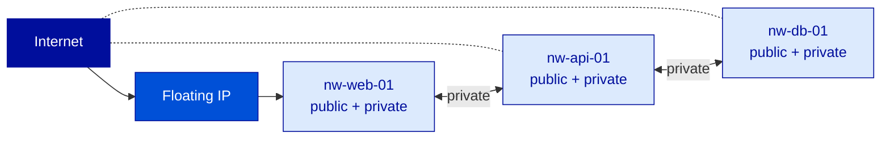
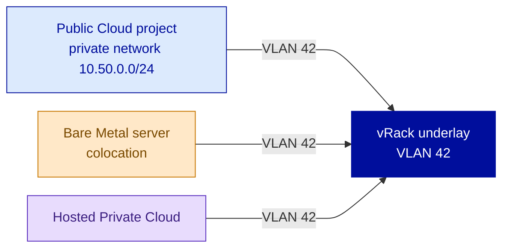
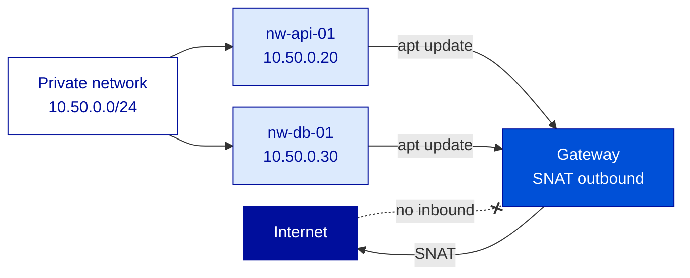
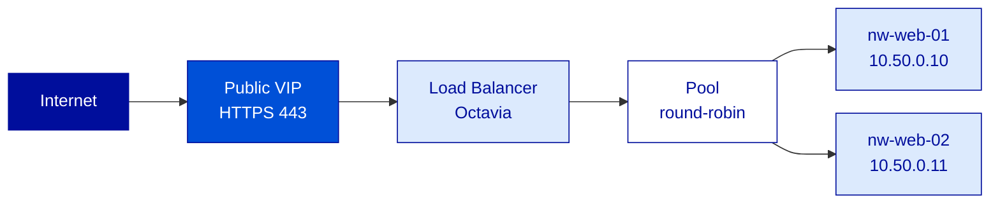
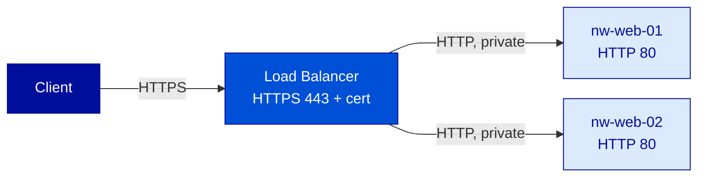

---
# ============================================================
# Module 2.4 -- Network (Part 2) -- vRack, Load Balancer & Gateway
# Slidev source file
# ============================================================
theme: ../../theme-ovhcloud
title: Network (Part 2) -- vRack, Load Balancer & Gateway
info: |
  ## OVHcloud -- Public Cloud -- Core Associate
  Module 2.4 -- Network (Part 2) -- vRack, Load Balancer & Gateway.
  Duration: 1h30.
class: text-left
highlighter: shiki
lineNumbers: false
drawings:
  persist: false
transition: slide-left
mdc: true
exportFilename: 'modules/module-2-4/student_export'

# Hide the floating navbar / controls overlay in dev mode
controls: false
download: false
selectable: true

# Module-level metadata (consumed by trainer-notes export and CI)
moduleId: "2.4"
moduleTitle: "Network (Part 2) -- vRack, Load Balancer & Gateway"
duration: "1h30"
program: "OVHcloud -- Public Cloud -- Core Associate"
los:
  - LO-NET-K03
  - LO-NET-K04
  - LO-NET-K05
  - LO-NET-K06
  - LO-NET-K07
  - LO-NET-S05
  - LO-NET-S06
  - LO-NET-S07
  - LO-NET-A01
  - LO-NET-A02
# COVER SLIDE
layout: cover
---

# Network (Part 2)
## vRack, Load Balancer & Gateway

<!--
Trainer notes Cover slide:
- Welcome to the closing module of the Network domain. Day 2, end of afternoon.
- Frame the shift : 2.3 built a sane tiered topology. 2.4 turns it into a production-shape topology.
- Announce : at the end of 1h30, API and DB have no public IP (Gateway retires them), the web tier sits behind a Load Balancer with HTTPS, and vRack is understood as the cross-product L2 underlay.
- Set expectations : slide 5 (Gateway as SNAT-outbound, not inbound exposure) is the pivot of the module. Pre-flag it.
- Anticipate confusions : Gateway vs Load Balancer vs vRack (three different jobs), Floating IP vs Additional IP (closed here).
- Dense module : 9 LOs in 90 min, vs 6 LOs in 2.3. Pacing is tight, watch the clock from the start.
-->

---
layout: default
moduleId: "2.4"
slideId: "Agenda"
---

# Agenda

<strong style="color: var(--ods-color-primary-700)">Block 1 — 5 min</strong> 
Sentier battu / Hors piste

<strong style="color: var(--ods-color-primary-700)">Block 2 — 30 min</strong> 
Theory &amp; Concepts 
vRack · Gateway · Floating vs Additional IP · Load Balancer · Anti-DDoS

<strong style="color: var(--ods-color-primary-700)">Block 3 — 15 min</strong> 
Trainer Demonstration 
Gateway deploy · LB with 2 backends · HTTPS termination

<strong style="color: var(--ods-color-primary-700)">Block 4 — 30 min</strong> 
Learner Lab 
Retire public IPs via Gateway, deploy LB with HTTPS

<strong style="color: var(--ods-color-primary-700)">Block 5 — 5 min</strong> 
Micro-check QCM 
8 questions

<strong style="color: var(--ods-color-primary-700)">Block 6 — 5 min</strong> 
Wrap-up &amp; Transition 
Recap · transition to Module 2.5

<!--
Trainer notes Agenda:
- Module hybride : Manager UI pour Gateway et LB (plus propre que le CLI au niveau Associate), CLI pour le detach NIC et les verifications.
- Verifier que les sorties du Module 2.3 (private network, 3 instances dual-NIC, SG en place, Floating IP sur web) sont toujours operationnelles. Sinon recover-network-state.sh.
- Annoncer le sous-domaine DNS par learner : le formateur fournit le mapping FQDN -> learner au debut du lab. Ne pas oublier de le preparer avant la session.
- Strict timing 90 min. Slide la plus importante : slide 5 (Gateway = SNAT outbound, pas inbound). Pre-annoncer.
-->

---
layout: section
block: "Block 1"
duration: "5 min"
---

# Before we start
### Prerequisites & remediation

---
layout: two-cols
moduleId: "2.4"
slideId: "S00a -- You are ready if..."
---

# Before we start (1/2)

::left::

<strong style="color: var(--ovh-masterbrand-blue); font-size: 1.1rem;">Tools</strong>

&middot; Northwind stack from Mod 2.3 : dual-NIC, tiered SGs, Floating IP on <code>nw-web-01</code> 
&middot; <code>openrc.sh</code> sourced, scoped to GRA 
&middot; <code>nginx</code> on <code>nw-web-01</code> with hostname injected in the welcome page (one-liner in lab) 
&middot; Manager UI open in a browser tab, Public Cloud project selected 
&middot; A trainer-provided DNS subdomain (e.g. <code>&lt;initials&gt;-northwind.demo.example</code>) delegated for HTTPS Let's Encrypt validation

::right::

<strong style="color: var(--ovh-masterbrand-blue); font-size: 1.1rem;">Knowledge</strong>

&middot; Dual-NIC topology from Mod 2.3 : API + DB on Ext-Net + private, web on Ext-Net + private + Floating IP 
&middot; Security Group semantics : stateful, default-deny ingress, additive rules 
&middot; Floating IP as a Neutron object inside the project 
&middot; The notion of an HTTP load balancer : VIP, pool of backends, round-robin, health checks 
&middot; TLS basics : the server presents the cert, the client validates the chain

<!--
Trainer notes S00a You are ready if:
- Demander : "Vos 3 instances Northwind sont up depuis 2.3 ? Floating IP toujours sur le web ?" Si plus de 30% out, lancer le recover-network-state.sh en parallele pendant l'introduction.
- Verifier que le sous-domaine DNS a ete delegate cote trainer AVANT la session. Sans ca, l'etape Let's Encrypt du lab echoue.
- Annoncer le mapping learner -> FQDN. Ecrire au tableau ou diffuser sur Slack du training.
- Souligner que le nginx doit afficher le hostname : sans ca, on ne voit pas le round-robin a l'oeil nu.
-->

---
layout: two-cols
moduleId: "2.4"
slideId: "S00b -- If not, here's where to look"
---

# Before we start (2/2)

::left::

<strong style="color: var(--ovh-masterbrand-blue); font-size: 1.1rem;">Stack or services missing</strong>

&middot; <strong>Mod 2.3 state missing?</strong> &rarr; run <code>module-2-3/recover-network-state.sh</code> from the lab repo, idempotent, ~3 min 
&middot; <strong>No DNS subdomain available?</strong> &rarr; fallback : use the LB's auto-assigned <code>*.lb.ovh.net</code> domain with the pre-attached wildcard Let's Encrypt cert. Pedagogical point preserved 
&middot; <strong>Hostname not in nginx welcome page?</strong> &rarr; one-liner provided in lab step 5

::right::

<strong style="color: var(--ovh-masterbrand-blue); font-size: 1.1rem;">Concept confusions to preempt</strong>

&middot; <strong>Gateway vs LB vs vRack?</strong> &rarr; three different jobs. Gateway = outbound from private-only. LB = inbound distribution. vRack = cross-product L2 
&middot; <strong>Floating IP vs Additional IP?</strong> &rarr; closed today, slide 6. Public Cloud = Floating IP. Additional IP = cross-product, Bare Metal heritage 
&middot; <strong>Will the LB auto-scale?</strong> &rarr; no, fixed-tier (S/M/L/XL), changeable in-place. Pre-empt the AWS ALB analogy

<!--
Trainer notes S00b If not where to look:
- Anticiper la confusion Gateway vs LB vs vRack : si elle reapparait pendant la Theory, on n'a pas suffisamment pose le perimetre ici.
- Anticiper "auto-scale" : si le persona Corporate ex-AWS le pose en slide 9, recadrer rapidement.
- Si plus de 30% de la salle a besoin du recover script, le lancer en parallele du Sentier battu, ne pas attendre.
- Cloturer en confirmant : Northwind stack up, openrc source, mapping FQDN diffuse, Manager UI ouverte.
-->

---
layout: section
block: "Block 2"
duration: "30 min"
---

# Theory & Concepts
### vRack, Gateway, Floating vs Additional IP, Load Balancer, Anti-DDoS

---
layout: default
moduleId: "2.4"
slideId: "S01 -- Starting point"
los: ["LO-NET-A01"]
---

# Where we left off &mdash; the topology is sane, not yet production-shape

<strong>End of Module 2.3</strong> 
3 tiers isolated by tiered SGs. Floating IP on web. But API + DB still carry a public IP (for outbound apt), and the web is a single backend.

<strong style="color: var(--ovh-masterbrand-blue);">Module 2.4 closes three loose ends</strong> 
<strong>Gateway</strong> retires the unused public IPs &middot; <strong>Load Balancer</strong> turns the web into a multi-backend frontend &middot; <strong>vRack</strong> extends L2 to other OVHcloud products.

<!--
Trainer notes S01 Starting point:
- Souligner que la topologie de 2.3 est saine mais pas production-shape : public IP residuelles sur API+DB, SPOF sur web tier.
- Demander : "Qui ferait une mise en prod avec ce schema aujourd'hui ?" Laisser le silence. La salle se positionne.
- Annoncer les trois objets nouveaux : Gateway, Load Balancer, vRack. Plus deux topics de fond : FIP vs Additional IP, Anti-DDoS.
- Anticiper la confusion : les trois objets nouveaux font des choses differentes, ne pas les melanger. C'est l'enjeu du slide 5.
-->

---
layout: default
moduleId: "2.4"
slideId: "S02 -- vRack overview"
los: ["LO-NET-K03"]
---

# vRack &mdash; the cross-product L2 underlay

<strong>What it is</strong>

&middot; OVHcloud proprietary <strong>Layer-2 underlay</strong> 
&middot; Connects <strong>different OVHcloud products</strong> at L2 
&middot; Built on the OVHcloud backbone (not the Internet) 
&middot; Predictable latency, no transit billing across the vRack 
&middot; <em>Legacy analogy : dark-fibre L2 trunk between datacenters</em>

<strong style="color: var(--ovh-masterbrand-blue);">Four foundational characteristics</strong>

&middot; <strong>Multi-product</strong> : Public Cloud, Bare Metal, Hosted Private Cloud, Dedicated Server 
&middot; <strong>Multi-DC</strong> : a single vRack can span GRA + BHS + SBG 
&middot; <strong>True Layer-2</strong> : broadcast, multicast, ARP all work 
&middot; <strong>VLAN-capable</strong> : sub-segments via VLAN tags inside one vRack

<OvhWarning title="Not an AWS Direct Connect / Transit Gateway analog" class="mt-4">Those are Layer-3 routed services. vRack is closer to a dark-fibre L2 trunk with VLAN trunking on top. No exact hyperscaler equivalent.</OvhWarning>

<!--
Trainer notes S02 vRack overview:
- Souligner : vRack n'est pas un service IaaS comme les autres, c'est un underlay L2. Different scope, different mental model.
- Anticiper "et la performance vs VPC peering AWS ?" : vRack passe par le backbone OVHcloud, latence stable, pas de cout de transit.
- Si "j'ai besoin de vRack pour demarrer ?" : non, optionnel, utile seulement en multi-produit OVHcloud.
- Rappeler : persona Corporate aime ce composant, c'est le pont vers leur Bare Metal ou HPC existant. Persona Digital Starter en a rarement besoin.
-->

---
layout: default
moduleId: "2.4"
slideId: "S03 -- vRack attach"
los: ["LO-NET-K03", "LO-NET-S07"]
---

# vRack &mdash; how it attaches to a Public Cloud project

<strong>Two-step attach</strong> 
1. <strong>Associate</strong> the Public Cloud project with a vRack (Manager UI, structural choice). 
2. When creating a private network, <strong>tag it with a vRack VLAN ID</strong>. It now bridges to the vRack.

<strong style="color: var(--ovh-masterbrand-blue);">Layer-2 reachability</strong> 
A Bare Metal with the same VLAN tag on its private interface sees the Public Cloud instances at L2 : ARP, broadcast, multicast all flow. <strong>The vRack is a feature of the project, not of the instance.</strong>

<!--
Trainer notes S03 vRack attach:
- Souligner que l'association projet-vRack se fait une fois pour toutes : un choix structurel, pas une operation courante.
- Anticiper "est-ce qu'il y a un cout ?" : le vRack est inclus dans la plupart des offres OVHcloud, pas de cout additionnel pour l'attacher.
- Si "et si je veux migrer une VM Bare Metal vers Public Cloud sans changer son IP ?" : vRack permet le L2 bridge, le scenario fonctionne.
- Rappeler que LO-NET-S07 est testable a partir du mecanisme explique ici, sans lab pratique (la plupart des learners n'ont pas de Bare Metal a brancher).
-->

---
layout: default
moduleId: "2.4"
slideId: "S04 -- Gateway role"
los: ["LO-NET-K05"]
---

# Gateway &mdash; what it does and where it sits

<strong>SNAT for outbound</strong> 
A managed OpenStack router. Sits as the <strong>default route</strong> of the private subnet. Private-only instances reach the Internet for <code>apt update</code>, <code>pip install</code>, etc.

<strong>Not for inbound.</strong> A Gateway does <strong>not</strong> expose private instances to the Internet. Inbound to a private instance requires a Floating IP (dual-NIC) or a Load Balancer in front.

<!--
Trainer notes S04 Gateway role:
- SLIDE LA PLUS IMPORTANTE DU MODULE. Ralentir, articuler.
- Souligner les deux mots-cles : "SNAT outbound" et "not inbound". Les ecrire au tableau si possible.
- Anticiper : "et si je veux exposer mon API ?" : pas le role du Gateway, c'est le role du Load Balancer ou d'une Floating IP sur l'instance.
- Demander : "qu'est-ce qui se passe pour les paquets de retour des connexions sortantes ?" : reponse : le Gateway maintient la table de connexions, les retours passent par le meme chemin (statefulness du NAT).
- Rappeler l'analogie legacy : routeur sur un stick avec NAT, classique sur les VLANs internes des datacenters.
-->

---
layout: default
moduleId: "2.4"
slideId: "S05 -- Gateway sizing & HA"
los: ["LO-NET-K05"]
---

# Gateway &mdash; sizing and HA model

<strong>Three sizing tiers</strong>

&middot; <strong>S</strong> : staging, light workload 
&middot; <strong>M</strong> : production, moderate outbound 
&middot; <strong>L</strong> : high-throughput outbound 
&middot; Sizing changeable <strong>in-place</strong> from the Manager 
&middot; Pricing per-hour, per-tier 
&middot; <em>Pricing details on the official OVHcloud pricing page</em>

<strong style="color: var(--ovh-masterbrand-blue);">HA managed by OVHcloud</strong>

&middot; Gateway is <strong>internally redundant</strong> 
&middot; No failover script to write client-side 
&middot; Transparent maintenance and patching 
&middot; Status visible on the OVHcloud status page

<OvhNotice title="AWS NAT Gateway cross-reference" class="mt-4">AWS NAT Gateway has identical positioning &mdash; managed SNAT, per-hour billing, no HA to configure. The mental model translates 1:1 for ex-AWS profiles.</OvhNotice>

<!--
Trainer notes S05 Gateway sizing and HA:
- Souligner que le sizing est modifiable a chaud, donc on peut demarrer en S sans risquer de se bloquer.
- Anticiper "quel est le surcout ?" : facture a l'heure, ordre de grandeur sur la pricing page. NE PAS citer un prix exact en formation, il varie.
- Si "et si la Gateway tombe ?" : HA interne, on n'a rien a faire cote client.
- Rappeler que c'est exactement le pattern AWS NAT Gateway, transparent pour les ex-AWS.
-->

---
layout: default
moduleId: "2.4"
slideId: "S06 -- Floating IP vs Additional IP"
los: ["LO-NET-K04"]
---

# Floating IP vs Additional IP &mdash; closed and clarified

<strong>Floating IP &middot; Public Cloud</strong>

&middot; <strong>Neutron object</strong> inside a Public Cloud project 
&middot; <code>openstack floating ip create Ext-Net</code> 
&middot; Attached to a Neutron port 
&middot; Lifecycle = project, billed <strong>per hour</strong> 
&middot; <em>Ideal for : failover VIP, web frontend exposure</em>

<strong style="color: var(--ovh-masterbrand-blue);">Additional IP &middot; OVHcloud product</strong>

&middot; Separate OVHcloud product, <strong>outside the project</strong> 
&middot; Ordered from the dedicated services section of the Manager 
&middot; Attached at the OS level on Bare Metal, VPS, Public Cloud 
&middot; Lifecycle = product order, billed <strong>per month</strong> 
&middot; <em>Ideal for : Bare Metal failover, license-bound IPs</em>

<OvhWarning title="On Public Cloud, default to Floating IP" class="mt-4">Additional IP is the cross-product story, rooted in the Bare Metal heritage. AWS Elastic IP = Floating IP. AWS has no equivalent of Additional IP.</OvhWarning>

<!--
Trainer notes S06 Floating IP vs Additional IP:
- Souligner que ce slide ferme le suspense laisse en 2.3. Question piege #2 du domaine Network.
- Anticiper : "et si je vois Additional IP dans la Manager, je dois m'en mefier ?" : non, c'est juste un autre produit pour un autre contexte (Bare Metal).
- Demander : "pour Northwind aujourd'hui, on prend quoi ?" : reponse attendue : Floating IP, parce que tout est sur Public Cloud.
- Rappeler que cette confusion est dans le top des questions du support OVHcloud. Savoir la dissiper en amont sauve du temps cote operations.
-->

---
layout: default
moduleId: "2.4"
slideId: "S07 -- Load Balancer overview"
los: ["LO-NET-K06"]
---

# Public Cloud Load Balancer &mdash; what it is

<strong>Managed L4 / L7 load balancer</strong> 
Built on <strong>OpenStack Octavia</strong>. Public VIP on the Internet side, pool of backends on the private network side. One product, four sizes.

<strong style="color: var(--ovh-masterbrand-blue);">Hyperscaler mapping</strong> 
AWS ALB &asymp; LB with HTTP/HTTPS listeners. AWS NLB &asymp; LB with TCP listener. OVHcloud LB does both in one product.

<!--
Trainer notes S07 Load Balancer overview:
- Souligner que c'est du Octavia upstream, donc OpenStack standard. Pas un produit proprietaire opaque.
- Anticiper "est-ce que c'est manage ou est-ce que je dois faire le patching ?" : manage, on ne voit pas les VMs sous-jacentes.
- Si question Layer 7 : "HTTP routing par path, par host, possible, mais pas couvert au niveau Associate."
- Rappeler que le LB est inside le projet, donc il prend ses membres sur les IPs privees, pas publiques. Les SG des backends doivent autoriser le LB en source private.
-->

---
layout: default
moduleId: "2.4"
slideId: "S08 -- LB anatomy"
los: ["LO-NET-K06", "LO-NET-S05"]
---

# Load Balancer &mdash; anatomy of a configuration

<strong>Listener &middot; public side</strong>

&middot; Protocol + port (<code>HTTP/80</code>, <code>HTTPS/443</code>, <code>TCP/3306</code>) 
&middot; Certificate reference (for TLS termination) 
&middot; <strong>One listener per protocol/port</strong>

<strong>Pool &middot; distribution logic</strong>

&middot; Algorithm : <code>ROUND_ROBIN</code> (default), <code>LEAST_CONNECTIONS</code>, <code>SOURCE_IP</code> 
&middot; One pool per listener typically 
&middot; <code>ROUND_ROBIN</code> is the sane Associate-scope choice

<strong style="color: var(--ovh-masterbrand-blue);">Member &middot; one backend</strong>

&middot; <code>instance + private IP + port + weight</code> 
&middot; Members live on the <strong>private network</strong> of the LB 
&middot; Two or more members for redundancy

<strong style="color: var(--ovh-masterbrand-blue);">Health monitor &middot; mandatory</strong>

&middot; Type : <code>TCP</code> or <code>HTTP</code> 
&middot; Interval, timeout, retries, expected status 
&middot; <strong>Without it, the LB sends traffic to dead backends</strong>

<!--
Trainer notes S08 LB anatomy:
- Souligner que le health monitor n'est pas un detail : c'est obligatoire pour une config saine.
- Anticiper "quelle algo prendre ?" : ROUND_ROBIN par defaut. LEAST_CONNECTIONS si requetes de duree tres variable. SOURCE_IP si stickiness IP necessaire.
- Demander : "si un backend tombe, qu'est-ce qui se passe ?" : reponse : le health monitor le detecte, l'exclut du pool, nouvelles requetes vont sur les survivants.
- Rappeler que tout ca se configure via la Manager UI au niveau Associate. Le CLI Octavia est Pro+.
-->

---
layout: default
moduleId: "2.4"
slideId: "S09 -- LB sizing tiers"
los: ["LO-NET-K06", "LO-NET-S05"]
---

# Load Balancer &mdash; the four sizing tiers

<table style="width:100%; border-collapse: collapse;">
<thead>
<tr style="background: var(--ovh-masterbrand-blue); color: white;">
<th style="padding: 6px 8px; text-align: left;">Tier</th>
<th style="padding: 6px 8px; text-align: left;">Throughput</th>
<th style="padding: 6px 8px; text-align: left;">New conn / s</th>
<th style="padding: 6px 8px; text-align: left;">Typical use case</th>
</tr>
</thead>
<tbody>
<tr style="background: #F2F2F2;">
<td style="padding: 6px 8px;"><strong>S</strong></td>
<td style="padding: 6px 8px;">Light</td>
<td style="padding: 6px 8px;">Low</td>
<td style="padding: 6px 8px;">Staging, low-traffic site</td>
</tr>
<tr>
<td style="padding: 6px 8px;"><strong>M</strong></td>
<td style="padding: 6px 8px;">Moderate</td>
<td style="padding: 6px 8px;">Moderate</td>
<td style="padding: 6px 8px;">Production small SaaS</td>
</tr>
<tr style="background: #F2F2F2;">
<td style="padding: 6px 8px;"><strong>L</strong></td>
<td style="padding: 6px 8px;">High</td>
<td style="padding: 6px 8px;">High</td>
<td style="padding: 6px 8px;">Production e-commerce</td>
</tr>
<tr>
<td style="padding: 6px 8px;"><strong>XL</strong></td>
<td style="padding: 6px 8px;">Very high</td>
<td style="padding: 6px 8px;">Very high</td>
<td style="padding: 6px 8px;">High-volume API or media</td>
</tr>
</tbody>
</table>

<strong>All tiers include</strong> 
HTTPS termination &middot; Anti-DDoS &middot; Managed Let's Encrypt &middot; Health checks

<strong style="color: var(--ovh-masterbrand-blue);">Heuristic</strong> 
Start <strong>S</strong> in staging, <strong>M</strong> in production for a small SaaS, upgrade in-place when monitoring shows saturation. <em>Exact capacity & pricing on the OVHcloud pricing page.</em>

<!--
Trainer notes S09 LB sizing tiers:
- Souligner que sizing changeable in-place est un argument de tranquillite, on n'est pas fige.
- Anticiper "comment je sais que je dois upgrader ?" : metriques Octavia exposees dans la Manager, on en parle au Module 3.2 Operations.
- Si "et l'auto-scaling comme AWS ALB ?" : pas en automatique au niveau Associate. Upgrade manuel mais rapide (in-place, courte interruption).
- NE PAS citer de chiffres precis throughput / prix en formation. Pointer vers la pricing page officielle. Les chiffres changent, l'inertie pedagogique de chiffres faux est couteuse.
-->

---
layout: default
moduleId: "2.4"
slideId: "S10 -- HTTPS termination"
los: ["LO-NET-S06"]
---

# HTTPS termination on the Load Balancer

<strong>Two certificate sources</strong> 
&middot; <strong>Managed Let's Encrypt</strong> &mdash; auto-renewed, requires DNS pointing to the LB VIP 
&middot; <strong>Customer-provided</strong> &mdash; paste PEM in the Manager

<strong style="color: var(--ovh-masterbrand-blue);">Why terminate at the LB</strong> 
Simpler cert management (one place), CPU offload from backends, easier rotation. The private network protects the LB-to-backend leg.

<!--
Trainer notes S10 HTTPS termination:
- Souligner que terminer le TLS au LB est la pratique courante, pas un compromis.
- Anticiper "et si je veux du end-to-end TLS pour la conformite ?" : possible, pool en HTTPS cote backend avec un cert sur chaque backend, mais Pro+.
- Demander : "qui gere le renouvellement Let's Encrypt ?" : OVHcloud le fait automatiquement tant que le DNS pointe encore vers le LB.
- Si "le LB voit les requetes en clair ?" : oui, c'est le sens meme de la terminaison TLS cote LB.
-->

---
layout: default
moduleId: "2.4"
slideId: "S11 -- Anti-DDoS scope"
los: ["LO-NET-K07"]
---

# Anti-DDoS &mdash; what it does, what it doesn't

<strong>Covered &middot; always on, included</strong>

&middot; <strong>Network-layer floods</strong> : SYN, UDP, amplification (DNS, NTP) 
&middot; <strong>Volumetric attacks</strong> : Tbps-scale absorbed at the backbone 
&middot; <strong>Protocol anomalies</strong> : malformed packets, fragmentation 
&middot; Active on <strong>every public IP</strong> of every OVHcloud service

<strong>Not covered &middot; out of scope</strong>

&middot; <strong>Application-layer attacks</strong> : HTTP flood, slow loris 
&middot; <strong>WAF concerns</strong> : SQL injection, XSS 
&middot; <strong>Credential-stuffing</strong>, bot abuse 
&middot; <em>Require a dedicated WAF product, not Anti-DDoS</em>

<OvhNotice title="Operational model" class="mt-4">Upstream scrubbing, no configuration to do. Compare to AWS Shield Standard (free) + Advanced (paid) &mdash; OVHcloud includes high-grade protection in the free baseline.</OvhNotice>

<!--
Trainer notes S11 Anti-DDoS scope:
- Souligner : gratuit, toujours actif, sur toutes les IPs publiques OVHcloud, pas seulement Public Cloud.
- Anticiper "c'est vraiment efficace ?" : c'est l'un des arguments historiques d'OVHcloud, capacite d'absorption multi-Tbps, documentee publiquement.
- Si "et le WAF ?" : hors scope Public Cloud Core Associate. Produit separe.
- Rappeler que le persona Corporate ex-AWS s'attend a un service separe et payant. C'est different ici, vendeur d'argument cote commerce.
-->

---
layout: default
moduleId: "2.4"
slideId: "S12 -- Hyperscaler cross-reference"
los: ["LO-NET-K03", "LO-NET-K05", "LO-NET-K06", "LO-NET-K07"]
---

# Hyperscaler cross-reference

<table style="width:100%; border-collapse: collapse;">
<thead>
<tr style="background: var(--ovh-masterbrand-blue); color: white;">
<th style="padding: 6px 8px; text-align: left;">OVHcloud Public Cloud</th>
<th style="padding: 6px 8px; text-align: left;">AWS</th>
<th style="padding: 6px 8px; text-align: left;">Azure</th>
</tr>
</thead>
<tbody>
<tr style="background: #F2F2F2;">
<td style="padding: 6px 8px;"><strong>Gateway</strong> (SNAT outbound)</td>
<td style="padding: 6px 8px;">NAT Gateway</td>
<td style="padding: 6px 8px;">NAT Gateway</td>
</tr>
<tr>
<td style="padding: 6px 8px;"><strong>Load Balancer</strong> (Octavia)</td>
<td style="padding: 6px 8px;">ALB / NLB (two products)</td>
<td style="padding: 6px 8px;">Azure LB / Application Gateway</td>
</tr>
<tr style="background: #F2F2F2;">
<td style="padding: 6px 8px;"><strong>vRack</strong> (L2 underlay)</td>
<td style="padding: 6px 8px;">No direct equivalent (closest : Direct Connect + Transit GW, L3)</td>
<td style="padding: 6px 8px;">ExpressRoute (L3)</td>
</tr>
<tr>
<td style="padding: 6px 8px;"><strong>Anti-DDoS</strong> (included)</td>
<td style="padding: 6px 8px;">Shield Standard (free) + Advanced (paid)</td>
<td style="padding: 6px 8px;">DDoS Protection Basic (free) + Standard (paid)</td>
</tr>
</tbody>
</table>

<strong>Gateway and LB map cleanly</strong> 
Same primitives, similar billing models. Mental translation 1:1 for ex-AWS / ex-Azure.

<strong style="color: var(--ovh-masterbrand-blue);">vRack is the OVHcloud specificity</strong> 
No exact equivalent at the hyperscalers. Closest hyperscaler concepts are L3 routed, not L2.

<!--
Trainer notes S12 Hyperscaler cross-reference:
- Souligner que vRack est la specificite OVHcloud, pas d'equivalent direct ailleurs. Vendeur d'argument cote commerce, c'est le pont Bare Metal.
- Anticiper "et AWS Shield Advanced, ca apporte quoi ?" : WAF integration, attaque attribution, support DRT (Shield Response Team). Service a valeur ajoutee, pas la protection volumetrique de base.
- Si question sur Application Gateway Azure : "L7 avec WAF inclus, plus proche d'un LB + WAF combine, pas equivalent strict au LB OVHcloud."
- Rappeler que ce slide ferme le bloc Theory. Transition vers la demo : on va voir Gateway et LB en action.
-->

---
layout: section
block: "Block 3"
duration: "15 min"
---

# Demo
### Gateway + Load Balancer + HTTPS termination, end-to-end

---
layout: default
moduleId: "2.4"
slideId: "Demo -- Production-shape topology"
los: ["LO-NET-K05", "LO-NET-K06", "LO-NET-S05", "LO-NET-S06"]
---

# Demo &mdash; from sane topology to production-shape, end-to-end

<strong style="color: var(--ovh-masterbrand-blue);">What you'll see</strong>

&middot; Deploy a Gateway on the private network 
&middot; Detach the Ext-Net NIC from <code>demo-api-01</code> 
&middot; Validate <code>apt update</code> still works via the Gateway 
&middot; Deploy a Load Balancer size S, one listener HTTP/80 
&middot; Clone the web instance, add a 2nd backend 
&middot; Demonstrate round-robin with a <code>curl</code> loop 
&middot; Add HTTPS termination with managed Let's Encrypt

<strong style="color: var(--ovh-masterbrand-blue);">Why this matters</strong>

By the end of the demo, you've seen Gateway and LB in action on a real topology. Channels : <strong>Manager UI</strong> for Gateway and LB, <strong>openstack CLI</strong> for the NIC detach, <strong>SSH</strong> for inside-instance validation, <strong>curl</strong> from the trainer's laptop for end-to-end.

  Starting from : <code>demo-web-01</code> + <code>demo-api-01</code> dual-NIC &middot; Region GRA &middot; SGs from Mod 2.3 in place

  13 steps &middot; ~12 min walkthrough &middot; 3 min Q&amp;A

<!--
Trainer notes Demo Production-shape topology:

PRE-FLIGHT (do BEFORE the block):
- openrc.sh sourced, openstack token issue succeeds.
- demo-web-01 and demo-api-01 dual-NIC from Mod 2.3 demo still up.
- nginx on demo-web-01 with hostname in welcome page : echo "served by $(hostname)" | sudo tee /var/www/html/index.nginx-debian.html.
- A pre-baked DNS A record demo-northwind.<trainer-zone> pointing to a placeholder LB VIP (or use *.lb.ovh.net fallback). This saves the 5 min Let's Encrypt wait during the live demo.
- Manager UI open, Public Cloud project visible.
- Terminal at 16pt+, dark background.

DEMO SCRIPT (13 steps, ~12 min):
1. Manager UI -> Network -> Gateway -> Create, attach to demo-private, size S. ACTIVE en ~30s. "Routeur manage, SNAT outbound."
2. openstack network list ; openstack router list. La Gateway apparait comme router avec deux ports. "Sous le capot c'est un router Neutron, l'objet annonce en 2.3 enfin utilise."
3. SSH demo-api-01, sudo apt update. OK. "Apt marche, l'API a encore son NIC Ext-Net. Pas surprenant."
4. openstack server remove network demo-api-01 Ext-Net. NIC publique disparait. "Maintenant API est private-only. Sans Gateway, ca casserait apt."
5. SSH demo-api-01 via jump host (depuis demo-web-01), sudo dhclient -r ens4 && sudo dhclient ens4, sudo apt update. OK via Gateway. "Outbound passe par la Gateway maintenant."
6. Manager UI -> LB -> Create, size S, attach demo-private, GRA. ACTIVE en ~2 min. Public VIP attribue. "Octavia sous le capot. Attendre ACTIVE avant de configurer."
7. Dans la meme flow Manager : add listener HTTP/80, ROUND_ROBIN, pool avec demo-web-01:80, health monitor TCP/80. Member ONLINE. "Un seul backend, round-robin c'est du pass-through."
8. Depuis laptop : for i in {1..5}; do curl http://<lb-vip>/; done. nginx 5 fois, meme hostname. "Un backend, un hostname. Maintenant on ajoute le 2eme."
9. Manager UI -> snapshot demo-web-01 -> spawn demo-web-02 from snapshot, meme flavor, dual-NIC, meme SG. ACTIVE. "Snapshot-based cloning, fast-forward."
10. LB pool -> add demo-web-02 (IP privee, port 80). 2 membres ONLINE. "Round-robin va alterner."
11. Depuis laptop : for i in {1..10}; do curl http://<lb-vip>/; done | grep "served by". Alternance des deux hostnames. "Round-robin en action."
12. Manager UI -> LB -> ajouter listener HTTPS/443, managed Let's Encrypt, FQDN demo-northwind.<trainer-zone>. ACTIVE, cert VALID. "TLS termine ici. Backends en HTTP sur le prive."
13. Depuis laptop : curl https://demo-northwind.<trainer-zone>/. nginx avec chaine TLS valide, hostname alterne. "Production-shape pattern."

FAILURE MODES:
- Step 1 Gateway stuck en BUILDING > 2 min : capacite regionale, retry ou utiliser la Gateway de secours pre-deployee.
- Step 5 apt update fail : dhclient pas refresh, le default route Gateway pas pris. sudo dhclient -r ens4 && sudo dhclient ens4.
- Step 7 member OFFLINE : SG du backend ne laisse pas passer le health check. Verifier que demo-web-sg accepte 80/tcp depuis 0.0.0.0/0 ou depuis 10.50.0.0/24.
- Step 12 Let's Encrypt fail : DNS pas propage, dig +short <fqdn> doit retourner le VIP du LB. Si pas pre-bake, attendre 1-2 min.

Q&A (3 min) : focus sur la difference Gateway / LB, et le sens du round-robin. Parking pour Mod 2.5 : IAM, secret management.
-->

---
layout: section
block: "Block 4"
duration: "30 min"
---

# Retire the public IPs, deploy the LB, add HTTPS
### Your turn. Solo. 30 minutes.

---
layout: default
moduleId: "2.4"
slideId: "Lab -- Brief"
los: ["LO-NET-K05", "LO-NET-S05", "LO-NET-S06"]
---

# Lab &mdash; Production-shape Northwind topology

<OvhNotice title="Mission" class="mt-4">You are Northwind's Cloud Ops engineer. The CTO walks back in: <em>&ldquo;The DB and API still have public IPs we don't need. The web tier is a single instance behind a Floating IP. Give me a Load Balancer with HTTPS and no public IP on the data tier.&rdquo;</em> Today you: (1) deploy a Gateway and retire the Ext-Net NIC from API + DB; (2) clone the web instance; (3) deploy a Load Balancer with two backends and HTTP round-robin; (4) add HTTPS with a managed Let's Encrypt certificate.</OvhNotice>

<strong style="color: var(--ovh-masterbrand-blue);">Channels</strong>

&middot; <strong>Manager UI</strong> for Gateway, LB deployment, HTTPS certificate 
&middot; <code>openstack</code> CLI for NIC detach and verification 
&middot; <strong>SSH</strong> for inside-instance validation (jump host via web tier once API/DB are private-only) 
&middot; <code>curl</code> from your laptop for end-to-end checks

<strong style="color: var(--ovh-masterbrand-blue);">Success criteria</strong>

API has no public IP, <code>apt update</code> works via Gateway &middot; LB shows 2 members ONLINE &middot; <code>curl</code> loop alternates between web-01 and web-02 &middot; <code>curl https://&lt;fqdn&gt;</code> returns 200 with valid TLS chain

  Gateway size : <strong>S</strong> &middot; LB size : <strong>S</strong> &middot; FQDN : <code>&lt;initials&gt;-northwind.&lt;trainer-zone&gt;</code> &middot; Time : 30 min

<!--
Trainer notes Lab Brief:
- Souligner les criteres de succes auto-verifiables. L'apprenant sait s'il a reussi sans demander.
- Lab dense pour 30 min : surveiller le timing serre. Si plus de la moitie de la salle est en retard a 20 min, couper l'etape 12 (delete legacy Floating IP) et la declarer optionnelle.
- Diffuser le mapping FQDN <-> learner : sans ca, l'etape Let's Encrypt echoue. Le formateur doit avoir prepare les DNS A records AVANT la session.
- Annoncer oralement la commande SSH jump : ssh -J ubuntu@<web-public-ip> ubuntu@<api-private-ip>. La salle ne devine pas.

VALIDATION CRITERIA (silent check by trainer):
- openstack server show <initials>-nw-api-01 -c addresses -f value : pas d'entree Ext-Net
- depuis api-01 (via jump web) : sudo apt update OK
- openstack loadbalancer member list <pool-id> : 2 membres ONLINE
- depuis laptop : curl loop 10x voit les deux hostnames
- depuis laptop : curl https://<fqdn>/ retourne 200, chain TLS valide, hostname alterne
-->

---
layout: default
moduleId: "2.4"
slideId: "Lab -- Steps 1/3"
---

# Lab &mdash; Step-by-step (1/3)
### Gateway + retire public IPs &middot; Manager UI + openstack CLI

<strong>1.</strong> Manager UI &rarr; Public Cloud &rarr; Network &rarr; Gateway &rarr; Create 
&nbsp;&nbsp;Attach to <code>&lt;initials&gt;-nw-private</code>, size <strong>S</strong>, region GRA 
&nbsp;&nbsp;Wait until status is <code>ACTIVE</code>. Confirm : <code>openstack router list</code> shows the router 
<strong>2.</strong> SSH <code>nw-api-01</code> on its public IP, run <code>sudo apt update</code> &mdash; baseline OK 
<strong>3.</strong> <code>openstack server remove network &lt;initials&gt;-nw-api-01 Ext-Net</code> 
&nbsp;&nbsp;The public IP is released. SSH session disconnects. 
<strong>4.</strong> SSH back via <strong>jump host</strong> (web tier still has a public IP) : 
&nbsp;&nbsp;<code>ssh -J ubuntu@&lt;web-public-ip&gt; ubuntu@&lt;api-private-ip&gt;</code> 
<strong>5.</strong> Inside <code>nw-api-01</code> : <code>sudo dhclient -r ens4 && sudo dhclient ens4</code> 
&nbsp;&nbsp;Then <code>ip route</code> &rarr; default route via the Gateway IP 
&nbsp;&nbsp;Then <code>sudo apt update</code> &rarr; OK, outbound via Gateway 
<strong>6.</strong> Repeat steps 3 to 5 for <code>nw-db-01</code>

<!--
Trainer notes Lab Steps 1/3:
- Slide de reference pour la premiere phase du lab : laisser projete jusqu'a l'etape 6.
- Insister oralement : "verifier que la Gateway est ACTIVE avant l'etape 3, sinon l'apt update casse." Pas de raccourci.
- Si plusieurs learners bloquent a l'etape 4 (jump host) : c'est nouveau pour beaucoup. 30 sec d'explication au tableau si necessaire.
- A l'etape 5, le dhclient -r est important : sans le release, le client ne re-emet pas une DHCP request et garde la vieille config.
- Passer a la slide 2/3 quand la majorite a fini l'etape 6, ou apres 10 min.
-->

---
layout: default
moduleId: "2.4"
slideId: "Lab -- Steps 2/3"
---

# Lab &mdash; Step-by-step (2/3)
### Clone web + deploy LB &middot; Manager UI

<strong>7.</strong> On <code>nw-web-01</code>, inject hostname in nginx welcome : 
&nbsp;&nbsp;<code>echo "served by $(hostname)" | sudo tee /var/www/html/index.nginx-debian.html</code> 
&nbsp;&nbsp;Confirm : <code>curl http://&lt;web-public-ip&gt;</code> shows "served by nw-web-01" 
<strong>8.</strong> Manager UI &rarr; Snapshots &rarr; create snapshot of <code>nw-web-01</code> 
&nbsp;&nbsp;Wait for snapshot status <code>ACTIVE</code> 
<strong>9.</strong> Manager UI &rarr; Instances &rarr; Create from snapshot &rarr; <code>nw-web-02</code> 
&nbsp;&nbsp;Same flavor <code>b3-8</code>, region GRA, dual-NIC (Ext-Net + private), same SG <code>nw-web-sg</code> 
&nbsp;&nbsp;SSH in, bring up <code>ens4</code> via DHCP, confirm hostname is <code>nw-web-02</code> 
<strong>10.</strong> Manager UI &rarr; Network &rarr; Load Balancers &rarr; Create 
&nbsp;&nbsp;Size <strong>S</strong>, attach to <code>&lt;initials&gt;-nw-private</code>, region GRA 
&nbsp;&nbsp;Wait until <code>ACTIVE</code>. Note the public VIP. 
<strong>11.</strong> Configure LB : 
&nbsp;&nbsp;Listener <code>HTTP/80</code>, algorithm <code>ROUND_ROBIN</code> 
&nbsp;&nbsp;Pool with <strong>both</strong> web instances as members (private IPs, port 80) 
&nbsp;&nbsp;Health monitor <code>TCP/80</code>. Wait : both members <code>ONLINE</code>.

<!--
Trainer notes Lab Steps 2/3:
- Le snapshot prend 1-3 min selon la taille de l'instance. Anticiper, ne pas laisser les learners regarder l'ecran fixement.
- A l'etape 9, verifier que la salle attache bien dual-NIC : sans le NIC prive sur web-02, le LB ne peut pas atteindre le backend.
- A l'etape 11, si un member reste OFFLINE plus de 2 min : verifier le SG (80/tcp depuis 0.0.0.0/0 deja en place par 2.3) et que nginx ecoute sur 0.0.0.0:80 et pas seulement 127.0.0.1.
- Passer a la slide 3/3 quand la majorite a fini l'etape 11, ou apres 10 min de plus (cumul 20 min).
-->

---
layout: default
moduleId: "2.4"
slideId: "Lab -- Steps 3/3"
---

# Lab &mdash; Step-by-step (3/3)
### Validate round-robin + add HTTPS

<strong>12.</strong> From your laptop, validate round-robin : 
&nbsp;&nbsp;<code>for i in {1..10}; do curl -s http://&lt;lb-vip&gt;/ | grep "served by"; done</code> 
&nbsp;&nbsp;Expected : alternation between <code>nw-web-01</code> and <code>nw-web-02</code> (5/5 or 4/6 acceptable) 
<strong>13.</strong> Manager UI &rarr; LB &rarr; add listener <code>HTTPS/443</code> 
&nbsp;&nbsp;Certificate type : <strong>Managed Let's Encrypt</strong> 
&nbsp;&nbsp;FQDN : <code>&lt;initials&gt;-northwind.&lt;trainer-zone&gt;</code> (trainer announces mapping) 
&nbsp;&nbsp;Wait until certificate is <code>VALID</code> and listener is <code>ACTIVE</code> (1-3 min) 
<strong>14.</strong> From your laptop : 
&nbsp;&nbsp;<code>curl https://&lt;initials&gt;-northwind.&lt;trainer-zone&gt;/</code> 
&nbsp;&nbsp;Expected : 200 OK, no <code>-k</code> needed, hostname alternates 
<strong>15.</strong> <em>(Optional)</em> Delete the legacy Floating IP from Mod 2.3 : 
&nbsp;&nbsp;<code>openstack floating ip delete &lt;fip-id&gt;</code> 
&nbsp;&nbsp;The LB VIP is now Northwind's only public entry point

<!--
Trainer notes Lab Steps 3/3:
- A l'etape 12, HTTP keepalive peut clumper le round-robin (7/3 ou 8/2 au lieu de 5/5). Acceptable, le but est de voir les deux hostnames.
- A l'etape 13, le DNS doit deja pointer vers le LB VIP. Si pas pre-bake, attendre la propagation (TTL 300s usuel).
- L'etape 15 est optionnelle : si la salle est en retard, la declarer homework. Le LB VIP fonctionne sans toucher a la FIP legacy.
- Annoncer la fin de lab a 5 min avant le timer, pour laisser le temps de finir les curl de validation.
-->

---
layout: section
block: "Block 5"
duration: "5 min"
---

# Micro-check
### 8 formative questions, no points

---
layout: default
moduleId: "2.4"
slideId: "MC -- Q1 vRack characteristics"
los: ["LO-NET-K03"]
---

# Q1 &mdash; vRack foundational characteristics

Which of the following is <strong>not</strong> a foundational characteristic of vRack?

<strong>A.</strong> Connects multiple OVHcloud products (Public Cloud, Bare Metal, Hosted Private Cloud) at Layer 2

<strong>B.</strong> Can span multiple datacenters (GRA, BHS, SBG)

<strong>C.</strong> Provides automatic IPSec encryption between connected products

<strong>D.</strong> Supports VLAN tagging to carve sub-segments

<!--
Trainer notes Q1:
- Correct answer: C. vRack n'apporte pas de chiffrement IPSec automatique, c'est un underlay L2 brut.
- A wrong (vraie carac) : multi-product est exactement la valeur de vRack.
- B wrong (vraie carac) : multi-DC est explicitement supporte.
- D wrong (vraie carac) : VLAN tagging permet de carver des sous-segments dans un meme vRack.
- LO: LO-NET-K03. Bloom: Remember.
- Piege : les profils security-aware supposent souvent IPSec sur tout. vRack est sur le backbone OVHcloud, donc isole, mais sans chiffrement transport.
-->

---
layout: default
moduleId: "2.4"
slideId: "MC -- Q2 Floating vs Additional"
los: ["LO-NET-K04"]
---

# Q2 &mdash; Failover VIP between two Public Cloud Instances

An operator needs a public IPv4 that can be reassigned between two Public Cloud Instances in seconds, for failover purposes. Which OVHcloud product is the right tool?

<strong>A.</strong> Floating IP, created via <code>openstack floating ip create Ext-Net</code>

<strong>B.</strong> Additional IP, ordered from the dedicated services section of the Manager

<strong>C.</strong> A second Public Cloud Instance running keepalived to share an IP

<strong>D.</strong> A vRack VLAN with a dedicated IP range

<!--
Trainer notes Q2:
- Correct answer: A. Floating IP est l'outil canonique pour ce besoin sur Public Cloud.
- B wrong : Additional IP est pour le scenario cross-product (mainly Bare Metal), pas l'outil par defaut Public Cloud.
- C wrong : techniquement possible mais demande de desactiver Neutron MAC/IP spoofing prevention, pas l'outil canonique.
- D wrong : vRack est L2, pas un service d'allocation d'IP. Mauvais produit pour le besoin.
- LO: LO-NET-K04. Bloom: Apply.
- Question piege Floating IP vs Additional IP : si ratee, le learner ouvrira un ticket support a la prochaine occasion.
-->

---
layout: default
moduleId: "2.4"
slideId: "MC -- Q3 Gateway role"
los: ["LO-NET-K05"]
---

# Q3 &mdash; What a Gateway actually does

A learner deploys a Gateway on a private network and expects to expose a private-only instance to the Internet via the Gateway. What actually happens?

<strong>A.</strong> The Gateway automatically exposes every instance on the private network with a public IP

<strong>B.</strong> The Gateway provides SNAT for outbound traffic only; inbound requires a Floating IP or a Load Balancer

<strong>C.</strong> The Gateway forwards inbound TCP traffic on standard ports to the first instance on the private network

<strong>D.</strong> The Gateway acts as a transparent L2 bridge between the public Internet and the private network

<!--
Trainer notes Q3:
- Correct answer: B. SNAT outbound, pas d'exposition inbound automatique.
- A wrong : aucune exposition automatique, c'est le piege a eviter.
- C wrong : pas de DNAT inbound automatique.
- D wrong : la Gateway est un router L3 avec SNAT, pas un bridge L2.
- LO: LO-NET-K05. Bloom: Understand.
- Question PIVOT du module. Si ratee, le learner construira une mauvaise topologie de prod la prochaine fois.
-->

---
layout: default
moduleId: "2.4"
slideId: "MC -- Q4 LB sizing"
los: ["LO-NET-K06", "LO-NET-S05"]
---

# Q4 &mdash; Sizing the Load Balancer for staging

A Northwind operator is sizing a Public Cloud Load Balancer for a staging environment with low traffic (~50 requests / second, two web backends). Which sizing tier is the most appropriate first pick?

<strong>A.</strong> Size <strong>S</strong>, with the option to upgrade in-place to M later if monitoring shows saturation

<strong>B.</strong> Size <strong>L</strong>, because staging should be over-provisioned to anticipate growth

<strong>C.</strong> Size <strong>XL</strong>, because anti-DDoS protection scales with the LB size

<strong>D.</strong> No size selection needed &mdash; the LB auto-scales based on traffic

<!--
Trainer notes Q4:
- Correct answer: A. S en staging, upgrade in-place vers M si justifie.
- B wrong : sur-dimensionner gonfle la facture sans benefice operationnel. Le sizing est changeable in-place.
- C wrong : Anti-DDoS est backbone-level, pas dependant du tier LB.
- D wrong : le LB OVHcloud est tiered, pas auto-scaling au niveau Associate. Piege ex-AWS ALB.
- LO: LO-NET-K06, LO-NET-S05. Bloom: Apply.
- Le piege "auto-scaling comme AWS ALB" est la principale erreur ex-AWS sur ce module.
-->

---
layout: default
moduleId: "2.4"
slideId: "MC -- Q5 HTTPS prerequisite"
los: ["LO-NET-S06"]
---

# Q5 &mdash; HTTPS termination prerequisite

An operator configures HTTPS termination on a Public Cloud Load Balancer using a managed Let's Encrypt certificate. Which prerequisite must be true <strong>before</strong> creating the HTTPS listener?

<strong>A.</strong> The certificate must be uploaded manually as a PEM file via the Manager

<strong>B.</strong> Each backend instance must have a copy of the certificate installed locally

<strong>C.</strong> The Load Balancer must be in size L or higher to support managed certificates

<strong>D.</strong> A DNS A record pointing the FQDN to the LB's public VIP must already exist and resolve, for the ACME validation to succeed

<!--
Trainer notes Q5:
- Correct answer: D. ACME validation a besoin du DNS pointing vers le VIP du LB.
- A wrong : c'est le chemin "customer-provided certificate", pas le managed Let's Encrypt.
- B wrong : TLS termine au LB, les backends parlent HTTP en clair sur le prive.
- C wrong : managed Let's Encrypt est inclus dans les 4 tiers, pas une option premium.
- LO: LO-NET-S06. Bloom: Apply.
- Piege classique en lab : on cree le listener avant que le DNS soit propage, et la validation echoue silencieusement.
-->

---
layout: default
moduleId: "2.4"
slideId: "MC -- Q6 vRack scenario"
los: ["LO-NET-S07"]
---

# Q6 &mdash; Reaching a Bare Metal in colocation

A Northwind operator has a Bare Metal server in colocation running a legacy analytics database, and a Public Cloud Instance that must reach it without crossing the public Internet. Which OVHcloud primitive enables this?

<strong>A.</strong> A Floating IP shared between the Bare Metal and the Public Cloud Instance

<strong>B.</strong> A Public Cloud Gateway with a route added to the Bare Metal's public IP

<strong>C.</strong> A vRack with both the Bare Metal and the Public Cloud project attached on the same VLAN tag, with a private network bridged into the vRack

<strong>D.</strong> A second NIC on the Public Cloud Instance attached directly to the Bare Metal's IP range

<!--
Trainer notes Q6:
- Correct answer: C. vRack avec VLAN tagging et private network bridge, c'est exactement le cas d'usage.
- A wrong : Floating IP est un objet projet Public Cloud, pas cross-product.
- B wrong : router vers IP publique = passe par Internet, on n'a pas resolu le besoin.
- D wrong : Neutron ne laisse pas s'attacher a un network qu'on ne possede pas. Le mecanisme correct est vRack.
- LO: LO-NET-S07. Bloom: Apply.
- Question scenario qui teste la comprehension de vRack au-dela de la simple definition.
-->

---
layout: default
moduleId: "2.4"
slideId: "MC -- Q7 Anti-DDoS scope"
los: ["LO-NET-K07"]
---

# Q7 &mdash; Anti-DDoS scope

OVHcloud Anti-DDoS protects against which of the following attack categories?

<strong>A.</strong> Volumetric network-layer attacks (SYN flood, UDP flood, amplification), absorbed at the OVHcloud backbone, included free

<strong>B.</strong> Application-layer attacks such as SQL injection and cross-site scripting

<strong>C.</strong> Credential-stuffing and brute-force login attempts on the application

<strong>D.</strong> Slow HTTP attacks (slow loris) targeting the application layer

<!--
Trainer notes Q7:
- Correct answer: A. Anti-DDoS = network-layer volumetric, scope clair.
- B wrong : SQL injection / XSS sont des concerns WAF, pas Anti-DDoS.
- C wrong : credential stuffing est application-layer, hors scope Anti-DDoS.
- D wrong : slow loris est application-layer, mitigation par WAF ou rate-limiting, pas Anti-DDoS.
- LO: LO-NET-K07. Bloom: Understand.
- Calibrer les attentes : Anti-DDoS protege le reseau, pas l'application. Un WAF est un produit separe (hors scope Associate).
-->

---
layout: default
moduleId: "2.4"
slideId: "MC -- Q8 Topology recommendation"
los: ["LO-NET-A01"]
---

# Q8 &mdash; Production topology with on-prem bridge

A Northwind architect designs production. The app has one public-facing web tier (HTTPS, redundancy, DDoS protection), one private API tier, one private DB tier, and must reach a legacy payroll system on an OVHcloud Bare Metal in colocation. Most appropriate topology?

<strong>A.</strong> Three Floating IPs (one per tier), tiered Security Groups, IPSec VPN to the on-prem payroll

<strong>B.</strong> One private network, two web backends behind a LB (HTTPS + anti-DDoS included), API + DB private-only with a Gateway for outbound, vRack bridging the private network to the Bare Metal

<strong>C.</strong> A Load Balancer in front of all three tiers (web, API, DB), vRack on the API tier only, no Gateway

<strong>D.</strong> Bare-Metal-only architecture, web on Bare Metal, vRack to the colocation site

<!--
Trainer notes Q8:
- Correct answer: B. La topologie production-shape complete : LB pour web (redondance + HTTPS + anti-DDoS), Gateway pour outbound API/DB, vRack pour le pont Bare Metal payroll.
- A wrong : pas de redondance sur le web (FIP seul), IPSec sur Internet public est inferieur a vRack pour du OVHcloud-to-OVHcloud.
- C wrong : LB devant DB n'a pas de sens (DB pas un service load-balance). vRack sur API seul ne resout pas le pont payroll.
- D wrong : abandonne Public Cloud entierement, hors scope de la certification.
- LO: LO-NET-A01. Bloom: Analyze.
- Question integrative : c'est l'examen reduit du module. Si ratee, revoir slide 5 (Gateway), slide 7-9 (LB), slide 2-3 (vRack).
-->

---
layout: section
block: "Block 6"
duration: "5 min"
---

# Wrap-up
### Recap & transition to Module 2.5

---
layout: two-cols
moduleId: "2.4"
slideId: "Wrap-up -- Recap & next stop"
los: ["LO-NET-K03", "LO-NET-K04", "LO-NET-K05", "LO-NET-K06", "LO-NET-K07", "LO-NET-S05", "LO-NET-S06", "LO-NET-S07", "LO-NET-A01", "LO-NET-A02"]
---

# Wrap-up

::left::

## You can now...

&middot; <strong style="color: var(--ovh-masterbrand-blue);">Define</strong> vRack and its four foundational characteristics 
&middot; <strong style="color: var(--ovh-masterbrand-blue);">Distinguish</strong> Floating IP from Additional IP and pick the right tool 
&middot; <strong style="color: var(--ovh-masterbrand-blue);">Explain</strong> the Gateway role : SNAT outbound, not inbound 
&middot; <strong style="color: var(--ovh-masterbrand-blue);">Describe</strong> the Public Cloud LB (Octavia, 4 sizes, HTTPS, anti-DDoS) 
&middot; <strong style="color: var(--ovh-masterbrand-blue);">Identify</strong> the Anti-DDoS scope (network-layer, free, not a WAF) 
&middot; <strong style="color: var(--ovh-masterbrand-blue);">Deploy</strong> a Load Balancer with two backends, verify round-robin 
&middot; <strong style="color: var(--ovh-masterbrand-blue);">Configure</strong> HTTPS termination with managed Let's Encrypt 
&middot; <strong style="color: var(--ovh-masterbrand-blue);">Explain</strong> how a private network joins a vRack for L2 reachability 
&middot; <strong style="color: var(--ovh-masterbrand-blue);">Recommend</strong> a network topology for a given need 
&middot; <strong style="color: var(--ovh-masterbrand-blue);">Apply</strong> least-privilege ingress by reflex

::right::

## Next stop &mdash; Module 2.5

<strong style="color: var(--ovh-masterbrand-blue);">Identity, Access & Security &mdash; Beyond Basics</strong>

The network is now production-shape. But the <strong>identities and the secrets</strong> still are not :  
<em>"The PostgreSQL password is in a config file. The SSH key is shared across the team. The trainer's IP is hardcoded in every SG. The project IAM is the default."</em>  
Module 2.5 overlays production-shape <strong>identity and secret management</strong> on top of today's network : IAM policies scoped per operator, Secret Manager for credentials, scoped SSH keys, IAM-rooted SG sources.

Module 8 / 11 &middot; Network domain &mdash; Part 2 of 2 &middot; Domain closed

<!--
Trainer notes Wrap-up:
- Rappeler que la topologie est maintenant production-shape : pas de public IP sur API/DB, LB redondant en frontend avec HTTPS, anti-DDoS inclus.
- Souligner : 16 LO du domaine Network valides au total (6 en 2.3 + 10 en 2.4). Domain Network ferme. Half des LOs Associate sont acquis.
- Anticiper la fatigue : Day 2 fin d'apres-midi. Annoncer la pause si imminente.
- Si question parking non resolue (IPv6, end-to-end TLS, L7 routing, Octavia internals) : noter "parking Pro+".
- Transition narrative : "Reseau production-shape. Mais identites + secrets toujours naifs. C'est le sujet de demain matin, Module 2.5."
- Eviter de demarrer 2.5 maintenant : laisser respirer. Day 3 commence par 2.5.
-->
