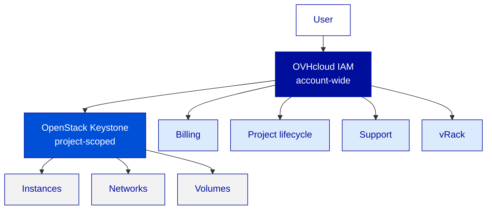
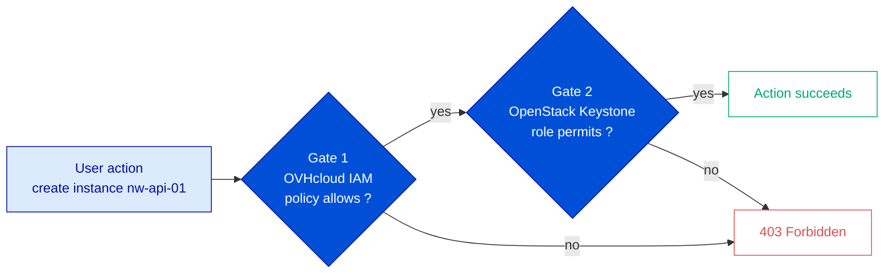
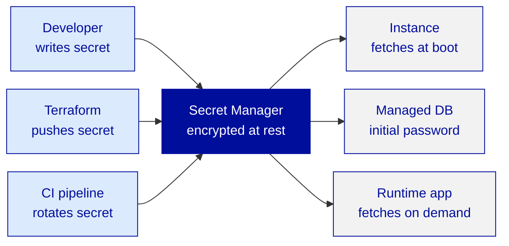
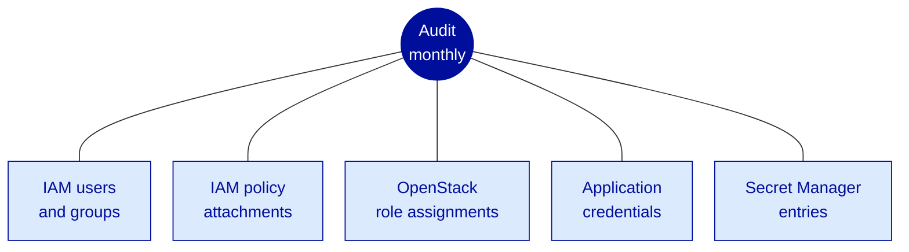

---
# ============================================================
# Module 2.5 -- Identity, Access & Security -- Beyond Basics
# Slidev source file
# ============================================================
theme: ../../theme-ovhcloud
title: Identity, Access & Security -- Beyond Basics
info: |
  ## OVHcloud -- Public Cloud -- Core Associate
  Module 2.5 -- Identity, Access & Security -- Beyond Basics.
  Duration: 1h30.
class: text-left
highlighter: shiki
lineNumbers: false
drawings:
  persist: false
transition: slide-left
mdc: true
exportFilename: 'modules/module-2-5/student_export'

# Hide the floating navbar / controls overlay in dev mode
controls: false
download: false
selectable: true

# Module-level metadata (consumed by trainer-notes export and CI)
moduleId: "2.5"
moduleTitle: "Identity, Access & Security -- Beyond Basics"
duration: "1h30"
program: "OVHcloud -- Public Cloud -- Core Associate"
los:
  - LO-SEC-K01
  - LO-SEC-K02
  - LO-SEC-K03
  - LO-SEC-K04
  - LO-SEC-K05
  - LO-SEC-K06
  - LO-SEC-S01
  - LO-SEC-S02
  - LO-SEC-S03
  - LO-SEC-S04
  - LO-SEC-S05
  - LO-SEC-A01
  - LO-SEC-A02
# COVER SLIDE
layout: cover
---

# Identity, Access & Security
## Beyond Basics

<!--
Trainer notes Cover slide:
- Welcome to the closing module of Day 2. End of afternoon, learners are tired but the module is high-value.
- Frame the shift : 2.4 closed the network domain on a production-shape topology. 2.5 closes Day 2 on a production-shape identity model.
- Announce : at the end of 1h30, the Northwind project has separated developer identity, an application credential for the backup job, secrets externalized to Secret Manager, and one audit finding resolved.
- Set expectations : slide 4 (two gates in sequence, IAM then Keystone) is the pivot of the module. Pre-flag it.
- Anticipate confusions : OVHcloud IAM vs OpenStack Keystone (the recurring confusion), application credentials vs personal credentials (the high-leverage habit), Secret Manager vs KMS (don't conflate).
- Dense module : 13 LOs in 90 min. The audit reflex is the take-home posture, not a passing skill.
-->

---
layout: default
moduleId: "2.5"
slideId: "Agenda"
---

# Agenda

**Block 1 -- Sentier battu** &middot; 5 min
*Prerequisites & remediation pointers*

**Block 2 -- Theory** &middot; 30 min
*Two-layer IAM &middot; Policy structure &middot; Roles &middot; App credentials &middot; Secret Manager &middot; KMS &middot; Audit reflex*

**Block 3 -- Demo** &middot; 15 min
*IAM user + group + policy &middot; Application credential &middot; Secret Manager &middot; Five-catalog audit*

**Block 4 -- Lab** &middot; 30 min
*Separate identities, scope credentials, externalize secrets, audit*

**Block 5 -- Micro-check** &middot; 5 min
*Formative QCM, 8 questions*

**Block 6 -- Wrap-up** &middot; 5 min
*Recap & transition to Module 3.1 (IaC Essentials)*

<!--
Trainer notes Agenda:
- Module hybride : Manager UI pour IAM users / groups / policies / Secret Manager, OpenStack CLI pour application credentials et role assignments.
- Verifier que la salle a un access admin sur l'organisation OVHcloud (sinon impossible de creer un IAM user). Sinon prevoir le compte demo prepare.
- Annoncer le double browser : une fenetre normale en tant que trainer, une fenetre privee en tant que <initials>-northwind-developer pour valider le scoping en temps reel.
- Strict timing 90 min. Slide la plus importante : slide 4 (les deux gates IAM puis Keystone). Pre-annoncer.
- Le module ferme Day 2. Annoncer Day 3 demarre par IaC Essentials (3.1).
-->

---
layout: section
block: "Block 1"
duration: "5 min"
---

# Before we start
### Prerequisites & remediation

---
layout: two-cols
moduleId: "2.5"
slideId: "S00a -- You are ready if..."
---

# Before we start (1/2)

::left::

<strong style="color: var(--ovh-masterbrand-blue); font-size: 1.1rem;">Tools</strong>

&middot; Northwind stack from Mod 2.4 : Gateway in place, LB with HTTPS fronting the web tier, API + DB private-only 
&middot; <code>backup-pg.sh</code> deployed on <code>nw-db-01</code>, currently sourcing the operator's personal <code>openrc.sh</code> 
&middot; Admin-level access on the OVHcloud organization (to create IAM users, groups, policies) 
&middot; A second browser, private window, to test the new IAM user without signing out 
&middot; The OVHcloud API console <code>api.ovh.com/console</code> reachable

::right::

<strong style="color: var(--ovh-masterbrand-blue); font-size: 1.1rem;">Knowledge</strong>

&middot; Basic IAM concepts from Mod 1.2 : project membership, OpenStack roles <code>administrator</code> / <code>member</code> / <code>reader</code> 
&middot; The <code>openrc.sh</code> pattern : env vars consumed by the OpenStack CLI 
&middot; Object Storage S3 access keys from Mod 2.1 (access key + secret key) 
&middot; Service account notion from legacy IT : a non-human identity used by a process, separate lifecycle from any human 
&middot; Discipline : never log a secret, never commit a secret to a repo

<!--
Trainer notes S00a You are ready if:
- Demander : "Votre Northwind stack avec LB + Gateway de 2.4 est toujours up ?" Si plus de 30% out, lancer recover-network-state.sh du Mod 2.4 en parallele pendant l'intro.
- Verifier que tous les learners ont l'admin OVHcloud sur leur organisation. Si pas le cas (training en entreprise, compte d'org partage) : prevenir et basculer sur le compte demo prepare.
- Souligner que le module utilise BEAUCOUP la Manager UI : verifier que la connexion fonctionne avant de demarrer.
- Confirmer que les learners savent ouvrir une fenetre privee dans leur navigateur. Ca parait trivial mais c'est un blocage frequent.
-->

---
layout: two-cols
moduleId: "2.5"
slideId: "S00b -- If not, here's where to look"
---

# Before we start (2/2)

::left::

<strong style="color: var(--ovh-masterbrand-blue); font-size: 1.1rem;">Stack or services missing</strong>

&middot; <strong>Mod 2.4 state missing ?</strong> &rarr; run <code>module-2-4/recover-network-state.sh</code>, idempotent, ~5 min 
&middot; <strong>No admin access on the OVHcloud org ?</strong> &rarr; trainer provides a pre-baked sub-account with admin rights scoped to a dedicated training org 
&middot; <strong><code>backup-pg.sh</code> not in place ?</strong> &rarr; lab handout includes a one-line <code>curl | bash</code> to redeploy the script and its systemd timer 
&middot; <strong>Personal <code>openrc.sh</code> committed to a repo ?</strong> &rarr; flag it now, address it in the audit step of the lab

::right::

<strong style="color: var(--ovh-masterbrand-blue); font-size: 1.1rem;">Concept confusions to preempt</strong>

&middot; <strong>OVHcloud IAM vs OpenStack Keystone ?</strong> &rarr; two layers, both required. IAM = account-wide (Manager, billing, projects). Keystone = inside one project (instances, networks) 
&middot; <strong>Why two IAM layers ?</strong> &rarr; OpenStack ships its own identity (Keystone). OVHcloud wraps the wider account around it. Architecture, not arbitrary 
&middot; <strong>Secret Manager vs KMS ?</strong> &rarr; Secret Manager stores secrets (passwords, API keys). KMS manages encryption keys. Different jobs 
&middot; <strong>Persona Digital Starter alone ?</strong> &rarr; same patterns, future-self benefits + rotation hygiene

<!--
Trainer notes S00b If not where to look:
- Anticiper la confusion IAM vs Keystone : si elle reapparait pendant la Theory, c'est qu'on n'a pas suffisamment pose le perimetre ici.
- Si plus de 30% de la salle a besoin du recover script, le lancer en parallele du Sentier battu, ne pas attendre.
- Pour le persona Digital Starter (souvent solo) : insister sur les 3 raisons de slide 11 (future-self, futur recrutement, rotation hygiene). Sinon ils zappent.
- Cloturer en confirmant : Northwind stack up, admin OVHcloud OK, backup-pg.sh present, fenetre privee testee.
-->

---
layout: section
block: "Block 2"
duration: "30 min"
---

# Theory & Concepts
### Two-layer IAM, policies, roles, app credentials, secrets, KMS, audit

---
layout: default
moduleId: "2.5"
slideId: "S01 -- Where we left off"
los: ["LO-SEC-A01"]
---

# Where we left off &mdash; network is production-shape, identity is not

<strong>End of Module 2.4</strong>

&middot; LB with HTTPS in front of the web tier 
&middot; Gateway retiring public IPs on API + DB 
&middot; Tiered Security Groups, default-deny ingress 
&middot; Anti-DDoS included at the backbone level 
&middot; <em>Network looks like real production.</em>

<strong>What the network does not solve</strong>

&middot; PostgreSQL password in plaintext in <code>config.yaml</code> 
&middot; Backup cron sources the operator's personal <code>openrc.sh</code> 
&middot; Every project member has <code>administrator</code> by default 
&middot; One flat SSH key shared across the team 
&middot; <em>The first audit finds all of this.</em>

<strong style="color: var(--ovh-masterbrand-blue);">Module 2.5 overlays production-shape identity</strong>&nbsp;: <strong>IAM scoped per role</strong> &middot; <strong>application credentials</strong> for automation &middot; <strong>Secret Manager</strong> for secrets &middot; <strong>audit reflex</strong> across five catalogs.

<!--
Trainer notes S01 Where we left off:
- Demander : "vous deploieriez ca en prod aujourd'hui ?" Laisser le silence. La salle se positionne.
- Souligner que le reseau est OK, l'identite ne l'est pas. C'est la suite logique de la sequence pedagogique.
- Annoncer les 4 piliers du module : IAM + app credentials + Secret Manager + audit. Tous les 4 sont touches dans le lab.
- Anticiper : "pourquoi pas tout en meme temps des le debut ?" : pedagogique, on construit la stack par couches, chaque couche refait passer la precedente au crible.
-->

---
layout: default
moduleId: "2.5"
slideId: "S02 -- Two identity layers"
los: ["LO-SEC-K01"]
---

# Two identity layers coexist &mdash; both are always present

<strong>OVHcloud IAM &middot; account-wide</strong> 
Sign-in to the Manager. Billing visibility. Project lifecycle. Support tickets. vRack. <strong>IAM management itself.</strong>

<strong style="color: var(--ovh-masterbrand-blue);">OpenStack Keystone &middot; project-scoped</strong> 
Inside one Public Cloud project : create instances, attach volumes, modify Security Groups, manage networks.

<!--
Trainer notes S02 Two identity layers:
- Slide structurant. Y passer 2 min pleines.
- Analogie legacy : OVHcloud IAM = AD au niveau de l'entreprise, Keystone = groupes locaux sur un serveur. La salle qui vient de legacy accroche immediatement.
- Pour ex-AWS : "AWS n'a qu'un seul IAM. OVHcloud en a deux parce que Public Cloud est OpenStack-native, Keystone fait partie de l'upstream open-source."
- Anticiper "pourquoi pas tout fusionner ?" : reponse au slide suivant + en FAQ. Hold the question.
- Demander : "ou se trouve la decision de creer un projet ?" : couche IAM. "Ou se trouve la decision de creer une instance dans le projet ?" : couche Keystone. Verifier que la salle suit.
-->

---
layout: default
moduleId: "2.5"
slideId: "S03 -- What lives in each layer"
los: ["LO-SEC-K01"]
---

# What lives in each layer

<strong>OVHcloud IAM</strong>

&middot; <strong>Users</strong> : individual identities, password + optional MFA, or federated via SAML / OIDC 
&middot; <strong>Groups</strong> : containers for users, the maintainable unit for policy attachment 
&middot; <strong>Policies</strong> : JSON-like documents declaring allowed and denied actions 
&middot; <strong>Roles</strong> (legacy, account-level) : predefined bundles (<code>administrator</code>, <code>accounting</code>), being superseded by policies 
&middot; <strong>Identity providers</strong> : SSO entry point (Pro+, awareness here) 
&middot; <strong>Audit log</strong> : who did what, when

<strong style="color: var(--ovh-masterbrand-blue);">OpenStack Keystone</strong>

&middot; <strong>Projects</strong> : the OpenStack isolation unit, one OVHcloud Public Cloud project = one Keystone project 
&middot; <strong>Users</strong> : the Keystone-side view of the OVHcloud identities granted access to the project 
&middot; <strong>Roles</strong> : <code>administrator</code>, <code>member</code>, <code>reader</code> (per-project, not global) 
&middot; <strong>Application credentials</strong> : project-scoped tokens, attached to a role, with an optional expiry 
&middot; <strong>Horizon</strong> : the OpenStack UI 
&middot; <strong>OpenStack CLI &middot; Terraform OpenStack</strong> : authenticate against Keystone

<!--
Trainer notes S03 What lives in each layer:
- Ne pas surinvestir sur les Roles legacy account-level cote IAM. Le pattern moderne est policy-driven, c'est ce qu'on enseigne.
- Insister sur "users in groups, policies on groups" : c'est le pattern maintenable. On le repete slide 5 et slide 7.
- Cote Keystone : les 3 roles sont stables sur toutes les regions OVHcloud, pas d'exception regionale a memoriser.
- Anticiper : "MFA obligatoire ?" : recommande fortement, peut etre enforced au niveau de l'organisation.
- Pour ex-AWS : Keystone = pas d'assume-role. C'est la principale difference avec AWS IAM, a flagger.
-->

---
layout: default
moduleId: "2.5"
slideId: "S04 -- Two gates in sequence"
los: ["LO-SEC-K01"]
---

# Every Public Cloud action passes two gates &mdash; in sequence

<strong>Gate 1 &middot; OVHcloud IAM</strong> 
At the OVHcloud API edge : is the caller authenticated ? Is a policy allowing this action on this resource type ? Failure &rarr; the call never reaches OpenStack.

<strong>Gate 2 &middot; OpenStack Keystone</strong> 
At the OpenStack API edge : does the caller have a role on this project permitting this OpenStack call ? Failure &rarr; <code>403 Forbidden</code>, classic OpenStack error.

<strong style="color: var(--ovh-masterbrand-blue);">Reading the failure mode</strong>&nbsp;: <em>"IAM allows but the call fails"</em> = Gate 2 closed (no Keystone role). <em>"User cannot sign in at all"</em> = Gate 1 closed (no IAM access).

<!--
Trainer notes S04 Two gates in sequence:
- Slide PIVOT du module. Si la salle le comprend, le reste suit. Si elle le rate, on revient ici.
- Insister : sequence, pas parallele. Gate 1 doit dire oui pour qu'on atteigne Gate 2.
- Anticiper : "et si je donne IAM mais pas Keystone, qu'est-ce que je vois ?" : le projet apparait dans la Manager mais "vide" : pas d'instances, pas de volumes. Le user crois que le projet est cassé, alors qu'il manque juste un role.
- Reformuler pour Digital Starter : "si vous etes seul, les deux gates sont grand ouvertes pour vous par defaut. Ca compte quand vous ajoutez quelqu'un."
- Demander a la fin : "ou se passe la decision quand un IAM user veut creer une instance ?" : reponse attendue, Gate 1 valide la policy IAM, Gate 2 valide le role Keystone sur le projet.
-->

---
layout: default
moduleId: "2.5"
slideId: "S05 -- IAM policy structure"
los: ["LO-SEC-K02"]
---

# IAM policy structure &mdash; four ingredients

<strong>Subject &middot; who</strong>

&middot; A user, a group, or an identity-provider role 
&middot; <strong>Groups are the maintainable pattern.</strong> Users join groups 
&middot; Per-user attachment : only for documented exceptions

<strong>Resource &middot; on what</strong>

&middot; URN syntax : <code>urn:v1:eu:resource:publicCloud:&lt;projectId&gt;</code> 
&middot; Identifies a service path, a project, an instance, etc. 
&middot; Wildcards allowed at the segment level

<strong style="color: var(--ovh-masterbrand-blue);">Action &middot; what</strong>

&middot; Colon-separated hierarchy : <code>publicCloud:operate:instance:create</code> 
&middot; Wildcards : <code>publicCloud:operate:instance:*</code>, <code>publicCloud:*</code> 
&middot; Use the action picker in the Manager. Hand-writing URNs &rarr; typos &rarr; silent zero-grant

<strong style="color: var(--ovh-masterbrand-blue);">Condition &middot; when</strong>

&middot; Optional. Narrows the rule by context 
&middot; Source IP range, MFA presence, time window 
&middot; Often empty at the Associate scope

  <strong>Rules combine with deny overrides allow.</strong> Same as AWS IAM, same as POSIX file ACLs. Useful for guardrails (deny project deletion on top of an allow-everything-else policy).

<!--
Trainer notes S05 IAM policy structure:
- Si possible, ouvrir la Manager UI et montrer une policy predefinie en direct (Public Cloud Operator est la plus propre).
- Insister sur "use the action picker". Les URN ecrites a la main sont une source de bugs silencieux : le user croit avoir la permission, la policy ne matche pas, le call est refuse, on cherche pendant 1h.
- Anticiper Corporate : "AD ressemble. C'est la meme logique deny-overrides-allow." OK comme intuition, mais l'attachment IAM est plus flexible que AD GPO.
- Pour Digital Starter : "vous ne creerez pas de policy custom au debut. Vous utiliserez les predefined. Slide 6."
- Anticiper : "et si deux groupes du meme user ont des policies contradictoires ?" : deny gagne. Toujours.
-->

---
layout: default
moduleId: "2.5"
slideId: "S06 -- Predefined IAM policies"
los: ["LO-SEC-K02", "LO-SEC-A01"]
---

# Predefined IAM policies &mdash; start here, customize only when needed

<table style="width:100%; border-collapse: collapse;">
<thead>
<tr style="background: var(--ovh-masterbrand-blue); color: white;">
<th style="padding: 6px 8px; text-align: left;">Predefined policy</th>
<th style="padding: 6px 8px; text-align: left;">Scope</th>
<th style="padding: 6px 8px; text-align: left;">Typical persona</th>
</tr>
</thead>
<tbody>
<tr style="background: #F2F2F2;">
<td style="padding: 6px 8px;"><strong>Public Cloud Operator</strong></td>
<td style="padding: 6px 8px;">Read + write on Public Cloud, no billing, no project deletion</td>
<td style="padding: 6px 8px;">Developer, SRE</td>
</tr>
<tr>
<td style="padding: 6px 8px;"><strong>Public Cloud Read-only</strong></td>
<td style="padding: 6px 8px;">Read everywhere in Public Cloud, write nowhere</td>
<td style="padding: 6px 8px;">Auditor, consultant</td>
</tr>
<tr style="background: #F2F2F2;">
<td style="padding: 6px 8px;"><strong>Billing Read-only</strong></td>
<td style="padding: 6px 8px;">Billing visibility, zero on infrastructure</td>
<td style="padding: 6px 8px;">Finance, accounting</td>
</tr>
<tr>
<td style="padding: 6px 8px;"><strong>Support Operator</strong></td>
<td style="padding: 6px 8px;">Create and follow support tickets</td>
<td style="padding: 6px 8px;">Ops on-call</td>
</tr>
<tr style="background: #F2F2F2;">
<td style="padding: 6px 8px;"><strong>Administrator</strong></td>
<td style="padding: 6px 8px;">Everything, including IAM management</td>
<td style="padding: 6px 8px;">Cloud admin (one or two people)</td>
</tr>
</tbody>
</table>

<strong>Production workflow</strong> 
<strong>Duplicate &middot; rename &middot; trim &middot; attach to a group.</strong> Never write a custom policy from scratch unless the predefined set genuinely doesn't fit.

<strong style="color: var(--ovh-masterbrand-blue);">A user can carry several policies</strong> 
Via group memberships (recommended) or direct attachments. <strong>Union of allows minus union of denies</strong> decides the effective scope.

<!--
Trainer notes S06 Predefined IAM policies:
- Insister sur "duplicate then trim" comme workflow de production. Plus rapide, moins de bugs, plus facile a reviewer.
- Anticiper Corporate : "on a 12 personas RBAC internes, on peut tout modeliser ?" : oui, IAM est assez flexible. Un groupe par persona, une policy par groupe.
- Persona Digital Starter creera rarement un IAM user au debut. La premiere policy qu'il utilisera : Public Cloud Read-only pour inviter un comptable ou un freelance.
- La table est volontairement courte : ce sont les plus utilisees. Le set evolue, ne pas memoriser une liste exhaustive.
- Anticiper : "et les permissions par projet ?" : se passe au niveau Resource de la policy (URN avec le projectId), et au niveau Keystone role. Slide 4 rappel.
-->

---
layout: default
moduleId: "2.5"
slideId: "S07 -- Application credentials"
los: ["LO-SEC-K04", "LO-SEC-A02"]
---

# Application credentials &mdash; the credential pattern for automation

<strong>Personal credentials in a cron job &middot; antipattern</strong>

&middot; <code>openrc.sh</code> with the operator's username + password 
&middot; Operator leaves the company &rarr; backup chain breaks 
&middot; Credential rotation breaks the cron 
&middot; Personal credentials see far more than the cron needs 
&middot; <strong>Lifecycle of a human bleeds into automation.</strong>

<strong style="color: var(--ovh-masterbrand-blue);">Application credentials &middot; the right tool</strong>

&middot; Issued by Keystone, scoped to <strong>one project</strong> 
&middot; Attached to <strong>one role</strong> (<code>member</code> recommended) 
&middot; Optional expiry &rarr; rotation discipline 
&middot; <strong>Decoupled from any human's lifecycle</strong> 
&middot; Two parts : <strong>ID</strong> (public-ish) + <strong>secret</strong> (sensitive)

  <strong>The reflex <code>A02</code> : any non-interactive workload uses an application credential.</strong> No exceptions. Cron jobs, Terraform, CI/CD, observability agents, backup scripts.

<!--
Trainer notes S07 Application credentials:
- Slide haute-leverage. C'est le reflex A02 qu'on veut ancrer.
- AWS cross-ref : esprit similaire aux STS short-lived credentials d'une EC2 instance role. But identique, mecanisme different.
- Anticiper : "et l'expiry, je mets combien ?" : matcher la cadence de rotation du consumer. 90 jours est un default raisonnable. 24h pour un demo.
- Le flag --unrestricted : permet de creer d'autres app credentials. Default est restricted. Ne pas activer --unrestricted sauf cas tres specifique (slide FAQ).
- Montrer le path Horizon en demo : Identity -> Application Credentials -> Create.
- Pour Digital Starter : "meme seul, vous separez ce qui tape dans la Manager (votre identite) de ce que vos scripts utilisent (l'app credential). Sinon vous rotatez tout en panique le jour ou vous changez de mot de passe."
-->

---
layout: default
moduleId: "2.5"
slideId: "S08 -- Secret Manager"
los: ["LO-SEC-K05"]
---

# Secret Manager &mdash; where credentials and secrets actually live

<strong>What it is</strong> 
A managed secret store. Secrets are written, read, and rotated through the OVHcloud API. Access controlled via OVHcloud IAM &mdash; <strong>same policy mechanic</strong> as any other OVHcloud resource.

<strong style="color: var(--ovh-masterbrand-blue);">Typical pattern</strong> 
Store once. Configure the consumer to <strong>fetch at boot</strong> or on demand via the OVHcloud API using an application credential. Rotation = write a new version, consumer fetches latest at next refresh.

  <strong>Principle</strong>&nbsp;: if your config file contains a password, your config file is a secret. <strong>Externalize.</strong> AWS analogy = AWS Secrets Manager. Same pattern.

<!--
Trainer notes S08 Secret Manager:
- Insister sur le principe : un fichier de config avec un password = un secret. Pas autorise dans un repo, pas autorise dans une VM image.
- Anti-pattern a souligner : hardcoder un password dans un fichier Terraform state. Le state n'est pas chiffre at rest par defaut, c'est un audit fail.
- Anticiper : "latence d'un fetch Secret Manager ?" : sub-seconde en same-region. Usage typique = read-once-at-boot, pas read-on-every-request.
- Secret Manager est un produit relativement jeune sur OVHcloud. La parite avec AWS Secrets Manager evolue. Renvoyer vers docs.ovhcloud.com pour les specifics.
- Pour Digital Starter : "meme si vous n'avez qu'une instance, mettre le password en Secret Manager vous evite de le commiter par accident le jour ou vous publiez votre Terraform sur GitHub."
-->

---
layout: default
moduleId: "2.5"
slideId: "S09 -- KMS awareness"
los: ["LO-SEC-K06"]
---

# KMS &mdash; what the Associate level needs to know

<table style="width:100%; border-collapse: collapse;">
<thead>
<tr style="background: var(--ovh-masterbrand-blue); color: white;">
<th style="padding: 6px 8px; text-align: left;">Pattern</th>
<th style="padding: 6px 8px; text-align: left;">Who controls the key</th>
<th style="padding: 6px 8px; text-align: left;">Where you see it today on Core</th>
</tr>
</thead>
<tbody>
<tr style="background: #F2F2F2;">
<td style="padding: 6px 8px;"><strong>Service-Managed Keys</strong></td>
<td style="padding: 6px 8px;">OVHcloud generates, stores, rotates &mdash; transparent to the customer</td>
<td style="padding: 6px 8px;">Object Storage at rest &middot; Block Storage &middot; Secret Manager (default)</td>
</tr>
<tr>
<td style="padding: 6px 8px;"><strong>Customer-Managed Keys</strong></td>
<td style="padding: 6px 8px;">Customer creates the key in OVHcloud KMS, grants the service the right to use it, can revoke</td>
<td style="padding: 6px 8px;">Selected services, list evolving &mdash; check <code>docs.ovhcloud.com</code></td>
</tr>
<tr style="background: #F2F2F2;">
<td style="padding: 6px 8px;"><strong>No key visible</strong></td>
<td style="padding: 6px 8px;">Encrypted at rest, key never exposed</td>
<td style="padding: 6px 8px;">Some platform-internal stores</td>
</tr>
</tbody>
</table>

<strong>At the Associate scope</strong> 
Awareness, not skill. Know that <strong>who controls the key</strong> matters more than how the cryptography works. AWS analogy = AWS KMS with customer-managed CMKs.

<strong style="color: var(--ovh-masterbrand-blue);">Audit-friendly pattern</strong> 
Customer-managed keys for compliance workloads (when available on the service). Service-managed for everything else.

<!--
Trainer notes S09 KMS awareness:
- Honnete avec la salle : ce slide est awareness, pas skill. Pas de lab KMS, pas de QCM lourd.
- L'integration customer-managed-keys est en cours de deploiement service par service. Ne pas memoriser une liste, elle sera obsolete avant l'examen.
- Anticiper le profil regulated-industry : "HSM-backed keys ?" : existe sur Hosted Private Cloud et certains Bare Metal, hors scope Public Cloud Core Associate.
- AWS cross-ref : AWS KMS avec customer-managed CMKs. Meme split de responsabilite, meme primitives d'audit.
- Renvoi explicite vers docs.ovhcloud.com pour les details. La calibration honnete est mieux recue qu'une fausse autorite.
-->

---
layout: default
moduleId: "2.5"
slideId: "S10 -- The audit reflex"
los: ["LO-SEC-S05", "LO-SEC-A01"]
---

# The audit reflex &mdash; five catalogs to cross-check

<strong>What each catalog tells you</strong> 
&middot; <strong>IAM users &amp; groups</strong> &mdash; who exists, who belongs where 
&middot; <strong>Policy attachments</strong> &mdash; the authorization rules in effect 
&middot; <strong>OpenStack roles</strong> &mdash; <code>openstack role assignment list --project &lt;name&gt; --names</code> 
&middot; <strong>App credentials</strong> &mdash; <code>openstack application credential list</code> 
&middot; <strong>Secret Manager</strong> &mdash; secrets, ages, references

<strong style="color: var(--ovh-masterbrand-blue);">The reflex itself</strong> 
Walk the five catalogs <strong>monthly</strong>. For each entry, ask : <em>is this still justified ?</em> Anything not justified &rarr; revoke. <strong>The goal is not zero findings &mdash; the goal is to know where findings are.</strong>

<!--
Trainer notes S10 The audit reflex:
- Slide qui ancre A01 (segmentation) et S05 (audit). Les deux reviennent au lab.
- Cadrer pragmatiquement : "le but n'est pas zero findings, le but est de savoir ou sont les findings." Les operations matures ont toujours des findings : la difference est qu'ils sont connus.
- Pour Digital Starter solo : "meme seul, faites cet audit une fois par trimestre. Les credentials orphelins sont le footing #1 des incidents en self-service."
- Demander : "lequel des 5 catalogues va trahir un developer parti depuis 6 mois ?" : reponse : tous les 5 potentiellement. C'est pourquoi on les croise.
- Anticiper : "comment automatiser cet audit ?" : a la main au niveau Associate. Industrialisation = sujet Module 3.2 Operations + IaC Module 3.1.
-->

---
layout: default
moduleId: "2.5"
slideId: "S11 -- Corporate IAM segmentation"
los: ["LO-SEC-A01"]
---

# Corporate IAM segmentation &mdash; a defensible template

<table style="width:100%; border-collapse: collapse;">
<thead>
<tr style="background: var(--ovh-masterbrand-blue); color: white;">
<th style="padding: 5px 7px; text-align: left;">Persona</th>
<th style="padding: 5px 7px; text-align: left;">IAM group</th>
<th style="padding: 5px 7px; text-align: left;">IAM policy attached</th>
<th style="padding: 5px 7px; text-align: left;">Role on production</th>
<th style="padding: 5px 7px; text-align: left;">Role on dev</th>
</tr>
</thead>
<tbody>
<tr style="background: #F2F2F2;">
<td style="padding: 5px 7px;"><strong>Cloud Admin</strong></td>
<td style="padding: 5px 7px;"><code>admins</code></td>
<td style="padding: 5px 7px;"><code>Administrator</code></td>
<td style="padding: 5px 7px;"><code>administrator</code> (2 pax max)</td>
<td style="padding: 5px 7px;"><code>administrator</code></td>
</tr>
<tr>
<td style="padding: 5px 7px;"><strong>Developer</strong></td>
<td style="padding: 5px 7px;"><code>developers</code></td>
<td style="padding: 5px 7px;"><code>Public Cloud Operator</code></td>
<td style="padding: 5px 7px;"><code>reader</code></td>
<td style="padding: 5px 7px;"><code>member</code></td>
</tr>
<tr style="background: #F2F2F2;">
<td style="padding: 5px 7px;"><strong>SRE on-call</strong></td>
<td style="padding: 5px 7px;"><code>sre</code></td>
<td style="padding: 5px 7px;"><code>Public Cloud Operator</code></td>
<td style="padding: 5px 7px;"><code>member</code></td>
<td style="padding: 5px 7px;"><code>member</code></td>
</tr>
<tr>
<td style="padding: 5px 7px;"><strong>Auditor</strong> (annual)</td>
<td style="padding: 5px 7px;"><code>auditors</code></td>
<td style="padding: 5px 7px;"><code>Public Cloud Read-only</code></td>
<td style="padding: 5px 7px;"><code>reader</code></td>
<td style="padding: 5px 7px;"><code>reader</code></td>
</tr>
<tr style="background: #F2F2F2;">
<td style="padding: 5px 7px;"><strong>Billing</strong></td>
<td style="padding: 5px 7px;"><code>billing</code></td>
<td style="padding: 5px 7px;"><code>Billing Read-only</code></td>
<td style="padding: 5px 7px;">&mdash;</td>
<td style="padding: 5px 7px;">&mdash;</td>
</tr>
</tbody>
</table>

  <strong style="color: var(--ovh-masterbrand-blue);">Principle</strong>&nbsp;: map to <strong>how the company actually works</strong>, not to OVHcloud-specific abstractions. Write the mapping once, link it from the team onboarding doc. This is the deliverable you defend to the auditor.

<!--
Trainer notes S11 Corporate IAM segmentation:
- Slide qui ancre A01. Laisser respirer 1 min.
- Anticiper Corporate : "on a un AD avec SSO, on peut le brancher ?" : oui, IAM supporte SAML. Le groupe AD devient la source du groupe IAM via federation.
- Pour Digital Starter (rarement 4 personas) : "le principe scope-by-role-not-by-person tient meme a 1 operator. Un groupe me-as-operator, un groupe me-as-billing, attaches a la meme identite. On desactive l'un quand on change de contexte."
- L'auditeur annuel est l'exemple typique de IAM lifecycle : creer pour la mission, deactiver a la fin. Une regle simple : la date de fin dans le nom du user (auditor-2026-Q4).
- Eviter d'entrer dans les nuances par-environnement. Si la salle pousse : "production = read seulement pour les devs, member pour le SRE on-call, c'est la regle de base."
-->

---
layout: section
block: "Block 3"
duration: "15 min"
---

# Trainer demonstration
### Production-shape identity overlay on the Northwind project

---
layout: default
moduleId: "2.5"
slideId: "Demo -- Overview"
los: ["LO-SEC-S01", "LO-SEC-S02", "LO-SEC-S03", "LO-SEC-S04", "LO-SEC-S05"]
---

# Demo &mdash; the four moves, on the running Northwind project

<strong>What you will see</strong>

&middot; Create an IAM user <code>demo-developer</code> 
&middot; Create a group <code>demo-devs</code> with a trimmed <code>Public Cloud Operator</code> policy 
&middot; Validate in a private browser : the user sees but cannot delete the project 
&middot; Generate an OpenStack application credential, role <code>member</code>, 24h expiry, restricted 
&middot; Confirm the credential works and is properly scoped 
&middot; Create a Secret Manager entry, fetch it from <code>demo-api-01</code> 
&middot; 60-second audit across the five catalogs &rarr; surface a planted over-privilege

<strong style="color: var(--ovh-masterbrand-blue);">Why this matters</strong>

At the end of the demo, you've seen the four moves in action on a real project. Channels : <strong>Manager UI</strong> for IAM and Secret Manager, <strong>Horizon</strong> for the application credential, <strong>OpenStack CLI</strong> for verification and audit, <strong>SSH</strong> for the in-instance fetch.

  Starting from : Northwind demo project &middot; Trainer = admin on the org &middot; Mod 2.4 state still in place

  12 steps &middot; ~12 min walkthrough &middot; 3 min Q&amp;A

<!--
Trainer notes Demo Production-shape identity:

PRE-FLIGHT (do BEFORE the block):
- Two browsers open : one trainer (admin), one private window (will sign in as demo-developer at step 4).
- Demo Northwind project still in place with the Mod 2.4 output state.
- Pre-plant the over-privilege : the trainer's own account has administrator on the demo project. Slide 10 audit will surface it.
- One orphan IAM user created earlier (no group, no policy) for the audit step.
- fetch-secret.sh deployed on demo-api-01 at /usr/local/bin/ (one-liner from the lab handout).
- Terminal at 16pt+, dark background.

DEMO SCRIPT (12 steps, ~12 min):
1. Manager UI -> Identity and Access -> Users -> Add user demo-developer, temporary password. "MFA enforced au niveau org, ils auront a setup a la premiere connexion."
2. Identity -> Policies -> Public Cloud Operator -> Duplicate -> rename demo-developer-policy -> trim publicCloud:projects:delete. "Duplicate-and-trim. Le deny sur project deletion est le guardrail standard pour les devs."
3. Identity -> Groups -> Add group demo-devs -> attach demo-developer-policy -> add demo-developer to the group. "Les groups owns les policies. Les users join les groups. Pattern maintenable."
4. Open private browser window, sign in as demo-developer, navigate to Public Cloud -> demo project. "Le projet est visible. Try to delete -> bloque. Try to view billing -> bloque. Two minutes de validation epargnent un audit finding."
5. Horizon UI (trainer browser) -> demo project -> Identity -> Application Credentials -> Create demo-backup-cred, role member, 24h expiry, unrestricted OFF. "Lire le secret maintenant, il ne reviendra pas. Restricted est le default safe."
6. Source l'app credential openrc.sh dans un terminal frais, openstack server list. "App credential marche, scope member."
7. Tenter openstack image create --public test.img. 403 Forbidden, admin required. "Scope restreint confirme. Si notre script tente ca, il echoue fast. C'est ce qu'on veut."
8. Manager UI -> Secret Manager -> Add secret demo-postgres-password avec valeur sample. "Stocke chiffre at rest. On grant l'acces a l'identite consommatrice."
9. SSH demo-api-01, fetch-secret.sh demo-postgres-password. Valeur retournee sur stdout (demo only, jamais loggee en prod). "Au lab vous le piperez dans le service environment via systemd ExecStartPre."
10. Trainer terminal : openstack role assignment list --project demo --names. "Cinq lignes. Mon compte trainer a administrator -> devrait etre member. Audit finding #1 en 5 secondes."
11. Manager UI -> Identity -> filtre users not in any group. Un orphan apparait (planted). "Audit finding #2 : orphan user, soit on supprime, soit on assigne a un group."
12. openstack application credential list. Trois credentials listes, un avec expiry dans le passe. "Audit finding #3 : credential expire encore liste. Cleanup."

FAILURE MODES:
- Step 4 sign-in fail : propagation IAM, jusqu'a 30s. Refresh le private window apres une pause.
- Step 6 openstack server list fail : ligne OS_AUTH_TYPE=v3applicationcredential manquante dans l'openrc.sh. Le download Horizon l'inclut, les edits manuels la perdent souvent.
- Step 9 fetch-secret.sh 403 : l'app credential n'a pas la policy read sur le secret. Le lab handout walk-through l'explique ; ici si ca arrive, le presenter comme un audit reflex en direct.
- Step 10 openstack role assignment list retourne rien : ajouter --project-domain default. Sur OVHcloud le domain est default mais le CLI le demande parfois selon la version.

Q&A (3 min) : focus sur la difference IAM vs Keystone et le concept d'application credential. Parking pour le lab : everything else.
-->

---
layout: section
block: "Block 4"
duration: "30 min"
---

# Separate identities, scope credentials, externalize secrets
### Your turn. Solo. 30 minutes.

---
layout: default
moduleId: "2.5"
slideId: "Lab -- Brief"
los: ["LO-SEC-S01", "LO-SEC-S02", "LO-SEC-S03", "LO-SEC-S04", "LO-SEC-S05"]
---

# Lab &mdash; Production-shape Northwind identity

You are Northwind's Cloud Ops engineer. The CTO walks back in : <em>"The PostgreSQL password is in a config file. The backup script uses your personal openrc. Everyone in the project is admin. The auditor arrives in three weeks. Fix it."</em> Today you : (1) create a developer IAM identity scoped via a group, (2) generate a backup application credential decoupled from your personal credentials, (3) externalize the PostgreSQL password and the S3 backup secret to Secret Manager, (4) run a five-catalog audit and resolve at least one finding.

<strong style="color: var(--ovh-masterbrand-blue);">Channels</strong>

&middot; <strong>Manager UI</strong> for IAM users / groups / policies and Secret Manager 
&middot; <strong>Horizon UI</strong> for the application credential generation 
&middot; <code>openstack</code> CLI for verification and audit 
&middot; <strong>SSH</strong> for in-instance secret fetch wiring 
&middot; No Terraform today &mdash; IaC integration is Module 3.1

<strong style="color: var(--ovh-masterbrand-blue);">Success criteria</strong>

New IAM user can list but not delete the project &middot; <code>backup-pg.sh</code> runs with the app credential &middot; <code>grep postgres_password /etc/northwind-api/config.yaml</code> returns nothing &middot; the API still responds 200 on <code>/health</code> &middot; audit notes commit at least one resolved finding

  Identity : <code>&lt;initials&gt;-northwind-developer</code> &middot; Group : <code>&lt;initials&gt;-northwind-devs</code> &middot; App credential expiry : <strong>90 days</strong> &middot; Time : 30 min

<!--
Trainer notes Lab Brief:
- Souligner les criteres de succes auto-verifiables : l'apprenant sait s'il a reussi sans demander.
- Lab tres dense pour 30 min : 6 etapes, plusieurs sous-etapes. Surveiller le timing. Si plus de la moitie de la salle est en retard a 20 min, declarer l'etape 5 (S3 secret) optionnelle et la garder en homework.
- Verifier que tous les learners ont admin sur leur org OVHcloud. Si pas le cas, basculer sur le compte demo prepare AVANT le demarrage du lab.
- Annoncer oralement la commande grep finale qui valide l'externalisation du password. Sinon les learners ne savent pas comment auto-valider.

VALIDATION CRITERIA (silent check by trainer):
- Manager UI : <initials>-northwind-developer existe, dans le group <initials>-northwind-devs, policy attachee au group
- Sign-in en private window comme cet user : projet visible, delete bouton absent, billing non accessible
- ssh nw-db-01 : grep -v personal /etc/northwind/backup-openrc.sh confirme app credential
- backup-pg.sh manuel : nouveau objet dans <initials>-nw-backups (openstack object list ... | tail -5)
- ssh nw-api-01 : grep postgres_password /etc/northwind-api/config.yaml retourne nothing
- curl http://localhost:8080/health sur nw-api-01 retourne 200
- <initials>-nw-audit-2.5.md present dans le lab repo avec au moins un finding before/after
-->

---
layout: default
moduleId: "2.5"
slideId: "Lab -- Steps 1/3"
---

# Lab &mdash; Step-by-step (1/3)
### IAM user + group + scoped policy &middot; Manager UI

<strong>1.</strong> Manager UI &rarr; Identity and Access &rarr; Users &rarr; Add user 
&nbsp;&nbsp;Login : <code>&lt;initials&gt;-northwind-developer</code>, temporary password 
<strong>2.</strong> Identity &rarr; Groups &rarr; Add group <code>&lt;initials&gt;-northwind-devs</code> 
<strong>3.</strong> Identity &rarr; Policies &rarr; Public Cloud Operator &rarr; Duplicate 
&nbsp;&nbsp;Rename : <code>&lt;initials&gt;-northwind-dev-policy</code> 
&nbsp;&nbsp;Trim : remove the action <code>publicCloud:projects:delete</code> 
<strong>4.</strong> Attach the custom policy to the <code>&lt;initials&gt;-northwind-devs</code> group 
<strong>5.</strong> Add <code>&lt;initials&gt;-northwind-developer</code> to the group 
<strong>6.</strong> Open a <strong>private browser window</strong>, sign in as <code>&lt;initials&gt;-northwind-developer</code> 
&nbsp;&nbsp;Confirm : Northwind project visible, resources listed 
&nbsp;&nbsp;Confirm : <strong>no Delete button</strong> on the project, billing not accessible 
&nbsp;&nbsp;Close the private window and return to your admin session

<!--
Trainer notes Lab Steps 1/3:
- Slide de reference pour la premiere phase. Laisser projete jusqu'a l'etape 6.
- Insister sur le private window : sans ca, le test fait via le meme browser hesite (cache, cookies). Vrai private window obligatoire.
- A l'etape 3, si la salle veut comprendre la liste exacte des actions dans publicCloud:projects:*, ouvrir le picker au tableau. Sinon ne pas s'attarder.
- A l'etape 6, attention propagation IAM peut prendre 30s. Si sign-in echoue immediatement, attendre puis retry.
- Passer a la slide 2/3 quand la majorite a fini l'etape 6, ou apres 10 min.
-->

---
layout: default
moduleId: "2.5"
slideId: "Lab -- Steps 2/3"
---

# Lab &mdash; Step-by-step (2/3)
### Application credential + secret externalization

<strong>7.</strong> Horizon UI &rarr; Identity &rarr; Application Credentials &rarr; Create 
&nbsp;&nbsp;Name : <code>&lt;initials&gt;-nw-backup-cred</code>, role <code>member</code>, expiry <strong>90 days</strong>, unrestricted <strong>OFF</strong> 
&nbsp;&nbsp;Download the <code>openrc.sh</code>, save as <code>~/.openrc/&lt;initials&gt;-nw-backup.sh</code> 
<strong>8.</strong> Source the new <code>openrc.sh</code> in a fresh terminal, run <code>openstack server list</code> &mdash; verify it works 
<strong>9.</strong> SSH <code>&lt;initials&gt;-nw-db-01</code> (via jump host through the web tier) 
&nbsp;&nbsp;Replace <code>/etc/northwind/backup-openrc.sh</code> with the content of the new app credential <code>openrc.sh</code> 
&nbsp;&nbsp;Run <code>sudo /usr/local/bin/backup-pg.sh</code> manually &mdash; confirm a new object lands in <code>&lt;initials&gt;-nw-backups</code> 
<strong>10.</strong> Manager UI &rarr; Secret Manager &rarr; Add secret <code>&lt;initials&gt;-nw-pg-password</code> 
&nbsp;&nbsp;Value : copy from <code>/etc/northwind-api/config.yaml</code> on <code>&lt;initials&gt;-nw-api-01</code> 
<strong>11.</strong> SSH <code>&lt;initials&gt;-nw-api-01</code>. Edit <code>/etc/systemd/system/northwind-api.service</code> : 
&nbsp;&nbsp;Add <code>ExecStartPre=/usr/local/bin/fetch-secret.sh &lt;initials&gt;-nw-pg-password POSTGRES_PASSWORD</code> 
&nbsp;&nbsp;Remove the <code>postgres_password:</code> line from <code>config.yaml</code> 
&nbsp;&nbsp;<code>sudo systemctl daemon-reload && sudo systemctl restart northwind-api</code> 
&nbsp;&nbsp;Confirm : <code>curl http://localhost:8080/health</code> returns 200

<!--
Trainer notes Lab Steps 2/3:
- A l'etape 7, insister sur "unrestricted OFF". C'est facile a louper et c'est exactement le scope qu'on veut.
- A l'etape 9, beaucoup de learners vont essayer SSH direct sur nw-db-01 qui n'a plus de public IP. Jump host obligatoire. Si pas evident, expliquer au tableau.
- A l'etape 10, le copy-paste du password de config.yaml dans Secret Manager doit etre fait dans la Manager UI (pas dans un terminal). Pas de password en clair dans le shell history.
- A l'etape 11, ExecStartPre est le mecanisme cle : fetch-secret.sh ecrit POSTGRES_PASSWORD dans /run/northwind-api/env qui est ensuite source par EnvironmentFile dans le service. Le password ne touche jamais le disque persistent.
- Passer a la slide 3/3 quand la majorite a fini l'etape 11, ou apres 10 min de plus.
-->

---
layout: default
moduleId: "2.5"
slideId: "Lab -- Steps 3/3"
---

# Lab &mdash; Step-by-step (3/3)
### S3 secret + five-catalog audit

<strong>12.</strong> Same pattern as steps 10-11, on <code>&lt;initials&gt;-nw-db-01</code>, for the S3 secret key 
&nbsp;&nbsp;Secret name : <code>&lt;initials&gt;-nw-s3-secret</code> 
&nbsp;&nbsp;Modify <code>backup-pg.sh</code> to source the S3 secret via <code>fetch-secret.sh</code> instead of the openrc file 
&nbsp;&nbsp;Run the backup once more to confirm 
<strong>13.</strong> Audit checklist &mdash; commit findings to <code>labs/2-5/&lt;initials&gt;-nw-audit-2.5.md</code> : 
&nbsp;&nbsp;a. <code>openstack role assignment list --project northwind --names</code> &rarr; flag any unjustified <code>administrator</code> 
&nbsp;&nbsp;b. Manager &rarr; Identity &rarr; Users, filter <em>not in any group</em> &rarr; flag orphans 
&nbsp;&nbsp;c. <code>openstack application credential list</code> &rarr; flag credentials &gt;60 days or with no expiry 
&nbsp;&nbsp;d. Manager &rarr; Secret Manager &rarr; for each secret <code>grep -r &lt;name&gt; .</code> &rarr; flag unused secrets 
&nbsp;&nbsp;e. <em>(Optional)</em> Rotate one secret : write v2, restart consumer, confirm new value picked up 
<strong>14.</strong> Hand off : share <code>&lt;initials&gt;-northwind-developer</code> username + screenshot of the private-browser session to the trainer

<!--
Trainer notes Lab Steps 3/3:
- L'etape 12 reproduit le pattern de 10-11. Si la salle est en retard, la declarer optionnelle et la garder en homework. Le pattern Secret Manager est ancre.
- L'etape 13 est l'audit reflex. Insister : chaque finding doit etre LOG (before-after) dans le markdown. Un finding non documente = pas de finding.
- A l'etape 13c, la regle ">60 days" est arbitraire mais raisonnable. La vraie regle est "tout credential avec no expiry est suspect" : si c'est encore necessaire, le re-creer avec une expiry explicite.
- A l'etape 13d, le grep peut etre fastidieux. Si le repo est gros, suggere d'utiliser ripgrep (rg <name>) qui est plus rapide.
- L'etape 14 est la validation par le trainer. C'est aussi un exercice pour les learners de demontrer leur travail.
- Annoncer la fin de lab a 5 min avant le timer pour que les learners aient le temps de commiter leurs findings.
-->

---
layout: section
block: "Block 5"
duration: "5 min"
---

# Micro-check
### 8 formative questions, no points

---
layout: default
moduleId: "2.5"
slideId: "MC -- Q1 IAM vs Keystone"
los: ["LO-SEC-K01"]
---

# Q1 &mdash; A user sees the project but it appears empty

An operator signs in to the OVHcloud Manager and sees the Northwind Public Cloud project listed. When they click into it, they cannot see the instances, networks, or volumes. <strong>Most likely cause ?</strong>

<strong>A.</strong> The Northwind project has been deleted

<strong>B.</strong> The user has an OVHcloud IAM grant on the project but no OpenStack role on it

<strong>C.</strong> The user's MFA token expired and the OpenStack API silently downgraded their access

<strong>D.</strong> The Northwind project is in a different OVHcloud region than the user's account

<!--
Trainer notes Q1:
- Correct answer: B. Gate 1 IAM passe (le projet est visible), Gate 2 Keystone bloque (pas de role) -> projet "vide" cote OpenStack.
- A wrong : un projet supprime n'apparait pas du tout dans la Manager.
- C wrong : expiration MFA declenche une re-authentification, pas un acces partiel silencieux.
- D wrong : les projets Public Cloud ne sont pas region-specifiques au niveau IAM.
- LO: LO-SEC-K01. Bloom: Understand.
- Question PIVOT : si rate, le learner ira chercher dans la mauvaise couche pendant des heures. Renvoyer slide 4.
-->

---
layout: default
moduleId: "2.5"
slideId: "MC -- Q2 policy structure"
los: ["LO-SEC-K02"]
---

# Q2 &mdash; Ingredients of an IAM policy rule

Which four ingredients fully describe a rule in an OVHcloud IAM policy ?

<strong>A.</strong> Subject, Resource, Action, Condition

<strong>B.</strong> User, Role, Service, Expiry

<strong>C.</strong> Group, Project, Permission, Region

<strong>D.</strong> Identity, Endpoint, Method, MFA

<!--
Trainer notes Q2:
- Correct answer: A. Subject (qui) - Resource (sur quoi) - Action (quoi) - Condition (quand).
- B wrong : confond le grammar policy avec le trio user-role-credential. Expiry est une propriete des credentials, pas des rules.
- C wrong : ressemble a un modele RBAC, pas a l'IAM policy OVHcloud.
- D wrong : MFA est une valeur possible de Condition, pas un ingredient.
- LO: LO-SEC-K02. Bloom: Remember.
- Question de memoire pure. Si rate, retour slide 5.
-->

---
layout: default
moduleId: "2.5"
slideId: "MC -- Q3 OpenStack roles"
los: ["LO-SEC-K03"]
---

# Q3 &mdash; The three standard OpenStack roles

Which three roles are available out of the box on every OVHcloud Public Cloud project ?

<strong>A.</strong> <code>owner</code>, <code>operator</code>, <code>viewer</code>

<strong>B.</strong> <code>root</code>, <code>developer</code>, <code>guest</code>

<strong>C.</strong> <code>administrator</code>, <code>member</code>, <code>reader</code>

<strong>D.</strong> <code>superuser</code>, <code>power_user</code>, <code>read_only</code>

<!--
Trainer notes Q3:
- Correct answer: C. Trio standard OpenStack stable sur toutes les regions.
- A wrong : ressemble a Azure RBAC, pas a OpenStack.
- B wrong : nommage invente.
- D wrong : nommage invente.
- LO: LO-SEC-K03. Bloom: Remember.
- Question de memoire pure. Trio a retenir par coeur, c'est dans toutes les commandes openstack role assignment list.
-->

---
layout: default
moduleId: "2.5"
slideId: "MC -- Q4 app credential pattern"
los: ["LO-SEC-K04", "LO-SEC-S03"]
---

# Q4 &mdash; Backup job using a departed operator's credentials

A team's nightly backup currently uses an <code>openrc.sh</code> with the personal credentials of an operator who just left the company. <strong>Correct fix ?</strong>

<strong>A.</strong> Keep the departed operator's credentials active and add a comment noting they should not be removed

<strong>B.</strong> Convert the operator's account into a "service account" by renaming it <code>backup-bot</code>

<strong>C.</strong> Distribute the operator's password to the team and rotate it monthly

<strong>D.</strong> Generate an OpenStack application credential scoped to <code>member</code> with a defined expiry, and reconfigure the backup to source it

<!--
Trainer notes Q4:
- Correct answer: D. C'est exactement le reflex A02 ancre au slide 7.
- A wrong : antipattern. Workflow auto attache a un cycle de vie humain.
- B wrong : renommer ne change pas le type de credential. Toujours rattache au compte humain.
- C wrong : password partages = audit fail. Toujours rattache a un cycle de vie humain.
- LO: LO-SEC-K04, LO-SEC-S03. Bloom: Apply.
- Question reflex. Si rate, le learner reproduira le bug en prod.
-->

---
layout: default
moduleId: "2.5"
slideId: "MC -- Q5 Secret Manager pattern"
los: ["LO-SEC-K05", "LO-SEC-S04"]
---

# Q5 &mdash; PostgreSQL password at boot

A Northwind API instance needs the PostgreSQL password at boot. Which approach respects the Secret Manager pattern at the Associate scope ?

<strong>A.</strong> Hardcode the password in user-data and rely on user-data being root-readable only

<strong>B.</strong> Store the password in Secret Manager, fetch at boot via the OVHcloud API using an application credential, inject as env var

<strong>C.</strong> Commit the password in a <code>.env</code> file alongside the app code, protected by a <code>.gitignore</code> entry

<strong>D.</strong> Store the password in a Block Storage volume mounted only on the API instance

<!--
Trainer notes Q5:
- Correct answer: B. Fetch-at-boot via app credential, injection env. C'est le pattern du lab.
- A wrong : user-data persiste dans les metadonnees instance, recuperable. Pas un secret store.
- C wrong : .gitignore empeche le commit mais pas la divulgation accidentelle. Les secrets ne vivent jamais dans un repo.
- D wrong : Block Storage n'est pas un secret store. Le volume peut etre detache et attache ailleurs.
- LO: LO-SEC-K05, LO-SEC-S04. Bloom: Apply.
- Question d'application directe du lab. Si rate, retour slide 8.
-->

---
layout: default
moduleId: "2.5"
slideId: "MC -- Q6 KMS scope"
los: ["LO-SEC-K06"]
---

# Q6 &mdash; KMS at the Associate scope

What is the correct characterization of a Key Management Service in the OVHcloud Public Cloud context at the Associate scope ?

<strong>A.</strong> KMS governs the lifecycle of encryption keys; the dominant pattern on Core today is service-managed, with customer-managed-key integration available on a growing list of services

<strong>B.</strong> KMS is a Public Cloud project component installed by default in every project

<strong>C.</strong> KMS replaces Secret Manager &mdash; they are alternative implementations of the same feature

<strong>D.</strong> KMS is only relevant for Hosted Private Cloud and Bare Metal &mdash; not applicable on Public Cloud

<!--
Trainer notes Q6:
- Correct answer: A. Calibration exacte du slide 9.
- B wrong : KMS est OVHcloud-wide, pas per-project.
- C wrong : Secret Manager stocke des secrets, KMS gere les cles qui peuvent chiffrer ces secrets. Deux jobs differents.
- D wrong : KMS est disponible sur Public Cloud. C'est la couverture par service qui s'etend encore.
- LO: LO-SEC-K06. Bloom: Understand.
- Question awareness. Si rate, repreciser le slide 9.
-->

---
layout: default
moduleId: "2.5"
slideId: "MC -- Q7 audit reflex"
los: ["LO-SEC-S05", "LO-SEC-A02"]
---

# Q7 &mdash; Audit findings to act on

An audit surfaces : (a) one orphan IAM user, (b) three app credentials &gt;1 year old with no expiry, (c) two operators with <code>administrator</code> on production who only need <code>member</code>, (d) one Secret Manager entry not referenced by any service. <strong>Best corrective set ?</strong>

<strong>A.</strong> Leave (a) and (d) alone &mdash; no immediate harm. Only correct (b) and (c)

<strong>B.</strong> Convert all findings to a single ticket "review next quarter"

<strong>C.</strong> Delete the orphan, revoke and recreate the credentials with explicit expiries, downgrade the operators, delete the unused secret

<strong>D.</strong> Add a deny-all policy on top of each finding to neutralize them

<!--
Trainer notes Q7:
- Correct answer: C. Application directe du principe least-privilege sur les 4 findings.
- A wrong : les identites et secrets pendants sont precisement ce qui mature en incident.
- B wrong : differer les findings d'identite sans remediation est l'antipattern que l'audit reflex cherche a empecher.
- D wrong : les deny-all policies n'enlevent pas les credentials orphelins ni les secrets non utilises. Complexite ajoutee sans resolution.
- LO: LO-SEC-S05, LO-SEC-A02. Bloom: Apply.
- Question integrative du module. C'est la question qui valide le reflex audit.
-->

---
layout: default
moduleId: "2.5"
slideId: "MC -- Q8 corporate segmentation"
los: ["LO-SEC-A01"]
---

# Q8 &mdash; Defensible IAM segmentation for a team of 8

A team : 1 cloud admin, 4 developers, 1 finance / billing, 1 external auditor (annual), 1 SRE on-call. <strong>Most defensible IAM segmentation ?</strong>

<strong>A.</strong> One group <code>team</code> containing all 8 users, with <code>Public Cloud Operator</code> attached

<strong>B.</strong> Five groups (<code>admins</code>, <code>developers</code>, <code>sre</code>, <code>auditors</code>, <code>billing</code>) &mdash; each user in one group, predefined policies, OpenStack roles per project (devs <code>member</code> on dev / <code>reader</code> on prod, SRE <code>member</code> on prod, auditor <code>reader</code> everywhere)

<strong>C.</strong> Eight individual users with policies attached directly to each user

<strong>D.</strong> External auditor shares a <code>auditor</code> account with a password rotated annually

<!--
Trainer notes Q8:
- Correct answer: B. Application directe du template slide 11.
- A wrong : ignore la differenciation de role. Donne write infra a l'auditeur et au finance.
- C wrong : policies attached to users = inmaintenable au-dela de 2 personnes. La lecon est groups own policies.
- D wrong : shared accounts violent l'audit trail per-identite. Auditeur = son propre user.
- LO: LO-SEC-A01. Bloom: Analyze.
- Question integrative attitudinale. C'est l'examen reduit du module sur A01. Si ratee, retour slide 11.
-->

---
layout: section
block: "Block 6"
duration: "5 min"
---

# Wrap-up
### Recap & transition to Module 3.1

---
layout: two-cols
moduleId: "2.5"
slideId: "Wrap-up -- Recap & next stop"
los: ["LO-SEC-K01", "LO-SEC-K02", "LO-SEC-K03", "LO-SEC-K04", "LO-SEC-K05", "LO-SEC-K06", "LO-SEC-S01", "LO-SEC-S02", "LO-SEC-S03", "LO-SEC-S04", "LO-SEC-S05", "LO-SEC-A01", "LO-SEC-A02"]
---

# Wrap-up

::left::

## You can now...

&middot; <strong style="color: var(--ovh-masterbrand-blue);">Distinguish</strong> OVHcloud IAM (account-wide) from OpenStack Keystone (project-scoped) 
&middot; <strong style="color: var(--ovh-masterbrand-blue);">Explain</strong> the four-ingredient IAM policy structure and deny-overrides-allow 
&middot; <strong style="color: var(--ovh-masterbrand-blue);">Identify</strong> the three OpenStack roles : <code>administrator</code>, <code>member</code>, <code>reader</code> 
&middot; <strong style="color: var(--ovh-masterbrand-blue);">Describe</strong> application credentials and pick them over personal credentials by reflex 
&middot; <strong style="color: var(--ovh-masterbrand-blue);">Identify</strong> Secret Manager as the right tool to externalize secrets 
&middot; <strong style="color: var(--ovh-masterbrand-blue);">Explain</strong> KMS at awareness level &mdash; who controls the key matters 
&middot; <strong style="color: var(--ovh-masterbrand-blue);">Create</strong> an IAM user, a group, attach a least-privilege policy, validate in a private window 
&middot; <strong style="color: var(--ovh-masterbrand-blue);">Generate</strong> and revoke OpenStack application credentials with scoped role and expiry 
&middot; <strong style="color: var(--ovh-masterbrand-blue);">Store</strong> a secret in Secret Manager and fetch it at boot from an instance 
&middot; <strong style="color: var(--ovh-masterbrand-blue);">Audit</strong> a project across the five catalogs and apply least-privilege 
&middot; <strong style="color: var(--ovh-masterbrand-blue);">Recommend</strong> an IAM segmentation aligned with corporate roles 
&middot; <strong style="color: var(--ovh-masterbrand-blue);">Justify</strong> the application-credential-over-personal-credential reflex

::right::

## Next stop &mdash; Module 3.1

<strong style="color: var(--ovh-masterbrand-blue);">Infrastructure as Code Essentials &mdash; CLI & Terraform</strong>

Northwind's network is production-shape. Its identity is production-shape. <strong>But everything has been built by hand.</strong>  
<em>"Projects, networks, instances, Security Groups, IAM users, policies, secrets &mdash; all through the Manager UI and ad-hoc CLI. If I delete this stack, I rebuild from memory."</em>  
Module 3.1 introduces the <strong>OpenStack CLI</strong> as a first-class deployment tool and <strong>Terraform</strong> as the declarative engine. By the end of Day 3, deleting Northwind and rebuilding from <code>terraform apply</code> takes 10 minutes.

Module 9 / 11 &middot; Identity, Access & Security &mdash; closing Day 2 &middot; Domain closed

<!--
Trainer notes Wrap-up:
- Rappeler que Day 2 est ferme. 9 modules sur 11 acquis. Day 3 demain : IaC + Operations + wrap-up + exam.
- Souligner : le reflex A02 (app credential over personal) est probablement la prise de conscience la plus utile du module au quotidien.
- Anticiper la fatigue : Day 2 fin d'apres-midi. Annoncer la pause de fin de journee.
- Si question parking non resolue (KMS detaille, SSO/SAML federation, IAM API REST endpoint) : noter "parking Pro+".
- Transition narrative : "Reseau OK. Identite OK. Mais tout fait main. C'est le sujet de Day 3 matin, Module 3.1."
- Eviter de demarrer 3.1 maintenant : laisser respirer, c'est demain.
-->
