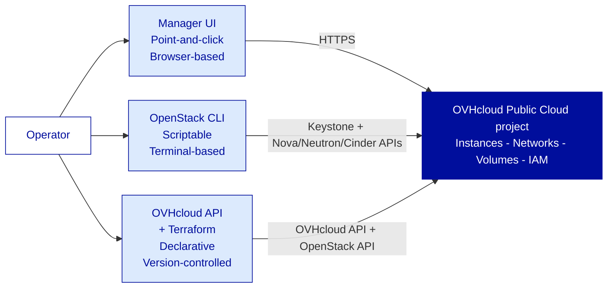
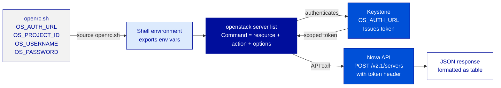

---
# ============================================================
# Module 3.1 -- Infrastructure as Code Essentials -- CLI & Terraform
# Slidev source file
# ============================================================
theme: ../../theme-ovhcloud
title: Infrastructure as Code Essentials -- CLI & Terraform
info: |
  ## OVHcloud -- Public Cloud -- Core Associate
  Module 3.1 -- Infrastructure as Code Essentials -- CLI & Terraform.
  Duration: 1h30.
class: text-left
highlighter: shiki
lineNumbers: false
drawings:
  persist: false
transition: slide-left
mdc: true
exportFilename: 'modules/module-3-1/student_export'

# Hide the floating navbar / controls overlay in dev mode
controls: false
download: false
selectable: true

# Module-level metadata (consumed by trainer-notes export and CI)
moduleId: "3.1"
moduleTitle: "Infrastructure as Code Essentials -- CLI & Terraform"
duration: "1h30"
program: "OVHcloud -- Public Cloud -- Core Associate"
los:
  - LO-IAC-K01
  - LO-IAC-K02
  - LO-IAC-K03
  - LO-IAC-K04
  - LO-IAC-S01
  - LO-IAC-S02
  - LO-IAC-S03
  - LO-IAC-S04
  - LO-IAC-S05
  - LO-IAC-S06
  - LO-IAC-S07
  - LO-IAC-A01
  - LO-IAC-A02
# COVER SLIDE
layout: cover
---

# Infrastructure as Code Essentials
## CLI &amp; Terraform

<!--
Trainer notes Cover slide:
- Ouverture de Day 3. La salle revient de la nuit. Ancrage narratif fort avant tout contenu.
- Rappeler l'etat Northwind : reseau production-shape (2.3-2.4), identite production-shape (2.5). Mais tout fait main.
- Annoncer la promesse : "a la fin de ce module, supprimer tout le stack Northwind et le rebuilder en 10 min avec terraform apply."
- Anticiper les profils : ex-AWS connait Terraform, ex-on-prem connait peut-etre Ansible ou Puppet. Demander qui a deja touche un outil IaC.
- Calibrer : CLI = outil de verification et d'audit quotidien. Terraform = outil de deploiement reproductible. Les deux coexistent, ils ne se remplacent pas.
- Ton du module : c'est le module "libérateur" du programme. Tout le travail fastidieux des jours precedents devient un fichier texte.
-->

---
layout: default
moduleId: "3.1"
slideId: "Agenda"
---

# Agenda

<div class="grid grid-cols-2 gap-8 mt-8">

<div>

**Block 1 -- Sentier battu** &middot; 5 min
*Prerequisites & remediation pointers*

**Block 2 -- Theory** &middot; 30 min
*Three control planes &middot; IaC definition & benefits &middot; OpenStack CLI &middot; Terraform overview &middot; Provider selection &middot; Workflow & state*

**Block 3 -- Demo** &middot; 15 min
*OpenStack CLI audit &middot; Terraform init/plan/apply/destroy &middot; Reproducibility proof*

</div>

<div>

**Block 4 -- Lab** &middot; 30 min
*Deploy Northwind staging with Terraform &middot; verify with CLI &middot; destroy + apply again*

**Block 5 -- Micro-check** &middot; 5 min
*Formative QCM, 7 questions*

**Block 6 -- Wrap-up** &middot; 5 min
*Recap & transition to Module 3.2 (Operations)*

</div>

</div>

<!--
Trainer notes Agenda:
- Module hybride : OpenStack CLI + Terraform. Les deux channels sont utilises en demo et en lab.
- Verifier que les learners ont Python 3 installe (prerequis CLI) et Terraform installe (prerequis lab). Sinon basculer sur le compte demo prepare.
- Annoncer le double browser : Manager UI pour suivre les ressources en temps reel pendant le demo Terraform.
- Strict timing : 30 min theory = dense mais calibre. La demo est la cle de voute de la credibilite du module.
- Annonce narrative : "Northwind a ete construit brique par brique. Aujourd'hui on le recree en un seul fichier."
-->

---
layout: section
block: "Block 1"
duration: "5 min"
---

# Before we start
### Prerequisites & remediation

---
layout: two-cols
moduleId: "3.1"
slideId: "S00a -- You are ready if..."
---

# Before we start (1/2)

::left::

<div class="text-sm">

<strong style="color: var(--ovh-masterbrand-blue); font-size: 1.1rem;">Tools</strong>

<div class="mt-3">
&middot; Northwind stack from Mod 2.5 : IAM users in place, app credentials generated, Secret Manager entries present<br/>
&middot; <code>openrc.sh</code> sourced and working : <code>openstack token issue</code> returns a valid token<br/>
&middot; Python 3.9+ installed : <code>python3 --version</code> &gt;= 3.9<br/>
&middot; <code>python3-openstackclient</code> (or pip install python-openstackclient) available<br/>
&middot; Terraform v1.5+ installed : <code>terraform version</code> returns v1.5 or above<br/>
&middot; A text editor or IDE capable of HCL syntax highlighting
</div>

</div>

::right::

<div class="text-sm">

<strong style="color: var(--ovh-masterbrand-blue); font-size: 1.1rem;">Knowledge</strong>

<div class="mt-3">
&middot; Keystone concepts from Mod 1.2 : <code>openrc.sh</code> sources env vars, <code>OS_AUTH_URL</code>, <code>OS_PROJECT_ID</code><br/>
&middot; Application credentials from Mod 2.5 : non-personal, scoped, with expiry<br/>
&middot; What a declarative file format looks like (JSON, YAML) -- HCL follows the same principle<br/>
&middot; The Northwind naming convention : <code>nw-web-01</code>, <code>nw-api-01</code>, <code>nw-db-01</code>, <code>nw-net-priv</code>, <code>nw-lb-01</code><br/>
&middot; General notion of version control : why committing a text file is useful
</div>

</div>

<!--
Trainer notes S00a You are ready if:
- Demander a voix haute : "openstack token issue retourne quelque chose ?" Si plus de 30% bloque, lancer le recover script en parallele.
- Verifier Terraform installe MAINTENANT. C'est le blocage le plus frequent au lab. Si pas installe : script d'installation one-liner dans le lab handout.
- Pour ex-AWS : HCL ressemble beaucoup a JSON. L'analogie mentale fonctionne bien.
- Le stack Mod 2.5 n'a pas besoin d'etre complet pour 3.1. Le minimum est un projet OVHcloud actif avec un openrc.sh valide.
- Souligner que le module ne requiert pas que le stack Northwind soit up -- on va le recreer avec Terraform.
-->

---
layout: two-cols
moduleId: "3.1"
slideId: "S00b -- If not, here is where to look"
---

# Before we start (2/2)

::left::

<div class="text-sm">

<strong style="color: var(--ovh-masterbrand-blue); font-size: 1.1rem;">Tools missing</strong>

<div class="mt-3">
&middot; <strong>openrc.sh fails ?</strong> &rarr; re-download from Manager UI &rarr; Public Cloud project &rarr; API Access &rarr; OpenStack RC File<br/>
&middot; <strong>OpenStack CLI not found ?</strong> &rarr; <code>pip3 install python-openstackclient --user</code><br/>
&middot; <strong>Terraform not installed ?</strong> &rarr; lab handout includes the one-liner for the learner's OS (apt/brew/winget)<br/>
&middot; <strong>HCL syntax errors in editor ?</strong> &rarr; install HashiCorp HCL extension for VS Code or IntelliJ<br/>
&middot; <strong>terraform version shows v1.4 or older ?</strong> &rarr; update : tfenv use latest or direct download from releases.hashicorp.com
</div>

</div>

::right::

<div class="text-sm">

<strong style="color: var(--ovh-masterbrand-blue); font-size: 1.1rem;">Concept confusions to preempt</strong>

<div class="mt-3">
&middot; <strong>Terraform vs Ansible ?</strong> &rarr; Terraform = infra provisioning (create/destroy cloud resources). Ansible = configuration management (inside the OS). Different layers<br/>
&middot; <strong>CLI vs Terraform -- which do I use ?</strong> &rarr; slide 2 answers this. Both have a role<br/>
&middot; <strong>Two Terraform providers -- which one ?</strong> &rarr; slide 8 answers this. Both can coexist<br/>
&middot; <strong>State file -- is it a backup ?</strong> &rarr; no. It is Terraform's knowledge of what it deployed. Slide 10
</div>

</div>

<!--
Trainer notes S00b If not where to look:
- Anticiper la question Terraform vs Ansible des le Sentier battu : elle reviendra en Theory. Donner une reponse courte ici, completer slide 3.
- Le pip3 install peut prendre 2 min. Si quelqu'un fait ca maintenant, le laisser continuer en parallele.
- La confusion "state file = backup" est frequente chez ex-on-prem. Pre-address, revient en detail slide 10.
- Cloturer en confirmant : openstack token issue OK, terraform version OK, editeur HCL pret.
-->

---
layout: section
block: "Block 2"
duration: "30 min"
---

# Theory & Concepts
### Three control planes &middot; IaC &middot; OpenStack CLI &middot; Terraform

---
layout: default
moduleId: "3.1"
slideId: "S01 -- Where we left off"
los: ["LO-IAC-A01"]
---

# Where we left off &mdash; Northwind is production-shape but entirely hand-built

<div class="grid grid-cols-2 gap-6 mt-6 text-sm">

<div class="ovh-callout">
<strong>What Day 1 and Day 2 produced</strong>
<div class="mt-2">
&middot; Project, regions, IAM users and policies (1.2, 2.5)<br/>
&middot; Three instances : web, API, PostgreSQL (1.3, 1.4)<br/>
&middot; Block volumes, Object Storage, backup strategy (2.1, 2.2)<br/>
&middot; Private network, Load Balancer, Gateway (2.3, 2.4)<br/>
&middot; App credentials, Secret Manager entries (2.5)<br/>
&middot; <em>Total : ~80 Manager UI clicks + ~30 CLI commands.</em>
</div>
</div>

<div class="ovh-callout ovh-callout-warn">
<strong>What the hand-built approach costs</strong>
<div class="mt-2">
&middot; No document : <em>"Do you remember the Security Group rule for port 5432 ?"</em><br/>
&middot; No repeatability : staging does not match production<br/>
&middot; No review : no one validated the config before apply<br/>
&middot; No drift detection : a manual change made at 2am goes unnoticed<br/>
&middot; <strong>Delete this stack and rebuild from memory = impossible in &lt; 1 day.</strong>
</div>
</div>

</div>

<div class="ovh-callout mt-4 text-sm" style="border-left-color: var(--ovh-masterbrand-blue); border-left-width: 4px;">
<strong style="color: var(--ovh-masterbrand-blue);">Module 3.1 answer</strong>&nbsp;: <strong>OpenStack CLI</strong> to audit and verify. <strong>Terraform</strong> to declare, reproduce, and evolve. By the end of today, deleting Northwind and rebuilding takes <strong>10 minutes</strong>.
</div>

<!--
Trainer notes S01 Where we left off:
- Demander : "si je vous demande de recreer le stack Northwind demain depuis zero, vous prenez combien de temps ?" Laisser la salle estimer. 4h, 8h, "je sais pas" sont des reponses normales.
- Souligner : le probleme n'est pas la competence. Le probleme est l'absence de representation versionnee de l'infra.
- AWS cross-ref : CloudFormation = meme besoin, syntax differente. Terraform est multi-cloud, donc CloudFormation ne suffit pas dans un contexte hybride.
- Ancrage narratif : "Aujourd'hui Northwind devient un fichier texte."
- Anticiper : "est-ce qu'on va tout re-ecrire depuis le debut ?" : non, on ecrit un sous-ensemble representatif (instance + volume + reseau). Le reste suit le meme pattern.
-->

---
layout: default
moduleId: "3.1"
slideId: "S02 -- Three control planes"
los: ["LO-IAC-K02"]
---

# Three ways to drive the same infrastructure

<div class="flex justify-center mt-2">



</div>

<div class="grid grid-cols-3 gap-4 mt-4 text-xs">

<div class="ovh-callout">
<strong>Manager UI</strong><br/>
Best for : first-time exploration, one-off operations, billing review, IAM management<br/>
Not for : repeatability, automation, multi-resource orchestration
</div>

<div class="ovh-callout">
<strong>OpenStack CLI</strong><br/>
Best for : scripted checks, audit commands, troubleshooting, CI/CD verifications<br/>
Not for : full infrastructure lifecycle management
</div>

<div class="ovh-callout" style="border-left-color: var(--ovh-masterbrand-blue); border-left-width: 4px;">
<strong style="color: var(--ovh-masterbrand-blue);">API / Terraform</strong><br/>
Best for : full lifecycle, reproducibility, review workflow, version control<br/>
<strong>The IaC-first default.</strong>
</div>

</div>

<!--
Trainer notes S02 Three control planes:
- Insister : les trois coexistent. Un ingenieur competent utilise les trois selon le contexte. Ce n'est pas un remplacement progressif.
- AWS cross-ref : Console = Manager UI, AWS CLI = OpenStack CLI, CloudFormation/CDK/Terraform = troisieme colonne.
- Demander : "vous avez deja ecrit un script bash qui fait des appels CLI pour deployer une infra ?" : l'IaC est la formalisation disciplinee de cette pratique.
- Anticipier : "et l'OVHcloud API directe sans Terraform ?" : possible, mais sans le plan/apply/state. Terraform ajoute la couche d'orchestration.
-->

---
layout: default
moduleId: "3.1"
slideId: "S03 -- What is IaC"
los: ["LO-IAC-K01"]
---

# Infrastructure as Code &mdash; definition and four benefits

<div class="grid grid-cols-2 gap-6 mt-4 text-sm">

<div class="ovh-callout" style="border-left-color: var(--ovh-masterbrand-blue); border-left-width: 4px;">
<strong style="color: var(--ovh-masterbrand-blue);">Definition</strong>
<div class="mt-2">
IaC is the practice of managing and provisioning infrastructure through <strong>machine-readable configuration files</strong> rather than manual processes.<br/><br/>
The configuration file is the <em>single source of truth</em> for what infrastructure exists. Not the Manager UI. Not a ticket. <strong>The file.</strong>
</div>
</div>

<div class="ovh-callout">
<strong>Legacy analogy</strong>
<div class="mt-2">
In the on-premises world : a rack cabling diagram + a runbook + a change management ticket is the closest equivalent. But it's not machine-executable, not version-controlled, and cannot self-verify drift.<br/><br/>
IaC collapses all three into <strong>one executable file</strong> that your team reviews via Git diff.
</div>
</div>

</div>

<div class="grid grid-cols-2 gap-4 mt-4 text-xs">

<div class="ovh-callout">
<strong>Reproducibility</strong> &mdash; run the same file on staging and production and get identical topology. <em>No more "it works on staging".</em>
</div>

<div class="ovh-callout">
<strong>Version control</strong> &mdash; every infrastructure change is a commit. Who changed what, when, and why. <em>Git blame answers the audit question.</em>
</div>

<div class="ovh-callout">
<strong>Peer review</strong> &mdash; infrastructure changes go through the same PR process as application code. <em>A second pair of eyes before apply.</em>
</div>

<div class="ovh-callout">
<strong>Drift detection</strong> &mdash; the tool compares the file against the real state and flags deviations. <em>The 2am manual fix shows up on the next plan.</em>
</div>

</div>

<!--
Trainer notes S03 What is IaC:
- L'analogie "rack cabling diagram + runbook + change ticket" est la plus efficace pour les Corporate ex-on-prem. La reserver pour cette salle.
- Pour ex-AWS : "c'est CloudFormation, mais multi-cloud, avec une syntax plus lisible."
- Souligner que les 4 benefices sont dans l'LO K01. Ce sont les 4 mots que l'examen peut tester.
- Demander : "lequel de ces 4 benefices aurait empeche le probleme du 2am change ?" : drift detection + peer review. Ancrer concretement.
- Ne pas entrer dans les nuances IaC imperative vs declarative ici. Slide 7 pour ca.
-->

---
layout: default
moduleId: "3.1"
slideId: "S04 -- OpenStack CLI anatomy"
los: ["LO-IAC-K02", "LO-IAC-S01"]
---

# OpenStack CLI &mdash; how it authenticates and what it sends

<div class="flex justify-center mt-2">



</div>

<div class="grid grid-cols-2 gap-4 mt-4 text-sm">

<div class="ovh-callout">
<strong>Installation</strong>
<div class="mt-1 text-xs">
<code>pip3 install python-openstackclient --user</code><br/>
Or via system package : <code>apt install python3-openstackclient</code><br/>
Verify : <code>openstack --version</code>
</div>
</div>

<div class="ovh-callout" style="border-left-color: var(--ovh-masterbrand-blue); border-left-width: 4px;">
<strong style="color: var(--ovh-masterbrand-blue);">Command anatomy</strong>
<div class="mt-1 text-xs">
<code>openstack &lt;resource&gt; &lt;action&gt; [options]</code><br/>
Examples : <code>openstack server list</code> &middot; <code>openstack volume create</code><br/>
Options : <code>--format json</code> &middot; <code>--column Name,ID</code> &middot; <code>-f value -c ID</code>
</div>
</div>

</div>

<!--
Trainer notes S04 OpenStack CLI anatomy:
- L'openrc.sh a deja ete vu en 1.2 et 2.5. Ce slide reaffirme la mecanique auth pour ceux qui l'ont oublie.
- Souligner : l'openrc.sh source en shell est un antipattern pour les scripts de production. En production on source un openrc genere depuis une app credential (Mod 2.5).
- Anticiper : "est-ce que Terraform source aussi l'openrc.sh ?" : non, Terraform lit les variables directement dans son provider block ou via TF_VAR_. Slide 8 pour ca.
- Demo prep : verifier que l'openrc.sh du trainer est sourced. Si la demo echoue a cause d'un token expire, le diagnostic est openstack token issue.
-->

---
layout: default
moduleId: "3.1"
slideId: "S05 -- Essential CLI commands"
los: ["LO-IAC-S02"]
---

# Essential OpenStack CLI commands &mdash; the six daily tools

<div class="text-xs mt-3">

<table style="width:100%; border-collapse: collapse;">
<thead>
<tr style="background: var(--ovh-masterbrand-blue); color: white;">
<th style="padding: 5px 8px; text-align: left;">Resource group</th>
<th style="padding: 5px 8px; text-align: left;">Key commands</th>
<th style="padding: 5px 8px; text-align: left;">Typical use</th>
</tr>
</thead>
<tbody>
<tr style="background: #F2F2F2;">
<td style="padding: 5px 8px;"><strong>server</strong></td>
<td style="padding: 5px 8px;"><code>server list</code> &middot; <code>server show &lt;id&gt;</code> &middot; <code>server create</code> &middot; <code>server delete</code></td>
<td style="padding: 5px 8px;">Audit running instances, check status, create for scripting</td>
</tr>
<tr>
<td style="padding: 5px 8px;"><strong>volume</strong></td>
<td style="padding: 5px 8px;"><code>volume list</code> &middot; <code>volume show &lt;id&gt;</code> &middot; <code>volume create</code></td>
<td style="padding: 5px 8px;">Audit block storage, verify attachment state</td>
</tr>
<tr style="background: #F2F2F2;">
<td style="padding: 5px 8px;"><strong>network</strong></td>
<td style="padding: 5px 8px;"><code>network list</code> &middot; <code>port list</code> &middot; <code>security group list</code></td>
<td style="padding: 5px 8px;">Verify network topology, check Security Group rules</td>
</tr>
<tr>
<td style="padding: 5px 8px;"><strong>image</strong></td>
<td style="padding: 5px 8px;"><code>image list --public</code> &middot; <code>image show &lt;id&gt;</code></td>
<td style="padding: 5px 8px;">Find the current Ubuntu/Debian image ID for Terraform configs</td>
</tr>
<tr style="background: #F2F2F2;">
<td style="padding: 5px 8px;"><strong>catalog</strong></td>
<td style="padding: 5px 8px;"><code>catalog list</code> &middot; <code>endpoint list</code></td>
<td style="padding: 5px 8px;">Verify available services in the current region</td>
</tr>
<tr>
<td style="padding: 5px 8px;"><strong>quota</strong></td>
<td style="padding: 5px 8px;"><code>quota show</code> &middot; <code>quota set</code></td>
<td style="padding: 5px 8px;">Check current usage vs limits before large deployments</td>
</tr>
</tbody>
</table>

</div>

<div class="ovh-callout mt-4 text-sm" style="border-left-color: var(--ovh-masterbrand-blue); border-left-width: 4px;">
<strong style="color: var(--ovh-masterbrand-blue);">Pattern for scripting</strong>&nbsp;: <code>openstack server list -f json | jq '.[].ID'</code> &mdash; output as JSON, pipe to jq for ID extraction. Used in CI/CD health checks and IaC pre-flight validations.
</div>

<!--
Trainer notes S05 Essential CLI commands:
- Ne pas memoriser la table. Elle est dans le lab handout. L'objectif est de savoir que ces commandes existent et dans quelle famille chercher.
- AWS cross-ref : aws ec2 describe-instances = openstack server list. Meme logique, syntax differente.
- Insister sur image list --public : les apprenants en auront besoin au lab pour trouver l'image ID Ubuntu courant.
- Le pattern jq est avance mais frequent en prod. Mentionner sans approfondir.
- Demander : "laquelle de ces commandes vous aurait aide pour l'audit de Module 2.5 ?" : security group list + application credential list (deja vu).
-->

---
layout: default
moduleId: "3.1"
slideId: "S06 -- Terraform declarative model"
los: ["LO-IAC-K03"]
---

# Terraform &mdash; declarative vs imperative

<div class="grid grid-cols-2 gap-6 mt-6 text-sm">

<div class="ovh-callout ovh-callout-warn">
<strong>Imperative (CLI / bash script)</strong>
<div class="mt-2">
<em>"Do these steps in this order :"</em><br/><br/>
<code>openstack server create --name nw-web-01 ...</code><br/>
<code>openstack volume create --size 50 nw-web-vol ...</code><br/>
<code>openstack server add volume nw-web-01 nw-web-vol</code><br/><br/>
You specify <strong>how</strong>. If a step fails halfway, you manage recovery. No idempotency guarantee.
</div>
</div>

<div class="ovh-callout" style="border-left-color: var(--ovh-masterbrand-blue); border-left-width: 4px;">
<strong style="color: var(--ovh-masterbrand-blue);">Declarative (Terraform HCL)</strong>
<div class="mt-2">
<em>"This is what I want to exist :"</em><br/><br/>
<code>resource "openstack_compute_instance_v2" "nw_web" &#123;...&#125;</code><br/>
<code>resource "openstack_blockstorage_volume_v3" "nw_web_vol" &#123;...&#125;</code><br/><br/>
You specify <strong>what</strong>. Terraform figures out the order, handles dependencies, and is <strong>idempotent</strong> : run twice = same result.
</div>
</div>

</div>

<div class="grid grid-cols-2 gap-4 mt-4 text-sm">

<div class="ovh-callout">
<strong>Idempotency matters</strong><br/>
Running <code>terraform apply</code> when nothing changed = no action. Running a bash script twice = potentially duplicate resources.
</div>

<div class="ovh-callout">
<strong>Dependency graph</strong><br/>
Terraform builds a dependency graph from your config. The volume attach waits for both instance and volume to exist. You do not write the ordering logic.
</div>

</div>

<!--
Trainer notes S06 Terraform declarative model:
- L'analogie la plus impactante pour les Corporate : "c'est comme un cahier des charges vs un mode d'emploi. Le cahier des charges dit ce qu'on veut, pas comment le construire."
- Insister sur l'idempotence : c'est le differenciateur cle par rapport a un script bash. Si le learner a deja eu un script qui a tout cree en double, l'idempotence resonne.
- AWS cross-ref : CloudFormation est aussi declaratif. CDK compile vers CloudFormation. Terraform est le meme principe, multi-cloud.
- Anticiper : "et si je veux faire des loops ?" : Terraform supporte count et for_each. Hors scope ici, Professional level.
-->

---
layout: default
moduleId: "3.1"
slideId: "S07 -- OVHcloud provider vs OpenStack provider"
los: ["LO-IAC-K04"]
---

# Two Terraform providers &mdash; when to use each

<div class="text-sm mt-4">

<table style="width:100%; border-collapse: collapse;">
<thead>
<tr style="background: var(--ovh-masterbrand-blue); color: white;">
<th style="padding: 6px 8px; text-align: left;">&nbsp;</th>
<th style="padding: 6px 8px; text-align: left;">OVHcloud provider</th>
<th style="padding: 6px 8px; text-align: left;">OpenStack provider</th>
</tr>
</thead>
<tbody>
<tr style="background: #F2F2F2;">
<td style="padding: 6px 8px;"><strong>Controls</strong></td>
<td style="padding: 6px 8px;">OVHcloud account-level objects : Projects, vRack, Load Balancer (Octavia), Failover IPs, Object Storage containers, IAM policies</td>
<td style="padding: 6px 8px;">OpenStack project-level objects : Instances, Volumes, Networks, Security Groups, Floating IPs, Images, Keypairs</td>
</tr>
<tr>
<td style="padding: 6px 8px;"><strong>Auth source</strong></td>
<td style="padding: 6px 8px;">OVHcloud API credentials : <code>application_key</code>, <code>application_secret</code>, <code>consumer_key</code>, <code>endpoint</code></td>
<td style="padding: 6px 8px;">OpenStack <code>openrc.sh</code> variables or app credential : <code>auth_url</code>, <code>user_name</code>, <code>password</code>, <code>tenant_id</code></td>
</tr>
<tr style="background: #F2F2F2;">
<td style="padding: 6px 8px;"><strong>Registry</strong></td>
<td style="padding: 6px 8px;"><code>ovh/ovh</code> on registry.terraform.io</td>
<td style="padding: 6px 8px;"><code>terraform-provider-openstack/openstack</code> on registry.terraform.io</td>
</tr>
<tr>
<td style="padding: 6px 8px;"><strong>Module 3.1 scope</strong></td>
<td style="padding: 6px 8px;">Awareness only &mdash; used in the lab for Object Storage container</td>
<td style="padding: 6px 8px;"><strong>Primary provider for the lab</strong> : instance, volume, network, Security Group</td>
</tr>
</tbody>
</table>

</div>

<div class="ovh-callout mt-4 text-sm" style="border-left-color: var(--ovh-masterbrand-blue); border-left-width: 4px;">
<strong style="color: var(--ovh-masterbrand-blue);">Rule of thumb</strong>&nbsp;: if the resource exists in Horizon (OpenStack UI), use the OpenStack provider. If it only appears in the OVHcloud Manager, use the OVHcloud provider. Real-world configs use <strong>both providers</strong> in the same root module.
</div>

<!--
Trainer notes S07 OVHcloud provider vs OpenStack provider:
- La regle "Horizon = OpenStack provider, Manager only = OVHcloud provider" est suffisamment simple pour etre retenue.
- Insister sur le fait que les deux coexistent dans le meme main.tf. Ce n'est pas un choix exclusif.
- AWS cross-ref : similaire au fait d'avoir a la fois le provider aws et le provider kubernetes dans le meme config.
- Anticiper : "et l'authentication OVHcloud API, comment on genere les cles ?" : Manager UI -> API -> Create Token. En dehors du scope de ce module, mais le lab handout a le chemin.
- Le lab n'utilise que le provider OpenStack pour l'essentiel. Le provider OVHcloud est mentionne pour l'awareness.
-->

---
layout: default
moduleId: "3.1"
slideId: "S08 -- Terraform workflow"
los: ["LO-IAC-K03", "LO-IAC-S05", "LO-IAC-S06"]
---

# Terraform workflow &mdash; four commands, one cycle

```mermaid {scale: 0.62}
%%{init: {'flowchart': {'nodeSpacing': 28, 'rankSpacing': 45}}}%%
flowchart LR
    WRITE[Write .tf files\nDescribe desired state]:::step
    INIT[terraform init\nDownload providers\nInit .terraform/]:::cmd
    PLAN[terraform plan\nDiff desired vs state\nShow proposed changes]:::cmd
    APPLY[terraform apply\nCreate/update/delete\nUpdate state file]:::cmd
    DESTROY[terraform destroy\nDelete all managed\nresources]:::destroy

    WRITE --> INIT
    INIT --> PLAN
    PLAN -->|review + confirm| APPLY
    APPLY -->|modify .tf and re-run| PLAN
    APPLY -.->|decommission| DESTROY

    classDef step fill:#F2F2F2,stroke:#000E9C,color:#000E9C
    classDef cmd fill:#0050D7,stroke:#000E9C,color:#FFFFFF
    classDef destroy fill:#D9534F,stroke:#8B0000,color:#FFFFFF
```

<div class="flex justify-center mt-2">



</div>

<div class="grid grid-cols-2 gap-4 mt-4 text-xs">

<div class="ovh-callout">
<strong>terraform init</strong><br/>
Run once per new config or after adding a provider. Downloads provider binaries into <code>.terraform/</code>. Safe to re-run.
</div>

<div class="ovh-callout">
<strong>terraform plan</strong><br/>
Dry run. Reads the state file + queries the real API to produce a diff. <strong>No infrastructure is touched.</strong> Review the plan output before every apply.
</div>

<div class="ovh-callout" style="border-left-color: var(--ovh-masterbrand-blue); border-left-width: 4px;">
<strong style="color: var(--ovh-masterbrand-blue);">terraform apply</strong><br/>
Executes the plan. Prompts for confirmation. <code>--auto-approve</code> skips the prompt -- safe in CI, risky interactively.
</div>

<div class="ovh-callout ovh-callout-warn">
<strong>terraform destroy</strong><br/>
Deletes <strong>all resources managed by this state</strong>. Prompts for confirmation. <strong>Use with intent. Cannot be undone.</strong>
</div>

</div>

<!--
Trainer notes S08 Terraform workflow:
- Insister sur "plan = no infrastructure touched". C'est la reponse a la peur du "et si je me trompe ?"
- AWS cross-ref : CloudFormation change sets = equivalent de terraform plan.
- Demo prep : le trainer doit avoir un main.tf minimal pret pour la demo. Verifier que terraform init a deja tourne (providers telecharges).
- Anticiper : "et si apply echoue a mi-parcours ?" : Terraform met le state a jour pour ce qui a reussi. La ressource partiellement creee peut exiger un terraform state rm ou un import.
- terraform destroy est le geste "never by hand again" : montrer en demo que destroy + apply = recreation complete.
-->

---
layout: default
moduleId: "3.1"
slideId: "S09 -- Minimal Terraform config anatomy"
los: ["LO-IAC-S03", "LO-IAC-S04"]
---

# Minimal Terraform config anatomy

<div class="grid grid-cols-2 gap-2 mt-1">
<div>

```hcl
# providers.tf
terraform {
  required_providers {
    openstack = {
      source  = "terraform-provider-openstack/openstack"
      version = "~> 1.54"
    }
  }
}
provider "openstack" {
  auth_url    = var.auth_url
  user_name   = var.user_name
  password    = var.password
  tenant_id   = var.project_id
  region      = var.region
}
```

</div>
<div>

```hcl
# main.tf
resource "openstack_compute_instance_v2" "nw_web" {
  name            = "nw-web-terraform"
  image_name      = "Ubuntu 22.04"
  flavor_name     = "b3-8"
  key_pair        = var.keypair_name
  security_groups = ["nw-sg-web"]
  network { name = "Ext-Net" }
}
resource "openstack_blockstorage_volume_v3" "nw_web_vol" {
  name = "nw-web-vol-terraform"
  size = 50
}
```

</div>
</div>

<div class="grid grid-cols-2 gap-2 mt-2" style="font-size: 0.7rem;">

<div class="ovh-callout" style="padding: 6px 10px;">
<strong>File layout</strong><br/>
<code>providers.tf</code> &mdash; provider blocks<br/>
<code>variables.tf</code> &mdash; var declarations<br/>
<code>main.tf</code> &mdash; resource blocks<br/>
<code>outputs.tf</code> &mdash; IPs, IDs
</div>

<div class="ovh-callout" style="border-left-color: var(--ovh-masterbrand-blue); border-left-width: 4px; padding: 6px 10px;">
<strong style="color: var(--ovh-masterbrand-blue);">Secret hygiene</strong><br/>
Never hardcode <code>password</code> in providers.tf.<br/>
Use <code>TF_VAR_password</code> env var or a <code>.tfvars</code> excluded from Git.
</div>

</div>

<style>
pre, pre code { font-size: 0.70rem !important; line-height: 1.17 !important; }
</style>

<!--
Trainer notes S09 Terraform config anatomy:
- Lire le code a voix haute une fois. Les learners qui n'ont jamais vu HCL se rassurent : c'est lisible.
- AWS cross-ref : resource block = AWS CloudFormation Resource dans le template. La syntax est plus concise.
- Insister sur le secret hygiene : le password dans providers.tf est le #1 des secrets commites par accident sur GitHub.
- Anticiper : "image_name vs image_id ?" : image_name est plus lisible mais peut devenir ambigu si deux images ont le meme nom. En production, utiliser l'image_id apres un openstack image list.
- Anticiper : "flavour name, d'ou ca vient ?" : openstack flavor list. Le trainer peut montrer en direct.
-->

---
layout: default
moduleId: "3.1"
slideId: "S10 -- State management"
los: ["LO-IAC-S07", "LO-IAC-A02"]
---

# State management &mdash; what terraform.tfstate is and what it is not

<div class="grid grid-cols-2 gap-6 mt-6 text-sm">

<div class="ovh-callout" style="border-left-color: var(--ovh-masterbrand-blue); border-left-width: 4px;">
<strong style="color: var(--ovh-masterbrand-blue);">What the state file IS</strong>
<div class="mt-2">
&middot; Terraform's knowledge map : resource ID in your config &rarr; resource ID on the cloud provider<br/>
&middot; The basis for <code>terraform plan</code> : diff between this file and the desired config<br/>
&middot; Updated after every successful <code>apply</code><br/>
&middot; At the Associate scope : a <strong>local file</strong>, <code>terraform.tfstate</code>, in the working directory
</div>
</div>

<div class="ovh-callout ovh-callout-warn">
<strong>What the state file is NOT</strong>
<div class="mt-2">
&middot; Not a backup of your infrastructure<br/>
&middot; Not a full description of every attribute of every resource<br/>
&middot; <strong>Not safe to commit to a public Git repo</strong> : it may contain sensitive values (passwords, tokens)<br/>
&middot; Not correct if someone manually changed a resource outside Terraform
</div>
</div>

</div>

<div class="ovh-callout mt-4 text-sm">
<strong>The manual-change trap (LO-IAC-A02)</strong>&nbsp;: a colleague deletes an instance manually in the Manager UI. The state file still says it exists. On the next <code>terraform plan</code>, Terraform sees a discrepancy and will try to <strong>recreate the instance</strong>. <strong>Manual changes in Terraform-managed infra are a source of drift and unintended re-creations.</strong>
</div>

<!--
Trainer notes S10 State management:
- La confusion "state file = backup" est la plus frequente. La corriger fermement.
- La ligne "not safe to commit" : insister avec un exemple concret - le password du provider OpenStack peut etre dans le state. Ajouter terraform.tfstate au .gitignore est obligatoire.
- AWS cross-ref : pas d'equivalent direct dans CloudFormation (AWS gere l'etat de son cote). C'est une difference importante que les ex-AWS doivent internaliser.
- Le scenario "manuel change trap" ancre A02. Le re-lire lentement. Demander : "est-ce que ca vous est deja arrive avec un script ?"
- Remote state (S3 backend) = Professional level. Mentionner qu'il existe pour les grandes equipes, sans rentrer dans les details.
-->

---
layout: section
block: "Block 3"
duration: "15 min"
---

# Trainer demonstration
### OpenStack CLI audit: 
### Terraform init &rarr; plan &rarr; apply &rarr; destroy &rarr; apply

---
layout: default
moduleId: "3.1"
slideId: "Demo -- Overview"
los: ["LO-IAC-S01", "LO-IAC-S02", "LO-IAC-S03", "LO-IAC-S04", "LO-IAC-S05", "LO-IAC-S06", "LO-IAC-S07"]
---

# Demo &mdash; from CLI audit to Terraform reproducibility proof

<div class="grid grid-cols-2 gap-6 mt-6">

<div class="ovh-callout">
<strong>What you will see</strong>
<div class="mt-2 text-sm">
&middot; <code>openstack server list</code> and <code>openstack quota show</code> on the Northwind project<br/>
&middot; A pre-written <code>main.tf</code> deploying one instance + one volume on the Northwind project<br/>
&middot; <code>terraform init</code> : provider download<br/>
&middot; <code>terraform plan</code> : reading the proposed changes<br/>
&middot; <code>terraform apply</code> : watching resources appear in the Manager UI in real time<br/>
&middot; <code>terraform destroy</code> : watching the stack disappear<br/>
&middot; <code>terraform apply</code> again : the stack is back in under 3 minutes<br/>
&middot; The state file before and after apply
</div>
</div>

<div class="ovh-callout" style="border-left-color: var(--ovh-masterbrand-blue); border-left-width: 4px;">
<strong style="color: var(--ovh-masterbrand-blue);">Why this matters</strong>
<div class="mt-2 text-sm">
The <code>destroy</code> + <code>apply</code> sequence is the proof of reproducibility. A stack that took 3 days to build by hand is recreated in minutes from a text file. <strong>This is the moment the value of IaC becomes experiential, not just conceptual.</strong><br/><br/>
Channels : <strong>terminal</strong> for Terraform + CLI, <strong>Manager UI</strong> side-by-side to watch resources appear.
</div>
</div>

</div>

<div class="mt-4 text-center text-sm" style="color: var(--ovh-gray-700);">
  10 steps &middot; ~12 min walkthrough &middot; 3 min Q&amp;A
</div>

<!--
Trainer notes Demo Overview:

PRE-FLIGHT (do BEFORE the block):
- Terminal at 16pt+, dark background. Side-by-side with Manager UI (OVHcloud Manager -> Public Cloud -> Northwind project -> Instances).
- main.tf pre-written (available in modules/module-3-1/lab/demo/main.tf). Do NOT live-code Terraform. The syntax is new to most learners and live-coding will eat the time budget.
- terraform init already run on the trainer machine. Providers downloaded. Run terraform plan --out demo.plan to cache the plan output.
- openrc.sh sourced in the terminal as an application credential (not personal credentials -- model the reflex from Mod 2.5).
- IMPORTANT : the demo Terraform config uses a different instance name (nw-demo-tf) to avoid conflicting with the lab Northwind stack.

DEMO SCRIPT (10 steps, ~12 min):
1. openstack server list : show the existing Northwind stack. "Voila ce qu'on a construit ces deux derniers jours."
2. openstack quota show : show current vCPU and instance quota usage. "Avant de deployer, on verifie qu'on a de la marge."
3. cat main.tf + providers.tf : read aloud the resource blocks. "Un fichier HCL. Lisible. Comparable via git diff."
4. terraform init : show the provider download. "Hashicorp pulls the OVHcloud + OpenStack provider binaries."
5. terraform plan : walk through the output. "+2 to add, 0 to change, 0 to destroy." Explain the + prefix. Point to the Manager UI -- nothing changed yet.
6. terraform apply : confirm yes. Watch the Manager UI as the instance appears. "Resources are being created in parallel where dependencies allow."
7. openstack server show nw-demo-tf : confirm the instance is there. "CLI verification, same data, different surface."
8. terraform destroy : confirm yes. Watch the Manager UI as resources disappear. "Stack gone. 30 seconds."
9. terraform apply again : confirm yes. Stack is back. "From nothing to running in under 3 minutes."
10. cat terraform.tfstate | jq '.resources[] | .type + " : " + .instances[0].attributes.id' : show that the state file maps resource types to cloud IDs.

FAILURE MODES:
- terraform apply 409 Conflict : quota exceeded. Run openstack quota show, request an increase or destroy a pre-existing demo resource.
- Image not found error : image name changed. Run openstack image list --public | grep Ubuntu and update image_name in main.tf.
- Provider auth fail : openrc.sh not sourced or TF_VAR_ not set. Source the openrc before the demo.
- terraform state file corrupted or missing : run terraform init -reconfigure, then terraform import for each existing resource (complex, avoid by not editing state manually).

Q&A (3 min) : focus on plan output reading and state file purpose. Park "remote state", "workspaces", "modules" for Professional level.
-->

---
layout: section
block: "Block 4"
duration: "30 min"
---

# Northwind by code
### Your turn. Solo. 30 minutes.

---
layout: default
moduleId: "3.1"
slideId: "Lab -- Brief"
los: ["LO-IAC-S01", "LO-IAC-S02", "LO-IAC-S03", "LO-IAC-S04", "LO-IAC-S05", "LO-IAC-S06", "LO-IAC-S07", "LO-IAC-A01", "LO-IAC-A02"]
---

# Lab &mdash; Deploy Northwind staging via Terraform

<div class="ovh-callout mt-4">
The CTO walks in : <em>"We just lost the staging environment to a misconfigured script. We need it back. Oh, and this time, put it in a file so it never happens again."</em> Today you : (1) configure the OpenStack CLI and run an audit of your current project, (2) write a minimal Terraform config that deploys a Northwind-shaped staging instance + volume + Security Group, (3) run <code>terraform plan</code>, review and apply, (4) destroy the stack and apply again to prove reproducibility, (5) commit the <code>.tf</code> files to your lab repository.
</div>

<div class="grid grid-cols-2 gap-4 mt-6">

<div class="ovh-callout" style="border-left-color: var(--ovh-masterbrand-blue); border-left-width: 4px;">
<strong style="color: var(--ovh-masterbrand-blue);">Channels</strong>
<div class="mt-2 text-sm">
&middot; <strong>OpenStack CLI</strong> : audit + verification<br/>
&middot; <strong>Terraform</strong> with the OpenStack provider : deploy<br/>
&middot; <strong>Manager UI</strong> : side-by-side visual confirmation<br/>
&middot; <strong>Git</strong> : commit the <code>.tf</code> files at the end
</div>
</div>

<div class="ovh-callout" style="border-left-color: var(--ovh-masterbrand-blue); border-left-width: 4px;">
<strong style="color: var(--ovh-masterbrand-blue);">Success criteria</strong>
<div class="mt-2 text-sm">
<code>openstack server show &lt;initials&gt;-nw-staging</code> returns ACTIVE &middot; <code>openstack volume list</code> shows the attached volume &middot; <code>terraform destroy</code> removes both &middot; <code>terraform apply</code> recreates both &middot; <code>.tf</code> files committed with a meaningful message
</div>
</div>

</div>

<div class="mt-4 text-center text-sm" style="color: var(--ovh-gray-700);">
  Instance : <code>&lt;initials&gt;-nw-staging</code> &middot; Image : Ubuntu 22.04 &middot; Flavor : b3-8 &middot; Volume : 50 GB &middot; Time : 30 min
</div>

<!--
Trainer notes Lab Brief:
- Souligner les criteres de succes auto-verifiables : l'apprenant sait s'il a reussi sans demander.
- Lab dense : 5 etapes, certaines avec sous-etapes. Surveiller le timing. Si plus de la moitie en retard a 20 min, l'etape "destroy + apply again" peut etre raccourcie a juste terraform destroy.
- Verifier que Terraform est installe sur toutes les machines AVANT le demarrage du lab. Si blocage, lab handout contient le one-liner d'installation.
- Annoncer que le lab handout contient aussi un providers.tf de reference pour eviter de typer le block provider de memoire.
- La securite : rappeler que terraform.tfstate est dans .gitignore avant le commit final. C'est le seul piege de cet etape.
-->

---
layout: default
moduleId: "3.1"
slideId: "Lab -- Steps 1/2"
---

# Lab &mdash; Step-by-step (1/2)
### CLI audit + Terraform init and plan

<div class="text-xs mt-1">

<strong>1.</strong> Source your app credential openrc.sh (from Mod 2.5) : <code>source ~/.openrc/&lt;initials&gt;-nw-backup.sh</code><br/>
&nbsp;&nbsp;Verify : <code>openstack token issue</code> returns a valid token<br/>
<strong>2.</strong> CLI audit before deploying :<br/>
&nbsp;&nbsp;a. <code>openstack server list</code> &mdash; note existing instances<br/>
&nbsp;&nbsp;b. <code>openstack quota show</code> &mdash; verify you have at least 2 free vCPU and 1 free instance slot<br/>
&nbsp;&nbsp;c. <code>openstack image list --public | grep -i ubuntu</code> &mdash; copy the image ID for Ubuntu 22.04<br/>
&nbsp;&nbsp;d. <code>openstack flavor list | grep b3-8</code> &mdash; confirm the flavor is available in your region<br/>
<strong>3.</strong> Create the lab directory and files :<br/>
&nbsp;&nbsp;<code>mkdir -p labs/3-1/&lt;initials&gt;-northwind-staging && cd labs/3-1/&lt;initials&gt;-northwind-staging</code><br/>
&nbsp;&nbsp;Copy <code>providers.tf</code> from the lab handout (or write it using slide S09 as reference)<br/>
&nbsp;&nbsp;Write <code>main.tf</code> with two resources : <code>openstack_compute_instance_v2</code> and <code>openstack_blockstorage_volume_v3</code><br/>
&nbsp;&nbsp;Write <code>.gitignore</code> containing <code>terraform.tfstate</code> and <code>.terraform/</code><br/>
<strong>4.</strong> <code>terraform init</code> &mdash; confirm providers downloaded (no errors)<br/>
<strong>5.</strong> <code>terraform plan</code> &mdash; read the output : confirm "+2 to add", review resource names and sizes

</div>

<!--
Trainer notes Lab Steps 1/2:
- L'etape 2c est importante : image_id change periodiquement. Ne pas hardcoder l'ID du trainer dans le lab handout.
- L'etape 3 : le lab handout a un providers.tf de reference. Insister : ne pas copier-coller le password en clair.
- L'etape 5 : encourager a lire le plan output complet. C'est la premiere fois que les learners voient la syntax du plan. Une minute investie ici evite une surprise en prod.
- A ce stade, aucune infrastructure n'a encore ete creee. Si quelqu'un demande "j'ai tout casse ?" : non, terraform plan ne touche rien.
- Passer a la slide 2/2 quand la majorite a fini l'etape 5, ou apres 12 min.
-->

---
layout: default
moduleId: "3.1"
slideId: "Lab -- Steps 2/2"
---

# Lab &mdash; Step-by-step (2/2)

<div class="text-xs mt-2" style="line-height: 1.45;">

<strong>6.</strong> <code>terraform apply</code> &mdash; type <code>yes</code><br/>
&nbsp;&nbsp;Verify : <code>openstack server show &lt;initials&gt;-nw-staging</code> returns <code>ACTIVE</code><br/>
&nbsp;&nbsp;Verify : <code>openstack volume list</code> shows the volume <code>available</code> or <code>in-use</code><br/>
<strong>7.</strong> <code>terraform destroy</code> &mdash; type <code>yes</code><br/>
&nbsp;&nbsp;Verify : <code>openstack server list</code> no longer shows <code>&lt;initials&gt;-nw-staging</code><br/>
<strong>8.</strong> <code>terraform apply</code> again &mdash; type <code>yes</code><br/>
&nbsp;&nbsp;Time it : seconds from "yes" to both resources <code>ACTIVE</code>. Note in your lab log. This is the reproducibility proof.<br/>
<strong>9.</strong> Inspect the state file :<br/>
&nbsp;&nbsp;<code>cat terraform.tfstate | python3 -m json.tool | head -40</code><br/>
&nbsp;&nbsp;Note that resource IDs differ from the previous apply &mdash; new resources, new IDs.<br/>
<strong>10.</strong> Commit &mdash; do <strong>not</strong> add <code>terraform.tfstate</code> :<br/>
&nbsp;&nbsp;<code>git add providers.tf main.tf variables.tf .gitignore</code><br/>
&nbsp;&nbsp;<code>git commit -m "feat(lab-3-1): northwind staging stack via Terraform"</code>

</div>

<!--
Trainer notes Lab Steps 2/2:
- L'etape 7-8 est le "moment libérateur". Encourager les learners a noter le temps. Le delta entre "construit a la main en 2 jours" et "recreé en Terraform en X secondes" est le take-home du module.
- L'etape 9 : les IDs changent apres destroy + apply parce que ce sont de nouvelles ressources. C'est le comportement attendu. Les IDs ne sont pas des identifiants stables -- raison supplementaire pour utiliser des noms et des outputs plutot que des IDs hardcodes.
- L'etape 10 : insister encore une fois sur "ne pas commiter terraform.tfstate". C'est repetitif parce que c'est le seul vrai risque de cet etape.
- Annoncer : ceux qui finissent tot peuvent essayer d'ajouter un openstack_networking_secgroup_v2 a leur main.tf et relancer plan + apply.
-->

---
layout: section
block: "Block 5"
duration: "5 min"
---

# Micro-check
### 7 formative questions, no points

---
layout: default
moduleId: "3.1"
slideId: "MC -- Q1 IaC benefits"
los: ["LO-IAC-K01"]
---

# Q1 &mdash; The four IaC benefits

Which four properties does Infrastructure as Code provide that a bash deployment script does NOT reliably provide ?

<div class="grid grid-cols-1 gap-3 mt-6">

<div class="ovh-callout"><strong>A.</strong> Reproducibility, version control, peer review, drift detection</div>
<div class="ovh-callout"><strong>B.</strong> Reproducibility, zero downtime, auto-scaling, disaster recovery</div>
<div class="ovh-callout"><strong>C.</strong> Version control, encryption at rest, compliance reporting, cost optimization</div>
<div class="ovh-callout"><strong>D.</strong> Peer review, multi-cloud support, serverless execution, AI-assisted provisioning</div>

</div>

<!--
Trainer notes Q1:
- Correct answer: A. Les quatre benefices de LO-IAC-K01 : reproducibility, version control, peer review, drift detection.
- B wrong : zero downtime, auto-scaling, DR sont des proprietes d'architecture, pas de l'IaC en tant que telle.
- C wrong : encryption at rest et compliance reporting ne sont pas des benefices intrinsèques de l'IaC.
- D wrong : multi-cloud support est une capacite de Terraform, pas un benefice de l'IaC comme pratique.
- LO: LO-IAC-K01. Bloom: Remember.
- Question de memoire directe. Si rate, retour slide S03.
-->

---
layout: default
moduleId: "3.1"
slideId: "MC -- Q2 control plane selection"
los: ["LO-IAC-K02"]
---

# Q2 &mdash; Right control plane for a CI/CD health check

A CI/CD pipeline needs to verify that a specific instance is in ACTIVE state after a deployment. <strong>Which control plane is most appropriate ?</strong>

<div class="grid grid-cols-1 gap-3 mt-6">

<div class="ovh-callout"><strong>A.</strong> OVHcloud Manager UI &mdash; navigate to the project and check the instance status manually</div>
<div class="ovh-callout"><strong>B.</strong> OpenStack CLI &mdash; <code>openstack server show &lt;id&gt; -f value -c status</code> in a pipeline step</div>
<div class="ovh-callout"><strong>C.</strong> Terraform &mdash; <code>terraform plan</code> to check if the instance diverged from desired state</div>
<div class="ovh-callout"><strong>D.</strong> OVHcloud API directly via <code>curl</code> &mdash; POST to the Keystone endpoint</div>

</div>

<!--
Trainer notes Q2:
- Correct answer: B. CLI scriptable, output parsable, exactement le role du CLI dans un pipeline.
- A wrong : Manager UI ne peut pas etre scripte dans un pipeline.
- C wrong : terraform plan peut etre utilise pour cela mais c'est lourd et pas son usage principal. Il faut aussi que l'etat soit a jour.
- D wrong : techniquement possible mais la CLI abstrait deja cette complexite. Reinventer la roue.
- LO: LO-IAC-K02. Bloom: Apply.
- Question reflex "bon outil pour le bon usage". Si rate, retour slide S02.
-->

---
layout: default
moduleId: "3.1"
slideId: "MC -- Q3 provider selection"
los: ["LO-IAC-K04"]
---

# Q3 &mdash; Terraform provider for a vRack connection

A Terraform config needs to connect a Public Cloud project to a vRack. <strong>Which provider manages this resource ?</strong>

<div class="grid grid-cols-1 gap-3 mt-6">

<div class="ovh-callout"><strong>A.</strong> The OpenStack provider &mdash; vRack appears in Horizon as a network resource</div>
<div class="ovh-callout"><strong>B.</strong> The OVHcloud provider &mdash; vRack is an OVHcloud account-level object managed via the OVHcloud API</div>
<div class="ovh-callout"><strong>C.</strong> Either provider can be used interchangeably for vRack</div>
<div class="ovh-callout"><strong>D.</strong> vRack cannot be managed by Terraform &mdash; it requires the Manager UI only</div>

</div>

<!--
Trainer notes Q3:
- Correct answer: B. vRack est un objet OVHcloud account-level (visible dans la Manager, pas dans Horizon). Donc OVHcloud provider.
- A wrong : vRack n'apparait pas dans Horizon comme un network resource gerant le vRack cross-products.
- C wrong : les deux providers ne sont pas interchangeables. Chaque resource appartient a un provider.
- D wrong : vRack est bien gerable via Terraform avec le provider OVHcloud.
- LO: LO-IAC-K04. Bloom: Apply.
- La regle de slide S07 : "Horizon = OpenStack provider, Manager only = OVHcloud provider."
-->

---
layout: default
moduleId: "3.1"
slideId: "MC -- Q4 plan output"
los: ["LO-IAC-K03", "LO-IAC-S05"]
---

# Q4 &mdash; Reading a terraform plan output

<code>terraform plan</code> outputs : <code>Plan: 1 to add, 1 to change, 0 to destroy.</code> <strong>What will happen on the next <code>terraform apply</code> ?</strong>

<div class="grid grid-cols-1 gap-3 mt-6 text-sm">

<div class="ovh-callout"><strong>A.</strong> One new resource will be created and one existing resource will be updated in-place; nothing will be deleted</div>
<div class="ovh-callout"><strong>B.</strong> One new resource will be created and one existing resource will be destroyed then recreated</div>
<div class="ovh-callout"><strong>C.</strong> One resource will be renamed and one will be resized; no creation or deletion</div>
<div class="ovh-callout"><strong>D.</strong> Terraform will prompt for confirmation then skip the change because the plan is outdated</div>

</div>

<!--
Trainer notes Q4:
- Correct answer: A. "1 to add" = creation, "1 to change" = update in-place. "0 to destroy" = aucune deletion.
- B wrong : "1 to change" n'est pas toujours un destroy+recreate. Seulement si l'attribut ne peut pas etre modifie in-place (ex: flavor change sur certains providers requiert recreate - auquel cas Terraform montre "-/+ 1 to destroy and create").
- C wrong : "change" peut inclure rename mais le output serait different. Le plan output lit explicitement le changement.
- D wrong : le plan n'expirer pas comme un lock. terraform apply relira le config et la state au moment de l'execution.
- LO: LO-IAC-K03, LO-IAC-S05. Bloom: Understand.
- Question de lecture de plan. Tres pratique. Si rate, retour slide S08 + montrer le plan output du demo.
-->

---
layout: default
moduleId: "3.1"
slideId: "MC -- Q5 state file purpose"
los: ["LO-IAC-S07"]
---

# Q5 &mdash; Role of the terraform.tfstate file

A new team member asks : <em>"What exactly is the terraform.tfstate file ?"</em> <strong>Best answer ?</strong>

<div class="grid grid-cols-1 gap-3 mt-6 text-sm">

<div class="ovh-callout"><strong>A.</strong> A backup of the infrastructure that can be used to restore resources if they are deleted outside Terraform</div>
<div class="ovh-callout"><strong>B.</strong> The historical log of all apply operations, used to audit who changed what</div>
<div class="ovh-callout"><strong>C.</strong> Terraform's mapping between the resource names in your .tf files and the actual resource IDs on the cloud provider, used to compute the diff at plan time</div>
<div class="ovh-callout"><strong>D.</strong> A lock file that prevents two team members from running apply at the same time</div>

</div>

<!--
Trainer notes Q5:
- Correct answer: C. Mapping config name <-> cloud ID. C'est la definition exacte.
- A wrong : l'antipattern "state = backup" explicitement dementi slide S10.
- B wrong : terraform state n'est pas un audit log. Pour l'audit : provider-level logs (OVHcloud audit log).
- D wrong : un lock file existe separement (terraform.tfstate.lock). Le state file lui-meme n'est pas un lock.
- LO: LO-IAC-S07. Bloom: Understand.
- Question qui teste directement la comprehension de S10. Si rate, retour slide S10.
-->

---
layout: default
moduleId: "3.1"
slideId: "MC -- Q6 manual change trap"
los: ["LO-IAC-A02", "LO-IAC-S06"]
---

# Q6 &mdash; Consequence of a manual change in a Terraform-managed stack

A developer deletes an instance via the Manager UI. The instance was deployed by Terraform and is still in the <code>terraform.tfstate</code>. <strong>What happens on the next <code>terraform apply</code> ?</strong>

<div class="grid grid-cols-1 gap-3 mt-6 text-sm">

<div class="ovh-callout"><strong>A.</strong> Terraform detects the drift and updates the state file to remove the resource; nothing is recreated</div>
<div class="ovh-callout"><strong>B.</strong> Terraform detects that the instance no longer exists on the provider and recreates it to match the desired state</div>
<div class="ovh-callout"><strong>C.</strong> Terraform raises an error and refuses to apply until the state file is manually corrected</div>
<div class="ovh-callout"><strong>D.</strong> Terraform does nothing &mdash; manual deletions outside Terraform are invisible to the state file</div>

</div>

<!--
Trainer notes Q6:
- Correct answer: B. Terraform refreshe l'etat reel au moment du plan. Il voit que l'instance manque et la recreee pour satisfaire la desired state.
- A wrong : Terraform ne met pas simplement le state a jour sans agir. Il vise a reconcilier l'etat reel avec le desired state.
- C wrong : Terraform ne refuse pas d'appliquer. Il recree ce qui manque.
- D wrong : les suppressions manuelles sont precissement visibles parce que Terraform query l'API provider au moment du plan.
- LO: LO-IAC-A02, LO-IAC-S06. Bloom: Apply.
- Question directe sur A02 (anticiper les risques des changements manuels). C'est exactement le "manual change trap" de slide S10.
-->

---
layout: default
moduleId: "3.1"
slideId: "MC -- Q7 IaC-first posture"
los: ["LO-IAC-A01"]
---

# Q7 &mdash; IaC-first posture on a production change

An SRE needs to increase a Security Group rule timeout on a production instance. <strong>Which approach matches the IaC-first attitude (A01) ?</strong>

<div class="grid grid-cols-1 gap-3 mt-6 text-sm">

<div class="ovh-callout"><strong>A.</strong> Modify the Security Group in the Manager UI immediately &mdash; it is faster and the change is small</div>
<div class="ovh-callout"><strong>B.</strong> Modify the Security Group in the Manager UI, then update the <code>.tf</code> file to match after the fact</div>
<div class="ovh-callout"><strong>C.</strong> Update the <code>.tf</code> file first, run <code>terraform plan</code> to review the change, then <code>terraform apply</code></div>
<div class="ovh-callout"><strong>D.</strong> Raise a change management ticket, wait for approval, then apply via the Manager UI</div>

</div>

<!--
Trainer notes Q7:
- Correct answer: C. Modifier le .tf d'abord, plan, apply. C'est le workflow IaC-first.
- A wrong : modification manuelle = drift. Terraform ne sait pas que ca a change.
- B wrong : "update le .tf apres" est l'antipattern le plus commun. Techniquement ca marche, mais c'est l'inverse de IaC-first et l'oubli est frequent.
- D wrong : le ticket ne remplace pas le workflow IaC. Les deux peuvent coexister : le ticket autorise le changement, Terraform l'execute.
- LO: LO-IAC-A01. Bloom: Evaluate.
- Question attitude. Si rate, le learner reproduira le pattern "change d'abord, update le tf apres" en prod. Ancrer l'ordre : tf d'abord.
-->

---
layout: section
block: "Block 6"
duration: "5 min"
---

# Wrap-up
### Recap & transition to Module 3.2

---
layout: two-cols
moduleId: "3.1"
slideId: "Wrap-up -- Recap & next stop"
los: ["LO-IAC-K01", "LO-IAC-K02", "LO-IAC-K03", "LO-IAC-K04", "LO-IAC-S01", "LO-IAC-S02", "LO-IAC-S03", "LO-IAC-S04", "LO-IAC-S05", "LO-IAC-S06", "LO-IAC-S07", "LO-IAC-A01", "LO-IAC-A02"]
---

# Wrap-up

::left::

## You can now...

<div class="ovh-callout mt-2" style="padding: 5px 10px;">
<div style="font-size: 0.72rem; line-height: 1.6;">
&middot; <strong style="color: var(--ovh-masterbrand-blue);">Define</strong> IaC and its four benefits : reproducibility, version control, peer review, drift detection<br/>
&middot; <strong style="color: var(--ovh-masterbrand-blue);">Identify</strong> the three control planes and select the right one for a given task<br/>
&middot; <strong style="color: var(--ovh-masterbrand-blue);">Describe</strong> the Terraform workflow : init &rarr; plan &rarr; apply &rarr; destroy<br/>
&middot; <strong style="color: var(--ovh-masterbrand-blue);">Distinguish</strong> the OVHcloud provider from the OpenStack provider<br/>
&middot; <strong style="color: var(--ovh-masterbrand-blue);">Install and configure</strong> the OpenStack CLI from an <code>openrc.sh</code><br/>
&middot; <strong style="color: var(--ovh-masterbrand-blue);">Execute</strong> the six CLI groups : server, volume, network, image, catalog, quota<br/>
&middot; <strong style="color: var(--ovh-masterbrand-blue);">Install</strong> Terraform and configure the OpenStack provider with secret hygiene<br/>
&middot; <strong style="color: var(--ovh-masterbrand-blue);">Write</strong> a minimal Terraform config : instance, volume, Security Group<br/>
&middot; <strong style="color: var(--ovh-masterbrand-blue);">Read</strong> a <code>terraform plan</code> output before applying<br/>
&middot; <strong style="color: var(--ovh-masterbrand-blue);">Apply and destroy</strong> a stack and reproduce it in under 3 minutes<br/>
&middot; <strong style="color: var(--ovh-masterbrand-blue);">Manage</strong> the local state file and exclude it from Git<br/>
&middot; <strong style="color: var(--ovh-masterbrand-blue);">Apply</strong> IaC-first reflex : <code>.tf</code> file before touching infrastructure<br/>
&middot; <strong style="color: var(--ovh-masterbrand-blue);">Anticipate</strong> the impact of manual changes on a Terraform-managed stack
</div>
</div>

::right::

## Next stop &mdash; Module 3.2

<div class="ovh-callout mt-2" style="border-left-color: var(--ovh-masterbrand-blue); border-left-width: 4px; padding: 8px 10px;">
<strong style="color: var(--ovh-masterbrand-blue);">Operations &mdash; Monitoring, Cost, Quotas & Support</strong>
<div class="mt-2" style="font-size: 0.82rem; line-height: 1.5;">
Northwind is reproducible. Production is live.<br/><br/>
<em>"The first invoice arrived. An instance was slower last Tuesday. A learner hit a quota limit. The status page showed an orange banner."</em><br/><br/>
Module 3.2 : <strong>read what is happening</strong> &mdash; observability, cost tracking, quota management, support channel.
</div>
</div>

<div class="mt-2 text-center" style="font-size: 0.65rem; color: var(--ovh-gray-700);">
Module 10 / 11 &middot; IaC Essentials &mdash; Domain 07 closed &middot; Day 3 morning
</div>

<!--
Trainer notes Wrap-up:
- Prendre 1 min pour laisser les learners regarder la liste "You can now". C'est aussi leur aide-memoire pour l'examen.
- Souligner : les deux reflexes a ancrer pour la vie pro - IaC-first (A01) et manual-change-trap (A02). Le reste est une technique.
- Transition narrative : "Northwind est codé. Il est reproducible. Maintenant il faut le surveiller."
- Pour ceux qui veulent aller plus loin : remote state (S3 backend), workspaces, modules Terraform = Module 3.2 Pro level. Ne pas ouvrir ca ici.
- Annoncer Module 3.2 : "vous venez de construire. Le prochain module vous apprend a observer ce que vous avez construit."
- Si des learners ont eu des erreurs pendant le lab, les noter pour le module 3.2 qui couvre le support et le diagnostics.
-->
