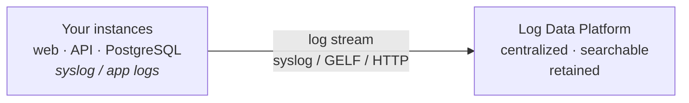

# Operations
## Monitoring, Cost, Quotas & Support

<!--
Ouverture Day 3 -- deuxieme module. La salle sort du lab Terraform.
Ancrage narratif: "production is live. The Terraform repo is clean. What happens when something breaks at 2am?"
Demander: "what's the first thing you check Monday morning on a system you own?" -- let them answer before showing the agenda.
Ton du module: plus calme que 3.1. C'est un module de maturite operationnelle, pas de revelation technique.
Anticiper le learner Corporate: "we have Datadog/Datadog" -- acknowledge, frame as the native baseline before third-party tools.
-->

---
layout: default
moduleId: "3.2"
slideId: "S01 — Agenda"
---

# Module 3.2 — Agenda

<strong style="color: var(--ods-color-primary-700)">Block 1 — 5 min</strong> 
Sentier battu / Hors piste

<strong style="color: var(--ods-color-primary-700)">Block 2 — 30 min</strong> 
Theory &amp; Concepts 
11 slides · 4K + 5S + 2A

<strong style="color: var(--ods-color-primary-700)">Block 3 — 15 min</strong> 
Trainer Demonstration 
Manager UI — Day-2 ops check

<strong style="color: var(--ods-color-primary-700)">Block 4 — 30 min</strong> 
Learner Lab 
Metrics · Cost · Quotas · Ticket

<strong style="color: var(--ods-color-primary-700)">Block 5 — 5 min</strong> 
Micro-check QCM 
7 questions

<strong style="color: var(--ods-color-primary-700)">Block 6 — 5 min</strong> 
Wrap-up &amp; Transition 
Recap · Exam transition

<OvhNotice title="Northwind context">Production is live. Today we watch it, control its cost, and know when to call for help.</OvhNotice>

<!--
Rappeler le cap: c'est le dernier module avant le pre-exam wrap-up et l'examen.
Demander: "your Northwind production is live since yesterday -- what's the first thing you check this morning?"
Ne pas attendre la reponse parfaite -- lancer la discussion, puis derouler le module.
-->

---
# Block 1 - Sentier battu
layout: section
block: "Block 1"
duration: "5 min"
moduleId: "3.2"
---

# Sentier battu / Hors piste
### Prerequisites & remediation

---
layout: default
moduleId: "3.2"
slideId: "S02 — Sentier battu"
los: ["LO-OPS-K01"]
---

# Prerequisites for this module

<strong>Tools in place</strong>

- OVHcloud Manager access (admin or member on the Northwind project)
- At least one running instance in the project
- OpenStack CLI installed and `openrc.sh` sourced (from Module 3.1)
- Browser access to `manager.ovhcloud.com` and `status.ovhcloud.com`

<strong>Knowledge assumed</strong>

- Manager UI navigation — project dashboard, instance list, billing section (Modules 1.2+)
- Hourly billing model (Module 1.2)
- Northwind stack topology after Module 3.1 — three production instances, volumes, private network, Load Balancer

<OvhWarning title="No running instance?">Run `openstack server start nwa-api-staging-01` or use the trainer's recovery script: `cd ~/demos/3-2-recovery && terraform apply -auto-approve`</OvhWarning>

<!--
Vérifier que tout le monde a le Manager ouvert sur le projet Northwind.
Hors piste: si aucune instance n'est running (Module 3.1 destroy non suivi d'un apply), utiliser le recovery script -- ca prend 2 minutes, pas la peine d'attendre.
Anticiper persona Digital Starter: "je n'ai pas de projet production" -- les exercices fonctionnent aussi sur le projet staging.
-->

---
# Block 2 - Theory
layout: section
block: "Block 2"
duration: "30 min"
moduleId: "3.2"
---

# Theory & Concepts
### Native observability · cost · quotas · support

---
layout: default
moduleId: "3.2"
slideId: "S03 — Day-2 shift"
los: ["LO-OPS-K01"]
---

# From "build it" to "run it" — the Day-2 shift

<table style="width:100%; border-collapse: collapse; margin-top: 1.5rem;">
<thead>
<tr>
<th style="padding: 10px 16px; text-align: center; width: 50%; background: var(--ods-color-primary-700); color: white;">Day 1 — Provision</th>
<th style="padding: 10px 16px; text-align: center; width: 50%; background: var(--ods-color-neutral-900); color: white;">Day 2 — Operate</th>
</tr>
</thead>
<tbody>
<tr>
<td style="padding: 12px 16px; text-align: center; font-size: 1.1rem; font-weight: 600; color: var(--ods-color-primary-700); border-bottom: 1px solid #E5E5E5;">create · configure</td>
<td style="padding: 12px 16px; text-align: center; font-size: 1.1rem; font-weight: 600; color: var(--ods-color-neutral-900); border-bottom: 1px solid #E5E5E5;">watch · measure</td>
</tr>
<tr>
<td style="padding: 12px 16px; text-align: center; font-size: 1.1rem; font-weight: 600; color: var(--ods-color-primary-700);">secure · automate</td>
<td style="padding: 12px 16px; text-align: center; font-size: 1.1rem; font-weight: 600; color: var(--ods-color-neutral-900);">control · respond</td>
</tr>
<tr style="background: #F2F2F2;">
<td style="padding: 6px 16px; text-align: center; font-size: 0.75rem; color: var(--ods-color-neutral-700);">Modules 1.1 → 3.1</td>
<td style="padding: 6px 16px; text-align: center; font-size: 0.75rem; color: var(--ods-color-neutral-700);">Module 3.2 → production</td>
</tr>
</tbody>
</table>

The three operational questions: <strong>Is the system healthy?</strong> &nbsp;·&nbsp; <strong>Am I controlling cost?</strong> &nbsp;·&nbsp; <strong>Am I prepared to scale?</strong>

<!--
Ouvrir avec la transition depuis Module 3.1: "production is live, the Terraform repo is clean -- what happens when something breaks at 2am?"
Legacy analogy: monitoring en datacenter = traps SNMP et Nagios. Ici, c'est un onglet navigateur sur le Manager -- et le reflexe de le consulter regulierement.
Anticiper le learner Corporate: "we have Datadog" -- acknowledge, frame this as the native baseline before adding third-party tools. Ne pas aller plus loin.
Garder ce slide court -- le "why" est clair, passer vite au "how".
-->

---
layout: default
moduleId: "3.2"
slideId: "S04 — Three Manager views"
los: ["LO-OPS-K01"]
---

# Native observability — three Manager views

📈

<strong>Instance Metrics</strong>

Per-instance CPU / RAM / disk / network No agent required

Manager → Instances → [instance] → Metrics

💶

<strong>Consumption</strong>

Hourly billing data · top contributors CSV export · 24h delay

Manager → Public Cloud → Consumption

⚖️

<strong>Quotas</strong>

Resource ceilings · headroom at a glance Per region · per project

Manager → Quotas and Regions

AWS equivalents: &nbsp;<strong>CloudWatch</strong> (metrics) &nbsp;·&nbsp; <strong>Cost Explorer</strong> (billing) &nbsp;·&nbsp; <strong>Service Quotas</strong> (limits)

<!--
Souligner: tout cela est sans agent -- OVHcloud collecte les metriques au niveau de l'hyperviseur.
Utiliser ce slide comme une carte de navigation pour le bloc: "on va couvrir chacun de ces trois panels dans les prochains slides."
Anticiper le learner ex-AWS: "CloudWatch is way more configurable" -- acknowledge, frame this as the native baseline (Associate scope), Prometheus/Grafana integration is Professional.
-->

---
layout: default
moduleId: "3.2"
slideId: "S05 — Instance metrics"
los: ["LO-OPS-S01"]
---

# Instance metrics — CPU, RAM, disk, network

<strong>CPU utilization (%)</strong> 
Spike at known time = batch job / deploy — <em>expected</em> 
Sustained >80% for hours = CPU-bound workload

<strong>RAM usage (MB / %)</strong> 
Rising line toward 100% over days = memory leak or growing dataset 
Flat plateau = stable, flavor is right-sized for RAM

<strong>Disk I/O (MB/s read / write)</strong> 
Write burst aligned to a batch job = expected log writes 
Sustained high I/O = storage bottleneck or runaway process

<strong>Network (in / out Mbps)</strong> 
Large egress spike = data export or delivery traffic — may generate billing 
Large ingress spike = data load or backup

Time ranges: 1h · 12h · 24h · 7 days · 30 days &nbsp;·&nbsp; <strong>Tip:</strong> use 24h for troubleshooting, 7-30 days for right-sizing review

<!--
Demander: "what does a CPU spike at 14:00 on Friday tell you?" -- let them answer. The reflex of asking the question is the point, not the answer.
Souligner: hypervisor-level metrics -- reflect what the VM "sees", not what the application measures. A memory leak may show stable RAM at the VM level if the OS swaps.
Anticiper: "can I set an alert on these metrics?" -- no native Manager alerting at this scope; Prometheus + Grafana with the OVHcloud metrics exporter is the Professional path. Mention briefly, don't dwell.
-->

---
layout: default
moduleId: "3.2"
slideId: "S06 — Log Data Platform"
los: ["LO-OPS-K02"]
---

# OVHcloud Log Data Platform — positioning

<strong>What it solves</strong> 
Logs from a self-managed instance live only on that VM's disk. If the VM disappears, so do the logs. LDP collects them centrally, searchable and retained.

<strong>Associate scope</strong> 
Know it exists · know why you need it · know where to enable it 
<em>Manager → Logs Data Platform</em> 
Setup: configure rsyslog or Filebeat on each instance

AWS equivalent: CloudWatch Logs + OpenSearch &nbsp;·&nbsp; Depth configuration (custom dashboards, APM) is Professional scope

<!--
Ce slide est de positionnement, pas d'implementation. Ne pas aller dans la config rsyslog.
Souligner la pertinence Northwind: "your self-managed PostgreSQL has logs. Right now they're only on that VM's disk. If the VM disappears, so do the logs."
Anticiper persona Digital Starter: overhead de configuration peut sembler lourd -- acknowledge; frame comme un investissement Day-2 qui paie des le premier incident a 3h du matin sans logs.
-->

---
layout: default
moduleId: "3.2"
slideId: "S07 — Consumption view"
los: ["LO-OPS-S02"]
---

# Cost tracking — reading the Consumption view

What the view shows

<ul class="text-sm space-y-1">
<li>Hourly billing data aggregated by day</li>
<li>~24h delay — not real-time</li>
<li>Daily spend chart (30-day trend)</li>
<li>Top cost contributors by type</li>
<li>Per-resource line items with hourly rate</li>
<li>CSV export for finance / reporting</li>
</ul>

Typical Northwind breakdown

<table style="width:100%; border-collapse: collapse; font-size: 0.75rem;">
<thead>
<tr style="background: var(--ovh-masterbrand-blue); color: white;">
<th style="padding: 5px 8px; text-align: left;">Resource</th>
<th style="padding: 5px 8px; text-align: right;">Cost/h</th>
</tr>
</thead>
<tbody>
<tr style="background: #F2F2F2;">
<td style="padding: 5px 8px;">Compute — production (3 instances)</td>
<td style="padding: 5px 8px; text-align: right;">€0.38</td>
</tr>
<tr>
<td style="padding: 5px 8px;">Compute — staging (3 instances)</td>
<td style="padding: 5px 8px; text-align: right;">€0.19</td>
</tr>
<tr style="background: #F2F2F2;">
<td style="padding: 5px 8px;">Block Storage — volumes</td>
<td style="padding: 5px 8px; text-align: right;">€0.02</td>
</tr>
<tr>
<td style="padding: 5px 8px;">Networking — Load Balancer</td>
<td style="padding: 5px 8px; text-align: right;">€0.02</td>
</tr>
<tr style="background: #FFF3CD;">
<td style="padding: 5px 8px;">⚠ Block Storage — orphaned volume</td>
<td style="padding: 5px 8px; text-align: right;">€0.01</td>
</tr>
</tbody>
</table>

<!--
Demander: "without looking, who here knows what their OVHcloud project cost yesterday?" -- not to embarrass, to make the reflex concrete.
Souligner: staging instances left running over the weekend cost real money -- the "forgot to destroy" pattern from Module 3.1's drift section applies here.
Anticiper: "can I set a budget alert?" -- yes, Manager -> Billing -> Budget Alerts; mention briefly, don't demo.
AWS cross-ref: Cost Explorer with daily granularity, service-level breakdown. Same model.
-->

---
layout: two-cols
moduleId: "3.2"
slideId: "S08 — Cost leaks"
los: ["LO-OPS-S02", "LO-OPS-A01"]
---

# Cost leaks — two patterns to know

::left::

Pattern 1 — Forgotten resources

Detached volume — €0.04/h = <strong>€28.80/month</strong>

Unassociated floating IP — €0.004/h = <strong>€2.88/month</strong>

Snapshot aged 90 days — €0.002/h per GB

They bill even if nothing uses them. Surface them in the Consumption view line-item table.

::right::

Pattern 2 — Right-sizing opportunity

CPU at 4% plateau on <code>b3-16</code> (€0.25/h) → resize to <code>b3-4</code> (€0.06/h) <strong>Saving: €0.19/h = ~€136/month</strong>

<OvhNotice title="Monthly Cost Review" class="text-xs mt-2">
First Monday of the month, 30 minutes, Manager Consumption view + a spreadsheet. No external tooling required.
</OvhNotice>

<!--
Souligner: right-sizing is not a one-time event -- workloads change. The quarterly performance review is the professional variant.
Rappeler the Northwind red thread: "that detached volume from Module 2.1 is still billing. We'll find it in the lab."
Persona Digital Starter: for a single-person operation, the cost impact of right-sizing one instance may be 20-50 euros/month -- not trivial at a 500 euro/month total bill.
Eviter: Reserved Instances or billing negotiation -- sales/commercial conversation, not certification scope.
-->

---
layout: default
moduleId: "3.2"
slideId: "S09 — Quotas"
los: ["LO-OPS-K03", "LO-OPS-S03"]
---

# Quotas & limits — what they are & where they live

<table style="width:100%; border-collapse: collapse;">
<thead>
<tr style="background: var(--ovh-masterbrand-blue); color: white;">
<th style="padding: 5px 8px; text-align: left;">Resource</th>
<th style="padding: 5px 8px; text-align: right;">Default quota</th>
<th style="padding: 5px 8px; text-align: right;">Current (Northwind)</th>
<th style="padding: 5px 8px; text-align: right;">Headroom</th>
</tr>
</thead>
<tbody>
<tr style="background: #F2F2F2;">
<td style="padding: 5px 8px;">Compute instances</td>
<td style="padding: 5px 8px; text-align: right;">20</td>
<td style="padding: 5px 8px; text-align: right;">3</td>
<td style="padding: 5px 8px; text-align: right;">17</td>
</tr>
<tr>
<td style="padding: 5px 8px;">vCPUs</td>
<td style="padding: 5px 8px; text-align: right;">40</td>
<td style="padding: 5px 8px; text-align: right;">18</td>
<td style="padding: 5px 8px; text-align: right;">22</td>
</tr>
<tr style="background: #F2F2F2;">
<td style="padding: 5px 8px;">RAM (GB)</td>
<td style="padding: 5px 8px; text-align: right;">100</td>
<td style="padding: 5px 8px; text-align: right;">36</td>
<td style="padding: 5px 8px; text-align: right;">64</td>
</tr>
<tr>
<td style="padding: 5px 8px;">Floating IPs</td>
<td style="padding: 5px 8px; text-align: right;">10</td>
<td style="padding: 5px 8px; text-align: right;">2</td>
<td style="padding: 5px 8px; text-align: right;">8</td>
</tr>
<tr style="background: #F2F2F2;">
<td style="padding: 5px 8px;">Volumes</td>
<td style="padding: 5px 8px; text-align: right;">40</td>
<td style="padding: 5px 8px; text-align: right;">8</td>
<td style="padding: 5px 8px; text-align: right;">32</td>
</tr>
<tr>
<td style="padding: 5px 8px;">Volume storage (GB)</td>
<td style="padding: 5px 8px; text-align: right;">10 000</td>
<td style="padding: 5px 8px; text-align: right;">280</td>
<td style="padding: 5px 8px; text-align: right;">9 720</td>
</tr>
</tbody>
</table>

<OvhNotice title="Two access methods" class="text-sm">
<strong>Manager</strong>: Public Cloud → Quotas and Regions 
<strong>CLI</strong>: <code>openstack quota show</code>
</OvhNotice>
<OvhWarning title="Request at 70% usage">
Do not wait until you hit the limit in production. The increase process takes up to 24-48h.
</OvhWarning>

<!--
Demander: "which resource is most likely to be the first ceiling you hit at Northwind?" -- vCPUs is usually first for multi-instance stacks.
Souligner: quotas are per region -- if you want to deploy in both GRA and SBG, quotas are independent for each region.
Anticiper: "can I set my own lower limit to prevent accidental overspend?" -- no; quotas are OVHcloud-set. Budget alerts are the tool for self-imposed spend caps.
AWS cross-ref: Service Quotas. Same concept, same increase process via the console or API.
-->

---
layout: default
moduleId: "3.2"
slideId: "S10 — Quota increase"
los: ["LO-OPS-K03", "LO-OPS-S03"]
---

# Requesting a quota increase

<OvhStep :step="1" title="Check current quota">
Manager → Quotas and Regions 
or <code>openstack quota show</code> 
Identify resource + gap
</OvhStep>
<OvhStep :step="2" title="Open a support ticket">
Category: <strong>Quota Increase</strong> 
Required: resource type · target value · justification · region 
<em>"I need 20 more vCPUs in GRA to deploy environment Y by March 1"</em>
</OvhStep>
<OvhStep :step="3" title="OVHcloud review & grant">
Standard SLA: up to 24-48h 
Premium SLA: faster 
Justified requests are rarely rejected 
New quota visible immediately on grant
</OvhStep>

<OvhWarning title="Plan ahead — request at 70%, not 100%" class="mt-4 text-sm">
A vague justification ("I need more") takes longer than a specific one. Quota increases are per region — open one ticket per region.
</OvhWarning>

<!--
Souligner: the justification is not bureaucratic -- it enables OVHcloud to allocate physical capacity in the region.
Anticiper: "can I automate a quota increase via the OVHcloud API?" -- yes, but manual review is required on OVHcloud's side regardless. Not worth automating at this scope.
Verifier que les learners comprennent la difference quota / budget alert: quota blocks creation, budget alert doesn't block anything.
-->

---
layout: default
moduleId: "3.2"
slideId: "S11 — Status page"
los: ["LO-OPS-S04"]
---

# OVHcloud status page — reading an incident

status.ovhcloud.com

 Public Cloud — Global — Object Storage — <strong>Operational</strong>

 Public Cloud — GRA — Compute — <strong>Degraded performance</strong> <em class="text-gray-400">since 09:42 UTC</em>

 Public Cloud — SBG — Network — <strong>Scheduled maintenance</strong> <em class="text-gray-400">2026-06-15 02:00-04:00 UTC</em>

Incident lifecycle states

<strong>Investigating</strong> — we know something is wrong

Identified — root cause known

Monitoring — fix applied, watching

Fix deployed — resolved at service level

Resolved — confirmed and closed + PIR

<!--
Demander: "you open the Manager Monday morning and a batch job failed overnight. First reflex?" -- expected answer: check the status page before assuming code or config issue.
Anticiper: "does OVHcloud notify by email automatically?" -- not by default; the learner must subscribe on the status page or set up Manager Alerts.
Si un incident est en cours pendant la session: utiliser comme enseignement en temps reel. Rare opportunity.
-->

---
layout: default
moduleId: "3.2"
slideId: "S12 — Support tiers"
los: ["LO-OPS-K04"]
---

# Support channels and SLA tiers

<table style="width:100%; border-collapse: collapse;">
<thead>
<tr style="background: var(--ovh-masterbrand-blue); color: white;">
<th style="padding: 5px 16px; text-align: left;">Level</th>
<th style="padding: 5px 16px; text-align: left;">Included with</th>
<th style="padding: 5px 16px; text-align: left;">Response SLA</th>
<th style="padding: 5px 16px; text-align: left;">Channel</th>
</tr>
</thead>
<tbody>
<tr style="background: #F2F2F2;">
<td style="padding: 5px 16px;"><strong>Community</strong></td>
<td style="padding: 5px 16px;">All accounts</td>
<td style="padding: 5px 16px;">Best-effort</td>
<td style="padding: 5px 16px;">docs.ovhcloud.com · community forum</td>
</tr>
<tr>
<td style="padding: 5px 16px;"><strong>Standard</strong></td>
<td style="padding: 5px 16px;">All OVHcloud contracts</td>
<td style="padding: 5px 16px;">Best-effort (24-48h)</td>
<td style="padding: 5px 16px;">Manager ticket only</td>
</tr>
<tr style="background: #F2F2F2;">
<td style="padding: 5px 16px;"><strong>Premium</strong></td>
<td style="padding: 5px 16px;">Business contracts</td>
<td style="padding: 5px 16px;">Guaranteed response time</td>
<td style="padding: 5px 16px;">Manager ticket + phone priority</td>
</tr>
<tr>
<td style="padding: 5px 16px;"><strong>Dedicated</strong></td>
<td style="padding: 5px 16px;">Enterprise</td>
<td style="padding: 5px 16px;">Named Technical Account Manager</td>
<td style="padding: 5px 16px;">Dedicated queue + direct contact</td>
</tr>
</tbody>
</table>

<OvhNotice title="Digital Starter default" class="text-sm">
Standard is the default tier for pay-as-you-go accounts. No phone. Ticket response during business hours. Adequate for non-urgent questions.
</OvhNotice>
<OvhWarning title="Before go-live" class="text-sm">
Corporate / Northwind should negotiate Premium before production go-live. The cost of one serious production incident without a guaranteed SLA typically exceeds the annual Premium contract cost.
</OvhWarning>

<!--
Rappeler la persona: Digital Starter (pay-as-you-go, moins de 2k euros/mois) = Standard by default -- no phone, ticket only, best-effort. Frame expectations.
Anticiper: "can I call OVHcloud directly?" -- Standard: no. Premium: yes. Dedicated: yes with named contact.
Verifier que les learners ont trouve le menu Support dans leur Manager avant de passer au slide suivant.
-->

---
layout: default
moduleId: "3.2"
slideId: "S13 — Support ticket"
los: ["LO-OPS-S05"]
---

# Opening a good support ticket — the 5-field rule

<strong>1. Category</strong> <em>Billing — Subscription question</em> Pick the most specific category — billing and technical incidents route to different teams.

<strong>2. Project ID</strong> <code>a1b2c3d4-xxxx-xxxx-xxxx-xxxxxxxxxxxx</code> Primary lookup key for the support agent. Manager → Project settings.

<strong>3. Affected resource(s)</strong> Volume ID / instance ID / IP — whichever is relevant. Found via Manager or <code>openstack &lt;type&gt; list</code>.

<strong>4. Timestamps in UTC</strong> <em>"Issue started 2026-06-05 ~14:00 UTC. Billing anomaly noticed 2026-06-09."</em> "It was slow" is useless. UTC timestamp is actionable.

<strong>5. Symptom + what was already checked</strong> Describe impact. Include a screenshot. State what you verified before opening.

<OvhWarning title="Without these 5 fields" class="text-xs">First reply = request for this information. That adds 24-48h. Submit complete.</OvhWarning>

<!--
Demander: "what's missing from this ticket: 'My instance is slow, please fix'?" -- let them enumerate the five missing fields.
Souligner the UTC requirement -- OVHcloud support operates across time zones; local time without timezone is ambiguous.
Eviter de digresser sur RCA, post-mortems -- pas dans le scope Associate.
C'est l'ancre de LO-OPS-S05 -- le learner doit repartir capable d'ecrire ce ticket pour n'importe quel probleme.
-->

---
# Block 3 - Demo
layout: section
block: "Block 3"
duration: "15 min"
moduleId: "3.2"
---

# Trainer Demonstration
### Manager UI · Day-2 ops check

---
layout: default
moduleId: "3.2"
slideId: "S14 — Demo overview"
los: ["LO-OPS-S01", "LO-OPS-S02", "LO-OPS-S03", "LO-OPS-S04", "LO-OPS-S05"]
---

# Demo — Monday morning ops check

Scenario: first week after Northwind production go-live. You open the Manager before the 9h30 standup.

<OvhStep :step="1" title="Project dashboard">Check for unexpected resources, cost summary, region status</OvhStep>
<OvhStep :step="2" title="Instance metrics">Open nwa-api-prod-01 → CPU spike Friday 17:30 → RAM stable → disk I/O aligned</OvhStep>
<OvhStep :step="3" title="Consumption view">Top contributor: Compute · orphaned volume visible in line items</OvhStep>

<OvhStep :step="4" title="openstack quota show">Terminal · vCPU headroom: 22/40 remaining · next environment needs 10 more → request now</OvhStep>
<OvhStep :step="5" title="status.ovhcloud.com">Read current status · maintenance banners · subscribe to GRA updates</OvhStep>
<OvhStep :step="6" title="Support ticket draft">Manager → Support → New Ticket · fill all 5 fields · stop at Submit</OvhStep>

<!--
Narrer les decisions au fur et a mesure -- l'objectif est de rendre visible la boucle mentale Day-2, pas juste les commandes.
Ne pas soumettre le ticket a la fin de la demo -- creer un vrai ticket serait une perturbation inutile.
Si un incident OVHcloud est en cours sur la status page: l'utiliser comme enseignement en temps reel.
-->

---
layout: section
block: "Block 4"
duration: "30 min"
---

# Your Northwind production is live
### Monday morning. Your turn. 30 minutes.

---
layout: default
moduleId: "3.2"
slideId: "S15 — Lab brief"
los: ["LO-OPS-S01", "LO-OPS-S02", "LO-OPS-S03", "LO-OPS-S04", "LO-OPS-S05", "LO-OPS-A01", "LO-OPS-A02"]
---

# Lab — Day-2 ops baseline for Northwind

<OvhNotice title="Mission" class="mt-4">The CTO stops by on Monday morning : <em>"Production has been live since Friday. Before the standup I need three answers: is the system healthy, are we spending correctly, and do we have room to scale next sprint? Write it down."</em> Today you : (1) read and interpret instance metrics over 24h and 7 days; (2) analyze the Consumption view and identify any forgotten billing line; (3) check quotas via CLI and compute headroom; (4) consult the status page and subscribe to region updates; (5) draft a complete support ticket for the orphaned volume; (6) write your observability posture document.</OvhNotice>

<strong style="color: var(--ovh-masterbrand-blue);">Channels</strong>

&middot; <strong>Manager UI</strong> : Instance Metrics tab, Consumption view, Quotas panel, Support ticket form 
&middot; <strong>OpenStack CLI</strong> : <code>openstack quota show</code> 
&middot; <strong>status.ovhcloud.com</strong> : incident awareness, region subscription

<strong style="color: var(--ovh-masterbrand-blue);">Success criteria</strong>

Metrics tab assessed, one right-sizing sentence written &middot; Consumption CSV exported, orphaned line identified &middot; <code>quota-output.txt</code> captured &middot; Status page screenshot saved &middot; <code>ticket-draft.md</code> complete with all 5 fields &middot; <code>observability-posture.md</code> : 3 metrics with thresholds, 1 log stream, cost cadence

<!--
Rappeler: c'est une session lecture + ecriture, pas de modification du stack.
Laisser les apprenants lire le Mission callout -- poser une question de comprehension avant de continuer.
-->

---
layout: default
moduleId: "3.2"
slideId: "Lab -- Steps 1/2"
los: ["LO-OPS-S01", "LO-OPS-S02", "LO-OPS-S03"]
---

# Lab — Step-by-step (1/2)
### Metrics · consumption · quotas

<strong>1.</strong> Manager → Instance [your instance] → Metrics tab 
&nbsp;&nbsp;&middot; Last 24h : note CPU baseline and any spikes 
&nbsp;&nbsp;&middot; Last 7 days : assess RAM trend and disk I/O pattern 
&nbsp;&nbsp;&middot; Write one sentence in your lab log : is this instance right-sized ? 
<strong>2.</strong> Manager → Public Cloud → Consumption 
&nbsp;&nbsp;&middot; Identify top cost contributor 
&nbsp;&nbsp;&middot; Export CSV → save as <code>consumption-export.csv</code> 
&nbsp;&nbsp;&middot; Scan line items : flag any orphaned or unexpected resource 
<strong>3.</strong> <code>openstack quota show &gt; quota-output.txt</code> 
&nbsp;&nbsp;&middot; Compute headroom per resource type 
&nbsp;&nbsp;&middot; Flag any resource below 30% headroom

<!--
Anticiper: "the Metrics tab shows no data" -- l'instance est peut-etre stoppee. openstack server start <name>, les metriques reviennent en 5 minutes.
Le CSV Consumption peut prendre quelques secondes a generer -- normal.
Circuler en salle pendant le Step 3 -- quota headroom doit etre interprete, pas juste copie.
-->

---
layout: default
moduleId: "3.2"
slideId: "Lab -- Steps 2/2"
los: ["LO-OPS-S04", "LO-OPS-S05", "LO-OPS-A01", "LO-OPS-A02"]
---

# Lab — Step-by-step (2/2)
### Status · ticket · posture

<strong>4.</strong> Open <code>status.ovhcloud.com</code> 
&nbsp;&nbsp;&middot; Check status for your project's region (GRA or SBG) 
&nbsp;&nbsp;&middot; Screenshot → save as <code>status-screenshot.png</code> 
&nbsp;&nbsp;&middot; Subscribe to region updates 
<strong>5.</strong> Manager → Support → New Ticket — <strong>do NOT submit</strong> 
&nbsp;&nbsp;&middot; Scenario : orphaned volume still billing since the Module 2.1 lab 
&nbsp;&nbsp;&middot; Fill all 5 fields : category, project ID, resource ID, UTC timestamp, symptom + prior checks 
&nbsp;&nbsp;&middot; Save as <code>ticket-draft.md</code> 
<strong>6.</strong> Create <code>observability-posture.md</code> 
&nbsp;&nbsp;&middot; 3 metrics with thresholds (e.g. CPU &gt; 80% sustained &gt; 1h = investigate) 
&nbsp;&nbsp;&middot; 1 LDP log stream to configure : which instance, which log file 
&nbsp;&nbsp;&middot; Cost review cadence : first Monday of month, 30 min, Consumption view + spreadsheet

<!--
Step 6 est le deliverable A02 -- le plus important du lab. Reserver au moins 8 minutes.
Rappeler: ne pas soumettre le ticket en Step 5.
Si un incident OVHcloud est en cours sur la status page: l'utiliser comme enseignement en temps reel.
-->

---
layout: section
block: "Block 5"
duration: "5 min"
---

# Micro-check
### 7 formative questions, no points

---
layout: default
moduleId: "3.2"
slideId: "MC -- Q1 Metrics view for RAM"
los: ["LO-OPS-S01"]
---

# Q1 &mdash; Instance metrics view

A Northwind operator wants to check RAM usage over the last 7 days. <strong>Which Manager view should they use?</strong>

<strong>A.</strong> Consumption view

<strong>B.</strong> Instance Metrics tab &mdash; RAM graph &mdash; 7-day range

<strong>C.</strong> Status page

<strong>D.</strong> Log Data Platform

<!--
Trainer notes Q1:
- Correct answer: B. Le Metrics tab de l'instance, selectionner RAM, plage 7 jours.
- A wrong : Consumption montre la facturation, pas les metriques systeme.
- C wrong : Status page = incidents OVHcloud, pas metriques d'instance.
- D wrong : LDP = centralisation de logs, pas metriques temps reel.
- LO: LO-OPS-S01. Bloom: Apply.
-->

---
layout: default
moduleId: "3.2"
slideId: "MC -- Q2 Consumption view data"
los: ["LO-OPS-K01"]
---

# Q2 &mdash; Consumption view data

<strong>What does the Consumption view show?</strong>

<strong>A.</strong> Real-time billing &mdash; updated every minute

<strong>B.</strong> Hourly billing data aggregated by day, with approximately 24h delay

<strong>C.</strong> Project audit log &mdash; who created or deleted resources

<strong>D.</strong> Monthly invoice &mdash; same view as the billing portal

<!--
Trainer notes Q2:
- Correct answer: B. Donnees horaires agregees par jour, delai ~24h. Pas du temps reel.
- A wrong : la Consumption n'est pas temps reel; le delai est une source de surprise pour les learners.
- C wrong : l'audit log est une fonctionnalite separee (Logs → Activity).
- D wrong : la facture mensuelle est dans le portail Billing, pas dans la Consumption view.
- LO: LO-OPS-K01. Bloom: Remember.
- Si rate, retour slide S07.
-->

---
layout: default
moduleId: "3.2"
slideId: "MC -- Q3 Quota headroom action"
los: ["LO-OPS-S03"]
---

# Q3 &mdash; Quota headroom anticipation

vCPU quota is 40, current usage 32. The CTO wants 10 more vCPUs available for the next sprint. <strong>Correct action?</strong>

<strong>A.</strong> Open a quota increase ticket now, with business justification, before the sprint starts

<strong>B.</strong> Wait until blocked &mdash; OVHcloud will auto-scale the quota when the limit is hit

<strong>C.</strong> Delete the staging environment to free up vCPUs for the sprint

<strong>D.</strong> Switch to a different region that has a higher default quota

<!--
Trainer notes Q3:
- Correct answer: A. Anticiper : la demande de quota prend du temps. Ouvrir le ticket avant d'en avoir besoin.
- B wrong : OVHcloud ne scale pas automatiquement les quotas. Il faut en faire la demande explicitement.
- C wrong : supprimer staging est une decision d'architecture, pas une reponse a un probleme de quota.
- D wrong : changer de region implique de migrer toute l'infrastructure. Disproportionne.
- LO: LO-OPS-S03. Bloom: Apply.
- La lecon cle : le quota n'est pas un hard wall auto-scalable -- c'est une limite qui necessite une action humaine.
-->

---
layout: default
moduleId: "3.2"
slideId: "MC -- Q4 Status page incident response"
los: ["LO-OPS-S04"]
---

# Q4 &mdash; Status page incident response

The status page shows "Degraded &mdash; GRA Compute". A Northwind batch job just failed. <strong>What is the correct first action?</strong>

<strong>A.</strong> Open a priority support ticket immediately to report the impact

<strong>B.</strong> Migrate the affected instances to another region

<strong>C.</strong> Restart all instances in GRA to force a recovery

<strong>D.</strong> Subscribe to status updates for the region; do not open a duplicate incident ticket

<!--
Trainer notes Q4:
- Correct answer: D. OVHcloud gere l'incident. S'abonner aux updates, surveiller, ne pas ouvrir un ticket doublon.
- A wrong : ouvrir un ticket quand un incident est deja declare ne fait qu'ajouter du bruit. Attendre la resolution.
- B wrong : migrer en region necessiterait de tout re-deployer. Hors de proportion pour un incident en cours.
- C wrong : restart ne resoud pas un incident infrastructure OVHcloud. Ca peut meme aggraver si le probleme est au niveau hyperviseur.
- LO: LO-OPS-S04. Bloom: Apply.
- Ancrer le reflexe : status page d'abord, toujours, avant d'ouvrir un ticket.
-->

---
layout: default
moduleId: "3.2"
slideId: "MC -- Q5 Support ticket quality"
los: ["LO-OPS-S05"]
---

# Q5 &mdash; Support ticket quality

A ticket has been submitted with the description: <em>"My instance is not responding."</em> <strong>Why will this ticket be slow to resolve?</strong>

<strong>A.</strong> The category is wrong &mdash; the ticket will be automatically closed

<strong>B.</strong> The instance ID, UTC timestamps, and prior checks performed are all missing

<strong>C.</strong> Standard SLA does not apply to compute instances &mdash; only managed services

<strong>D.</strong> Instance IDs cannot be shared in support tickets for security reasons

<!--
Trainer notes Q5:
- Correct answer: B. Les 5 champs obligatoires : categorie, project ID, resource ID, timestamp UTC, symptome + checks deja effectues. Ce ticket n'a rien de tout cela.
- A wrong : le ticket ne sera pas auto-ferme; il sera simplement deprioritise ou genere une demande de complemento d'info.
- C wrong : le SLA standard s'applique bien aux instances. Tier Business = 4h, Standard = best effort.
- D wrong : les IDs de ressources doivent etre fournis -- c'est precisement ce qui permet au support de trouver la ressource.
- LO: LO-OPS-S05. Bloom: Analyze.
- Ancrer le reflexe : un ticket sans resource ID et timestamps sera toujours plus lent. Ecrire avant de soumettre.
-->

---
layout: default
moduleId: "3.2"
slideId: "MC -- Q6 Cost-review reflex"
los: ["LO-OPS-A01"]
---

# Q6 &mdash; Cost-review reflex

An operator adds a recurring monthly calendar event: <em>"OVHcloud cost review &mdash; 30 min."</em> <strong>Which learning outcome does this behaviour directly embody?</strong>

<strong>A.</strong> LO-OPS-A01 &mdash; apply a recurring cost-review reflex to surface forgotten resources and right-sizing opportunities

<strong>B.</strong> LO-OPS-A02 &mdash; define and document an observability posture for any new project

<strong>C.</strong> LO-OPS-S02 &mdash; track project consumption and identify unexpected billing lines

<strong>D.</strong> LO-OPS-K03 &mdash; define quotas and explain the increase process

<!--
Trainer notes Q6:
- Correct answer: A. Le calendrier recurrent = reflex = posture = A01. C'est exactement la definition de cet outcome.
- B wrong : A02 est la posture d'observabilite (metriques + logs + cadence). Le calendrier cost seul ne suffit pas pour A02.
- C wrong : S02 est le skill operationnel (consulter la vue Consumption). Le calendrier est une posture, pas un skill ponctuel.
- D wrong : K03 est la connaissance des quotas. Pas de lien avec les couts.
- LO: LO-OPS-A01. Bloom: Evaluate.
- Question meta -- elle teste si les learners ont interiorise le vocabulaire du programme. Bonne question finale avant la wrap-up.
-->

---
layout: default
moduleId: "3.2"
slideId: "MC -- Q7 Minimum observability posture"
los: ["LO-OPS-A02"]
---

# Q7 &mdash; Minimum observability posture

A developer asks what constitutes a minimum viable observability posture for a new OVHcloud Public Cloud project. <strong>Best answer?</strong>

<strong>A.</strong> A Grafana dashboard with one CPU alert configured

<strong>B.</strong> 3 metrics with alert thresholds, 1 LDP log stream, and a documented cost-review cadence

<strong>C.</strong> Real-time billing alerts only &mdash; cost overrun is the primary risk for new projects

<strong>D.</strong> A status.ovhcloud.com subscription and a weekly support-ticket review

<!--
Trainer notes Q7:
- Correct answer: B. Les trois composantes de A02 : metriques avec seuils + stream de logs LDP + cadence de cost review. Les trois ensemble.
- A wrong : Grafana n'est pas un outil OVHcloud natif. Et une seule alerte CPU ne constitue pas une posture.
- C wrong : les couts seuls sans metriques operationnelles = aveugle sur la performance et la disponibilite.
- D wrong : la status page couvre les incidents OVHcloud, pas la sante de votre application. Ce n'est pas une posture d'observabilite.
- LO: LO-OPS-A02. Bloom: Evaluate.
- Bonne conclusion du module : la "posture" est le deliverable du lab step 6. Si rate, renvoyer au fichier observability-posture.md.
-->

---
# Block 6 - Wrap-up
layout: section
block: "Block 6"
duration: "5 min"
moduleId: "3.2"
---

# Wrap-up & Transition
### Recap & exam transition

---
layout: default
moduleId: "3.2"
slideId: "S17 — Wrap-up"
los: ["LO-OPS-K01", "LO-OPS-K02", "LO-OPS-K03", "LO-OPS-K04", "LO-OPS-S01", "LO-OPS-S02", "LO-OPS-S03", "LO-OPS-S04", "LO-OPS-S05", "LO-OPS-A01", "LO-OPS-A02"]
---

# You can now…

<strong style="color: var(--ods-color-primary-700)">Identify</strong> the three native observability surfaces and their AWS equivalents — `K01` 
<strong style="color: var(--ods-color-primary-700)">Identify</strong> the Log Data Platform and articulate why centralized logs matter — `K02` 
<strong style="color: var(--ods-color-primary-700)">Define</strong> quotas, interpret headroom, explain the increase process — `K03` 
<strong style="color: var(--ods-color-primary-700)">Identify</strong> the four support tiers and their SLA implications — `K04`

<strong style="color: var(--ods-color-primary-700)">Read and interpret</strong> the four instance-level metrics — `S01` 
<strong style="color: var(--ods-color-primary-700)">Track</strong> project consumption and surface forgotten resources — `S02` 
<strong style="color: var(--ods-color-primary-700)">Check</strong> quotas via Manager + CLI and open an increase ticket — `S03` 
<strong style="color: var(--ods-color-primary-700)">Consult</strong> the status page and apply the correct incident response — `S04` 
<strong style="color: var(--ods-color-primary-700)">Open</strong> a support ticket with all five required fields — `S05`

<OvhNotice title="A01 — Cost-review reflex">Apply a recurring monthly ritual to audit forgotten resources, right-sizing opportunities, and quota headroom.</OvhNotice>
<OvhNotice title="A02 — Observability posture">Recommend: 3 metrics with thresholds + 1 LDP log stream + documented cost-review cadence — for any new project.</OvhNotice>

<!--
C'est le dernier wrap-up du programme. Prendre 30 secondes pour marquer le moment: "vous venez de fermer la boucle Day-2. De la creation du projet Northwind a la surveillance de la production."
Transition vers le pre-exam: laisser la place a des questions learner-driven avant de passer au wrap-up consolidation de fin de journee.
Ne pas rusher -- si des questions emerg ent ici, c'est exactement le bon moment.
-->

---
layout: default
moduleId: "3.2"
slideId: "S18 — Transition"
los: ["LO-OPS-A01", "LO-OPS-A02"]
---

# Northwind — the arc is complete

<table style="width:100%; border-collapse: collapse; margin-top: 1.5rem; font-size: 0.875rem;">
<thead>
<tr>
<th style="padding: 10px 16px; text-align: left; width: 10%; background: var(--ovh-masterbrand-blue); color: white;">Day</th>
<th style="padding: 10px 16px; text-align: left; background: var(--ovh-masterbrand-blue); color: white;">What Northwind built</th>
</tr>
</thead>
<tbody>
<tr>
<td style="padding: 8px 16px; border-bottom: 1px solid #e5e7eb;"><strong>1</strong></td>
<td style="padding: 8px 16px; border-bottom: 1px solid #e5e7eb;">Project · IAM · first instances · compute foundations</td>
</tr>
<tr style="background: #F2F2F2;">
<td style="padding: 8px 16px; border-bottom: 1px solid #e5e7eb;"><strong>2</strong></td>
<td style="padding: 8px 16px; border-bottom: 1px solid #e5e7eb;">Storage · private network · Load Balancer · vRack · security hardening</td>
</tr>
<tr>
<td style="padding: 8px 16px;"><strong>3</strong></td>
<td style="padding: 8px 16px;">Terraform IaC · reproducible production · <strong>Day-2 operations</strong></td>
</tr>
</tbody>
</table>

The self-managed PostgreSQL instance — the CTO's original challenge — is now <strong>hardened, backed up to Object Storage, running on a private network, and monitored via the Manager</strong>. All using only OVHcloud Public Cloud Core capabilities.

<OvhNotice title="Next: Pre-exam consolidation (1h)" class="mt-4 text-sm">
Structured review across all 11 modules · learner-driven Q&A · mock micro-check set 
Then: <strong>OVHcloud — Public Cloud — Core Associate Final Exam</strong> — 60 questions · 90 minutes · closed-book
</OvhNotice>

<!--
Laisser le moment respirer. Ce slide marque la fin du contenu certifiant.
Demander: "one thing you're confident about going into the exam, and one thing you want to review in the consolidation hour."
Ne pas commencer le recap de consolidation maintenant -- c'est la session suivante. Garder l'energie pour l'examen.
-->
